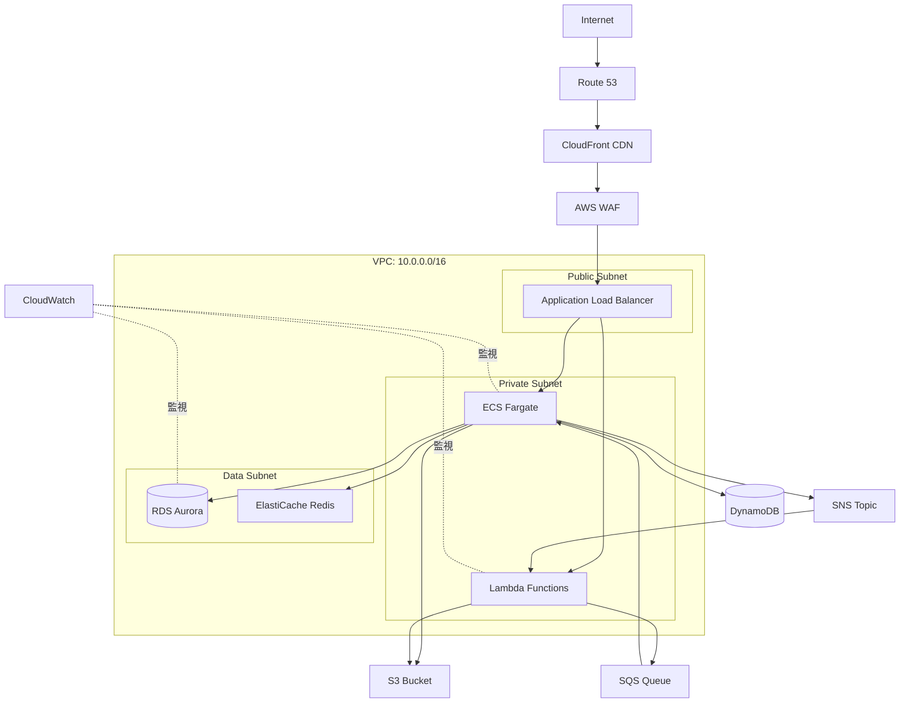
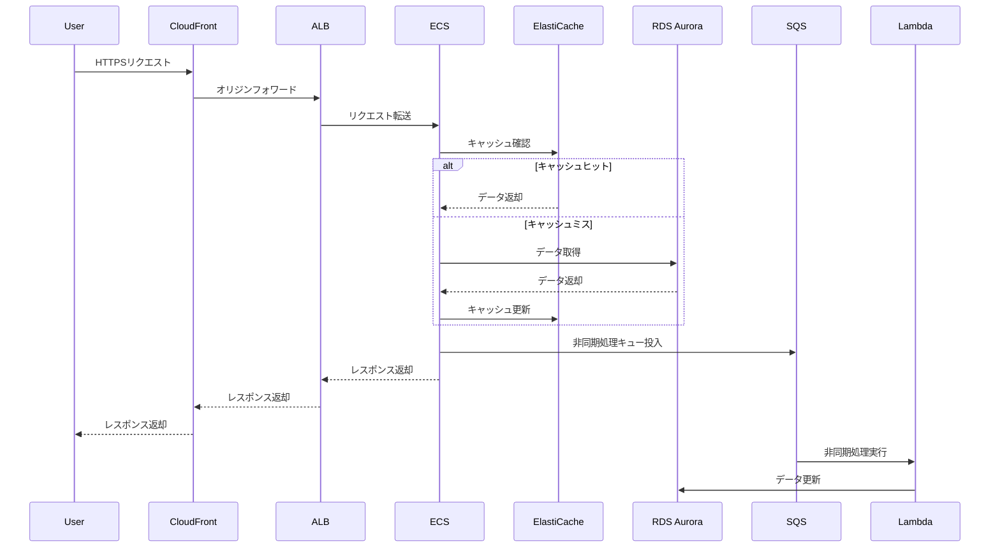

# infra-[ID]-[機能名]-design

## 概要

[インフラの目的、スコープ、前提条件を1-2段落で記述]

**目的**: [このインフラで実現したいこと]

**スコープ**:
- 含む: [構築対象のAWSサービス・リソース]
- 含まない: [今回の範囲外]

**前提条件**:
- [既存インフラとの関係]
- [使用するAWSアカウント・リージョン]
- [ネットワーク要件]

## 前提となるADR

以下の技術決定に基づいて設計：

- [ADR-001: VPC設計決定](specs/adr/infra-[ID]-[機能名]-adr-001.md)
  - 決定内容: [VPC構成、Subnet分割方針]
- [ADR-002: データベース選択](specs/adr/infra-[ID]-[機能名]-adr-002.md)
  - 決定内容: [RDS vs DynamoDBの選択理由]
- [ADR-003: コンピューティング選択](specs/adr/infra-[ID]-[機能名]-adr-003.md)
  - 決定内容: [Lambda vs ECS Fargateの選択理由]

## アーキテクチャ設計

### アーキテクチャ図



### CDKスタック構成

```yaml
スタック構成:
  1. NetworkStack:
      目的: ネットワーク基盤の構築
      リソース:
        - VPC (10.0.0.0/16)
        - Public Subnet x2 (Multi-AZ)
        - Private Subnet x2 (Multi-AZ)
        - Data Subnet x2 (Multi-AZ)
        - Internet Gateway
        - NAT Gateway x2
        - Route Tables
      出力:
        - vpc: IVpc
        - publicSubnets: ISubnet[]
        - privateSubnets: ISubnet[]
        - dataSubnets: ISubnet[]
      依存: なし
      ファイル: lib/stacks/network-stack.ts

  2. SecurityStack:
      目的: セキュリティグループとIAMロールの定義
      リソース:
        - ALB Security Group
        - ECS Security Group
        - RDS Security Group
        - Lambda Security Group
        - IAM Roles (ECS Task, Lambda Execution)
      出力:
        - albSecurityGroup: ISecurityGroup
        - ecsSecurityGroup: ISecurityGroup
        - rdsSecurityGroup: ISecurityGroup
        - lambdaSecurityGroup: ISecurityGroup
      依存: NetworkStack
      ファイル: lib/stacks/security-stack.ts

  3. DatabaseStack:
      目的: データベース層の構築
      リソース:
        - RDS Aurora Cluster (Multi-AZ)
        - Secrets Manager (DB認証情報)
        - Backup Policy
        - Parameter Group
        - Subnet Group
      出力:
        - cluster: IDatabaseCluster
        - secret: ISecret
        - endpoint: string
      依存: NetworkStack, SecurityStack
      ファイル: lib/stacks/database-stack.ts

  4. CacheStack:
      目的: キャッシュ層の構築
      リソース:
        - ElastiCache Redis Cluster (Multi-AZ)
        - Subnet Group
        - Parameter Group
      出力:
        - cluster: CfnReplicationGroup
        - endpoint: string
      依存: NetworkStack, SecurityStack
      ファイル: lib/stacks/cache-stack.ts

  5. StorageStack:
      目的: ストレージ層の構築
      リソース:
        - S3 Bucket (アプリケーションデータ)
        - S3 Bucket (ログ保存)
        - S3 Lifecycle Policy
        - KMS Key (暗号化)
      出力:
        - dataBucket: IBucket
        - logBucket: IBucket
        - kmsKey: IKey
      依存: なし
      ファイル: lib/stacks/storage-stack.ts

  6. ComputeStack:
      目的: コンピューティング層の構築
      リソース:
        - ECS Cluster
        - ECS Fargate Service
        - Task Definition
        - ALB + Target Group
        - Auto Scaling Policy
        - Lambda Functions
      出力:
        - ecsService: IFargateService
        - loadBalancer: IApplicationLoadBalancer
        - apiFunctions: IFunction[]
      依存: NetworkStack, SecurityStack, DatabaseStack, CacheStack, StorageStack
      ファイル: lib/stacks/compute-stack.ts

  7. MessagingStack:
      目的: メッセージング層の構築
      リソース:
        - SQS Queue (DLQ付き)
        - SNS Topic
        - EventBridge Rules
      出力:
        - queue: IQueue
        - topic: ITopic
      依存: なし
      ファイル: lib/stacks/messaging-stack.ts

  8. MonitoringStack:
      目的: 監視・ログ層の構築
      リソース:
        - CloudWatch Alarms
        - SNS Topics (アラート通知)
        - CloudWatch Dashboards
        - Log Groups (保持期間設定)
      出力: なし
      依存: ComputeStack, DatabaseStack
      ファイル: lib/stacks/monitoring-stack.ts
```

### データフロー図



## ネットワーク設計

### VPC設計

```yaml
VPC: 10.0.0.0/16
├── Public Subnet (AZ-a): 10.0.0.0/24
│   ├── 用途: ALB, NAT Gateway
│   └── インターネットゲートウェイ: 有効
├── Public Subnet (AZ-c): 10.0.1.0/24
│   ├── 用途: ALB, NAT Gateway
│   └── インターネットゲートウェイ: 有効
├── Private Subnet (AZ-a): 10.0.10.0/24
│   ├── 用途: ECS Fargate, Lambda
│   └── NAT Gateway: 使用（Public Subnet経由）
├── Private Subnet (AZ-c): 10.0.11.0/24
│   ├── 用途: ECS Fargate, Lambda
│   └── NAT Gateway: 使用（Public Subnet経由）
├── Data Subnet (AZ-a): 10.0.20.0/24
│   ├── 用途: RDS Aurora, ElastiCache
│   └── インターネットアクセス: なし
└── Data Subnet (AZ-c): 10.0.21.0/24
    ├── 用途: RDS Aurora, ElastiCache
    └── インターネットアクセス: なし
```

### Security Group設計

```yaml
ALB Security Group (alb-sg):
  Ingress:
    - Protocol: TCP, Port: 443, Source: 0.0.0.0/0, Description: "HTTPS from Internet"
    - Protocol: TCP, Port: 80, Source: 0.0.0.0/0, Description: "HTTP redirect to HTTPS"
  Egress:
    - Protocol: TCP, Port: 8080, Destination: ECS Security Group, Description: "To ECS tasks"

ECS Security Group (ecs-sg):
  Ingress:
    - Protocol: TCP, Port: 8080, Source: ALB Security Group, Description: "From ALB"
  Egress:
    - Protocol: TCP, Port: 5432, Destination: RDS Security Group, Description: "To RDS"
    - Protocol: TCP, Port: 6379, Destination: Cache Security Group, Description: "To ElastiCache"
    - Protocol: TCP, Port: 443, Destination: 0.0.0.0/0, Description: "To AWS APIs"

Lambda Security Group (lambda-sg):
  Ingress: なし
  Egress:
    - Protocol: TCP, Port: 5432, Destination: RDS Security Group, Description: "To RDS"
    - Protocol: TCP, Port: 443, Destination: 0.0.0.0/0, Description: "To AWS APIs"

RDS Security Group (rds-sg):
  Ingress:
    - Protocol: TCP, Port: 5432, Source: ECS Security Group, Description: "From ECS"
    - Protocol: TCP, Port: 5432, Source: Lambda Security Group, Description: "From Lambda"
  Egress: なし

ElastiCache Security Group (cache-sg):
  Ingress:
    - Protocol: TCP, Port: 6379, Source: ECS Security Group, Description: "From ECS"
  Egress: なし
```

### VPC Endpoints（オプション）

```yaml
Gateway Endpoints:
  - S3 Endpoint: S3アクセス時のNAT Gateway不要化
  - DynamoDB Endpoint: DynamoDBアクセス時のNAT Gateway不要化

Interface Endpoints（コスト削減重視の場合は省略可）:
  - Secrets Manager Endpoint: Secrets Manager API呼び出しのNAT Gateway不要化
  - ECR API Endpoint: ECRからイメージプル時のNAT Gateway不要化
  - ECR DKR Endpoint: ECRからイメージプル時のNAT Gateway不要化
  - CloudWatch Logs Endpoint: ログ送信時のNAT Gateway不要化
```

## IAM設計

### IAMロール・ポリシー設計

```yaml
ECS Task Execution Role (ecs-task-execution-role):
  目的: ECSタスク起動時のAWS API呼び出し
  信頼関係: ecs-tasks.amazonaws.com
  ポリシー:
    - AmazonECSTaskExecutionRolePolicy (AWS管理ポリシー)
    - カスタムポリシー:
        - ECR: GetAuthorizationToken, BatchGetImage, BatchCheckLayerAvailability
        - Secrets Manager: GetSecretValue (DB認証情報のみ)
        - CloudWatch Logs: CreateLogStream, PutLogEvents

ECS Task Role (ecs-task-role):
  目的: ECSタスク実行中のAWS API呼び出し
  信頼関係: ecs-tasks.amazonaws.com
  ポリシー:
    - カスタムポリシー:
        - S3: GetObject, PutObject (特定バケット/プレフィックスのみ)
        - DynamoDB: Query, PutItem, UpdateItem (特定テーブルのみ)
        - SQS: SendMessage, ReceiveMessage (特定キューのみ)
        - SNS: Publish (特定トピックのみ)

Lambda Execution Role (lambda-execution-role):
  目的: Lambda関数実行時のAWS API呼び出し
  信頼関係: lambda.amazonaws.com
  ポリシー:
    - AWSLambdaVPCAccessExecutionRole (AWS管理ポリシー)
    - カスタムポリシー:
        - Secrets Manager: GetSecretValue (DB認証情報のみ)
        - S3: GetObject, PutObject (特定バケット/プレフィックスのみ)
        - SQS: ReceiveMessage, DeleteMessage (特定キューのみ)
        - CloudWatch Logs: CreateLogStream, PutLogEvents

RDS Enhanced Monitoring Role (rds-monitoring-role):
  目的: RDS拡張モニタリング
  信頼関係: monitoring.rds.amazonaws.com
  ポリシー:
    - AmazonRDSEnhancedMonitoringRole (AWS管理ポリシー)
```

### IAM最小権限の原則適用例

```typescript
// 悪い例: ワイルドカード、全リソース
{
  "Effect": "Allow",
  "Action": "s3:*",
  "Resource": "*"
}

// 良い例: 明示的なアクション、特定リソース
{
  "Effect": "Allow",
  "Action": ["s3:GetObject", "s3:PutObject"],
  "Resource": "arn:aws:s3:::my-bucket/app-data/*"
}
```

## 監視・ログ設計

### CloudWatch Metrics監視

```yaml
ALB監視:
  - TargetResponseTime:
      閾値: 平均 > 1s (Warning), 平均 > 3s (Critical)
      期間: 5分
      評価期間: 2回連続
  - HTTPCode_Target_5XX_Count:
      閾値: 合計 > 10 (Critical)
      期間: 5分
      評価期間: 1回
  - HealthyHostCount:
      閾値: 最小 < 1 (Critical)
      期間: 1分
      評価期間: 1回

ECS Fargate監視:
  - CPUUtilization:
      閾値: 平均 > 70% (Warning), 平均 > 90% (Critical)
      期間: 5分
      評価期間: 2回連続
  - MemoryUtilization:
      閾値: 平均 > 70% (Warning), 平均 > 90% (Critical)
      期間: 5分
      評価期間: 2回連続
  - RunningTaskCount:
      閾値: 最小 < 1 (Critical)
      期間: 1分
      評価期間: 1回

Lambda監視:
  - Errors:
      閾値: 合計 > 10 (Critical)
      期間: 5分
      評価期間: 1回
  - Throttles:
      閾値: 合計 > 5 (Warning)
      期間: 5分
      評価期間: 1回
  - Duration:
      閾値: 平均 > 25s (Warning), 平均 > 28s (Critical)
      期間: 5分
      評価期間: 2回連続

RDS Aurora監視:
  - CPUUtilization:
      閾値: 平均 > 70% (Warning), 平均 > 90% (Critical)
      期間: 5分
      評価期間: 3回連続
  - DatabaseConnections:
      閾値: 合計 > 80% of max (Warning), 合計 > 95% of max (Critical)
      期間: 5分
      評価期間: 2回連続
  - FreeStorageSpace:
      閾値: 最小 < 10GB (Warning), 最小 < 5GB (Critical)
      期間: 5分
      評価期間: 1回
  - ReplicaLag:
      閾値: 最大 > 1000ms (Warning), 最大 > 5000ms (Critical)
      期間: 5分
      評価期間: 2回連続

ElastiCache Redis監視:
  - CPUUtilization:
      閾値: 平均 > 75% (Warning), 平均 > 90% (Critical)
      期間: 5分
      評価期間: 2回連続
  - DatabaseMemoryUsagePercentage:
      閾値: 平均 > 80% (Warning), 平均 > 95% (Critical)
      期間: 5分
      評価期間: 2回連続
  - CurrConnections:
      閾値: 最大 > 1000 (Warning), 最大 > 5000 (Critical)
      期間: 5分
      評価期間: 2回連続
```

### ログ保持期間

```yaml
環境別ログ保持:
  本番環境:
    - Application Log (ECS/Lambda): 90日
    - ALB Access Log: 90日
    - VPC Flow Log: 30日
    - CloudTrail: 90日（S3に永久保存）
  ステージング環境:
    - Application Log: 30日
    - ALB Access Log: 30日
    - VPC Flow Log: 7日
    - CloudTrail: 30日
  開発環境:
    - Application Log: 7日
    - ALB Access Log: 7日
    - VPC Flow Log: なし
    - CloudTrail: 7日
```

### CloudWatch Dashboard

```yaml
ダッシュボード構成:
  Overview Dashboard:
    - ALB TargetResponseTime (折れ線グラフ)
    - ECS CPUUtilization (折れ線グラフ)
    - RDS CPUUtilization (折れ線グラフ)
    - Lambda Errors (棒グラフ)
    - 総リクエスト数 (数値)

  ECS Dashboard:
    - RunningTaskCount (折れ線グラフ)
    - CPUUtilization (折れ線グラフ)
    - MemoryUtilization (折れ線グラフ)
    - NetworkIn/Out (折れ線グラフ)

  RDS Dashboard:
    - CPUUtilization (折れ線グラフ)
    - DatabaseConnections (折れ線グラフ)
    - ReadLatency/WriteLatency (折れ線グラフ)
    - FreeStorageSpace (折れ線グラフ)
```

## バックアップ・DR設計

### バックアップ戦略

```yaml
RDS Aurora:
  自動バックアップ: 有効
  バックアップ保持期間:
    - 本番環境: 7日
    - ステージング環境: 3日
    - 開発環境: 1日
  バックアップウィンドウ: 03:00-04:00 UTC (JST 12:00-13:00)
  スナップショット: 週次（日曜 03:00 UTC）
  クロスリージョンバックアップ:
    - 本番環境: 有効（us-west-2）
    - その他: 無効

S3:
  バージョニング: 有効
  ライフサイクルポリシー:
    - 30日後: Standard-IA移行
    - 90日後: Glacier Flexible Retrieval移行
    - 365日後: Glacier Deep Archive移行
  クロスリージョンレプリケーション:
    - 本番環境: 有効（us-west-2）
    - その他: 無効

ElastiCache Redis:
  自動バックアップ: 有効
  バックアップ保持期間:
    - 本番環境: 7日
    - ステージング環境: 1日
    - 開発環境: 無効
  バックアップウィンドウ: 03:00-04:00 UTC
```

### ディザスタリカバリ

```yaml
DR戦略: Pilot Light
RPO (Recovery Point Objective): 1時間
RTO (Recovery Time Objective): 4時間

Primary Region: ap-northeast-1 (Tokyo)
  - 全サービス稼働
  - RDS Aurora: Multi-AZ、自動バックアップ
  - S3: Cross-Region Replication有効
  - ElastiCache: Multi-AZ

DR Region: us-west-2 (Oregon)
  - RDS Aurora Read Replica（手動昇格準備）
  - S3 Replica Bucket（自動同期）
  - AMI/ECRイメージの複製（週次）
  - CDKスタック定義（同期）

フェイルオーバー手順:
  1. Route 53ヘルスチェックで障害検知
  2. Lambda関数でDR Region起動
      - RDS Read Replicaを昇格
      - ECS Fargateタスク起動
      - ALB起動
  3. Route 53でトラフィック切り替え
  4. 動作確認
  5. Primary Region復旧後、フェールバック
```

## コスト見積もり

### 月間コスト見積もり（本番環境、想定トラフィック: 100 req/s）

```yaml
コンピューティング:
  ECS Fargate:
    - vCPU: 2 vCPU × 2 タスク × 730時間 × $0.04048/vCPU時間 = $118
    - Memory: 4GB × 2 タスク × 730時間 × $0.004445/GB時間 = $26
    小計: $144

  Lambda:
    - 実行時間: 100万リクエスト × 200ms × $0.0000166667/GB秒 × 512MB = $17
    - リクエスト: 100万リクエスト × $0.20/100万 = $0.2
    小計: $17.2

  合計: $161.2/月

データベース:
  RDS Aurora PostgreSQL:
    - db.r6g.large × 2 (Multi-AZ): $292 × 2 = $584
    - ストレージ: 100GB × $0.10/GB = $10
    - バックアップストレージ: 100GB × $0.021/GB = $2
    - I/O: 100万回 × $0.20/100万 = $0.2
    小計: $596.2

  ElastiCache Redis:
    - cache.r6g.large × 2 (Multi-AZ): $0.246/時間 × 730時間 × 2 = $359
    小計: $359

  合計: $955.2/月

ネットワーク:
  Application Load Balancer:
    - 時間料金: 730時間 × $0.0243/時間 = $18
    - LCU: 10 LCU × 730時間 × $0.008/LCU時間 = $58
    小計: $76

  NAT Gateway:
    - 時間料金: 730時間 × $0.062/時間 × 2 (Multi-AZ) = $90
    - データ処理: 500GB × $0.062/GB = $31
    小計: $121

  データ転送:
    - CloudFront to Internet: 500GB × $0.114/GB = $57
    - ALB to ECS: 無料（同一AZ）
    小計: $57

  合計: $254/月

ストレージ:
  S3:
    - Standard: 100GB × $0.025/GB = $2.5
    - PUT/POST: 100万リクエスト × $0.0047/1000 = $4.7
    - GET: 1000万リクエスト × $0.00037/1000 = $3.7
    小計: $10.9

  EBS (ALBログ用):
    - gp3: 50GB × $0.096/GB = $4.8
    小計: $4.8

  合計: $15.7/月

監視・ログ:
  CloudWatch:
    - Logs: 10GB × $0.76/GB = $7.6
    - Metrics: 100カスタムメトリクス × $0.30 = $30
    - Alarms: 10アラーム × $0.10 = $1
    - Dashboards: 3ダッシュボード × $3 = $9
    小計: $47.6

  CloudTrail:
    - データイベント: 100万イベント × $0.10/10万 = $1
    小計: $1

  X-Ray:
    - トレース: 100万トレース × $5.00/100万 = $5
    小計: $5

  合計: $53.6/月

セキュリティ:
  Secrets Manager:
    - シークレット: 5個 × $0.40 = $2
    - API呼び出し: 100万回 × $0.05/1万 = $5
    小計: $7

  KMS:
    - キー: 2個 × $1 = $2
    - API呼び出し: 100万回 × $0.03/1万 = $3
    小計: $5

  合計: $12/月

総計: $1,451.7/月
```

### 環境別コスト

```yaml
本番環境: $1,451.7/月
  - Multi-AZ、高可用性構成
  - Reserved Instances未適用

ステージング環境: $725.9/月
  - スペック半分、シングルAZ可
  - Reserved Instances未適用

開発環境: $362.9/月
  - スペック1/4、シングルAZ
  - 夜間自動停止（50%削減）

年間総コスト: ($1,451.7 + $725.9 + $362.9) × 12 = $30,486/年

コスト削減策適用後（Reserved Instances、Savings Plans）:
  - 本番環境ECS/RDS: 30%削減 → $1,016/月
  - 年間総コスト: $25,017/年（17%削減）
```

## 受入条件（EARS記法）

### セキュリティ
- [ ] **AC-SEC-1** (遍在型): システムはすべてのS3バケットでSSE-KMS暗号化を有効化すること
- [ ] **AC-SEC-2** (遍在型): システムはすべてのRDSインスタンスで保管時暗号化を有効化すること
- [ ] **AC-SEC-3** (遍在型): システムはすべての通信でTLS 1.2以上を使用すること
- [ ] **AC-SEC-4** (選択型): もしSecurity Groupで0.0.0.0/0を許可する場合、ポート80/443のみに制限すること
- [ ] **AC-SEC-5** (遍在型): システムはIAMロールで最小権限の原則を適用すること
- [ ] **AC-SEC-6** (遍在型): システムはSecrets Managerでデータベース認証情報を管理すること
- [ ] **AC-SEC-7** (遍在型): システムはCloudTrailで全APIアクションを記録すること

### 信頼性
- [ ] **AC-REL-1** (遍在型): システムはRDS AuroraをMulti-AZ構成で配置すること
- [ ] **AC-REL-2** (遍在型): システムはECS Fargateを最低2つのAvailability Zoneに配置すること
- [ ] **AC-REL-3** (契機型): ECSタスクが異常終了したとき、システムは自動的に新しいタスクを起動すること
- [ ] **AC-REL-4** (不測型): もしRDS Primary障害が発生した場合、システムは1分以内にRead Replicaに自動フェイルオーバーすること
- [ ] **AC-REL-5** (遍在型): システムはRDSの自動バックアップを有効化し、7日間保持すること
- [ ] **AC-REL-6** (選択型): もしトラフィックがMin Capacityを下回る場合、システムはMin Capacity以下にスケールインしないこと

### パフォーマンス
- [ ] **AC-PERF-1** (契機型): ユーザーがAPIリクエストを送信したとき、システムは95パーセンタイルで1秒以内にレスポンスを返すこと
- [ ] **AC-PERF-2** (状態型): トラフィックが100 req/sを超えている間、システムはECSタスクを自動スケールアウトすること
- [ ] **AC-PERF-3** (状態型): トラフィックが20 req/s未満の間、システムはECSタスクを最小2タスクまでスケールインすること
- [ ] **AC-PERF-4** (遍在型): システムはCloudFront CDNで静的コンテンツをキャッシュすること
- [ ] **AC-PERF-5** (遍在型): システムはElastiCache Redisでデータベースクエリ結果をキャッシュすること

### 運用監視
- [ ] **AC-OPS-1** (遍在型): システムはすべてのアプリケーションログをCloudWatch Logsに送信すること
- [ ] **AC-OPS-2** (契機型): CloudWatch Alarmが発火したとき、システムはSNSでメール通知を送信すること
- [ ] **AC-OPS-3** (遍在型): システムはX-Ray Tracingを有効化すること
- [ ] **AC-OPS-4** (遍在型): システムはすべてのリソースに Environment, Project, Owner, ManagedBy タグを付与すること
- [ ] **AC-OPS-5** (遍在型): システムはCloudWatch Dashboardでメトリクスを可視化すること

### コスト最適化
- [ ] **AC-COST-1** (選択型): もし開発環境の場合、システムは平日19時にリソースを自動停止すること
- [ ] **AC-COST-2** (選択型): もし開発環境の場合、システムは平日9時にリソースを自動起動すること
- [ ] **AC-COST-3** (遍在型): システムはS3にライフサイクルポリシーを設定し、90日後にGlacier移行すること
- [ ] **AC-COST-4** (不測型): もし月間コストが$1,500を超えた場合、システムはBudget AlarmでSNS通知を送信すること
- [ ] **AC-COST-5** (遍在型): システムはNAT Gatewayの代わりにVPC Endpointsを活用すること（S3, DynamoDB）

## テスト戦略

### Unit Test（CDK Assertions）
- リソース生成検証
- Security Group設定検証
- IAMポリシー最小権限検証
- タグ付与検証

### Snapshot Test
- CloudFormationテンプレートのスナップショット作成
- 構成変更の差分検出

### Security Test
- cfn-nag: CloudFormationセキュリティスキャン
- cdk-nag: CDKネイティブ静的解析
- カスタムルール: コンプライアンス検証

### Integration Test
- 実環境デプロイ後のエンドポイント疎通確認
- RDS接続確認
- ElastiCache接続確認
- CloudWatch Logs出力確認

### Performance Test（本番デプロイ前）
- 負荷テスト: 想定トラフィックの120%でテスト
- スケーリング確認: Auto Scalingが正常に動作するか
- レイテンシ確認: 95パーセンタイル < 1秒

## デプロイ戦略

### デプロイ手順

1. **事前確認**
   - [ ] ステークホルダー承認取得
   - [ ] メンテナンス通知送信（必要な場合）
   - [ ] バックアップ取得確認

2. **CDK Synth & Diff**
   ```bash
   cd infrastructure/
   npx cdk synth --all
   npx cdk diff ProductionNetworkStack
   npx cdk diff ProductionDatabaseStack
   npx cdk diff ProductionComputeStack
   ```

3. **セキュリティスキャン**
   ```bash
   cfn_nag_scan --input-path cdk.out/
   ```

4. **順次デプロイ**
   ```bash
   npx cdk deploy ProductionNetworkStack --require-approval always
   npx cdk deploy ProductionSecurityStack --require-approval always
   npx cdk deploy ProductionDatabaseStack --require-approval always
   npx cdk deploy ProductionCacheStack --require-approval always
   npx cdk deploy ProductionStorageStack --require-approval always
   npx cdk deploy ProductionComputeStack --require-approval always
   npx cdk deploy ProductionMessagingStack --require-approval always
   npx cdk deploy ProductionMonitoringStack --require-approval always
   ```

5. **動作確認**
   - [ ] ALBヘルスチェック確認
   - [ ] API疎通確認
   - [ ] データベース接続確認
   - [ ] CloudWatch Logs出力確認
   - [ ] CloudWatch Alarms設定確認

6. **事後確認**
   - [ ] CloudWatch Metricsで正常性確認
   - [ ] コスト確認（Cost Explorer）
   - [ ] ロールバック手順の準備確認

### ロールバック手順

1. **CloudFormation ChangeSet復元**
   - AWS Consoleで対象Stackを選択
   - 前バージョンのChangeSetsから復元

2. **または CDK Destroy & 再デプロイ**
   ```bash
   npx cdk destroy ProductionComputeStack --force
   git checkout <previous-commit>
   npx cdk deploy ProductionComputeStack
   ```

## 品質チェックリスト

- [ ] **ID・機能名がメタデータとして記録されているか**
- [ ] **前提となる関連ADRの参照**
- [ ] **AWS Well-Architected Framework 5本柱を考慮**
- [ ] **セキュリティ要件を満たしているか**
- [ ] **コスト見積もりが妥当か**
- [ ] **スケーラビリティが確保されているか**
- [ ] **ディザスタリカバリ戦略が定義されているか**
- [ ] **受入条件がEARS記法で記述されているか**
- [ ] **最新のAWSベストプラクティスの調査と参考資料の記載**
- [ ] **テスト戦略が定義されているか**
- [ ] **デプロイ・ロールバック手順が明確か**
- [ ] **CDKスタック構成が明確か**
- [ ] **IAM最小権限の原則が適用されているか**
- [ ] **監視・ログ設計が完備されているか**

## 参考資料

[最新技術情報の調査で参照した情報源を記載]

- [AWS Well-Architected Framework]: https://aws.amazon.com/architecture/well-architected/
  - 該当する柱と関連セクション
- [AWS CDK Best Practices]: https://docs.aws.amazon.com/cdk/latest/guide/best-practices.html
- [AWS公式ドキュメント URL]: [簡潔な説明]
- [AWSブログ・事例 URL]: [参考にしたベストプラクティス]
- [技術記事・ブログ URL]: [ベストプラクティス情報]

## 関連情報

- [関連するInfrastructure ADR]: specs/adr/[num]-[title].md
- [関連する要件定義書]: specs/stories/[STORY_ID]-[title]/requirements.md
