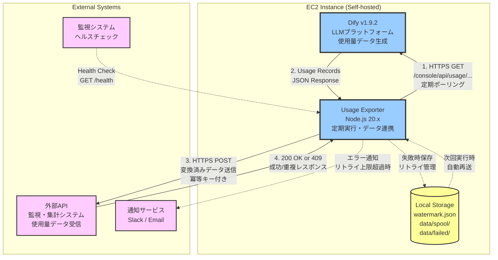

# Dify Usage Exporter - システム構成図

## システム構成



## 主要コンポーネント

### EC2 Instance (Self-hosted)
EC2インスタンス上で稼働する全てのコンポーネントをホスト

#### Dify v1.9.2
- **役割**: LLMプラットフォーム、モデル使用量データの生成元
- **API**: `/console/api/usage/...` エンドポイントで使用量データを提供（※要調査）
- **データ形式**: JSON形式のUsage Records（日付、アプリID、プロバイダー、モデル、トークン数など）
- **認証方式**:
  - ログインエンドポイント: `POST /console/api/login`
  - 認証ボディ: `{ email, password, remember_me: false }`
  - レスポンス: `access_token` を取得
  - API呼び出し: `Authorization: Bearer ${access_token}` ヘッダーを使用
- **参考実装**: `/Users/naokikodama/development/Repository/bonginkan/Dify-Inhouse-Platform/app/api/dify`
  - ※使用量取得APIは含まれていないため、別途Dify APIドキュメントまたは実機での調査が必要

#### Usage Exporter
- **役割**: Difyから使用量データを取得し、外部APIへ連携
- **技術スタック**: Node.js 20.x、TypeScript 5.x
- **実行方式**: node-cronによる定期実行（例: 毎日午前2時）
- **主要機能**:
  - Dify APIからの定期ポーリング（ウォーターマークベース）
  - 外部API仕様へのデータ変換
  - 冪等キー生成（重複防止）
  - リトライ制御（指数バックオフ）
  - エラー通知

#### Local Storage
- **watermark.json**: 前回取得完了位置の永続化
- **data/spool/**: 送信失敗データの一時保存、自動リトライ対象
- **data/failed/**: リトライ上限超過データ、手動対応が必要

### External Systems

#### 外部API（社外/社内の集計システム）
- **役割**: 使用量データの最終宛先、コスト集計・監査・課金処理を実施
- **想定機能**:
  - コスト集計・可視化
  - アプリ別/ユーザー別の利用監査
  - 課金/配賦処理
- **API仕様**: HTTPS POST、冪等キー対応（409で重複検出）

#### 監視システム
- **役割**: Usage Exporterの稼働状態監視
- **方式**: ヘルスチェックエンドポイント（GET /health）を定期的にポーリング

#### 通知サービス
- **Slack**: Webhook経由でエラー通知
- **Email**: SMTP経由でエラー通知
- **通知条件**: リトライ上限超過時、重大なエラー発生時

## データフロー

### 正常系フロー
1. **定期実行**: node-cron がスケジュールに従って Usage Exporter を起動
2. **データ取得**: Usage Exporter が Dify API から使用量データを取得（ウォーターマークベースで差分のみ）
3. **データ変換**: 外部API仕様に変換、冪等キー生成
4. **データ送信**: 外部APIへ HTTPS POST 送信
5. **成功応答**: 外部APIから 200 OK または 409（重複）を受信
6. **進捗保存**: watermark.json を更新

### 異常系フロー
1. **送信失敗検知**: ネットワークエラー、5xx、429 などを検出
2. **即時リトライ**: 指数バックオフ（1秒 → 2秒 → 4秒）で最大3回リトライ
3. **スプール保存**: 即時リトライ上限到達時に data/spool/ へ保存
4. **自動リトライ**: 次回実行時に自動的にスプールデータを再送試行
5. **永久失敗**: リトライ10回超過時に data/failed/ へ移動
6. **エラー通知**: Slack/Email へ通知送信

## 冪等性の保証

### レコード単位の冪等キー
```
{date}_{app_id}_{provider}_{model}
```

### バッチ単位の冪等キー
```
SHA256(レコード冪等キーのソート結合)
```

外部APIは冪等キーで重複を判定し、409レスポンスを返す想定。409レスポンスは成功とみなす（既に処理済み）。

## リトライポリシー

| 項目 | 設定値 |
|------|--------|
| 最大リトライ回数 | 3回（環境変数で変更可能） |
| バックオフ方式 | 指数バックオフ（1秒 → 2秒 → 4秒） |
| リトライ対象 | ネットワークエラー、5xx、429 |
| リトライ非対象 | 400、401、403 |
| スプールリトライ上限 | 10回（環境変数で変更可能） |
| 最大保持期間 | 7日間 |

## セキュリティ

- **通信暗号化**: HTTPS/TLS 1.2以上での通信必須
- **認証**: Dify API・外部APIともに Bearer トークン認証
- **シークレット管理**: 全てのAPIキー・トークンは環境変数で管理
- **ファイルパーミッション**: スプール・ウォーターマークファイルは600（所有者のみ読み書き）
- **ログセキュリティ**: シークレット情報はログ出力しない

## パフォーマンス要件

| 項目 | 要件 |
|------|------|
| 大量データ処理 | 10,000件/バッチを30秒以内で完了 |
| メモリ効率 | ページング処理でメモリ使用量を100MB以内に抑制 |
| ログオーバーヘッド | パフォーマンス低下を5%以内に抑制 |
| ヘルスチェック | レスポンス時間100ms以内 |
| APIタイムアウト | 30秒 |
