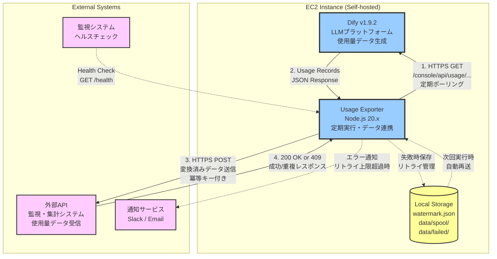

# 1: dify-usage-exporter

Notion Epic: [https://www.notion.so/2aeaebc7449b80678c40fd4f602f2f54](https://www.notion.so/2aeaebc7449b80678c40fd4f602f2f54)

## エピック概要

セルフホスト中のDify（v1.9.2予定）で発生するモデル使用量（Usage）を、定期的に社外/社内の外部APIへ連携する。本機能により、コスト集計・アプリ別/ユーザー別の利用監査・課金/配賦処理などのDownstreamを可能にする。

## 技術スタック

- **言語**: TypeScript 5.x
- **ランタイム**: Node.js 20.x LTS
- **HTTPクライアント**: axios 1.x（リトライ機能、インターセプター対応）
- **リトライ**: axios-retry 3.x
- **スケジューラ**: node-cron 3.x
- **ログ**: winston 3.x（構造化JSON出力）
- **バリデーション**: zod 3.x（レスポンス・リクエストスキーマ検証）
- **CLI**: commander 11.x（コマンドライン引数パース）
- **日時処理**: date-fns 3.x
- **HTTPサーバー**: express 4.x（ヘルスチェック用）
- **通知**: axios（Slack Webhook）、nodemailer（メール通知）
- **永続化**: ローカルファイル（JSON形式）でウォーターマーク・スプールデータ管理
- **コンテナ化**: Docker
- **環境変数管理**: dotenv 16.x

## 共通設計方針

全ストーリーで適用する共通方針を記載します。

### データフロー
1. Dify APIから使用量データを取得
2. 外部API仕様に合わせてデータ変換
3. 外部APIへHTTPS POST送信
4. 失敗時はスプールに保存し、次回実行時にリトライ

### 冪等性の保証
- **レコード単位の冪等キー**: `{date}_{app_id}_{provider}_{model}`
- **バッチ単位の冪等キー**: SHA256(レコード冪等キーのソート結合)
- 外部APIは冪等キーで重複を判定し、409レスポンスを返す想定
- 409レスポンスは成功とみなす（既に処理済み）

### リトライポリシー
- **最大リトライ回数**: 3回（環境変数で変更可能）
- **バックオフ方式**: 指数バックオフ（1秒 → 2秒 → 4秒）
- **リトライ対象**: ネットワークエラー、5xx、429
- **リトライ非対象**: 400、401、403

### エラーハンドリング
- **リトライ上限到達**: スプール（ローカルファイル）に保存
- **スプール再送**: 次回実行時に自動的に再送試行
- **スプールリトライ上限**: 10回（環境変数で変更可能）
- **リトライ上限超過**: data/failed/ディレクトリへ移動、エラー通知送信

### ログ形式
- **形式**: JSON Lines（1行1JSONオブジェクト）
- **出力先**: 標準出力（stdout）
- **ログレベル**: error, warn, info, debug
- **共通項目**: timestamp（ISO 8601）, level, message, context

### 設定管理
- 全ての設定を環境変数で外部化
- 必須環境変数が未設定の場合はエラー終了
- .envファイルで環境変数を管理（.gitignore対象）

## ストーリー間で共有する設計・実装

複数のストーリーで使用する共通モジュール、ユーティリティ、データ構造などを記載します。

### 共通モジュール

- **Logger** (`src/logger/winston-logger.ts`): 構造化ログ出力、全モジュールで使用
- **Environment Config** (`src/config/env-config.ts`): 環境変数管理、全モジュールで使用
- **Watermark Manager** (`src/watermark/watermark-manager.ts`): ウォーターマーク読み書き、fetcherとorchestratorで使用
- **Spool Manager** (`src/sender/spool-manager.ts`): スプールファイル管理、senderとorchestratorで使用

### 共通データ構造

- **DifyUsageRecord** (`src/types/dify-usage.ts`): Dify APIレスポンスの型定義
- **ExternalApiRecord** (`src/types/external-api.ts`): 外部API送信データの型定義
- **Watermark** (`src/types/watermark.ts`): ウォーターマークファイルの型定義
- **SpoolFile** (`src/types/spool.ts`): スプールファイルの型定義
- **ExecutionMetrics** (`src/types/metrics.ts`): 実行メトリクスの型定義

### 共通インターフェース

- **IFetcher** (`src/interfaces/fetcher.ts`): データ取得インターフェース
- **ITransformer** (`src/interfaces/transformer.ts`): データ変換インターフェース
- **ISender** (`src/interfaces/sender.ts`): データ送信インターフェース
- **INotifier** (`src/interfaces/notifier.ts`): 通知インターフェース

### 共通ユーティリティ

- **Date Utilities** (`src/utils/date-utils.ts`): 日時フォーマット、期間計算
- **Idempotency Key Generator** (`src/transformer/idempotency-key.ts`): 冪等キー生成ロジック
- **File Utilities** (`src/utils/file-utils.ts`): ファイル操作（読み書き、ディレクトリ走査）

## セキュリティ要件

- **シークレット管理**: 全てのAPIキー・トークンは環境変数で管理、ログ出力しない
- **通信暗号化**: HTTPS/TLS 1.2以上での通信必須、http://は拒否
- **ファイルパーミッション**: スプールファイル・ウォーターマークファイルは600（所有者のみ読み書き）
- **IPホワイトリスト**: 外部API側で送信元IPを許可リスト登録（可能な場合）
- **認証**: Dify API・外部APIともにBearerトークン認証

## パフォーマンス要件

- **大量データ処理**: 10,000件/バッチの処理を30秒以内で完了
- **メモリ効率**: ページング処理でメモリ使用量を100MB以内に抑制
- **ログオーバーヘッド**: ログ出力によるパフォーマンス低下を5%以内に抑制
- **ヘルスチェック**: レスポンス時間100ms以内
- **タイムアウト**: API呼び出しのタイムアウトは30秒

## テスト戦略

- **単体テスト**: 各モジュールの主要ロジックをテスト（Vitest使用）
- **統合テスト**: Dify API・外部APIのモック環境でエンドツーエンドテスト
- **エラーシナリオテスト**: ネットワークエラー、5xx、429、タイムアウトなどの異常系テスト
- **リトライテスト**: 指数バックオフ、リトライ回数上限、スプール保存を検証
- **冪等性テスト**: 同じデータを複数回送信しても問題ないことを検証
- **ウォーターマークテスト**: 正常更新、バックアップ復元、破損時のフォールバックを検証

## 想定リスクと対策

| リスク | 影響度 | 発生確率 | 対策 |
|-------|--------|---------|------|
| Dify APIの仕様変更（v1.9.2以降） | 高 | 中 | バリデーションで早期検出、スキーマ定義をzodで厳密化 |
| 外部APIの一時停止・障害 | 高 | 中 | スプール機構で最大7日間リトライ、data/failed/で永続保存 |
| 大量データによるメモリ不足 | 中 | 低 | ページング処理、バッチサイズ制限（100件/バッチ） |
| ウォーターマークファイル破損 | 中 | 低 | バックアップ自動作成、復元機能、デフォルト期間へのフォールバック |
| スプールファイル肥大化 | 中 | 中 | 最大保持期間（7日）、リトライ上限（10回）、data/failed/への移動 |
| 環境変数の設定ミス | 低 | 高 | 起動時バリデーション、必須項目チェック、.env.exampleの提供 |
| レート制限（429） | 中 | 中 | Retry-Afterヘッダ対応、指数バックオフ、最大リトライ回数制限 |

## このエピックのストーリー

| Story ID | タイトル | Notion URL | Git Directory |
|----------|---------|------------|---------------|
| 1 | foundation-and-scheduler | [Notion](https://www.notion.so/2aeaebc7449b81a2a0e1c717e13fd9ea) | specs/stories/1-foundation-and-scheduler/ |
| 2 | dify-usage-fetcher | [Notion](https://www.notion.so/2aeaebc7449b81709282ccb5d906df3c) | specs/stories/2-dify-usage-fetcher/ |
| 3 | data-transformation | [Notion](https://www.notion.so/2aeaebc7449b816bb074e70ecbe24731) | specs/stories/3-data-transformation/ |
| 4 | external-api-sender | [Notion](https://www.notion.so/2aeaebc7449b81e4a4a1e70bf1305852) | specs/stories/4-external-api-sender/ |
| 5 | monitoring-logging-healthcheck | [Notion](https://www.notion.so/2aeaebc7449b8195a7d3d25869217790) | specs/stories/5-monitoring-logging-healthcheck/ |
| 6 | manual-resend-watermark | [Notion](https://www.notion.so/2aeaebc7449b8125865cdddbba9d8517) | specs/stories/6-manual-resend-watermark/ |


# Dify Usage Exporter - システム構成図

## システム構成



## 主要コンポーネント

### EC2 Instance (Self-hosted)
EC2インスタンス上で稼働する全てのコンポーネントをホスト

#### Dify v1.9.2
- **役割**: LLMプラットフォーム、モデル使用量データの生成元
- **API**: `/console/api/usage/...` エンドポイントで使用量データを提供（※要調査）
- **データ形式**: JSON形式のUsage Records（日付、アプリID、プロバイダー、モデル、トークン数など）
- **認証方式**:
  - ログインエンドポイント: `POST /console/api/login`
  - 認証ボディ: `{ email, password, remember_me: false }`
  - レスポンス: `access_token` を取得
  - API呼び出し: `Authorization: Bearer ${access_token}` ヘッダーを使用
- **参考実装**: `/Users/naokikodama/development/Repository/bonginkan/Dify-Inhouse-Platform/app/api/dify`
  - ※使用量取得APIは含まれていないため、別途Dify APIドキュメントまたは実機での調査が必要

#### Usage Exporter
- **役割**: Difyから使用量データを取得し、外部APIへ連携
- **技術スタック**: Node.js 20.x、TypeScript 5.x
- **実行方式**: node-cronによる定期実行（例: 毎日午前2時）
- **主要機能**:
  - Dify APIからの定期ポーリング（ウォーターマークベース）
  - 外部API仕様へのデータ変換
  - 冪等キー生成（重複防止）
  - リトライ制御（指数バックオフ）
  - エラー通知

#### Local Storage
- **watermark.json**: 前回取得完了位置の永続化
- **data/spool/**: 送信失敗データの一時保存、自動リトライ対象
- **data/failed/**: リトライ上限超過データ、手動対応が必要

### External Systems

#### 外部API（社外/社内の集計システム）
- **役割**: 使用量データの最終宛先、コスト集計・監査・課金処理を実施
- **想定機能**:
  - コスト集計・可視化
  - アプリ別/ユーザー別の利用監査
  - 課金/配賦処理
- **API仕様**: HTTPS POST、冪等キー対応（409で重複検出）

#### 監視システム
- **役割**: Usage Exporterの稼働状態監視
- **方式**: ヘルスチェックエンドポイント（GET /health）を定期的にポーリング

#### 通知サービス
- **Slack**: Webhook経由でエラー通知
- **Email**: SMTP経由でエラー通知
- **通知条件**: リトライ上限超過時、重大なエラー発生時

## データフロー

### 正常系フロー
1. **定期実行**: node-cron がスケジュールに従って Usage Exporter を起動
2. **データ取得**: Usage Exporter が Dify API から使用量データを取得（ウォーターマークベースで差分のみ）
3. **データ変換**: 外部API仕様に変換、冪等キー生成
4. **データ送信**: 外部APIへ HTTPS POST 送信
5. **成功応答**: 外部APIから 200 OK または 409（重複）を受信
6. **進捗保存**: watermark.json を更新

### 異常系フロー
1. **送信失敗検知**: ネットワークエラー、5xx、429 などを検出
2. **即時リトライ**: 指数バックオフ（1秒 → 2秒 → 4秒）で最大3回リトライ
3. **スプール保存**: 即時リトライ上限到達時に data/spool/ へ保存
4. **自動リトライ**: 次回実行時に自動的にスプールデータを再送試行
5. **永久失敗**: リトライ10回超過時に data/failed/ へ移動
6. **エラー通知**: Slack/Email へ通知送信

## 冪等性の保証

### レコード単位の冪等キー
```
{date}_{app_id}_{provider}_{model}
```

### バッチ単位の冪等キー
```
SHA256(レコード冪等キーのソート結合)
```

外部APIは冪等キーで重複を判定し、409レスポンスを返す想定。409レスポンスは成功とみなす（既に処理済み）。

## リトライポリシー

| 項目 | 設定値 |
|------|--------|
| 最大リトライ回数 | 3回（環境変数で変更可能） |
| バックオフ方式 | 指数バックオフ（1秒 → 2秒 → 4秒） |
| リトライ対象 | ネットワークエラー、5xx、429 |
| リトライ非対象 | 400、401、403 |
| スプールリトライ上限 | 10回（環境変数で変更可能） |
| 最大保持期間 | 7日間 |

## セキュリティ

- **通信暗号化**: HTTPS/TLS 1.2以上での通信必須
- **認証**: Dify API・外部APIともに Bearer トークン認証
- **シークレット管理**: 全てのAPIキー・トークンは環境変数で管理
- **ファイルパーミッション**: スプール・ウォーターマークファイルは600（所有者のみ読み書き）
- **ログセキュリティ**: シークレット情報はログ出力しない

## パフォーマンス要件

| 項目 | 要件 |
|------|------|
| 大量データ処理 | 10,000件/バッチを30秒以内で完了 |
| メモリ効率 | ページング処理でメモリ使用量を100MB以内に抑制 |
| ログオーバーヘッド | パフォーマンス低下を5%以内に抑制 |
| ヘルスチェック | レスポンス時間100ms以内 |
| APIタイムアウト | 30秒 |
