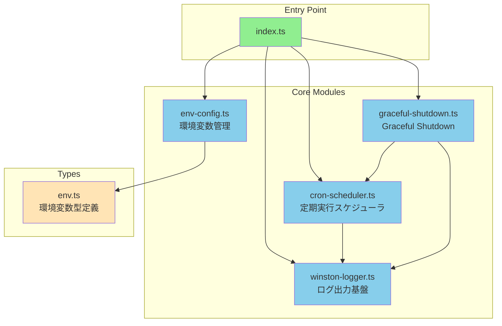
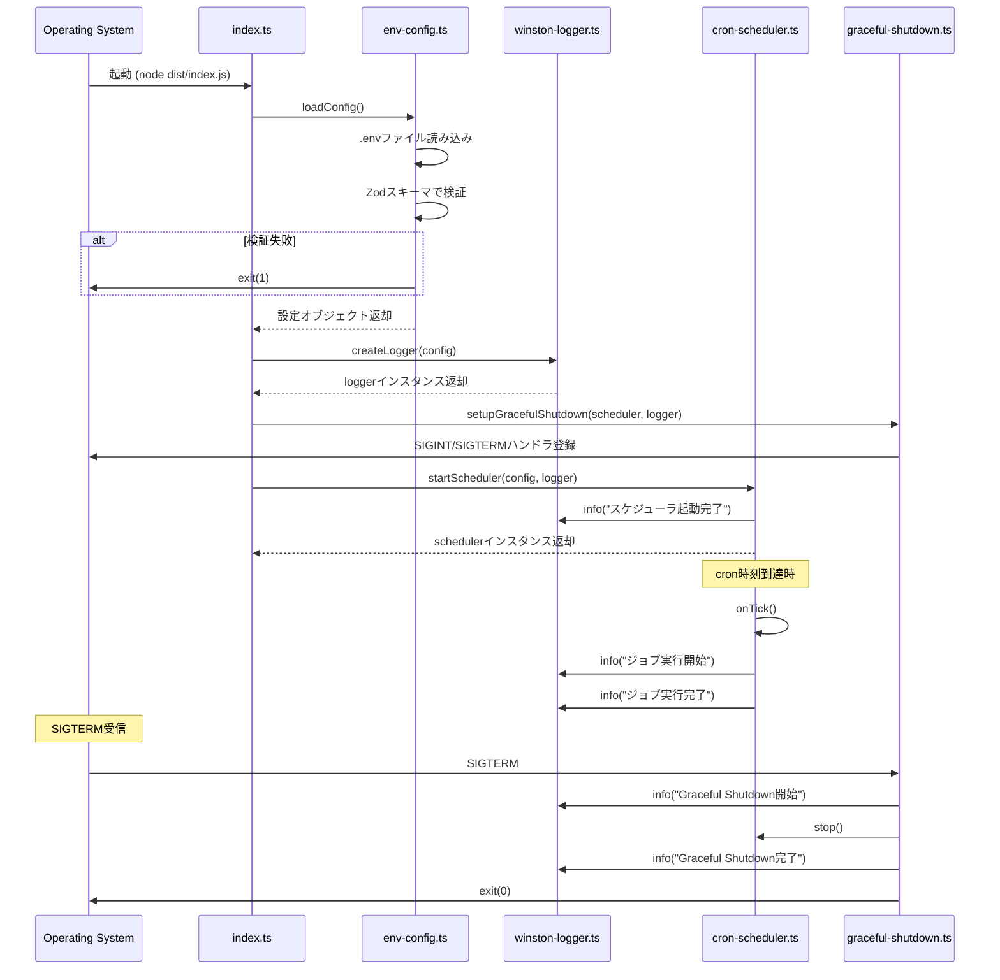

# Design Doc: 基盤とスケジューラ

## 概要

Dify使用量エクスポートシステムの基盤となるTypeScript/Node.js実行環境、環境変数管理、ログ出力基盤、定期実行スケジューラ、Graceful Shutdown機能を実装する。

## 合意事項チェックリスト

### スコープ
- [x] TypeScript/Node.js実行環境の構築
- [x] 環境変数の一元管理とZodによる起動時検証
- [x] winston による JSON形式ログ出力
- [x] cron パッケージによる定期実行スケジューラ
- [x] SIGINT/SIGTERM 対応の Graceful Shutdown
- [x] Docker マルチステージビルド対応

### 非スコープ
- [ ] Difyからのデータ取得（Story 2）
- [ ] データ変換ロジック（Story 3）
- [ ] 外部API送信（Story 4）
- [ ] 監視・ヘルスチェック（Story 5）
- [ ] 手動再送機能（Story 6）

### 制約条件
- 単一プロセス実行（分散ロックは対象外）
- タイムゾーンはUTC基準
- ログ出力先は標準出力（stdout）のみ

### パフォーマンス要件
- 起動時間: 5秒以内
- 環境変数検証: 1秒以内
- ログオーバーヘッド: 5%以内

## 前提となるADR

- [ADR 008: バックエンド基盤技術スタック](specs/adr/008-backend-foundation-tech-stack.md): 技術選定の根拠

## 既存コードベース分析

### 実装パスマッピング

本プロジェクトは新規作成のため、既存コードは存在しない。以下のディレクトリ構造で新規作成する：

```
dify-usage-exporter/
├── src/
│   ├── index.ts                    # エントリーポイント
│   ├── config/
│   │   └── env-config.ts           # 環境変数管理
│   ├── logger/
│   │   └── winston-logger.ts       # ログ出力基盤
│   ├── scheduler/
│   │   └── cron-scheduler.ts       # 定期実行スケジューラ
│   ├── shutdown/
│   │   └── graceful-shutdown.ts    # Graceful Shutdown
│   └── types/
│       └── env.ts                  # 環境変数の型定義
├── dist/                           # ビルド成果物
├── test/
│   ├── unit/                       # 単体テスト
│   └── integration/                # 統合テスト
├── .env                            # 環境変数（gitignore対象）
├── .env.example                    # 環境変数サンプル
├── package.json
├── tsconfig.json
├── Dockerfile
└── README.md
```

### 類似機能の検索結果

- 類似機能: なし（新規プロジェクト）
- 判断: 新規実装を進める
- 根拠: epic.md で定義された技術スタック（winston, cron, zod, dotenv）に従い実装

## 実装アプローチ

### 戦略選択: 垂直スライス

**選択理由**:
- 各モジュール（環境変数、ログ、スケジューラ、Graceful Shutdown）が独立して動作可能
- 外部依存が最小限（Dify API、外部APIとの連携は後続ストーリー）
- Phase 1でエントリーポイントから動作確認まで完結

### フェーズ構成

| Phase | 内容 | 確認レベル |
|-------|------|-----------|
| Phase 1 | プロジェクト初期化、環境変数管理 | L2（結合テスト） |
| Phase 2 | ログ出力基盤 | L2（結合テスト） |
| Phase 3 | スケジューラ、Graceful Shutdown | L2（結合テスト） |
| Phase 4 | Docker対応、最終統合 | L3（E2Eテスト） |

## アーキテクチャ設計

### コンポーネント図



### データフロー図



## 詳細設計

### 1. 環境変数管理 (env-config.ts)

#### インターフェース定義

```typescript
// src/types/env.ts
import { z } from 'zod'

export const envSchema = z.object({
  // 必須環境変数
  DIFY_API_URL: z.string().url(),
  DIFY_API_TOKEN: z.string().min(1),
  EXTERNAL_API_URL: z.string().url(),
  EXTERNAL_API_TOKEN: z.string().min(1),

  // オプション環境変数（デフォルト値あり）
  CRON_SCHEDULE: z.string().default('0 0 * * *'),
  LOG_LEVEL: z.enum(['error', 'warn', 'info', 'debug']).default('info'),
  GRACEFUL_SHUTDOWN_TIMEOUT: z.coerce.number().min(1).max(300).default(30),
  MAX_RETRY: z.coerce.number().min(1).max(10).default(3),
  NODE_ENV: z.enum(['development', 'production', 'test']).default('production'),
})

export type EnvConfig = z.infer<typeof envSchema>
```

```typescript
// src/config/env-config.ts
import dotenv from 'dotenv'
import { envSchema, type EnvConfig } from '../types/env'

export function loadConfig(): EnvConfig {
  dotenv.config()

  const result = envSchema.safeParse(process.env)

  if (!result.success) {
    console.error('環境変数の検証に失敗しました:')
    console.error(result.error.format())
    process.exit(1)
  }

  return result.data
}
```

### 2. ログ出力基盤 (winston-logger.ts)

#### インターフェース定義

```typescript
// src/logger/winston-logger.ts
import winston from 'winston'
import type { EnvConfig } from '../types/env'

export interface Logger {
  error(message: string, meta?: Record<string, unknown>): void
  warn(message: string, meta?: Record<string, unknown>): void
  info(message: string, meta?: Record<string, unknown>): void
  debug(message: string, meta?: Record<string, unknown>): void
  child(meta: Record<string, unknown>): Logger
}

export function createLogger(config: EnvConfig): Logger {
  const winstonLogger = winston.createLogger({
    level: config.LOG_LEVEL,
    format: winston.format.combine(
      winston.format.timestamp({ format: 'YYYY-MM-DDTHH:mm:ss.SSSZ' }),
      winston.format.errors({ stack: true }),
      winston.format.json()
    ),
    defaultMeta: {
      service: 'dify-usage-exporter',
      env: config.NODE_ENV,
    },
    transports: [
      new winston.transports.Console(),
    ],
  })

  return wrapWinstonLogger(winstonLogger)
}

function wrapWinstonLogger(winstonLogger: winston.Logger): Logger {
  return {
    error: (message, meta) => winstonLogger.error(message, meta),
    warn: (message, meta) => winstonLogger.warn(message, meta),
    info: (message, meta) => winstonLogger.info(message, meta),
    debug: (message, meta) => winstonLogger.debug(message, meta),
    child: (meta) => wrapWinstonLogger(winstonLogger.child(meta)),
  }
}
```

### 3. 定期実行スケジューラ (cron-scheduler.ts)

#### インターフェース定義

```typescript
// src/scheduler/cron-scheduler.ts
import { CronJob } from 'cron'
import type { EnvConfig } from '../types/env'
import type { Logger } from '../logger/winston-logger'

export interface Scheduler {
  start(): void
  stop(): void
  isRunning(): boolean
}

// cron式の検証関数（cronパッケージには組み込みの検証がないため実装）
function validateCronExpression(expression: string): boolean {
  try {
    // CronJobインスタンスを作成して検証
    const testJob = CronJob.from({
      cronTime: expression,
      onTick: () => {},
      start: false,
    })
    testJob.stop()
    return true
  } catch {
    return false
  }
}

export function createScheduler(
  config: EnvConfig,
  logger: Logger,
  onTick: () => Promise<void>
): Scheduler {
  // cron式の検証
  if (!validateCronExpression(config.CRON_SCHEDULE)) {
    logger.error('無効なcron式です', { cronSchedule: config.CRON_SCHEDULE })
    process.exit(1)
  }

  let isTaskRunning = false

  const job = CronJob.from({
    cronTime: config.CRON_SCHEDULE,
    onTick: async () => {
      if (isTaskRunning) {
        logger.warn('前回のジョブが実行中のためスキップします')
        return
      }

      isTaskRunning = true
      const executionId = generateExecutionId()
      const taskLogger = logger.child({ executionId })

      taskLogger.info('ジョブ実行開始')
      const startTime = Date.now()

      try {
        await onTick()
        const duration = Date.now() - startTime
        taskLogger.info('ジョブ実行完了', { durationMs: duration })
      } catch (error) {
        const duration = Date.now() - startTime
        taskLogger.error('ジョブ実行失敗', {
          error: error instanceof Error ? error.message : String(error),
          stack: error instanceof Error ? error.stack : undefined,
          durationMs: duration,
        })
      } finally {
        isTaskRunning = false
      }
    },
    start: false,
    timeZone: 'UTC',
  })

  return {
    start: () => {
      job.start()
      const nextDate = job.nextDate()
      logger.info('スケジューラ起動完了', {
        cronSchedule: config.CRON_SCHEDULE,
        nextExecution: nextDate?.toISO(),
      })
    },
    stop: () => {
      job.stop()
      logger.info('スケジューラ停止完了')
    },
    isRunning: () => isTaskRunning,
  }
}

function generateExecutionId(): string {
  return `exec-${Date.now()}-${Math.random().toString(36).substring(2, 9)}`
}
```

### 4. Graceful Shutdown (graceful-shutdown.ts)

#### インターフェース定義

```typescript
// src/shutdown/graceful-shutdown.ts
import type { Scheduler } from '../scheduler/cron-scheduler'
import type { Logger } from '../logger/winston-logger'

export interface GracefulShutdownOptions {
  timeoutMs: number
  scheduler: Scheduler
  logger: Logger
}

export function setupGracefulShutdown(options: GracefulShutdownOptions): void {
  const { timeoutMs, scheduler, logger } = options

  const shutdown = async (signal: string) => {
    logger.info('シャットダウンシグナル受信', { signal })

    // スケジューラを停止
    scheduler.stop()

    // 実行中のタスクが完了するまで待機
    const startTime = Date.now()
    while (scheduler.isRunning()) {
      if (Date.now() - startTime > timeoutMs) {
        logger.error('Graceful Shutdownタイムアウト', { timeoutMs })
        process.exit(1)
      }
      await sleep(100)
    }

    logger.info('Graceful Shutdown完了')
    process.exit(0)
  }

  process.on('SIGINT', () => shutdown('SIGINT'))
  process.on('SIGTERM', () => shutdown('SIGTERM'))

  // 未処理のPromise rejectionをハンドリング（Fail-Fast原則）
  process.on('unhandledRejection', (reason, promise) => {
    logger.error('未処理のPromise rejection', {
      reason: reason instanceof Error ? reason.message : String(reason),
      stack: reason instanceof Error ? reason.stack : undefined,
    })
    // Fail-Fast: 未処理のrejectionは予期しない状態を示すため即座に終了
    process.exit(1)
  })

  // 未捕捉の例外をハンドリング
  process.on('uncaughtException', (error) => {
    logger.error('未捕捉の例外', {
      error: error.message,
      stack: error.stack,
    })
    process.exit(1)
  })
}

function sleep(ms: number): Promise<void> {
  return new Promise((resolve) => setTimeout(resolve, ms))
}
```

### 5. エントリーポイント (index.ts)

```typescript
// src/index.ts
import { loadConfig } from './config/env-config'
import { createLogger } from './logger/winston-logger'
import { createScheduler } from './scheduler/cron-scheduler'
import { setupGracefulShutdown } from './shutdown/graceful-shutdown'

async function main(): Promise<void> {
  // 1. 環境変数を読み込み・検証
  const config = loadConfig()

  // 2. ロガーを作成
  const logger = createLogger(config)
  logger.info('アプリケーション起動開始', {
    nodeEnv: config.NODE_ENV,
    logLevel: config.LOG_LEVEL,
  })

  // 3. スケジューラを作成
  const scheduler = createScheduler(config, logger, async () => {
    // 後続ストーリーで実装: データ取得 → 変換 → 送信
    logger.info('エクスポートジョブ実行（プレースホルダー）')
  })

  // 4. Graceful Shutdownを設定
  setupGracefulShutdown({
    timeoutMs: config.GRACEFUL_SHUTDOWN_TIMEOUT * 1000,
    scheduler,
    logger,
  })

  // 5. スケジューラを起動
  scheduler.start()

  // 設定ダンプ（シークレットはマスク）
  logger.info('設定値', {
    cronSchedule: config.CRON_SCHEDULE,
    gracefulShutdownTimeout: config.GRACEFUL_SHUTDOWN_TIMEOUT,
    maxRetry: config.MAX_RETRY,
    difyApiUrl: config.DIFY_API_URL,
    externalApiUrl: config.EXTERNAL_API_URL,
    // トークンは出力しない
  })
}

main().catch((error) => {
  console.error('致命的なエラー:', error)
  process.exit(1)
})
```

### 6. Dockerfile

```dockerfile
# ビルドステージ
FROM node:20-alpine AS builder

WORKDIR /app

COPY package*.json ./
RUN npm ci

COPY tsconfig.json ./
COPY src ./src

RUN npm run build

# 実行ステージ
FROM node:20-alpine AS runner

WORKDIR /app

# 非rootユーザーを作成
RUN addgroup -g 1001 -S nodejs && \
    adduser -S exporter -u 1001 -G nodejs

# 必要なファイルのみコピー
COPY --from=builder /app/dist ./dist
COPY --from=builder /app/package*.json ./

# 本番用依存のみインストール
RUN npm ci --only=production && \
    npm cache clean --force

# 非rootユーザーに切り替え
USER exporter

CMD ["node", "dist/index.js"]
```

## 変更影響マップ

```yaml
変更対象: 新規プロジェクト作成
直接影響:
  - src/index.ts（エントリーポイント作成）
  - src/config/env-config.ts（環境変数管理作成）
  - src/logger/winston-logger.ts（ログ基盤作成）
  - src/scheduler/cron-scheduler.ts（スケジューラ作成）
  - src/shutdown/graceful-shutdown.ts（Graceful Shutdown作成）
  - src/types/env.ts（型定義作成）
  - package.json（依存ライブラリ定義）
  - tsconfig.json（TypeScript設定）
  - Dockerfile（コンテナ設定）
間接影響:
  - 後続ストーリーの全モジュール（本基盤を使用）
波及なし:
  - 外部システム（Dify、外部API）
```

## 統合境界の約束

### 環境変数 → 全モジュール

```yaml
境界名: EnvConfig提供
  入力: process.env（文字列Map）
  出力: EnvConfig型オブジェクト（同期）
  エラー時: console.errorでエラー出力後、exit(1)で終了
```

### Logger → 全モジュール

```yaml
境界名: ログ出力
  入力: message（文字列）、meta（オプションのオブジェクト）
  出力: なし（stdoutにJSON出力）
  エラー時: 内部エラーはconsole.errorにフォールバック
```

### Scheduler → 後続ストーリー

```yaml
境界名: ジョブ実行
  入力: onTick（async関数）
  出力: 実行完了またはエラー（非同期）
  エラー時: エラーログ出力、次回実行に影響なし
```

### GracefulShutdown → OS

```yaml
境界名: シグナルハンドリング
  入力: SIGINT、SIGTERM
  出力: exit(0)またはexit(1)
  エラー時: タイムアウト超過でexit(1)
```

## 受入条件（EARS記法）

### 環境変数管理

- [ ] **AC-ENV-1** (契機型): アプリケーションが起動したとき、システムは.envファイルから環境変数を読み込むこと
- [ ] **AC-ENV-2** (選択型): もし必須環境変数（DIFY_API_URL、DIFY_API_TOKEN、EXTERNAL_API_URL、EXTERNAL_API_TOKEN）が未設定の場合、システムはエラーメッセージを出力してexit code 1で終了すること
- [ ] **AC-ENV-3** (選択型): もし環境変数の値が不正（URL形式でない等）の場合、システムはZodのエラーメッセージを出力してexit code 1で終了すること
- [ ] **AC-ENV-4** (選択型): もしオプション環境変数が未設定の場合、システムはデフォルト値を使用すること（CRON_SCHEDULE: '0 0 * * *'、LOG_LEVEL: 'info'、GRACEFUL_SHUTDOWN_TIMEOUT: 30、MAX_RETRY: 3）
- [ ] **AC-ENV-5** (遍在型): システムはprocess.envを直接参照せず、env-config.tsのloadConfig()経由で設定を取得すること

### ログ出力基盤

- [ ] **AC-LOG-1** (遍在型): システムはすべてのログをJSON Lines形式で標準出力に出力すること
- [ ] **AC-LOG-2** (遍在型): システムは全てのログにtimestamp（ISO 8601形式）、level、message、contextを含めること
- [ ] **AC-LOG-3** (遍在型): システムはerror、warn、info、debugの4つのログレベルをサポートすること
- [ ] **AC-LOG-4** (選択型): もしエラーログを出力する場合、システムはスタックトレースを含めること
- [ ] **AC-LOG-5** (遍在型): システムはシークレット情報（DIFY_API_TOKEN、EXTERNAL_API_TOKEN）をログに出力しないこと

### 定期実行スケジューラ

- [ ] **AC-SCHED-1** (契機型): アプリケーションが起動したとき、システムは5秒以内にスケジューラを起動し、次回実行予定をログ出力すること
- [ ] **AC-SCHED-2** (契機型): cron時刻が到達したとき、システムは設定したonTick関数を実行すること
- [ ] **AC-SCHED-3** (選択型): もしCRON_SCHEDULE環境変数が設定されている場合、システムはその値をcron式として使用すること
- [ ] **AC-SCHED-4** (不測型): もし無効なcron式が設定されている場合、システムはエラーログを出力してexit code 1で終了すること
- [ ] **AC-SCHED-5** (状態型): 前回のジョブが実行中の間、システムは新しいジョブ実行をスキップしてwarningログを出力すること
- [ ] **AC-SCHED-6** (遍在型): システムはジョブ実行ごとに一意のexecutionIdを生成し、ログに含めること
- [ ] **AC-SCHED-7** (遍在型): システムはcron時刻から±5秒以内でジョブ実行を開始すること

### Graceful Shutdown

- [ ] **AC-SHUT-1** (契機型): SIGINTシグナルを受信したとき、システムはGraceful Shutdownを開始すること
- [ ] **AC-SHUT-2** (契機型): SIGTERMシグナルを受信したとき、システムはGraceful Shutdownを開始すること
- [ ] **AC-SHUT-3** (選択型): もし実行中のタスクがない場合、システムは即座にexit code 0で終了すること
- [ ] **AC-SHUT-4** (状態型): 実行中のタスクがある間、システムはタスク完了を待機すること
- [ ] **AC-SHUT-5** (不測型): もしGRACEFUL_SHUTDOWN_TIMEOUT秒以内にタスクが完了しない場合、システムはexit code 1で強制終了すること
- [ ] **AC-SHUT-6** (不測型): もしunhandledRejectionが発生した場合、システムはエラーログを出力してexit code 1で終了すること（Fail-Fast原則）
- [ ] **AC-SHUT-7** (不測型): もしuncaughtExceptionが発生した場合、システムはエラーログを出力してexit code 1で終了すること

### Docker対応

- [ ] **AC-DOCKER-1** (遍在型): システムはマルチステージビルドでDockerイメージを構築すること
- [ ] **AC-DOCKER-2** (遍在型): システムは非rootユーザー（exporter）でコンテナを実行すること
- [ ] **AC-DOCKER-3** (契機型): docker buildを実行したとき、システムはnode:20-alpineベースイメージを使用すること

## テスト戦略

### 単体テスト

| モジュール | テスト対象 | テストケース |
|-----------|-----------|-------------|
| env-config | loadConfig() | 正常系、必須環境変数不足、不正な値 |
| winston-logger | createLogger() | ログ出力形式、ログレベル、メタデータ |
| cron-scheduler | createScheduler() | スケジューラ起動/停止、cron式検証、ジョブ実行 |
| graceful-shutdown | setupGracefulShutdown() | シグナルハンドリング、タイムアウト |

### 統合テスト

| テストシナリオ | 確認内容 |
|---------------|---------|
| 正常起動 | 環境変数読み込み → ロガー作成 → スケジューラ起動 |
| 環境変数エラー | 必須環境変数不足時のexit 1 |
| Graceful Shutdown | SIGTERM送信 → タスク完了待機 → exit 0 |
| タイムアウト | 長時間タスク中のシャットダウン → タイムアウト → exit 1 |

### テストカバレッジ目標

- **単体テスト**: 70%以上（project-contextと整合）
- **統合テスト**: 主要パス100%

## E2E確認手順

### Phase 1: 環境変数管理

1. `.env`ファイルに必須環境変数を設定
2. `npm run build && node dist/index.js` を実行
3. 期待結果: 起動成功ログが出力される

### Phase 2: ログ出力基盤

1. LOG_LEVEL=debug を設定して起動
2. 期待結果: JSON形式でログが標準出力に出力される
3. 確認: timestamp、level、message、serviceフィールドが含まれる

### Phase 3: スケジューラ

1. CRON_SCHEDULE='*/1 * * * *'（毎分実行）を設定
2. 起動し、1分待機
3. 期待結果: ジョブ実行開始/完了ログが出力される

### Phase 4: Graceful Shutdown

1. アプリケーションを起動
2. `kill -SIGTERM <pid>` を送信
3. 期待結果: Graceful Shutdown完了ログが出力され、exit 0で終了

### Phase 5: Docker

1. `docker build -t dify-usage-exporter .` を実行
2. `docker run --env-file .env dify-usage-exporter` を実行
3. 期待結果: コンテナ内で正常に起動し、ログが出力される

## 技術的依存関係と実装制約

### 実装順序

1. **types/env.ts** - 他モジュールが依存
2. **config/env-config.ts** - ロガー作成に必要
3. **logger/winston-logger.ts** - スケジューラ、シャットダウンが依存
4. **scheduler/cron-scheduler.ts** - シャットダウンが依存
5. **shutdown/graceful-shutdown.ts** - スケジューラ参照が必要
6. **index.ts** - 全モジュールを統合

### 外部依存

```json
{
  "dependencies": {
    "winston": "^3.11.0",
    "dotenv": "^16.3.1",
    "zod": "^3.22.4",
    "cron": "^3.1.6"
  },
  "devDependencies": {
    "typescript": "^5.3.3",
    "@types/node": "^20.10.0",
    "vitest": "^1.1.0"
  }
}
```

## 参考資料

- [Winston Logger - BetterStack Guide](https://betterstack.com/community/guides/logging/how-to-install-setup-and-use-winston-and-morgan-to-log-node-js-applications/)
- [Graceful Shutdown Best Practices](https://infinitejs.com/posts/mastering-graceful-shutdowns-nodejs/)
- [Zod Environment Validation](https://creatures.sh/blog/env-type-safety-and-validation/)
- [cron GitHub](https://github.com/kelektiv/node-cron)
- [Dockerfile Best Practices](https://docs.docker.com/develop/develop-images/dockerfile_best-practices/)
