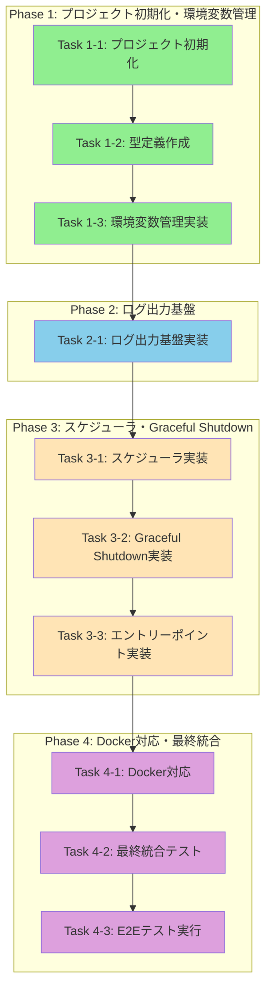

# 作業計画書: 基盤とスケジューラ

## 概要

Dify使用量エクスポートシステムの基盤となるTypeScript/Node.js実行環境、環境変数管理、ログ出力基盤、定期実行スケジューラ、Graceful Shutdown機能、Docker対応を実装する。

## フェーズ構成図

```mermaid
gantt
    title 基盤とスケジューラ 実装フェーズ
    dateFormat  X
    axisFormat %s

    section Phase 1
    プロジェクト初期化           :p1-1, 0, 1
    環境変数管理                 :p1-2, after p1-1, 2

    section Phase 2
    ログ出力基盤                 :p2-1, after p1-2, 2

    section Phase 3
    スケジューラ                 :p3-1, after p2-1, 2
    Graceful Shutdown           :p3-2, after p3-1, 1

    section Phase 4
    Docker対応                   :p4-1, after p3-2, 1
    最終統合                     :p4-2, after p4-1, 1
```

## タスク依存関係図

## リスクと対策

| リスク | 影響度 | 発生確率 | 対策 | 検知方法 |
|--------|--------|----------|------|----------|
| 環境変数スキーマの設計ミス | 高 | 中 | Design Docの型定義を厳密に実装、テストで検証 | 統合テストのAC-ENV-2/3失敗 |
| cronパッケージの動作不安定 | 中 | 低 | 公式ドキュメント準拠、タイムゾーン明示指定 | AC-SCHED-7精度テスト失敗 |
| Graceful Shutdownタイムアウト | 中 | 低 | デフォルト30秒で十分な余裕確保 | AC-SHUT-5テスト失敗 |
| winstonログ形式の不一致 | 低 | 中 | JSON Lines形式を明示設定、テストで検証 | AC-LOG-1/2テスト失敗 |
| Dockerビルド失敗 | 中 | 低 | マルチステージビルドの各段階で検証 | docker buildコマンド失敗 |

---

## Phase 1: プロジェクト初期化・環境変数管理

**目標**: TypeScript/Node.js実行環境の構築と環境変数の一元管理

**確認レベル**: L2（結合テスト）

### Task 1-1: プロジェクト初期化

- [ ] npm init で package.json 作成
- [ ] 依存ライブラリのインストール（winston, dotenv, zod, cron）
- [ ] 開発依存のインストール（typescript, @types/node, vitest）
- [ ] tsconfig.json 作成（strict mode有効、ESNext対応）
- [ ] .gitignore 作成（node_modules, dist, .env等）
- [ ] .env.example 作成（サンプル環境変数）
- [ ] npm scripts 設定（build, start, test, check）
- [ ] `npm run build` でビルド成功確認

**完了条件**:
- ビルドコマンドが成功する
- TypeScript strict mode が有効

### Task 1-2: 型定義作成（src/types/env.ts）

- [ ] EnvSchema（Zod）の定義
  - 必須: DIFY_API_URL, DIFY_API_TOKEN, EXTERNAL_API_URL, EXTERNAL_API_TOKEN
  - オプション: CRON_SCHEDULE, LOG_LEVEL, GRACEFUL_SHUTDOWN_TIMEOUT, MAX_RETRY, NODE_ENV
- [ ] EnvConfig型のエクスポート
- [ ] 型チェック通過確認

**完了条件**:
- Design DocのenvSchemaと完全一致
- `npm run check` でエラーなし

### Task 1-3: 環境変数管理実装と統合テスト作成（src/config/env-config.ts）

- [ ] loadConfig()関数の実装
  - dotenv.config()呼び出し
  - Zodスキーマでの検証
  - 失敗時はconsole.error + exit(1)
- [ ] 統合テスト作成（test/integration/foundation-and-scheduler.int.test.ts）
  - AC-ENV-1: 起動時の環境変数読み込み（2件）
  - AC-ENV-2: 必須環境変数未設定時のエラー処理（5件）
  - AC-ENV-3: 不正値時のZodエラー処理（8件）
  - AC-ENV-4: オプション環境変数のデフォルト値（5件）
  - AC-ENV-5: loadConfig()経由の設定取得（2件）
- [ ] 統合テスト実行・パス確認

**テストファイルパス**: `test/integration/foundation-and-scheduler.int.test.ts`

**完了条件**:
- AC-ENV-1〜5対応（22件のテスト解決）
- 必須環境変数検証が1秒以内に完了
- トレーサビリティ: AC-ENV-1（2件）、AC-ENV-2（5件）、AC-ENV-3（8件）、AC-ENV-4（5件）、AC-ENV-5（2件）

### Phase 1 動作確認手順

1. `.env`ファイルに必須環境変数を設定
2. `npm run build && node dist/index.js` を実行
3. **期待結果**: 起動成功ログが出力される（この時点ではindex.tsが簡易実装のため、configロード成功のみ確認）

---

## Phase 2: ログ出力基盤

**目標**: winston によるJSON形式ログ出力基盤の構築

**確認レベル**: L2（結合テスト）

### Task 2-1: ログ出力基盤実装と統合テスト作成（src/logger/winston-logger.ts）

- [ ] Loggerインターフェースの定義
  - error, warn, info, debug メソッド
  - child メソッド（メタデータ継承）
- [ ] createLogger()関数の実装
  - JSON形式出力（winston.format.json）
  - タイムスタンプ（ISO 8601形式）
  - スタックトレース対応
  - defaultMeta（service, env）
- [ ] wrapWinstonLogger()関数の実装
- [ ] 統合テスト作成（test/integration/foundation-and-scheduler.int.test.ts）
  - AC-LOG-1: JSON Lines形式での標準出力（4件）
  - AC-LOG-2: ログフィールドの含有（5件）
  - AC-LOG-3: 4つのログレベルサポート（7件）
  - AC-LOG-4: エラーログのスタックトレース（3件）
  - AC-LOG-5: シークレット情報の非出力（3件）
  - Logger子インスタンス（2件）
- [ ] 統合テスト実行・パス確認

**テストファイルパス**: `test/integration/foundation-and-scheduler.int.test.ts`

**完了条件**:
- AC-LOG-1〜5対応（24件のテスト解決）
- ログオーバーヘッド5%以内（パフォーマンス要件）
- トレーサビリティ: AC-LOG-1（4件）、AC-LOG-2（5件）、AC-LOG-3（7件）、AC-LOG-4（3件）、AC-LOG-5（3件）、子インスタンス（2件）

### Phase 2 動作確認手順

1. LOG_LEVEL=debug を設定して起動
2. **期待結果**: JSON形式でログが標準出力に出力される
3. **確認**: timestamp、level、message、serviceフィールドが含まれる

---

## Phase 3: スケジューラ・Graceful Shutdown

**目標**: 定期実行スケジューラとGraceful Shutdown機能の実装

**確認レベル**: L2（結合テスト）

### Task 3-1: スケジューラ実装と統合テスト作成（src/scheduler/cron-scheduler.ts）

- [ ] Schedulerインターフェースの定義
  - start, stop, isRunning メソッド
- [ ] validateCronExpression()関数の実装
- [ ] createScheduler()関数の実装
  - cron式検証
  - isTaskRunningフラグによる重複実行防止
  - executionId生成
  - ジョブ実行ログ（開始/完了/失敗）
  - UTCタイムゾーン設定
- [ ] generateExecutionId()関数の実装
- [ ] 統合テスト作成（test/integration/foundation-and-scheduler.int.test.ts）
  - AC-SCHED-1: スケジューラ起動と次回実行予定ログ（3件）
  - AC-SCHED-2: cron時刻到達時のonTick実行（4件）
  - AC-SCHED-3: CRON_SCHEDULE環境変数の使用（2件）
  - AC-SCHED-4: 無効なcron式でのexit（3件）
  - AC-SCHED-5: 実行中ジョブのスキップ（3件）
  - AC-SCHED-6: executionId生成とログ含有（4件）
  - AC-SCHED-7: cron時刻からの実行精度（1件）
  - スケジューラ停止（2件）
  - ジョブ実行エラーハンドリング（4件）
  - isRunning()状態確認（2件）
- [ ] 統合テスト実行・パス確認

**テストファイルパス**: `test/integration/foundation-and-scheduler.int.test.ts`

**完了条件**:
- AC-SCHED-1〜7対応（28件のテスト解決）
- cron時刻から±5秒以内でジョブ実行開始
- トレーサビリティ: AC-SCHED-1（3件）、AC-SCHED-2（4件）、AC-SCHED-3（2件）、AC-SCHED-4（3件）、AC-SCHED-5（3件）、AC-SCHED-6（4件）、AC-SCHED-7（1件）、停止（2件）、エラー（4件）、状態（2件）

### Task 3-2: Graceful Shutdown実装と統合テスト作成（src/shutdown/graceful-shutdown.ts）

- [ ] GracefulShutdownOptionsインターフェースの定義
- [ ] setupGracefulShutdown()関数の実装
  - SIGINT/SIGTERMハンドラ登録
  - タスク完了待機ループ
  - タイムアウト処理
  - unhandledRejectionハンドラ
  - uncaughtExceptionハンドラ
- [ ] sleep()ヘルパー関数の実装
- [ ] 統合テスト作成（test/integration/foundation-and-scheduler.int.test.ts）
  - AC-SHUT-1: SIGINTによるShutdown開始（2件）
  - AC-SHUT-2: SIGTERMによるShutdown開始（2件）
  - AC-SHUT-3: タスクなしでの即座終了（2件）
  - AC-SHUT-4: 実行中タスクの完了待機（2件）
  - AC-SHUT-5: タイムアウト超過による強制終了（3件）
  - AC-SHUT-6: unhandledRejectionでのexit（3件）
  - AC-SHUT-7: uncaughtExceptionでのexit（3件）
  - スケジューラ停止の確認（1件）
- [ ] 統合テスト実行・パス確認

**テストファイルパス**: `test/integration/foundation-and-scheduler.int.test.ts`

**完了条件**:
- AC-SHUT-1〜7対応（18件のテスト解決）
- Graceful Shutdown成功率99%以上
- トレーサビリティ: AC-SHUT-1（2件）、AC-SHUT-2（2件）、AC-SHUT-3（2件）、AC-SHUT-4（2件）、AC-SHUT-5（3件）、AC-SHUT-6（3件）、AC-SHUT-7（3件）、停止確認（1件）

### Task 3-3: エントリーポイント実装と統合テスト作成（src/index.ts）

- [ ] main()関数の実装
  - loadConfig()呼び出し
  - createLogger()呼び出し
  - createScheduler()呼び出し（プレースホルダーonTick）
  - setupGracefulShutdown()呼び出し
  - scheduler.start()呼び出し
  - 設定ダンプログ出力（シークレットマスク）
- [ ] main().catch()エラーハンドリング
- [ ] 統合テスト作成（test/integration/foundation-and-scheduler.int.test.ts）
  - 正常起動フロー（4件）
  - main()のエラーハンドリング（2件）
- [ ] 統合テスト実行・パス確認

**テストファイルパス**: `test/integration/foundation-and-scheduler.int.test.ts`

**完了条件**:
- エントリーポイント統合テスト対応（6件のテスト解決）
- 起動時間5秒以内
- トレーサビリティ: 正常起動（4件）、エラーハンドリング（2件）

### Phase 3 動作確認手順

1. CRON_SCHEDULE='*/1 * * * *'（毎分実行）を設定
2. 起動し、1分待機
3. **期待結果**: ジョブ実行開始/完了ログが出力される
4. `kill -SIGTERM <pid>` を送信
5. **期待結果**: Graceful Shutdown完了ログが出力され、exit 0で終了

---

## Phase 4: Docker対応・最終統合

**目標**: Dockerマルチステージビルド対応と全テスト通過

**確認レベル**: L3（E2Eテスト）

### Task 4-1: Docker対応

- [ ] Dockerfile作成
  - ビルドステージ（node:20-alpine）
  - 実行ステージ（node:20-alpine）
  - 非rootユーザー（exporter, uid:1001）
  - 本番依存のみインストール
- [ ] .dockerignore作成
- [ ] docker buildコマンドで成功確認
- [ ] docker run --env-file .env で起動確認

**完了条件**:
- AC-DOCKER-1〜3対応
- ビルドイメージサイズの最適化
- 非rootユーザー実行

### Task 4-2: 最終統合テストと品質チェック

- [ ] 全統合テスト実行（112件）
- [ ] カバレッジ確認（70%以上）
- [ ] Biome check（lint + format）
- [ ] TypeScriptビルド確認
- [ ] 未解決テスト: 0件

**テストファイルパス**: `test/integration/foundation-and-scheduler.int.test.ts`

**完了条件**:
- 統合テスト: 112/112件パス
- カバレッジ: 70%以上
- lint/format: エラーなし

### Task 4-3: E2Eテスト実行

- [ ] E2Eテスト実行（49件）
  - Docker コンテナ E2Eテスト（11件）
  - アプリケーション起動 E2Eテスト（8件）
  - スケジューラ実行 E2Eテスト（6件）
  - Graceful Shutdown E2Eテスト（8件）
  - ログ出力 E2Eテスト（6件）
  - 異常系 E2Eテスト（2件）
  - 全体シナリオ E2Eテスト（8件）
- [ ] 全E2Eテストパス確認

**テストファイルパス**: `test/e2e/foundation-and-scheduler.e2e.test.ts`

**完了条件**:
- E2Eテスト: 49/49件パス
- パフォーマンス要件達成（起動5秒以内、検証1秒以内）

### Phase 4 動作確認手順

1. `docker build -t dify-usage-exporter .` を実行
2. `docker run --env-file .env dify-usage-exporter` を実行
3. **期待結果**: コンテナ内で正常に起動し、ログが出力される
4. `docker stop <container_id>` を実行
5. **期待結果**: Graceful Shutdownが完了し、exit 0で終了

---

## 品質保証チェックリスト

### 受入条件達成状況

#### 環境変数管理
- [ ] AC-ENV-1: .envファイルから環境変数読み込み
- [ ] AC-ENV-2: 必須環境変数未設定時のexit 1
- [ ] AC-ENV-3: 不正値時のZodエラー
- [ ] AC-ENV-4: オプション環境変数のデフォルト値
- [ ] AC-ENV-5: loadConfig()経由の設定取得

#### ログ出力基盤
- [ ] AC-LOG-1: JSON Lines形式での標準出力
- [ ] AC-LOG-2: timestamp/level/message/context含有
- [ ] AC-LOG-3: error/warn/info/debugサポート
- [ ] AC-LOG-4: エラーログのスタックトレース
- [ ] AC-LOG-5: シークレット情報の非出力

#### 定期実行スケジューラ
- [ ] AC-SCHED-1: 5秒以内にスケジューラ起動
- [ ] AC-SCHED-2: cron時刻到達時のonTick実行
- [ ] AC-SCHED-3: CRON_SCHEDULE環境変数使用
- [ ] AC-SCHED-4: 無効なcron式でexit 1
- [ ] AC-SCHED-5: 実行中ジョブのスキップ
- [ ] AC-SCHED-6: executionId生成とログ含有
- [ ] AC-SCHED-7: cron時刻から±5秒以内で実行

#### Graceful Shutdown
- [ ] AC-SHUT-1: SIGINTでShutdown開始
- [ ] AC-SHUT-2: SIGTERMでShutdown開始
- [ ] AC-SHUT-3: タスクなしでexit 0
- [ ] AC-SHUT-4: 実行中タスク完了待機
- [ ] AC-SHUT-5: タイムアウト超過でexit 1
- [ ] AC-SHUT-6: unhandledRejectionでexit 1
- [ ] AC-SHUT-7: uncaughtExceptionでexit 1

#### Docker対応
- [ ] AC-DOCKER-1: マルチステージビルド
- [ ] AC-DOCKER-2: 非rootユーザー実行
- [ ] AC-DOCKER-3: node:20-alpineベース

### テストカバレッジ

| カテゴリ | 件数 | 状況 |
|---------|------|------|
| 統合テスト | 112件 | 未実行 |
| E2Eテスト | 49件 | 未実行 |
| **合計** | **161件** | - |

### パフォーマンス要件

- [ ] 起動時間: 5秒以内
- [ ] 環境変数検証: 1秒以内
- [ ] ログオーバーヘッド: 5%以内
- [ ] cron実行精度: ±5秒以内

### 最終確認

- [ ] 全統合テスト通過（112件）
- [ ] 全E2Eテスト通過（49件）
- [ ] カバレッジ70%以上
- [ ] Biome check通過
- [ ] TypeScriptビルド成功
- [ ] Docker build/run成功
- [ ] 設計書（Design Doc）との整合性確認
