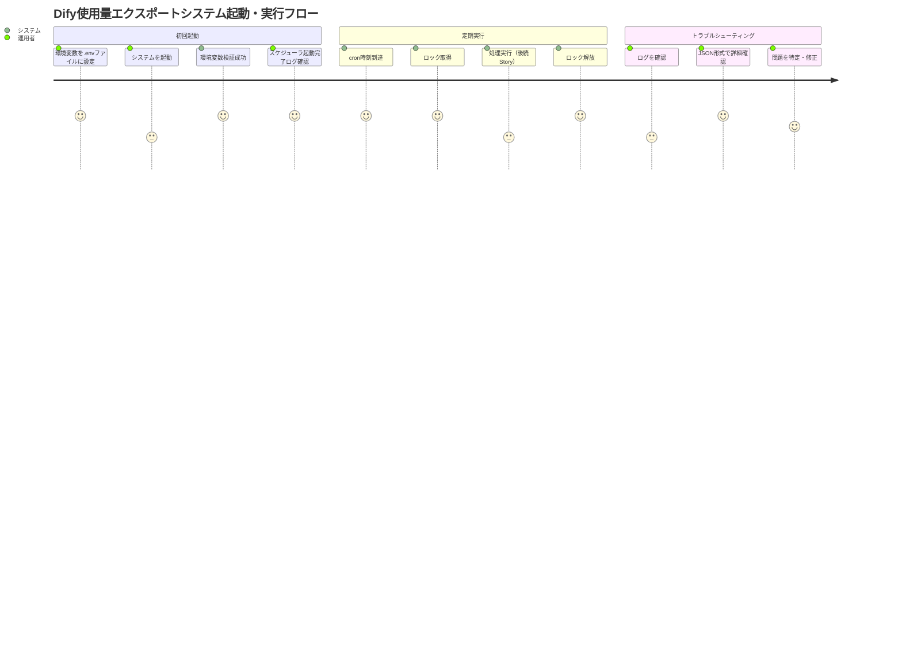
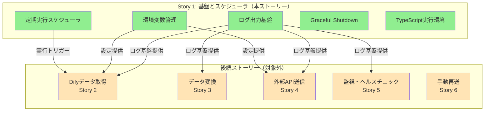

# 要件定義書: 基盤とスケジューラ

## 概要

### 1行要約
Dify使用量エクスポート機能の基盤となるTypeScript/Node.js実行環境、ログ出力、環境変数管理、定期実行スケジューラを構築する。

### 背景
Dify使用量を定期的に外部APIへ連携するシステムを構築するにあたり、後続ストーリーで実装される各機能（データ取得、変換、送信、監視）が動作する土台が必要です。本ストーリーでは、以下の課題を解決します：

- **実行環境の標準化**: ローカル開発・本番環境（コンテナ）の両方で一貫して動作する実行基盤
- **運用可視性の確保**: 構造化されたログ出力により、トラブルシューティングと監視を可能にする
- **設定の一元管理**: 環境ごとに異なる設定を安全に管理し、起動時に検証する
- **定期実行の自動化**: 人手を介さずに毎日自動的にデータ連携を実行する

## ユーザーストーリー

### プライマリーユーザー
- **システム運用者**: Dify使用量エクスポートシステムを運用・監視する担当者
- **開発者**: 本システムを開発・保守する担当者

### ユーザーストーリー
```
As a システム運用者
I want to Dify使用量エクスポートシステムが毎日自動的に実行される
So that 手動オペレーションなしで継続的にデータ連携が行われる
```

```
As a システム運用者
I want to システムのログを構造化されたJSON形式で確認できる
So that 問題発生時に迅速に原因を特定し対処できる
```

```
As a 開発者
I want to 環境変数の設定ミスを起動時に検出できる
So that 本番環境で設定ミスによる障害を未然に防げる
```

### ユースケース

1. **定期実行**: 毎日深夜0時に自動的にエクスポート処理を実行
2. **手動実行**: 開発・検証のために任意のタイミングで手動実行
3. **環境別設定**: 開発環境と本番環境で異なる設定（cron時刻、ログレベル）を適用
4. **ログ確認**: 標準出力に出力されたJSON形式のログを解析ツールで検索・分析
5. **設定エラー検出**: 必須環境変数の未設定や不正な値を起動時に検出し、エラーメッセージを出力

## 機能要件

### 必須要件（MVP）

#### 1. TypeScript/Node.js実行環境
- **プロジェクト初期化**: npm initでdify-usage-exporterプロジェクトを作成
- **TypeScript設定**: strict mode有効、ESNext対応、型定義ファイル生成
- **ビルド**: TypeScriptをコンパイルしてdist/ディレクトリへ出力
- **実行**: node dist/index.jsで実行可能

#### 2. 環境変数管理
- **設定ファイル**: .envファイルで環境変数を管理（dotenv使用）
- **起動時検証**: 必須環境変数の存在チェック、型チェック（zodスキーマ使用）
- **検証失敗時**: エラーメッセージをログ出力し、exit code 1で終了
- **必須環境変数**:
  - `DIFY_API_URL`: Dify APIのベースURL（例: https://dify.example.com）
  - `DIFY_API_TOKEN`: Dify API認証トークン
  - `EXTERNAL_API_URL`: 外部APIのベースURL（例: https://api.example.com）
  - `EXTERNAL_API_TOKEN`: 外部API認証トークン
- **オプション環境変数**（デフォルト値あり）:
  - `CRON_SCHEDULE`: cron式（デフォルト: `0 0 * * *` 毎日深夜0時）
  - `LOG_LEVEL`: ログレベル（デフォルト: `info`）
  - `GRACEFUL_SHUTDOWN_TIMEOUT`: Graceful Shutdownタイムアウト秒数（デフォルト: `30`）
  - `MAX_RETRY`: 最大リトライ回数（デフォルト: `3`）

#### 3. ログ出力基盤
- **ログライブラリ**: winston使用
- **出力先**: 標準出力（stdout）のみ
- **形式**: JSON Lines（1行1JSONオブジェクト）
- **ログレベル**: error, warn, info, debug
- **共通項目**: timestamp（ISO 8601形式）, level, message, context
- **構造化**: コンテキスト情報（実行ID、モジュール名、メトリクス）を含める

#### 4. 定期実行スケジューラ
- **ライブラリ**: node-cron使用
- **デフォルトスケジュール**: 毎日深夜0時（`0 0 * * *`）
- **環境変数上書き**: CRON_SCHEDULEで任意のcron式を設定可能
- **cron式検証**: 起動時にcron式の妥当性を検証、不正な場合はエラー終了
- **実行ロック**: 同時実行を防ぐためのロック機構（後続ストーリーで詳細実装）
- **ロック取得失敗時**: エラーログ出力 + exit code 1で終了

#### 5. Graceful Shutdown
- **シグナル対応**: SIGINT、SIGTERMを受信時にGraceful Shutdown
- **タイムアウト**: 環境変数GRACEFUL_SHUTDOWN_TIMEOUT秒以内に終了（デフォルト30秒）
- **実行中処理**: 実行中のタスクを完了してから終了
- **強制終了**: タイムアウト超過時はexit code 1で強制終了

#### 6. コンテナ対応
- **Dockerfile**: Node.js 20.x LTSベースイメージ
- **マルチステージビルド**: ビルドステージと実行ステージを分離
- **非rootユーザー**: セキュリティのため非rootユーザーで実行
- **ヘルスチェック**: コンテナヘルスチェックエンドポイント（後続ストーリーで実装）

### 追加要件（Nice to Have）
- **設定ファイルのバリデーション**: 起動時に.env.exampleと実際の.envを比較し、不足している環境変数を警告
- **開発モード**: NODE_ENV=developmentでデバッグ機能有効化（詳細ログ、ホットリロード）
- **設定ダンプ**: 起動時に有効な設定値をログ出力（シークレットはマスク）

### 対象外（Out of Scope）
- **Difyからのデータ取得**: Story 2で実装
- **データ変換ロジック**: Story 3で実装
- **外部API送信**: Story 4で実装
- **監視・ヘルスチェック**: Story 5で実装
- **手動再送機能**: Story 6で実装
- **ログ収集基盤**: CloudWatch Logs、Datadogなどの外部ログ管理サービスとの連携（将来的な拡張として検討）

## 非機能要件

### パフォーマンス
- **起動時間**: 5秒以内にスケジューラが起動し、次回実行予定をログ出力
- **環境変数検証**: 起動時検証は1秒以内に完了
- **ログオーバーヘッド**: ログ出力によるパフォーマンス低下を5%以内に抑制

### 信頼性
- **起動失敗の検出**: 環境変数検証失敗時は即座にexit code 1で終了
- **ロック失敗の検出**: 同時実行検出時はexit code 1で終了
- **Graceful Shutdown成功率**: SIGINT/SIGTERM受信時の正常終了率99%以上

### セキュリティ
- **シークレット管理**: APIトークンは環境変数で管理、ログ出力しない
- **.envファイル保護**: .gitignoreで.envをバージョン管理から除外
- **ログのマスキング**: 万が一シークレットを含むエラーが発生してもログには出力しない（または一部マスク）

### 拡張性
- **モジュール分離**: 各機能（環境変数管理、ログ、スケジューラ）を独立したモジュールとして実装
- **インターフェース定義**: 後続ストーリーで実装する機能との連携のためのインターフェースを定義
- **設定追加容易性**: 新しい環境変数の追加が容易な設計

## 成功基準

### 定量的指標
1. **起動成功率**: 正しい環境変数設定で起動成功率100%
2. **起動失敗検出率**: 環境変数不足・不正時の検出率100%
3. **ログ出力成功率**: 全てのログがJSON形式で標準出力に出力される（100%）
4. **スケジューラ精度**: 設定したcron時刻から±5秒以内で実行開始
5. **Graceful Shutdown成功率**: タイムアウト内での正常終了率99%以上

### 定性的指標
1. **開発者体験**: 環境変数設定ミスを即座に検出でき、エラーメッセージが明確
2. **運用体験**: ログを見るだけでシステムの状態（次回実行予定、設定値）が把握できる
3. **保守性**: モジュールが明確に分離されており、後続ストーリーでの拡張が容易

## ユーザージャーニー



## スコープ境界図



## 技術的考慮事項

### 依存関係
- **Node.js**: 20.x LTS（2024年10月時点での最新LTS）
- **TypeScript**: 5.x
- **依存ライブラリ**:
  - `winston`: 3.x（ログ出力）
  - `dotenv`: 16.x（環境変数読み込み）
  - `zod`: 3.x（環境変数検証）
  - `node-cron`: 3.x（定期実行スケジューラ）

### 制約
- **実行環境**: ローカル（macOS、Linux）とDockerコンテナの両対応
- **ログ出力先**: 標準出力のみ（ファイル出力は将来的な拡張として検討）
- **ロック機構**: 単一プロセスのみを想定（分散ロックは対象外）
- **タイムゾーン**: UTC基準（cron実行時刻もUTC）

### リスクと軽減策
| リスク | 影響度 | 発生確率 | 軽減策 |
|--------|--------|----------|--------|
| 環境変数の設定ミス | 高 | 高 | 起動時バリデーション、.env.exampleの提供、エラーメッセージの明確化 |
| cron式の設定ミス | 中 | 中 | 起動時にcron式を検証、デフォルト値の提供 |
| Graceful Shutdownタイムアウト | 中 | 低 | 環境変数で調整可能、デフォルト30秒で十分な時間を確保 |
| Node.jsバージョン不一致 | 低 | 低 | Dockerで実行環境を統一、package.jsonでenginesを指定 |
| ログ出力の肥大化 | 低 | 中 | ログレベルをinfoに設定、debugは開発時のみ使用 |

## 付録

### 参考資料
- [Epic: dify-usage-exporter](https://www.notion.so/2aeaebc7449b80678c40fd4f602f2f54)
- [Story: foundation-and-scheduler](https://www.notion.so/2aeaebc7449b81a2a0e1c717e13fd9ea)
- [winston Documentation](https://github.com/winstonjs/winston)
- [node-cron Documentation](https://github.com/node-cron/node-cron)
- [zod Documentation](https://zod.dev/)

### 用語集
- **Graceful Shutdown**: プロセス終了時に実行中のタスクを完了してから終了する仕組み
- **JSON Lines**: 1行に1つのJSONオブジェクトを記述する形式（.jsonl）
- **cron式**: Unixのcron形式で定期実行スケジュールを表現する記法（例: `0 0 * * *`）
- **ロック機構**: 同時実行を防ぐための排他制御
- **冪等性**: 同じ操作を複数回実行しても結果が変わらない性質
- **ウォーターマーク**: 最後に処理したデータの位置を記録する仕組み
- **スプール**: 送信失敗時に一時保存し、後でリトライするための保存領域

### ディレクトリ構造（想定）
```
dify-usage-exporter/
├── src/
│   ├── index.ts                    # エントリーポイント
│   ├── config/
│   │   └── env-config.ts           # 環境変数管理
│   ├── logger/
│   │   └── winston-logger.ts       # ログ出力基盤
│   ├── scheduler/
│   │   └── cron-scheduler.ts       # 定期実行スケジューラ
│   └── types/
│       └── env.ts                  # 環境変数の型定義
├── dist/                           # ビルド成果物
├── .env                            # 環境変数（gitignore対象）
├── .env.example                    # 環境変数のサンプル
├── package.json
├── tsconfig.json
├── Dockerfile
└── README.md
```

### 環境変数設定例（.env.example）
```bash
# Dify API Settings
DIFY_API_URL=https://dify.example.com
DIFY_API_TOKEN=your-dify-api-token

# External API Settings
EXTERNAL_API_URL=https://api.example.com
EXTERNAL_API_TOKEN=your-external-api-token

# Scheduler Settings
CRON_SCHEDULE=0 0 * * *

# Logging Settings
LOG_LEVEL=info

# Graceful Shutdown
GRACEFUL_SHUTDOWN_TIMEOUT=30

# Retry Settings
MAX_RETRY=3
```
