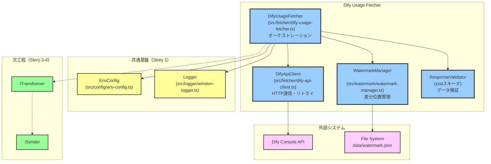
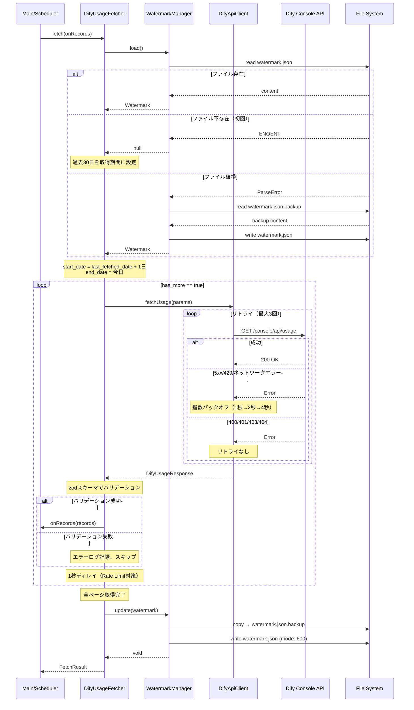
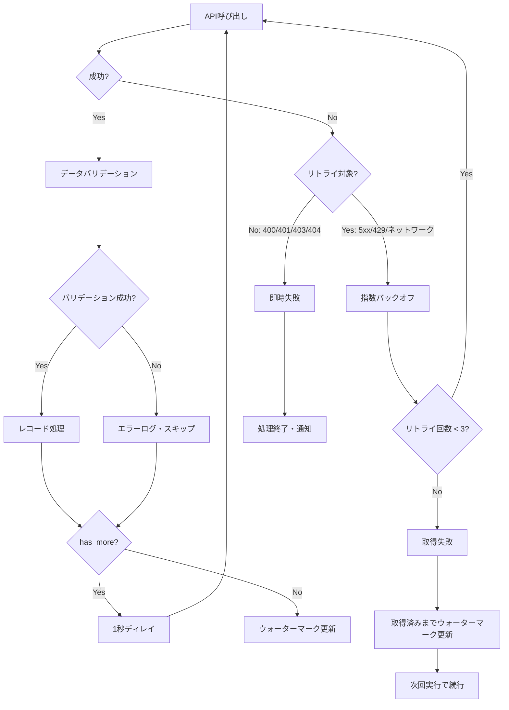

# Design Doc: Dify使用量データ取得機能

## 合意事項チェックリスト

### スコープ
- [x] Dify Console APIから使用量データを取得
- [x] ウォーターマーク方式による差分取得（ファイルベース）
- [x] ページング処理によるメモリ効率化
- [x] 指数バックオフによるリトライ制御
- [x] zodスキーマによるデータバリデーション
- [x] 固定Bearer Token認証

### 非スコープ
- [x] データ変換（Story 3で実装）
- [x] 外部API送信（Story 4で実装）
- [x] エラー通知（Story 5で実装）
- [x] ウォーターマークリセットCLI（Story 6で実装）

### 制約条件
- [x] メモリ使用量100MB以内
- [x] 10,000件を30秒以内で取得
- [x] Dify API仕様はv1.9.2リリース後に要確認
- [x] 単一プロセス前提（複数プロセス同時実行非対応）

### パフォーマンス要件
- [x] 取得成功率99.9%以上
- [x] 重複取得率0%（ウォーターマーク保証）

## 前提となるADR

- [ADR 002: リトライポリシー](specs/adr/002-retry-policy.md) - 指数バックオフの詳細
- [ADR 003: ファイルロック機構](specs/adr/003-file-lock-mechanism.md) - ウォーターマークファイルの排他制御
- [ADR 007: HTTPクライアントライブラリ](specs/adr/007-http-client-library.md) - axios + axios-retry
- [ADR 008: バックエンド基盤技術スタック](specs/adr/008-backend-foundation-tech-stack.md) - 技術基盤
- [ADR 009: Dify Fetcherアーキテクチャ](specs/adr/009-dify-fetcher-architecture.md) - 本機能の技術選択

## 既存コードベース分析

### 実装パスマッピング

| パス | 種別 | 説明 |
|------|------|------|
| `src/config/env-config.ts` | 既存 | 環境変数管理（拡張対象） |
| `src/types/env.ts` | 既存 | 環境変数スキーマ（拡張対象） |
| `src/logger/winston-logger.ts` | 既存 | 構造化ログ出力 |
| `src/fetcher/dify-usage-fetcher.ts` | 新規 | Dify APIクライアント |
| `src/fetcher/dify-api-client.ts` | 新規 | HTTP通信層 |
| `src/watermark/watermark-manager.ts` | 新規 | ウォーターマーク管理 |
| `src/types/dify-usage.ts` | 新規 | Dify使用量データ型定義 |
| `src/types/watermark.ts` | 新規 | ウォーターマーク型定義 |
| `src/interfaces/fetcher.ts` | 新規 | Fetcherインターフェース |

### 類似機能の検索結果

- **HTTPクライアント**: axiosは`package.json`に含まれていないが、ADR 007でaxios + axios-retryの採用が決定済み
- **環境変数管理**: `src/config/env-config.ts`と`src/types/env.ts`が存在し、拡張して使用
- **ロガー**: `src/logger/winston-logger.ts`が存在し、そのまま使用

### 判断
- **既存使用**: 環境変数管理、ロガー
- **新規実装**: Dify APIクライアント、ウォーターマーク管理、型定義

## 変更影響マップ

```yaml
変更対象: Dify使用量データ取得機能
直接影響:
  - src/types/env.ts（環境変数スキーマ拡張）
  - src/config/env-config.ts（環境変数読み込み）
  - src/fetcher/（新規ディレクトリ）
  - src/watermark/（新規ディレクトリ）
  - src/types/dify-usage.ts（新規）
  - src/types/watermark.ts（新規）
  - src/interfaces/fetcher.ts（新規）
間接影響:
  - src/index.ts（エントリーポイント、将来的に統合）
  - data/watermark.json（実行時生成）
波及なし:
  - src/scheduler/cron-scheduler.ts
  - src/shutdown/graceful-shutdown.ts
```

## 統合ポイントマップ

```yaml
統合点1:
  既存コンポーネント: EnvConfig（src/types/env.ts）
  統合方法: zodスキーマにDify関連環境変数を追加
  影響度: 中（データ利用）
  必要なテスト観点: 新規環境変数の検証、デフォルト値の確認

統合点2:
  既存コンポーネント: Logger（src/logger/winston-logger.ts）
  統合方法: 依存性注入でLoggerインスタンスを受け取る
  影響度: 低（読み取りのみ）
  必要なテスト観点: ログ出力形式の確認

統合点3:
  新規コンポーネント: ITransformer（Story 3）
  統合方法: Fetcherが取得したデータをTransformerに渡す
  影響度: 高（処理フロー変更）
  必要なテスト観点: インターフェース整合性、データ形式の一致

統合点4:
  新規コンポーネント: ISender（Story 4）
  統合方法: 変換済みデータをSenderに渡す
  影響度: 高（処理フロー変更）
  必要なテスト観点: 送信失敗時のウォーターマーク更新タイミング
```

## 統合境界の約束

```yaml
DifyApiFetcher → WatermarkManager:
  入力: last_fetched_date（Date）
  出力: 同期（Watermark型オブジェクト）
  エラー時: WatermarkFileError（復元試行後に失敗した場合）

DifyApiFetcher → DifyApiClient:
  入力: start_date, end_date, page, limit
  出力: 非同期（DifyUsageResponse型）
  エラー時: DifyApiError（リトライ後も失敗した場合）

DifyApiFetcher → ITransformer:
  入力: DifyUsageRecord[]
  出力: 同期または非同期（ExternalApiRecord[]）
  エラー時: TransformError（変換失敗）

WatermarkManager → ファイルシステム:
  入力: Watermark型オブジェクト
  出力: 同期（void）
  エラー時: WatermarkFileError（書き込み失敗、バックアップ失敗）
```

## 実装アプローチ

**垂直スライスアプローチを採用**

### 選択理由
1. **機能単位で完結**: Dify API取得は独立した機能
2. **外部依存最小**: 既存コードへの影響が限定的
3. **価値提供が早い**: 取得機能が完成すれば、モック外部APIで動作確認可能
4. **テストしやすい**: 各層を独立してテスト可能

### フェーズ構成
1. **Phase 1**: 型定義・インターフェース（基盤）
2. **Phase 2**: ウォーターマーク管理（データ層）
3. **Phase 3**: Dify APIクライアント（通信層）
4. **Phase 4**: Fetcher統合（ビジネス層）
5. **Phase 5**: 統合テスト・品質保証

## システムアーキテクチャ

### コンポーネント構成図



### 責務分離

| コンポーネント | 責務 | 依存関係 |
|---------------|------|----------|
| DifyUsageFetcher | オーケストレーション、フロー制御 | DifyApiClient, WatermarkManager, Logger |
| DifyApiClient | HTTP通信、リトライ、認証 | axios, axios-retry, EnvConfig |
| WatermarkManager | ウォーターマーク読み書き、バックアップ・復元 | fs, EnvConfig |
| ResponseValidator | レスポンスバリデーション | zod |

## クラス/インターフェース設計

### IFetcher インターフェース

```typescript
// src/interfaces/fetcher.ts
import type { DifyUsageRecord } from '../types/dify-usage.js'

export interface IFetcher {
  /**
   * 使用量データを取得し、コールバックで処理する
   * @param onRecords 取得したレコードを処理するコールバック
   * @returns 取得結果のサマリー
   */
  fetch(onRecords: (records: DifyUsageRecord[]) => Promise<void>): Promise<FetchResult>
}

export interface FetchResult {
  success: boolean
  totalRecords: number
  totalPages: number
  startDate: string
  endDate: string
  durationMs: number
  errors: FetchError[]
}

export interface FetchError {
  type: 'validation' | 'api' | 'watermark'
  message: string
  details?: Record<string, unknown>
}
```

### DifyUsageFetcher クラス

```typescript
// src/fetcher/dify-usage-fetcher.ts
import type { IFetcher, FetchResult } from '../interfaces/fetcher.js'
import type { DifyApiClient } from './dify-api-client.js'
import type { WatermarkManager } from '../watermark/watermark-manager.js'
import type { Logger } from '../logger/winston-logger.js'
import type { EnvConfig } from '../types/env.js'
import type { DifyUsageRecord } from '../types/dify-usage.js'

export interface DifyUsageFetcherDeps {
  client: DifyApiClient
  watermarkManager: WatermarkManager
  logger: Logger
  config: EnvConfig
}

export function createDifyUsageFetcher(deps: DifyUsageFetcherDeps): IFetcher {
  const { client, watermarkManager, logger, config } = deps

  return {
    async fetch(onRecords): Promise<FetchResult> {
      const startTime = Date.now()
      const errors: FetchError[] = []
      let totalRecords = 0
      let totalPages = 0

      // 1. ウォーターマーク読み込み
      const watermark = await watermarkManager.load()
      const startDate = calculateStartDate(watermark, config)
      const endDate = new Date()

      logger.info('Dify使用量取得開始', {
        startDate: startDate.toISOString(),
        endDate: endDate.toISOString(),
      })

      // 2. ページング処理
      let page = 1
      let hasMore = true

      while (hasMore) {
        try {
          const response = await client.fetchUsage({
            startDate: formatDate(startDate),
            endDate: formatDate(endDate),
            page,
            limit: config.DIFY_FETCH_PAGE_SIZE,
          })

          // 3. バリデーション
          const validRecords = validateRecords(response.data, errors, logger)

          if (validRecords.length > 0) {
            await onRecords(validRecords)
            totalRecords += validRecords.length
          }

          totalPages = page
          hasMore = response.has_more
          page++

          // 4. 進捗ログ（100ページごと）
          if (page % 100 === 0) {
            logger.info('取得進捗', {
              page,
              totalRecords,
              progress: `${totalRecords}/${response.total} (${Math.round((totalRecords / response.total) * 100)}%)`,
            })
          }

          // 5. ページ間ディレイ（Rate Limit対策）
          if (hasMore) {
            await sleep(1000)
          }
        } catch (error) {
          logger.error('ページ取得失敗', { page, error })
          errors.push({
            type: 'api',
            message: `ページ${page}の取得に失敗`,
            details: { page, error: String(error) },
          })
          break
        }
      }

      // 6. ウォーターマーク更新（全ページ取得完了後）
      if (totalRecords > 0) {
        await watermarkManager.update({
          last_fetched_date: endDate.toISOString(),
          last_updated_at: new Date().toISOString(),
        })
        logger.info('ウォーターマーク更新完了', {
          last_fetched_date: endDate.toISOString(),
        })
      }

      const durationMs = Date.now() - startTime

      logger.info('Dify使用量取得完了', {
        success: errors.length === 0,
        totalRecords,
        totalPages,
        durationMs,
        errorCount: errors.length,
      })

      return {
        success: errors.length === 0,
        totalRecords,
        totalPages,
        startDate: startDate.toISOString(),
        endDate: endDate.toISOString(),
        durationMs,
        errors,
      }
    },
  }
}
```

### DifyApiClient

```typescript
// src/fetcher/dify-api-client.ts
import axios, { type AxiosInstance, type AxiosError } from 'axios'
import axiosRetry from 'axios-retry'
import type { EnvConfig } from '../types/env.js'
import type { Logger } from '../logger/winston-logger.js'
import type { DifyUsageResponse } from '../types/dify-usage.js'

export interface DifyApiClientDeps {
  config: EnvConfig
  logger: Logger
}

export interface FetchUsageParams {
  startDate: string  // YYYY-MM-DD
  endDate: string    // YYYY-MM-DD
  page: number
  limit: number
}

export function createDifyApiClient(deps: DifyApiClientDeps): DifyApiClient {
  const { config, logger } = deps

  const client = axios.create({
    baseURL: config.DIFY_API_BASE_URL,
    timeout: config.DIFY_FETCH_TIMEOUT_MS,
    headers: {
      'Content-Type': 'application/json',
      'Authorization': `Bearer ${config.DIFY_API_TOKEN}`,
      'User-Agent': 'dify-usage-exporter/1.0.0',
    },
  })

  // リトライ設定（ADR 002, ADR 007準拠）
  axiosRetry(client, {
    retries: config.DIFY_FETCH_RETRY_COUNT,
    retryDelay: (retryCount, error) => {
      // 429の場合はRetry-Afterヘッダーを考慮
      const retryAfter = error.response?.headers['retry-after']
      if (retryAfter) {
        const delayMs = Number.parseInt(retryAfter, 10) * 1000
        logger.info('Retry-Afterヘッダー検出', { retryAfter, delayMs })
        return delayMs
      }
      // 指数バックオフ（1秒 → 2秒 → 4秒）
      return axiosRetry.exponentialDelay(retryCount)
    },
    retryCondition: (error: AxiosError) => {
      // リトライ対象: ネットワークエラー、5xx、429
      if (axiosRetry.isNetworkOrIdempotentRequestError(error)) {
        return true
      }
      const status = error.response?.status
      return status === 429 || (status !== undefined && status >= 500)
    },
    onRetry: (retryCount, error) => {
      logger.warn('APIリトライ試行', {
        retryCount,
        error: error.message,
        status: error.response?.status,
      })
    },
  })

  // リクエストインターセプター（ログ出力、トークンマスク）
  client.interceptors.request.use((config) => {
    logger.debug('APIリクエスト送信', {
      method: config.method,
      url: config.url,
      params: config.params,
    })
    return config
  })

  // レスポンスインターセプター（ログ出力）
  client.interceptors.response.use(
    (response) => {
      logger.debug('APIレスポンス受信', {
        status: response.status,
        url: response.config.url,
      })
      return response
    },
    (error: AxiosError) => {
      logger.error('APIエラー', {
        status: error.response?.status,
        message: error.message,
        url: error.config?.url,
      })
      throw error
    }
  )

  return {
    async fetchUsage(params: FetchUsageParams): Promise<DifyUsageResponse> {
      const response = await client.get<DifyUsageResponse>('/console/api/usage', {
        params: {
          start_date: params.startDate,
          end_date: params.endDate,
          page: params.page,
          limit: params.limit,
        },
      })
      return response.data
    },
  }
}

export interface DifyApiClient {
  fetchUsage(params: FetchUsageParams): Promise<DifyUsageResponse>
}
```

### WatermarkManager

```typescript
// src/watermark/watermark-manager.ts
import fs from 'node:fs/promises'
import path from 'node:path'
import type { Watermark } from '../types/watermark.js'
import type { Logger } from '../logger/winston-logger.js'
import type { EnvConfig } from '../types/env.js'

export interface WatermarkManagerDeps {
  config: EnvConfig
  logger: Logger
}

export function createWatermarkManager(deps: WatermarkManagerDeps): WatermarkManager {
  const { config, logger } = deps
  const filePath = config.WATERMARK_FILE_PATH
  const backupPath = `${filePath}.backup`

  return {
    async load(): Promise<Watermark | null> {
      try {
        const content = await fs.readFile(filePath, 'utf-8')
        const watermark = JSON.parse(content) as Watermark
        logger.info('ウォーターマーク読み込み成功', {
          last_fetched_date: watermark.last_fetched_date,
        })
        return watermark
      } catch (error) {
        if ((error as NodeJS.ErrnoException).code === 'ENOENT') {
          logger.info('ウォーターマークファイル不存在（初回実行）')
          return null
        }

        // 破損時はバックアップから復元を試行
        logger.warn('ウォーターマークファイル破損、バックアップから復元試行', { error })
        try {
          const backupContent = await fs.readFile(backupPath, 'utf-8')
          const watermark = JSON.parse(backupContent) as Watermark

          // バックアップから本ファイルを復元
          await fs.writeFile(filePath, backupContent, { mode: 0o600 })
          logger.info('バックアップから復元成功', {
            last_fetched_date: watermark.last_fetched_date,
          })
          return watermark
        } catch (restoreError) {
          logger.error('バックアップ復元失敗', { restoreError })
          throw new WatermarkFileError('ウォーターマークファイルとバックアップの復元に失敗')
        }
      }
    },

    async update(watermark: Watermark): Promise<void> {
      const content = JSON.stringify(watermark, null, 2)
      const dir = path.dirname(filePath)

      // ディレクトリ作成（存在しない場合）
      await fs.mkdir(dir, { recursive: true })

      // 既存ファイルのバックアップ作成
      try {
        await fs.access(filePath)
        await fs.copyFile(filePath, backupPath)
        logger.debug('ウォーターマークバックアップ作成', { backupPath })
      } catch {
        // ファイルが存在しない場合はバックアップ不要
      }

      // 新しいウォーターマークを書き込み
      await fs.writeFile(filePath, content, { mode: 0o600 })
      logger.info('ウォーターマーク更新成功', {
        last_fetched_date: watermark.last_fetched_date,
      })
    },
  }
}

export interface WatermarkManager {
  load(): Promise<Watermark | null>
  update(watermark: Watermark): Promise<void>
}

export class WatermarkFileError extends Error {
  constructor(message: string) {
    super(message)
    this.name = 'WatermarkFileError'
  }
}
```

### 型定義

```typescript
// src/types/dify-usage.ts
import { z } from 'zod'

export const difyUsageRecordSchema = z.object({
  date: z.string().regex(/^\d{4}-\d{2}-\d{2}$/),
  app_id: z.string().min(1),
  app_name: z.string().optional(),
  provider: z.string().min(1),
  model: z.string().min(1),
  input_tokens: z.number().int().min(0),
  output_tokens: z.number().int().min(0),
  total_tokens: z.number().int().min(0),
  user_id: z.string().optional(),
})

export const difyUsageResponseSchema = z.object({
  data: z.array(difyUsageRecordSchema),
  total: z.number().int().min(0),
  page: z.number().int().min(1),
  limit: z.number().int().min(1),
  has_more: z.boolean(),
})

export type DifyUsageRecord = z.infer<typeof difyUsageRecordSchema>
export type DifyUsageResponse = z.infer<typeof difyUsageResponseSchema>
```

```typescript
// src/types/watermark.ts
import { z } from 'zod'

export const watermarkSchema = z.object({
  last_fetched_date: z.string().datetime(),
  last_updated_at: z.string().datetime(),
})

export type Watermark = z.infer<typeof watermarkSchema>
```

### 環境変数スキーマ拡張

```typescript
// src/types/env.ts（拡張）
import { z } from 'zod'

export const envSchema = z.object({
  // 必須環境変数（既存）
  DIFY_API_BASE_URL: z.string().url(),
  DIFY_API_TOKEN: z.string().min(1),
  EXTERNAL_API_URL: z.string().url(),
  EXTERNAL_API_TOKEN: z.string().min(1),

  // Dify Fetcher関連（新規）
  DIFY_FETCH_PAGE_SIZE: z.coerce.number().min(1).max(1000).default(100),
  DIFY_INITIAL_FETCH_DAYS: z.coerce.number().min(1).max(365).default(30),
  DIFY_FETCH_TIMEOUT_MS: z.coerce.number().min(1000).max(120000).default(30000),
  DIFY_FETCH_RETRY_COUNT: z.coerce.number().min(1).max(10).default(3),
  DIFY_FETCH_RETRY_DELAY_MS: z.coerce.number().min(100).max(10000).default(1000),
  WATERMARK_FILE_PATH: z.string().default('data/watermark.json'),

  // オプション環境変数（既存）
  CRON_SCHEDULE: z.string().default('0 0 * * *'),
  LOG_LEVEL: z.enum(['error', 'warn', 'info', 'debug']).default('info'),
  GRACEFUL_SHUTDOWN_TIMEOUT: z.coerce.number().min(1).max(300).default(30),
  MAX_RETRY: z.coerce.number().min(1).max(10).default(3),
  NODE_ENV: z.enum(['development', 'production', 'test']).default('production'),
})

export type EnvConfig = z.infer<typeof envSchema>
```

## データフロー

### 主要フローシーケンス図



### エラーハンドリングフロー



## エラーハンドリング

### エラー種別と処理

| エラー種別 | HTTPステータス | 処理 | リトライ |
|-----------|---------------|------|----------|
| ネットワークエラー | - | 指数バックオフリトライ | 最大3回 |
| サーバーエラー | 5xx | 指数バックオフリトライ | 最大3回 |
| Rate Limit | 429 | Retry-After考慮リトライ | 最大3回 |
| Bad Request | 400 | ログ出力、処理終了 | なし |
| Unauthorized | 401 | ログ出力、処理終了 | なし |
| Forbidden | 403 | ログ出力、処理終了 | なし |
| Not Found | 404 | ログ出力、処理終了 | なし |
| バリデーションエラー | - | ログ出力、レコードスキップ | なし |
| ウォーターマークエラー | - | バックアップ復元試行 | なし |

### カスタムエラークラス

```typescript
// src/errors/dify-api-error.ts
export class DifyApiError extends Error {
  constructor(
    message: string,
    public readonly code: string,
    public readonly statusCode?: number,
    public readonly details?: Record<string, unknown>
  ) {
    super(message)
    this.name = 'DifyApiError'
  }
}

// エラーコード定義
export const DIFY_API_ERROR_CODES = {
  NETWORK_ERROR: 'DIFY_NETWORK_ERROR',
  AUTHENTICATION_ERROR: 'DIFY_AUTH_ERROR',
  PERMISSION_ERROR: 'DIFY_PERMISSION_ERROR',
  VALIDATION_ERROR: 'DIFY_VALIDATION_ERROR',
  RATE_LIMIT_ERROR: 'DIFY_RATE_LIMIT_ERROR',
  SERVER_ERROR: 'DIFY_SERVER_ERROR',
} as const
```

## 受入条件（EARS記法）

### FR-1: Dify API認証

- [ ] **AC-1-1** (遍在型): システムはすべてのAPIリクエストに`Authorization: Bearer ${DIFY_API_TOKEN}`ヘッダーを含めること
- [ ] **AC-1-2** (選択型): もし環境変数`DIFY_API_TOKEN`が未設定の場合、システムは起動時にエラーを出力して終了すること
- [ ] **AC-1-3** (不測型): もしAPIが401エラーを返した場合、システムはエラーログを出力して処理を終了すること

### FR-2: 使用量データ取得API呼び出し

- [ ] **AC-2-1** (契機型): Fetcherが起動したとき、システムはDify Console API `/console/api/usage` を呼び出すこと
- [ ] **AC-2-2** (遍在型): システムはstart_date、end_date、page、limitパラメータを正しく設定すること
- [ ] **AC-2-3** (選択型): もしAPIがJSON形式のレスポンスを返した場合、システムはDifyUsageResponse型として解析すること
- [ ] **AC-2-4** (遍在型): システムはAPIタイムアウトを30秒（デフォルト）に設定すること

### FR-3: ページング処理

- [ ] **AC-3-1** (状態型): has_moreがtrueの間、システムは次のページを取得し続けること
- [ ] **AC-3-2** (遍在型): システムは各ページ取得後に1秒のディレイを挿入すること
- [ ] **AC-3-3** (選択型): もしDIFY_FETCH_PAGE_SIZE環境変数が設定されている場合、システムはその値を1ページあたりの取得件数として使用すること
- [ ] **AC-3-4** (契機型): 100ページ取得するごとに、システムは進捗ログを出力すること

### FR-4: ウォーターマーク管理

- [ ] **AC-4-1** (契機型): Fetcher起動時、システムはウォーターマークファイル（data/watermark.json）を読み込むこと
- [ ] **AC-4-2** (選択型): もしウォーターマークファイルが存在しない場合、システムは過去30日間（デフォルト）を取得期間として設定すること
- [ ] **AC-4-3** (契機型): 全ページ取得完了時、システムはウォーターマークを更新すること
- [ ] **AC-4-4** (遍在型): システムはウォーターマーク更新前にバックアップファイル（watermark.json.backup）を作成すること
- [ ] **AC-4-5** (選択型): もしウォーターマークファイルが破損している場合、システムはバックアップから復元を試行すること
- [ ] **AC-4-6** (遍在型): システムはウォーターマークファイルのパーミッションを600に設定すること

### FR-5: エラーハンドリング

- [ ] **AC-5-1** (選択型): もしネットワークエラー/5xx/429が発生した場合、システムは指数バックオフで最大3回リトライすること
- [ ] **AC-5-2** (選択型): もし400/401/403/404エラーが発生した場合、システムはリトライせずに処理を終了すること
- [ ] **AC-5-3** (選択型): もし429エラーでRetry-Afterヘッダーが存在する場合、システムはその値を待機時間として使用すること
- [ ] **AC-5-4** (遍在型): システムはすべてのエラーを構造化ログ（JSON形式）で記録すること
- [ ] **AC-5-5** (選択型): もしページ取得中にエラーが発生した場合、システムは取得済みデータまでウォーターマークを更新すること

### FR-6: データバリデーション

- [ ] **AC-6-1** (遍在型): システムはAPIレスポンスをzodスキーマで検証すること
- [ ] **AC-6-2** (遍在型): システムは必須フィールド（date, app_id, provider, model, total_tokens）の存在を確認すること
- [ ] **AC-6-3** (選択型): もしバリデーションエラーが発生した場合、システムはエラーログを記録して該当レコードをスキップすること
- [ ] **AC-6-4** (遍在型): システムはトークン数が0以上の整数であることを検証すること

### 非機能要件

- [ ] **AC-NF-1** (遍在型): システムは10,000件のレコードを30秒以内で取得すること
- [ ] **AC-NF-2** (遍在型): システムはメモリ使用量を100MB以内に抑制すること
- [ ] **AC-NF-3** (遍在型): システムは重複取得率0%を保証すること（ウォーターマーク方式）
- [ ] **AC-NF-4** (遍在型): システムはAPIトークンをログに出力しないこと

## テスト戦略

### 単体テスト

| テスト対象 | テスト観点 | テストファイル |
|-----------|-----------|---------------|
| DifyUsageFetcher | オーケストレーション、フロー制御 | `test/unit/fetcher/dify-usage-fetcher.test.ts` |
| DifyApiClient | HTTP通信、リトライ設定 | `test/unit/fetcher/dify-api-client.test.ts` |
| WatermarkManager | 読み込み、書き込み、バックアップ | `test/unit/watermark/watermark-manager.test.ts` |
| zodスキーマ | バリデーション | `test/unit/types/dify-usage.test.ts` |

### 統合テスト

| テストシナリオ | 説明 | テストファイル |
|---------------|------|---------------|
| 正常系フロー | 複数ページ取得、ウォーターマーク更新 | `test/integration/dify-fetcher.int.test.ts` |
| リトライ動作 | 5xx/429/ネットワークエラーからの復旧 | `test/integration/dify-fetcher-retry.int.test.ts` |
| 初回実行 | ウォーターマーク不存在時の挙動 | `test/integration/dify-fetcher-initial.int.test.ts` |
| 障害復旧 | ウォーターマーク破損時の復元 | `test/integration/dify-fetcher-recovery.int.test.ts` |

### E2E確認手順

#### Phase 4完了時（Fetcher統合）

```bash
# 1. 環境変数設定
export DIFY_API_BASE_URL="https://dify.example.com"
export DIFY_API_TOKEN="your-api-token"
export DIFY_FETCH_PAGE_SIZE=100
export WATERMARK_FILE_PATH="data/watermark.json"

# 2. モックサーバー起動（開発環境）
# Dify APIのモックサーバーを起動

# 3. 初回実行（ウォーターマーク不存在）
npm run dev -- --fetch

# 確認項目:
# - 過去30日分のデータが取得される
# - data/watermark.json が作成される
# - ログに「ウォーターマークファイル不存在（初回実行）」が出力される

# 4. 2回目実行（差分取得）
npm run dev -- --fetch

# 確認項目:
# - 前回からの差分のみ取得される
# - ウォーターマークが更新される

# 5. エラーシナリオ（5xxエラー）
# モックサーバーで500エラーを返すように設定
npm run dev -- --fetch

# 確認項目:
# - 3回リトライ後に失敗
# - 指数バックオフ（1秒→2秒→4秒）
# - エラーログが出力される
```

## 環境変数定義

| 環境変数名 | 必須 | デフォルト値 | 説明 |
|-----------|------|------------|------|
| `DIFY_API_BASE_URL` | Yes | - | Dify Console APIのベースURL |
| `DIFY_API_TOKEN` | Yes | - | 固定Bearer Token |
| `DIFY_FETCH_PAGE_SIZE` | No | 100 | 1ページあたりの取得件数（1-1000） |
| `DIFY_INITIAL_FETCH_DAYS` | No | 30 | 初回実行時の取得期間（日数） |
| `DIFY_FETCH_TIMEOUT_MS` | No | 30000 | APIタイムアウト（ミリ秒） |
| `DIFY_FETCH_RETRY_COUNT` | No | 3 | 最大リトライ回数 |
| `DIFY_FETCH_RETRY_DELAY_MS` | No | 1000 | 初回リトライディレイ（ミリ秒） |
| `WATERMARK_FILE_PATH` | No | data/watermark.json | ウォーターマークファイルパス |

## 参考資料

- [Dify API Documentation](https://docs.dify.ai/en/openapi-api-access-readme) - Dify公式APIドキュメント
- [axios-retry npm package](https://www.npmjs.com/package/axios-retry) - リトライライブラリ
- [zod Documentation](https://zod.dev/) - スキーマバリデーションライブラリ
- [Watermark-based incremental loading](https://techcommunity.microsoft.com/blog/fasttrackforazureblog/robust-data-ingestion-with-high-watermarking/3707480) - ウォーターマーク方式の参考資料

## 関連情報

- Epic方針書: `specs/epics/1-dify-usage-exporter/epic.md`
- 要件定義書: `specs/stories/2-dify-usage-fetcher/requirements.md`
- ADR 009: `specs/adr/009-dify-fetcher-architecture.md`
