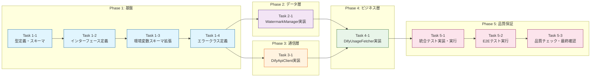

# 作業計画書: Dify使用量データ取得機能

## フェーズ構成図

```mermaid
gantt
    title Dify使用量データ取得機能 実装フェーズ
    dateFormat X
    axisFormat %s

    section Phase 1
    型定義・インターフェース :p1, 0, 1

    section Phase 2
    ウォーターマーク管理 :p2, after p1, 1

    section Phase 3
    Dify APIクライアント :p3, after p1, 1

    section Phase 4
    Fetcher統合 :p4, after p2, 1

    section Phase 5
    統合テスト・品質保証 :p5, after p4, 1
```



## タスク依存関係図



---

## Phase 1: 型定義・インターフェース

**目的**: 機能全体の型基盤を整備し、後続フェーズの実装を可能にする

### Task 1-1: 型定義・zodスキーマ実装と単体テスト作成

**対応AC**: AC-6-1, AC-6-2, AC-6-4

- [ ] `src/types/dify-usage.ts` 作成
  - DifyUsageRecord zodスキーマ定義
  - DifyUsageResponse zodスキーマ定義
  - 型エクスポート（DifyUsageRecord, DifyUsageResponse）
- [ ] `src/types/watermark.ts` 作成
  - Watermark zodスキーマ定義
  - 型エクスポート
- [ ] 単体テスト作成（`test/unit/types/dify-usage.test.ts`）
  - 正常なデータのバリデーション成功
  - 必須フィールド欠落時のエラー検出
  - 日付形式（YYYY-MM-DD）のバリデーション
  - トークン数の範囲チェック（0以上の整数）
- [ ] 単体テスト実行・パス確認

**完了条件**:
- zodスキーマがDesign Docの定義と一致
- 単体テストがすべてパス
- 型が正しくエクスポートされている

---

### Task 1-2: Fetcherインターフェース定義

**対応AC**: AC-2-1

- [ ] `src/interfaces/fetcher.ts` 作成
  - IFetcherインターフェース定義
  - FetchResult型定義
  - FetchError型定義
- [ ] 型の整合性確認（DifyUsageRecordとの連携）

**完了条件**:
- インターフェースがDesign Docの設計と一致
- 型エクスポートが正しく動作

---

### Task 1-3: 環境変数スキーマ拡張と単体テスト作成

**対応AC**: AC-1-2, AC-2-4, AC-3-3, AC-4-2

- [ ] `src/types/env.ts` 拡張
  - DIFY_FETCH_PAGE_SIZE追加（デフォルト: 100）
  - DIFY_INITIAL_FETCH_DAYS追加（デフォルト: 30）
  - DIFY_FETCH_TIMEOUT_MS追加（デフォルト: 30000）
  - DIFY_FETCH_RETRY_COUNT追加（デフォルト: 3）
  - DIFY_FETCH_RETRY_DELAY_MS追加（デフォルト: 1000）
  - WATERMARK_FILE_PATH追加（デフォルト: data/watermark.json）
- [ ] `src/config/env-config.ts` 更新（必要な場合）
- [ ] 既存の環境変数テストに新規項目のテストケース追加
  - デフォルト値の適用確認
  - 範囲チェック（min/max）の検証
  - 必須環境変数未設定時のエラー
- [ ] テスト実行・パス確認

**完了条件**:
- 新規環境変数がスキーマに追加されている
- デフォルト値が正しく設定されている
- 既存テストと新規テストがパス

---

### Task 1-4: カスタムエラークラス定義

**対応AC**: AC-5-1, AC-5-2, AC-5-4

- [ ] `src/errors/dify-api-error.ts` 作成
  - DifyApiErrorクラス定義
  - エラーコード定数定義（DIFY_API_ERROR_CODES）
- [ ] `src/watermark/watermark-manager.ts` にWatermarkFileErrorクラス定義を含める（後続タスクで実装）

**完了条件**:
- エラークラスがDesign Docの設計と一致
- エラーコードが定義されている

---

### Phase 1 動作確認

```bash
# 型チェック
npm run build

# 単体テスト実行
npm test -- test/unit/types/

# 確認項目:
# - 型定義がコンパイルエラーなし
# - 単体テストが全パス
# - 環境変数のデフォルト値が正しく適用される
```

---

## Phase 2: ウォーターマーク管理

**目的**: ウォーターマークの読み書き・バックアップ・復元機能を実装

**依存**: Phase 1完了

### Task 2-1: WatermarkManager実装と統合テスト作成

**対応AC**: AC-4-1, AC-4-2, AC-4-3, AC-4-4, AC-4-5, AC-4-6

- [ ] `src/watermark/watermark-manager.ts` 作成
  - createWatermarkManager関数実装
  - load()メソッド実装
    - ファイル読み込み
    - ENOENT時のnull返却
    - 破損時のバックアップ復元
  - update()メソッド実装
    - ディレクトリ自動作成
    - バックアップ作成
    - パーミッション600での書き込み
  - WatermarkFileErrorクラス定義
- [ ] 単体テスト作成（`test/unit/watermark/watermark-manager.test.ts`）
  - ファイル存在時の正常読み込み
  - ファイル不存在時のnull返却
  - ファイル破損時のバックアップ復元
  - バックアップも破損時のエラースロー
  - 更新時のバックアップ作成
  - パーミッション600の設定確認
  - ディレクトリ自動作成
- [ ] 単体テスト実行・パス確認
- [ ] 統合テスト実装（`test/integration/dify-usage-fetcher.int.test.ts`）
  - FR-4: ウォーターマーク管理 統合テスト（6件 + 5エッジケース）
  - AC-4-1: Fetcher起動時にウォーターマークファイル読み込み
  - AC-4-2: ファイル不存在時に過去30日間を取得期間に設定
  - AC-4-3: 全ページ取得完了時にウォーターマーク更新
  - AC-4-4: 更新前にバックアップファイル作成
  - AC-4-5: ファイル破損時にバックアップから復元
  - AC-4-6: ファイルパーミッション600設定
  - エッジケース: バックアップも破損、ディレクトリ不存在、書き込み権限なし、カスタムファイルパス、初回取得日数カスタマイズ
- [ ] 統合テスト実行・パス確認

**完了条件**:
- WatermarkManagerが正常に動作する
- 単体テスト・統合テストがすべてパス
- バックアップ・復元機能が動作する
- パーミッション600が設定される

---

### Phase 2 動作確認

```bash
# 単体テスト実行
npm test -- test/unit/watermark/

# 統合テスト実行（FR-4関連）
npm test -- test/integration/dify-usage-fetcher.int.test.ts -t "FR-4"

# 手動確認:
# 1. data/watermark.jsonが存在しない状態でload()がnullを返す
# 2. update()でファイルが作成され、パーミッションが600
# 3. バックアップファイルが作成される
```

---

## Phase 3: Dify APIクライアント

**目的**: Dify Console APIとの通信・リトライ・認証を実装

**依存**: Phase 1完了

### Task 3-1: DifyApiClient実装と統合テスト作成

**対応AC**: AC-1-1, AC-1-3, AC-2-1, AC-2-2, AC-2-3, AC-2-4, AC-5-1, AC-5-2, AC-5-3, AC-5-4

- [ ] axios, axios-retryパッケージインストール確認
- [ ] `src/fetcher/dify-api-client.ts` 作成
  - createDifyApiClient関数実装
  - axiosインスタンス作成（baseURL, timeout, headers）
  - Bearer Token認証ヘッダー設定
  - axios-retryによるリトライ設定
    - 指数バックオフ（1秒→2秒→4秒）
    - リトライ条件（ネットワークエラー、5xx、429）
    - Retry-Afterヘッダー対応
  - リクエスト/レスポンスインターセプター（ログ出力）
  - fetchUsage()メソッド実装
- [ ] 単体テスト作成（`test/unit/fetcher/dify-api-client.test.ts`）
  - 認証ヘッダー設定確認
  - タイムアウト設定確認
  - リトライ設定確認
  - パラメータ構築確認
- [ ] 単体テスト実行・パス確認
- [ ] 統合テスト実装（`test/integration/dify-usage-fetcher.int.test.ts`）
  - FR-1: Dify API認証 統合テスト（3件 + 2エッジケース）
  - FR-2: 使用量データ取得API呼び出し 統合テスト（4件 + 3エッジケース）
  - FR-5: エラーハンドリング 統合テスト（5件 + 6エッジケース）
  - AC-1-1: 全リクエストにBearer Token含む
  - AC-1-2: DIFY_API_TOKEN未設定時のエラー
  - AC-1-3: 401エラー時のログ出力・終了
  - AC-2-1: /console/api/usage呼び出し
  - AC-2-2: パラメータ正しく設定
  - AC-2-3: JSONレスポンス解析
  - AC-2-4: タイムアウト30秒
  - AC-5-1: ネットワークエラー/5xx/429リトライ
  - AC-5-2: 400/401/403/404リトライなし
  - AC-5-3: Retry-Afterヘッダー対応
  - AC-5-4: 構造化ログ記録
- [ ] 統合テスト実行・パス確認

**完了条件**:
- DifyApiClientが正常に動作する
- Bearer Token認証が全リクエストに含まれる
- リトライ設定がADR 002準拠
- 単体テスト・統合テストがすべてパス

---

### Phase 3 動作確認

```bash
# 単体テスト実行
npm test -- test/unit/fetcher/dify-api-client.test.ts

# 統合テスト実行（FR-1, FR-2, FR-5関連）
npm test -- test/integration/dify-usage-fetcher.int.test.ts -t "FR-1\|FR-2\|FR-5"

# モックサーバーを使用した動作確認:
# 1. 正常レスポンス時のデータ取得
# 2. 5xxエラー時のリトライ動作
# 3. 429エラー時のRetry-After対応
# 4. 401エラー時の即時終了
```

---

## Phase 4: Fetcher統合

**目的**: 全コンポーネントを統合し、オーケストレーション機能を実装

**依存**: Phase 2, Phase 3完了

### Task 4-1: DifyUsageFetcher実装と統合テスト作成

**対応AC**: AC-2-1, AC-3-1, AC-3-2, AC-3-3, AC-3-4, AC-5-5, AC-6-1, AC-6-2, AC-6-3, AC-6-4, AC-NF-1, AC-NF-2, AC-NF-3, AC-NF-4

- [ ] `src/fetcher/dify-usage-fetcher.ts` 作成
  - createDifyUsageFetcher関数実装
  - fetch()メソッド実装
    - ウォーターマーク読み込み
    - 開始日・終了日計算
    - ページング処理ループ
    - zodスキーマバリデーション
    - onRecordsコールバック呼び出し
    - 進捗ログ出力（100ページごと）
    - ページ間ディレイ（1秒）
    - ウォーターマーク更新
    - FetchResult返却
  - エラーハンドリング（取得済みまでウォーターマーク更新）
  - APIトークンのログ非出力
- [ ] ヘルパー関数実装
  - calculateStartDate()
  - formatDate()
  - validateRecords()
  - sleep()
- [ ] 単体テスト作成（`test/unit/fetcher/dify-usage-fetcher.test.ts`）
  - オーケストレーション動作
  - ページング処理
  - バリデーション処理
  - エラーハンドリング
- [ ] 単体テスト実行・パス確認
- [ ] 統合テスト実装（`test/integration/dify-usage-fetcher.int.test.ts`）
  - FR-3: ページング処理 統合テスト（4件 + 4エッジケース）
  - FR-6: データバリデーション 統合テスト（4件 + 4エッジケース）
  - 非機能要件 統合テスト（4件）
  - コンポーネント連携 統合テスト（5件）
  - AC-3-1: has_more=trueで継続取得
  - AC-3-2: 1秒ディレイ挿入
  - AC-3-3: DIFY_FETCH_PAGE_SIZE反映
  - AC-3-4: 100ページごと進捗ログ
  - AC-5-5: エラー時に取得済みまでウォーターマーク更新
  - AC-6-1: zodスキーマ検証
  - AC-6-2: 必須フィールド確認
  - AC-6-3: バリデーションエラー時スキップ
  - AC-6-4: トークン数検証
  - AC-NF-1: 10,000件を30秒以内
  - AC-NF-2: メモリ100MB以内
  - AC-NF-3: 重複取得率0%
  - AC-NF-4: APIトークン非出力
- [ ] 統合テスト実行・パス確認

**完了条件**:
- DifyUsageFetcherが正常に動作する
- 全コンポーネントが連携して動作する
- 単体テスト・統合テストがすべてパス
- Design DocのE2E確認手順が成功

---

### Phase 4 動作確認

```bash
# 単体テスト実行
npm test -- test/unit/fetcher/

# 統合テスト実行（FR-3, FR-6, 非機能要件関連）
npm test -- test/integration/dify-usage-fetcher.int.test.ts

# Design Doc記載のE2E確認手順:
# 1. 環境変数設定
export DIFY_API_BASE_URL="https://dify.example.com"
export DIFY_API_TOKEN="your-api-token"
export DIFY_FETCH_PAGE_SIZE=100
export WATERMARK_FILE_PATH="data/watermark.json"

# 2. モックサーバー起動（開発環境）

# 3. 初回実行（ウォーターマーク不存在）
# 確認項目:
# - 過去30日分のデータが取得される
# - data/watermark.json が作成される
# - ログに「ウォーターマークファイル不存在（初回実行）」が出力される

# 4. 2回目実行（差分取得）
# 確認項目:
# - 前回からの差分のみ取得される
# - ウォーターマークが更新される

# 5. エラーシナリオ（5xxエラー）
# 確認項目:
# - 3回リトライ後に失敗
# - 指数バックオフ（1秒→2秒→4秒）
# - エラーログが出力される
```

---

## Phase 5: 統合テスト・品質保証

**目的**: 全機能の統合テストを完了し、品質基準を満たす

**依存**: Phase 4完了

### Task 5-1: 統合テスト実装・実行

**対応AC**: 全AC

- [ ] `test/integration/dify-usage-fetcher.int.test.ts` の全テスト実装完了確認
  - FR-1: Dify API認証 統合テスト（5件）
  - FR-2: 使用量データ取得API呼び出し 統合テスト（7件）
  - FR-3: ページング処理 統合テスト（8件）
  - FR-4: ウォーターマーク管理 統合テスト（11件）
  - FR-5: エラーハンドリング 統合テスト（11件）
  - FR-6: データバリデーション 統合テスト（8件）
  - 非機能要件 統合テスト（4件）
  - コンポーネント連携 統合テスト（5件）
  - 計59件のテストケース
- [ ] 全統合テスト実行・パス確認

**完了条件**:
- 全59件の統合テストがパス
- テストカバレッジ70%以上

---

### Task 5-2: E2Eテスト実行

**対応AC**: 全AC

- [ ] `test/e2e/dify-usage-fetcher.e2e.test.ts` の全テスト実行
  - 初回実行シナリオ（5件）
  - 差分取得シナリオ（6件）
  - ページング処理シナリオ（5件）
  - エラー復旧シナリオ（8件）
  - ログ出力シナリオ（6件）
  - 環境変数設定シナリオ（5件）
  - 全体フローシナリオ（5件）
  - Docker環境シナリオ（4件）
  - 計44件のE2Eテスト
- [ ] E2Eテスト実行・パス確認

**完了条件**:
- 全44件のE2Eテストがパス
- Docker環境での動作確認完了

---

### Task 5-3: 品質チェック・最終確認

**対応AC**: 全AC

- [ ] 品質チェックコマンド実行
  - `npm run check` （Biome lint + format）
  - `npm run check:unused` （未使用エクスポート検出）
  - `npm run build` （TypeScriptビルド）
  - `npm run test:coverage:fresh` （カバレッジ測定）
- [ ] カバレッジレポート確認（70%以上）
- [ ] Design Doc受入条件最終確認
  - [ ] AC-1-1: 全リクエストにBearer Token
  - [ ] AC-1-2: DIFY_API_TOKEN未設定エラー
  - [ ] AC-1-3: 401エラー時ログ・終了
  - [ ] AC-2-1: /console/api/usage呼び出し
  - [ ] AC-2-2: パラメータ正しく設定
  - [ ] AC-2-3: JSONレスポンス解析
  - [ ] AC-2-4: タイムアウト30秒
  - [ ] AC-3-1: has_more継続取得
  - [ ] AC-3-2: 1秒ディレイ
  - [ ] AC-3-3: DIFY_FETCH_PAGE_SIZE反映
  - [ ] AC-3-4: 100ページ進捗ログ
  - [ ] AC-4-1: ウォーターマーク読み込み
  - [ ] AC-4-2: 初回30日取得
  - [ ] AC-4-3: 完了時ウォーターマーク更新
  - [ ] AC-4-4: バックアップ作成
  - [ ] AC-4-5: 破損時バックアップ復元
  - [ ] AC-4-6: パーミッション600
  - [ ] AC-5-1: リトライ（ネットワーク/5xx/429）
  - [ ] AC-5-2: リトライなし（400/401/403/404）
  - [ ] AC-5-3: Retry-After対応
  - [ ] AC-5-4: 構造化ログ
  - [ ] AC-5-5: エラー時ウォーターマーク更新
  - [ ] AC-6-1: zodスキーマ検証
  - [ ] AC-6-2: 必須フィールド確認
  - [ ] AC-6-3: バリデーションエラー時スキップ
  - [ ] AC-6-4: トークン数検証
  - [ ] AC-NF-1: 10,000件を30秒以内
  - [ ] AC-NF-2: メモリ100MB以内
  - [ ] AC-NF-3: 重複取得率0%
  - [ ] AC-NF-4: APIトークン非出力
- [ ] 最終品質確認コマンド実行
  - `npm run check:all`

**完了条件**:
- 全品質チェックがパス
- カバレッジ70%以上達成
- 全30件の受入条件が満たされている
- lint/format/buildエラーなし

---

## リスクと対策

| リスク | 影響度 | 発生確率 | 対策 | 検知方法 |
|--------|--------|----------|------|----------|
| Dify API仕様の不確実性 | 高 | 中 | zodスキーマでバリデーション、エラー早期検出 | AC-6-3のバリデーションエラーログ |
| リトライロジックの複雑性 | 中 | 中 | axios-retry採用で実装簡素化、ADR 002準拠 | 統合テストでリトライ動作確認 |
| ウォーターマーク破損 | 中 | 低 | バックアップ・復元機能実装 | AC-4-5のテスト |
| メモリ使用量超過 | 中 | 低 | ページング処理、onRecordsコールバック即時処理 | AC-NF-2のメモリ測定テスト |
| Rate Limit | 中 | 中 | ページ間ディレイ、Retry-After対応 | AC-5-3のテスト |

---

## 品質チェックリスト

### Design Doc整合性
- [ ] 全コンポーネントがDesign Docの設計に準拠
- [ ] 統合ポイントマップに従った実装
- [ ] 統合境界の約束に準拠

### テスト戦略
- [ ] 単体テスト: 各コンポーネント
- [ ] 統合テスト: 59件（実装と同時）
- [ ] E2Eテスト: 44件（最終Phase）

### 非機能要件
- [ ] パフォーマンス: 10,000件を30秒以内
- [ ] メモリ効率: 100MB以内
- [ ] 信頼性: 重複取得率0%
- [ ] セキュリティ: APIトークン非出力

### コード品質
- [ ] TypeScript strict mode準拠
- [ ] Biome lint/formatパス
- [ ] カバレッジ70%以上
- [ ] any型不使用

---

## 参考資料

- Design Doc: `specs/stories/2-dify-usage-fetcher/design.md`
- Requirements: `specs/stories/2-dify-usage-fetcher/requirements.md`
- ADR 002: リトライポリシー
- ADR 003: ファイルロック機構
- ADR 007: HTTPクライアントライブラリ
- ADR 008: バックエンド基盤技術スタック
- ADR 009: Dify Fetcherアーキテクチャ
