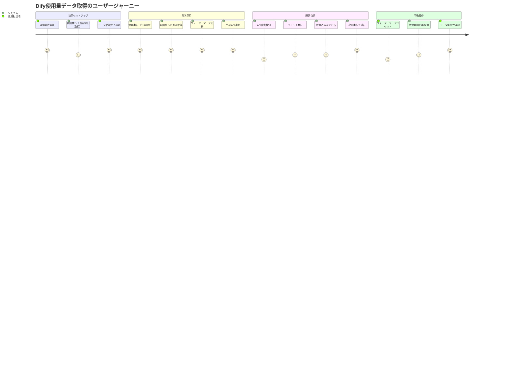
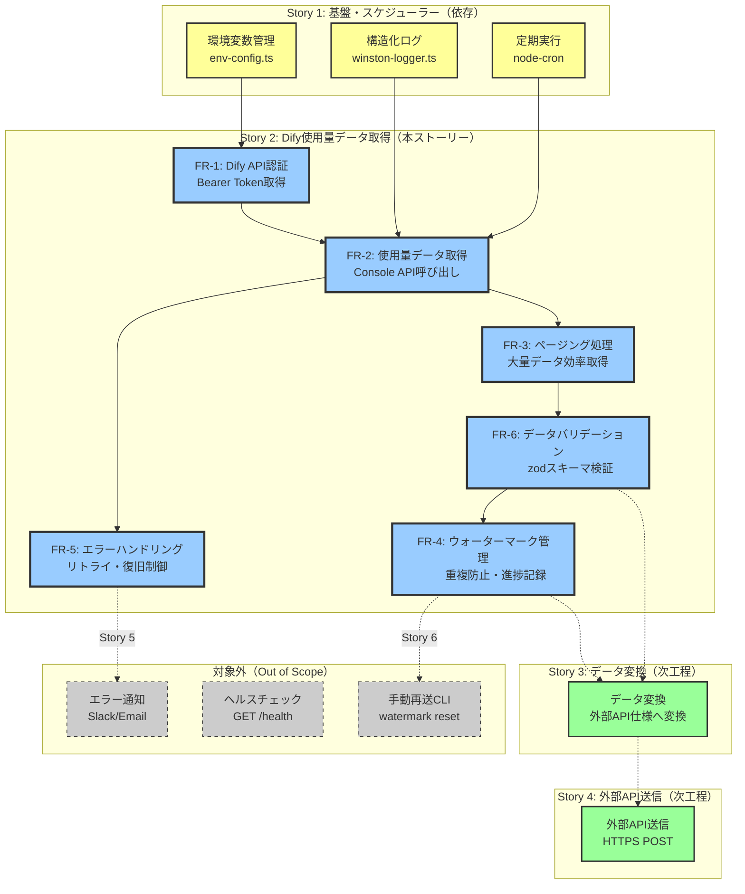
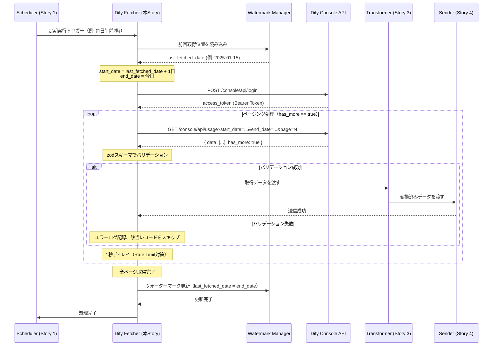

# 要件定義書: Dify使用量データ取得機能

## 概要

### 1行要約
DifyのConsole APIから使用量データ（Usage）を定期的に取得し、外部API連携に必要な形式で永続化する機能。

### 背景
セルフホスト中のDify（v1.9.2予定）で発生するモデル使用量を、外部API（社外/社内の集計システム）へ連携するためには、Difyから使用量データを安全かつ確実に取得する必要がある。取得処理では、重複取得の防止、ネットワーク障害時の復旧、大量データの効率的な処理が求められる。

本ストーリーでは、ウォーターマーク方式による差分取得、ページング処理によるメモリ効率化、エラー時のリトライ制御を実装し、安定的なデータ取得を実現する。

## ユーザーストーリー

### プライマリーユーザー
- **システム運用担当者**: Dify使用量の監視・コスト管理を行う担当者
- **経営層・財務担当**: アプリ別/ユーザー別のLLM利用状況を把握し、課金/配賦処理を行う担当者

### ユーザーストーリー
```
As a システム運用担当者
I want to Difyから使用量データを自動的に取得し、外部システムへ連携したい
So that コスト集計・監査・課金処理を自動化し、手動集計の手間を削減できる
```

### ユースケース
1. **日次の使用量取得**: 毎日午前2時に前日分の使用量データを自動取得
2. **初回セットアップ**: 初回実行時に過去30日分のデータを取得
3. **障害復旧**: ネットワーク障害やDify API一時停止からの自動復旧
4. **大量データ処理**: 大量の使用量レコードをメモリ効率的に取得
5. **手動再取得**: ウォーターマークをリセットして特定期間のデータを再取得

## 機能要件

### 必須要件（MVP）

#### FR-1: Dify API認証
- **説明**: Dify Console APIへの認証
- **詳細**:
  - 認証方式: 固定Bearer Token方式
  - 認証ヘッダー: `Authorization: Bearer ${DIFY_API_TOKEN}`
  - 環境変数管理:
    - `DIFY_API_TOKEN`: Dify Console APIのBearerトークン
  - トークンは事前にDifyコンソールで発行し、環境変数に設定
  - 有効期限管理は不要（長期有効なAPIトークンを使用）
  - **決定事項**: 固定Bearer Token方式を採用（ADR 009参照）
    - 理由: セキュリティリスクが低く、運用シンプル。email/password方式は保留

#### FR-2: 使用量データ取得API呼び出し
- **説明**: Dify Console APIから使用量データを取得
- **詳細**:
  - エンドポイント: `/console/api/usage/...`（※Dify v1.9.2リリース後に確認が必要）
  - 認証方式: `Authorization: Bearer ${DIFY_API_TOKEN}` ヘッダー
  - パラメータ:
    - `start_date`: 開始日（ISO 8601形式、例: 2025-01-01）
    - `end_date`: 終了日（ISO 8601形式、例: 2025-01-31）
    - `page`: ページ番号（デフォルト: 1）
    - `limit`: 1ページあたりのレコード数（デフォルト: 100、最大: 1000）
  - レスポンス形式（想定）:
    ```json
    {
      "data": [
        {
          "date": "2025-01-15",
          "app_id": "abc123",
          "app_name": "My App",
          "provider": "openai",
          "model": "gpt-4",
          "input_tokens": 1000,
          "output_tokens": 500,
          "total_tokens": 1500,
          "user_id": "user123"
        }
      ],
      "total": 10000,
      "page": 1,
      "limit": 100,
      "has_more": true
    }
    ```
  - タイムアウト: 30秒
  - リトライ: ネットワークエラー、5xx、429で最大3回リトライ（指数バックオフ: 1秒 → 2秒 → 4秒）

#### FR-3: ページング処理
- **説明**: 大量データを効率的に取得するためのページング処理
- **詳細**:
  - 1ページあたり100件を取得（環境変数 `DIFY_FETCH_PAGE_SIZE` で変更可能）
  - `has_more: true` の間、次のページを取得
  - ページ間で1秒のディレイを挿入（Rate Limit対策）
  - メモリ使用量を100MB以内に抑制（ストリーム処理または即座に変換・送信）

#### FR-4: ウォーターマーク管理
- **説明**: 前回取得完了位置を記録し、重複取得を防止
- **詳細**:
  - ファイルパス: `data/watermark.json`
  - フォーマット:
    ```json
    {
      "last_fetched_date": "2025-01-15T00:00:00.000Z",
      "last_updated_at": "2025-01-16T02:00:00.000Z"
    }
    ```
  - **更新タイミング**: 全ページ取得完了後に一括更新
    - 理由: 途中失敗時の整合性確保、外部API送信完了後に更新
  - **初回実行時**: `watermark.json` が存在しない場合、過去30日間を取得（環境変数 `DIFY_INITIAL_FETCH_DAYS=30` でデフォルト設定）
  - **バックアップ**: 更新前に `watermark.json.backup` を自動作成（1世代のみ保持）
  - **復元機能**: `watermark.json` 破損時に `watermark.json.backup` から復元
  - **ファイルパーミッション**: 600（所有者のみ読み書き）

#### FR-5: エラーハンドリング
- **説明**: API呼び出し失敗時の適切な処理
- **詳細**:
  - **リトライ対象エラー**:
    - ネットワークエラー（ECONNREFUSED, ETIMEDOUT等）
    - 5xxエラー（サーバー内部エラー）
    - 429エラー（Rate Limit）: `Retry-After` ヘッダーを考慮
  - **リトライ非対象エラー**:
    - 400（Bad Request）: パラメータエラー、ログ出力後に処理終了
    - 401（Unauthorized）: 認証エラー、トークン再取得を試行
    - 403（Forbidden）: 権限エラー、エラー通知送信後に処理終了
    - 404（Not Found）: エンドポイント不明、エラー通知送信後に処理終了
  - **無限ループ防止**:
    - 同じエラーが3回連続発生した場合、処理中断
    - **取得済みデータまでウォーターマーク更新** を行い、次回実行時に続きから取得
  - **ログ記録**: 全てのエラーを構造化ログ（JSON Lines）で記録

#### FR-6: データバリデーション
- **説明**: 取得したデータの妥当性検証
- **詳細**:
  - zodスキーマでレスポンス形式を検証
  - 必須フィールドの存在確認: `date`, `app_id`, `provider`, `model`, `total_tokens`
  - データ型検証: 日付形式、数値範囲（トークン数は0以上）
  - バリデーションエラー発生時: ログ記録後、該当レコードをスキップして処理継続

### 追加要件（Nice to Have）

#### FR-7: 進捗ログ出力
- **説明**: 大量データ取得時の進捗状況を可視化
- **詳細**:
  - 100ページごとに進捗ログを出力（例: "Fetched 10000/50000 records (20%)"）
  - ETA（推定残り時間）の表示

#### FR-8: パフォーマンスメトリクス
- **説明**: 取得処理のパフォーマンス測定
- **詳細**:
  - 取得開始時刻、終了時刻、所要時間
  - 取得レコード数、ページ数
  - 平均レスポンスタイム（ページあたり）
  - メモリ使用量（ピーク値）

### 対象外（Out of Scope）

#### OS-1: データ変換・外部API送信
- **説明**: 取得したデータの変換と外部APIへの送信
- **理由**: Story 3（data-transformation）、Story 4（external-api-sender）で実装

#### OS-2: スケジューラー
- **説明**: 定期実行の制御
- **理由**: Story 1（foundation-and-scheduler）で実装済み

#### OS-3: 監視・通知
- **説明**: エラー通知、ヘルスチェック
- **理由**: Story 5（monitoring-logging-healthcheck）で実装

#### OS-4: 手動再送・ウォーターマークリセット
- **説明**: CLIコマンドでの手動操作
- **理由**: Story 6（manual-resend-watermark）で実装

## 非機能要件

### パフォーマンス
- **取得処理時間**: 10,000件のレコードを30秒以内で取得
- **メモリ効率**: メモリ使用量を100MB以内に抑制（ページング処理）
- **APIタイムアウト**: 30秒
- **ページ間ディレイ**: 1秒（Rate Limit対策）

### 信頼性
- **データ完全性**: ウォーターマーク方式で重複取得を防止、欠落なし
- **障害復旧**: ネットワーク障害やAPI一時停止から自動復旧
- **エラー率**: 一時的なネットワークエラーでも99.9%のデータ取得成功率

### セキュリティ
- **認証情報管理**: `DIFY_API_TOKEN` を環境変数で管理、ログ出力しない
- **通信暗号化**: HTTPS/TLS 1.2以上での通信必須
- **ファイルパーミッション**: `watermark.json` は600（所有者のみ読み書き）
- **ログセキュリティ**: APIトークン、パスワードはログ出力しない（マスキング処理）

### 拡張性
- **APIバージョン変更対応**: Dify API仕様変更時にスキーマ定義を修正可能（zodスキーマ）
- **複数Difyインスタンス対応**: 将来的に複数のDifyインスタンスから取得する可能性を考慮（環境変数での切り替え）

## 成功基準

### 定量的指標
1. **取得成功率**: 99.9%以上（一時的なネットワークエラーを除く）
2. **取得処理時間**: 10,000件を30秒以内
3. **メモリ効率**: メモリ使用量100MB以内
4. **重複取得率**: 0%（ウォーターマーク機能による保証）

### 定性的指標
1. **運用負荷の削減**: 手動集計が不要になり、自動化による運用工数削減
2. **データ信頼性**: ウォーターマークによる重複防止で、データの整合性が保証される
3. **障害復旧の自動化**: ネットワーク障害やAPI障害からの自動復旧により、運用介入が不要

## 技術的考慮事項

### 依存関係
- **Story 1（foundation-and-scheduler）**: 環境変数管理、ロガー、スケジューラー
  - 依存モジュール: `src/config/env-config.ts`, `src/logger/winston-logger.ts`
- **Story 3（data-transformation）**: 取得データの変換処理
  - インターフェース: `ITransformer`
- **Story 4（external-api-sender）**: 外部API送信
  - インターフェース: `ISender`

### 制約
- **Dify API仕様**: v1.9.2リリース後にエンドポイントとレスポンス形式を確認する必要がある
  - 参考実装: `/Users/naokikodama/development/Repository/bonginkan/Dify-Inhouse-Platform/app/api/dify`
  - ※使用量取得APIは含まれていないため、別途調査が必要
- **Rate Limit**: Dify APIのRate Limitが不明なため、ページ間に1秒のディレイを挿入
- **メモリ制約**: EC2インスタンスのメモリ制約を考慮し、ページング処理でメモリ使用量を抑制

### リスクと軽減策
| リスク | 影響度 | 発生確率 | 軽減策 |
|--------|--------|----------|--------|
| Dify API仕様変更（v1.9.2以降） | 高 | 中 | zodスキーマでバリデーション、エラー検出を早期化。APIドキュメント確認。 |
| Dify APIの一時停止・障害 | 高 | 中 | リトライ制御（指数バックオフ）、ウォーターマークで次回実行時に続行 |
| 大量データによるメモリ不足 | 中 | 低 | ページング処理（100件/ページ）、ストリーム処理 |
| ウォーターマークファイル破損 | 中 | 低 | バックアップ自動作成（`watermark.json.backup`）、復元機能 |
| Rate Limitによる429エラー | 中 | 中 | `Retry-After` ヘッダー対応、指数バックオフ、ページ間ディレイ |
| 認証トークンの有効期限切れ | 中 | 低 | 各実行時にトークン再取得（固定Bearer Token方式では発生しない） |

## ユーザージャーニー図



## スコープ境界図



## データフロー図



## 環境変数定義

| 環境変数名 | 必須 | デフォルト値 | 説明 |
|-----------|------|------------|------|
| `DIFY_API_BASE_URL` | ✓ | - | Dify Console APIのベースURL（例: `https://dify.example.com`） |
| `DIFY_API_TOKEN` | ✓ | - | Dify Console APIの固定Bearer Token |
| `DIFY_FETCH_PAGE_SIZE` | - | 100 | 1ページあたりの取得レコード数（最大: 1000） |
| `DIFY_INITIAL_FETCH_DAYS` | - | 30 | 初回実行時の取得期間（日数） |
| `DIFY_FETCH_TIMEOUT_MS` | - | 30000 | APIタイムアウト（ミリ秒） |
| `DIFY_FETCH_RETRY_COUNT` | - | 3 | 最大リトライ回数 |
| `DIFY_FETCH_RETRY_DELAY_MS` | - | 1000 | 初回リトライディレイ（ミリ秒、指数バックオフ） |
| `WATERMARK_FILE_PATH` | - | data/watermark.json | ウォーターマークファイルのパス |

## 付録

### 参考資料
- [Dify API参考実装](https://github.com/bonginkan/Dify-Inhouse-Platform/tree/main/app/api/dify)
- [Epic方針書: dify-usage-exporter](../../../specs/epics/1-dify-usage-exporter/epic.md)
- [Story 1: 基盤・スケジューラー](../1-foundation-and-scheduler/requirements.md)
- [Story 3: データ変換](../3-data-transformation/requirements.md)
- [Story 4: 外部API送信](../4-external-api-sender/requirements.md)

### 用語集
- **ウォーターマーク**: 前回取得完了位置を記録する仕組み。データベースのWAL（Write-Ahead Log）における位置管理と同様の概念。
- **ページング**: 大量データを分割して取得する処理。メモリ効率化とRate Limit対策に有効。
- **冪等性**: 同じ操作を複数回実行しても結果が変わらない性質。外部API送信で重複防止に使用。
- **Bearer Token**: HTTP認証方式の一種。`Authorization: Bearer {token}` ヘッダーで認証情報を送信。
- **指数バックオフ**: リトライ間隔を指数的に増加させる方式（1秒 → 2秒 → 4秒 → ...）。
- **Rate Limit**: API呼び出しの頻度制限。429エラーで通知される。
- **zod**: TypeScriptのスキーマバリデーションライブラリ。実行時の型検証に使用。
