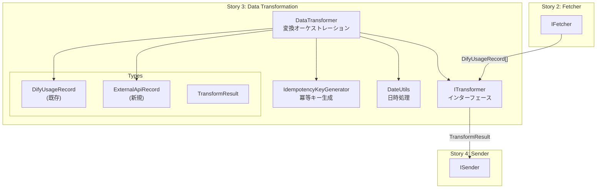
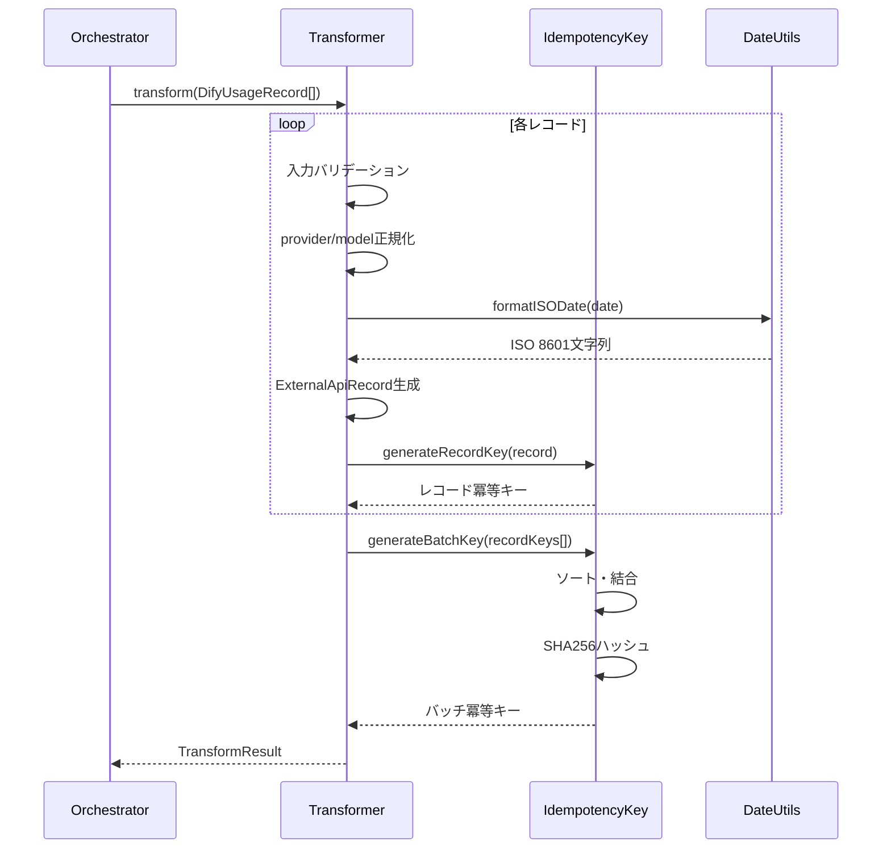

# Design Doc: Data Transformation

## 概要

Dify APIから取得した使用量データ（DifyUsageRecord）を外部API仕様に適合する形式（ExternalApiRecord）に変換し、冪等キーを生成するモジュールを実装する。

## 合意事項チェックリスト

| 合意事項 | 内容 | 設計での反映箇所 |
|---------|------|----------------|
| スコープ | DifyUsageRecord → ExternalApiRecord変換、冪等キー生成 | 変換ロジック、冪等キー生成モジュール |
| 非スコープ | 外部API送信（Story 4）、エラー通知 | - |
| ExternalApiRecord型 | 仕様書に基づき定義 | 型定義セクション |
| 変換エラー時の処理 | 失敗レコードを破棄、成功レコードのみ送信 | エラーハンドリング戦略 |
| provider/model正規化 | 小文字変換、空白除去 | 正規化処理 |
| パフォーマンス要件 | 10,000レコードを5秒以内に変換 | パフォーマンス設計 |

## 前提となるADR

- [specs/adr/010-data-transformation-architecture.md](specs/adr/010-data-transformation-architecture.md): データ変換アーキテクチャ、ITransformerインターフェース設計
- [specs/adr/009-dify-fetcher-architecture.md](specs/adr/009-dify-fetcher-architecture.md): IFetcherインターフェース（同一パターン参照）

## 既存コードベース分析

### 実装パスマッピング

| 種別 | パス | 状態 |
|------|------|------|
| DifyUsageRecord型 | `src/types/dify-usage.ts` | 既存 |
| IFetcherインターフェース | `src/interfaces/fetcher.ts` | 既存（参照パターン） |
| 環境変数設定 | `src/config/env-config.ts` | 既存 |
| ロガー | `src/logger/winston-logger.ts` | 既存 |
| ExternalApiRecord型 | `src/types/external-api.ts` | 新規 |
| ITransformerインターフェース | `src/interfaces/transformer.ts` | 新規 |
| DataTransformer | `src/transformer/data-transformer.ts` | 新規 |
| 冪等キー生成 | `src/transformer/idempotency-key.ts` | 新規 |
| 日時ユーティリティ | `src/utils/date-utils.ts` | 新規 |

### 類似機能の検索結果

- **IFetcher実装**: `src/fetcher/dify-usage-fetcher.ts`
  - 関数ファクトリパターン（`createDifyUsageFetcher`）
  - 依存性注入（DifyUsageFetcherDeps）
  - **採用**: 同一パターンをITransformerに適用

## 実装アプローチ

### 戦略選択: 垂直スライス

**選択理由**:
1. 機能が独立して完結（変換のみ）
2. 外部依存が最小（crypto, date-fns）
3. Story 4（送信）への明確なインターフェース提供

### 実装順序

1. **Phase 1**: 型定義とインターフェース（基盤）
2. **Phase 2**: 冪等キー生成（独立機能）
3. **Phase 3**: データ変換オーケストレーション（統合）

## アーキテクチャ図



## データフロー図



## 型定義

### ExternalApiRecord

```typescript
// src/types/external-api.ts
import { z } from 'zod'

export const externalApiRecordSchema = z.object({
  // 必須フィールド
  date: z.string().regex(/^\d{4}-\d{2}-\d{2}$/),
  app_id: z.string().min(1),
  provider: z.string().min(1),
  model: z.string().min(1),
  input_tokens: z.number().int().min(0),
  output_tokens: z.number().int().min(0),
  total_tokens: z.number().int().min(0),

  // 冪等キー（変換時に生成）
  idempotency_key: z.string().min(1),

  // オプションフィールド
  app_name: z.string().optional(),
  user_id: z.string().optional(),

  // メタデータ
  transformed_at: z.string().datetime(),
})

export type ExternalApiRecord = z.infer<typeof externalApiRecordSchema>
```

### ITransformerインターフェース

```typescript
// src/interfaces/transformer.ts
import type { DifyUsageRecord } from '../types/dify-usage.js'
import type { ExternalApiRecord } from '../types/external-api.js'

export interface ITransformer {
  transform(records: DifyUsageRecord[]): TransformResult
}

export interface TransformResult {
  /** 変換成功したレコード */
  records: ExternalApiRecord[]
  /** バッチ全体の冪等キー（SHA256） */
  batchIdempotencyKey: string
  /** 変換成功レコード数 */
  successCount: number
  /** 変換失敗レコード数 */
  errorCount: number
  /** 変換エラーの詳細 */
  errors: TransformError[]
}

export interface TransformError {
  /** エラーが発生したレコードの識別情報 */
  recordIdentifier: {
    date: string
    app_id: string
  }
  /** エラーメッセージ */
  message: string
  /** エラーの詳細 */
  details?: Record<string, unknown>
}
```

### TransformerDeps（依存性注入）

```typescript
// src/transformer/data-transformer.ts
import type { Logger } from '../logger/winston-logger.js'

export interface TransformerDeps {
  logger: Logger
}
```

## 変換ロジック詳細

### 正規化処理

```typescript
function normalizeProvider(provider: string): string {
  return provider.trim().toLowerCase()
}

function normalizeModel(model: string): string {
  return model.trim().toLowerCase()
}
```

### レコード変換

```typescript
function transformRecord(
  record: DifyUsageRecord,
  transformedAt: string
): ExternalApiRecord {
  const normalizedProvider = normalizeProvider(record.provider)
  const normalizedModel = normalizeModel(record.model)

  return {
    date: record.date,
    app_id: record.app_id,
    provider: normalizedProvider,
    model: normalizedModel,
    input_tokens: record.input_tokens,
    output_tokens: record.output_tokens,
    total_tokens: record.total_tokens,
    idempotency_key: generateRecordIdempotencyKey({
      date: record.date,
      app_id: record.app_id,
      provider: normalizedProvider,
      model: normalizedModel,
    }),
    app_name: record.app_name,
    user_id: record.user_id,
    transformed_at: transformedAt,
  }
}
```

## 冪等キー生成

### レコード単位冪等キー

```typescript
// src/transformer/idempotency-key.ts
export interface RecordKeyParams {
  date: string
  app_id: string
  provider: string
  model: string
}

export function generateRecordIdempotencyKey(params: RecordKeyParams): string {
  return `${params.date}_${params.app_id}_${params.provider}_${params.model}`
}
```

### バッチ単位冪等キー

```typescript
import crypto from 'crypto'

export function generateBatchIdempotencyKey(recordKeys: string[]): string {
  if (recordKeys.length === 0) {
    return ''
  }

  // ソートして順序に依存しない決定的なキー生成
  const sorted = [...recordKeys].sort()
  const concatenated = sorted.join(',')

  return crypto.createHash('sha256').update(concatenated).digest('hex')
}
```

## 日時ユーティリティ

```typescript
// src/utils/date-utils.ts
import { formatISO } from 'date-fns'

export function getCurrentISOTimestamp(): string {
  return formatISO(new Date())
}

export function formatDateToISO(date: Date): string {
  return formatISO(date, { representation: 'complete' })
}
```

## エラーハンドリング戦略

### 変換エラーの処理

1. **入力バリデーションエラー**: zodスキーマ検証失敗 → TransformErrorに記録、レコードをスキップ
2. **正規化エラー**: 空文字列など → TransformErrorに記録、レコードをスキップ
3. **出力バリデーションエラー**: 変換後のExternalApiRecordが不正 → TransformErrorに記録、レコードをスキップ

### エラー収集パターン

```typescript
const errors: TransformError[] = []
const successRecords: ExternalApiRecord[] = []

for (const record of records) {
  try {
    const transformed = transformRecord(record, transformedAt)
    const validation = externalApiRecordSchema.safeParse(transformed)

    if (validation.success) {
      successRecords.push(validation.data)
    } else {
      errors.push({
        recordIdentifier: { date: record.date, app_id: record.app_id },
        message: '出力バリデーションエラー',
        details: { errors: validation.error.errors },
      })
    }
  } catch (error) {
    errors.push({
      recordIdentifier: { date: record.date, app_id: record.app_id },
      message: '変換処理エラー',
      details: { error: String(error) },
    })
  }
}
```

## 統合ポイントマップ

```yaml
統合点1:
  既存コンポーネント: IFetcher.fetch() の onRecords コールバック
  統合方法: コールバック内でITransformer.transform()を呼び出し
  影響度: 中（データ利用）
  必要なテスト観点: DifyUsageRecord[]を正しく変換できること

統合点2:
  新規コンポーネント: ISender（Story 4）
  統合方法: TransformResultをISender.send()に渡す
  影響度: 高（処理フロー）
  必要なテスト観点: ExternalApiRecord[]とbatchIdempotencyKeyの正確性
```

## 変更影響マップ

```yaml
変更対象: 新規モジュール追加
直接影響:
  - src/types/external-api.ts（新規）
  - src/interfaces/transformer.ts（新規）
  - src/transformer/data-transformer.ts（新規）
  - src/transformer/idempotency-key.ts（新規）
  - src/utils/date-utils.ts（新規）
間接影響:
  - package.json（date-fns追加）
  - Story 4のISender実装（TransformResultを受け取る）
波及なし:
  - 既存のfetcher, watermark, logger, config
```

## データ契約

### 入力: DifyUsageRecord[]

```yaml
型: DifyUsageRecord[]
前提条件:
  - zodスキーマでバリデーション済み
  - 空配列の可能性あり
保証:
  - 各レコードは有効なDifyUsageRecord
エラー時:
  - バリデーション失敗レコードは上流で除外済み
```

### 出力: TransformResult

```yaml
型: TransformResult
前提条件: なし
保証:
  - records: 変換成功したExternalApiRecord[]
  - batchIdempotencyKey: 空配列の場合は空文字列
  - successCount + errorCount = 入力レコード数
エラー時:
  - errors配列に詳細を格納
  - records配列には成功レコードのみ
```

## 統合境界の約束

```yaml
境界名: Fetcher → Transformer
  入力: DifyUsageRecord[]
  出力: TransformResult（同期）
  エラー時: 例外をスローせず、TransformResult.errorsに格納

境界名: Transformer → Sender
  入力: TransformResult
  出力: なし（Sender側で処理）
  エラー時: Sender側で処理
```

## パフォーマンス設計

### 目標

- 10,000レコードを5秒以内に変換

### 最適化ポイント

1. **単一ループ処理**: 変換と冪等キー生成を1回のループで実行
2. **事前計算**: transformedAtを変換開始時に1回だけ計算
3. **配列の事前確保**: 結果配列のサイズを事前に確保（オプション最適化）
4. **SHA256の効率**: Node.js cryptoはC++実装で高速

### ベンチマーク基準

```typescript
// 10,000レコードの変換テスト
const records = generateMockRecords(10000)
const start = Date.now()
const result = transformer.transform(records)
const duration = Date.now() - start
// duration < 5000ms を確認
```

## テスト戦略

### 単体テスト

| テスト対象 | テストケース | 期待結果 |
|----------|------------|---------|
| generateRecordIdempotencyKey | 正常なパラメータ | `{date}_{app_id}_{provider}_{model}` |
| generateBatchIdempotencyKey | 空配列 | 空文字列 |
| generateBatchIdempotencyKey | ソート確認 | 順序に依存しない同一ハッシュ |
| normalizeProvider | 大文字・空白 | 小文字・空白除去 |
| transformRecord | 正常レコード | ExternalApiRecord |
| transform | 全レコード成功 | errorCount = 0 |
| transform | 一部失敗 | 成功レコードのみ返却 |

### 統合テスト

| テストケース | 検証内容 |
|------------|---------|
| Fetcher → Transformer | onRecordsコールバックでの変換 |
| パフォーマンステスト | 10,000レコード/5秒以内 |

## 受入条件（EARS記法）

### AC1: Dify API形式から外部API形式への変換

- [ ] **AC1-1** (契機型): DifyUsageRecord[]が渡されたとき、システムはExternalApiRecord[]に変換すること
- [ ] **AC1-2** (遍在型): システムは各ExternalApiRecordにtransformed_at（ISO 8601）を付与すること
- [ ] **AC1-3** (遍在型): システムはproviderを小文字に正規化し、前後の空白を除去すること
- [ ] **AC1-4** (遍在型): システムはmodelを小文字に正規化し、前後の空白を除去すること

### AC2: レコード単位冪等キー生成

- [ ] **AC2-1** (遍在型): システムは各ExternalApiRecordに`{date}_{app_id}_{provider}_{model}`形式の冪等キーを付与すること
- [ ] **AC2-2** (遍在型): システムは正規化後のprovider/modelを冪等キーに使用すること

### AC3: バッチ単位冪等キー生成

- [ ] **AC3-1** (契機型): 変換完了時、システムはソート済みレコード冪等キーのSHA256ハッシュを生成すること
- [ ] **AC3-2** (選択型): もし入力が空配列の場合、システムは空文字列をバッチ冪等キーとして返却すること
- [ ] **AC3-3** (遍在型): システムは同一レコードセットに対して同一のバッチ冪等キーを生成すること（順序非依存）

### AC4: zodによるバリデーション

- [ ] **AC4-1** (遍在型): システムは変換後の各ExternalApiRecordをzodスキーマで検証すること
- [ ] **AC4-2** (不測型): もしバリデーションが失敗した場合、システムは該当レコードをTransformErrorsに記録し、成功レコードのみを返却すること

### AC5: エラーハンドリング

- [ ] **AC5-1** (不測型): もし変換処理でエラーが発生した場合、システムはエラーをTransformErrorに記録し、処理を継続すること
- [ ] **AC5-2** (遍在型): システムはsuccessCount + errorCountが入力レコード数と一致することを保証すること
- [ ] **AC5-3** (遍在型): システムは例外をスローせず、全てのエラーをTransformResultに格納すること

### AC6: パフォーマンス

- [ ] **AC6-1** (遍在型): システムは10,000レコードを5秒以内に変換すること

## E2E確認手順

### Phase 1完了時: 型定義とインターフェース

1. `npm run build` が成功すること
2. `npm run check` がエラーなしで完了すること
3. 型定義ファイルがエクスポートできること

### Phase 2完了時: 冪等キー生成

1. 単体テストが全てパスすること
2. 同一入力に対して同一キーが生成されること
3. 異なる順序の入力に対して同一バッチキーが生成されること

### Phase 3完了時: データ変換統合

1. `npm test` が全てパスすること
2. 10,000レコードの変換が5秒以内に完了すること
3. 変換エラー時に成功レコードのみが返却されること
4. TransformResult.batchIdempotencyKeyが正しく生成されること

## 参考資料

- [Node.js Crypto Documentation](https://nodejs.org/api/crypto.html)
- [date-fns v3 Documentation](https://date-fns.org/)
- [Stripe Idempotency Best Practices](https://stripe.com/blog/idempotency)
