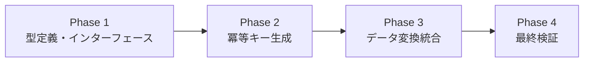
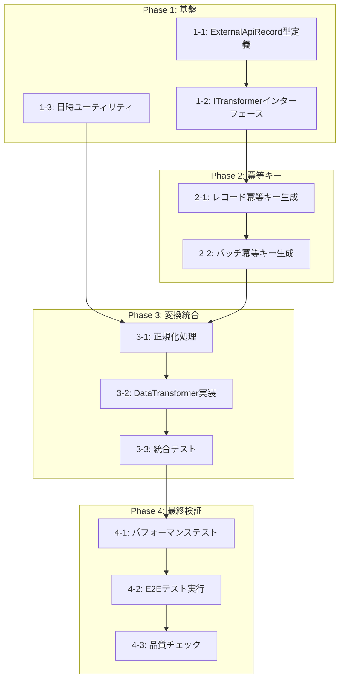

# 作業計画書: Data Transformation

## 概要

Dify APIから取得した使用量データ（DifyUsageRecord）を外部API仕様に適合する形式（ExternalApiRecord）に変換し、冪等キーを生成するモジュールを実装する。

## フェーズ構成図

## タスク依存関係図

## リスクと対策

| リスク | 影響度 | 対策 | 検知方法 |
|--------|--------|------|----------|
| SHA256ハッシュ衝突 | 低 | 64文字16進数を使用（256ビット） | 単体テストでユニーク性検証 |
| パフォーマンス未達 | 中 | 単一ループ処理、事前計算の最適化 | ベンチマークテスト（10,000レコード/5秒） |
| zodバリデーション過剰 | 中 | safeParse使用、エラー収集パターン | 統合テストでエラー処理検証 |
| date-fns互換性 | 低 | v3 API使用、TypeScript型チェック | ビルドテスト |

---

## Phase 1: 型定義とインターフェース

**目的**: 型定義とインターフェースで基盤を構築

### Task 1-1: ExternalApiRecord型定義と単体テスト作成

**AC対応**: AC4（zodバリデーション）

- [x] `src/types/external-api.ts`にexternalApiRecordSchemaとExternalApiRecord型を定義
- [x] 単体テスト作成（`test/unit/types/external-api.test.ts`）
  - 正常なレコードのバリデーション成功
  - 日付形式不正（YYYY/MM/DD）でエラー
  - 負のトークン数でエラー
  - 空文字列app_idでエラー
  - オプションフィールド（app_name, user_id）の欠損許容
- [x] テスト実行・パス確認

**完了条件**: 型定義がエクスポート可能、単体テスト全パス

### Task 1-2: ITransformerインターフェースと関連型定義

**AC対応**: AC5（エラーハンドリング）

- [x] `src/interfaces/transformer.ts`にITransformer、TransformResult、TransformError型を定義
- [x] 型のエクスポート確認
- [x] `npm run build`で型チェック成功

**完了条件**: インターフェースがエクスポート可能、ビルド成功

### Task 1-3: 日時ユーティリティ実装と単体テスト作成

**AC対応**: AC1-2（transformed_at付与）

- [x] date-fnsパッケージ追加（`npm install date-fns`）
- [x] `src/utils/date-utils.ts`にgetCurrentISOTimestamp、formatDateToISOを実装
- [x] 単体テスト作成（`test/unit/utils/date-utils.test.ts`）
  - getCurrentISOTimestampがISO 8601形式を返す
  - formatDateToISOが正しい形式に変換
- [x] テスト実行・パス確認

**完了条件**: 日時ユーティリティが動作、単体テスト全パス

### Phase 1 動作確認

1. [x] `npm run build`が成功すること
2. [x] `npm run check`がエラーなしで完了すること
3. [x] 型定義ファイルがエクスポートできること

---

## Phase 2: 冪等キー生成

**目的**: 冪等キー生成ロジックを独立して実装・テスト

### Task 2-1: レコード冪等キー生成と単体テスト作成

**AC対応**: AC2（レコード単位冪等キー）

- [ ] `src/transformer/idempotency-key.ts`にRecordKeyParams型、generateRecordIdempotencyKeyを実装
- [ ] 単体テスト作成（`test/unit/transformer/idempotency-key.test.ts` - レコードキー部分）
  - 正常パラメータで`{date}_{app_id}_{provider}_{model}`形式生成
  - 同一入力に対して同一キー生成（冪等性）
  - 異なる入力に対して異なるキー生成（一意性）
- [ ] テスト実行・パス確認

**完了条件**: レコード冪等キー生成が動作、単体テスト全パス

### Task 2-2: バッチ冪等キー生成と単体テスト作成

**AC対応**: AC3（バッチ単位冪等キー）

- [ ] `src/transformer/idempotency-key.ts`にgenerateBatchIdempotencyKeyを追加
- [ ] 単体テスト作成（`test/unit/transformer/idempotency-key.test.ts` - バッチキー部分）
  - 空配列で空文字列を返却
  - ソートによる順序非依存性検証
  - SHA256形式（64文字16進数）の確認
  - 単一レコードでも正常動作
  - 大量レコード（1000件）でも正常動作
  - 重複レコード含むバッチでの決定性
- [ ] テスト実行・パス確認

**完了条件**: バッチ冪等キー生成が動作、単体テスト全パス

### Phase 2 動作確認

1. [ ] 単体テストが全てパスすること
2. [ ] 同一入力に対して同一キーが生成されること
3. [ ] 異なる順序の入力に対して同一バッチキーが生成されること

---

## Phase 3: データ変換オーケストレーション

**目的**: 変換ロジックを統合し、全ACを満たす

### Task 3-1: 正規化処理と単体テスト作成

**AC対応**: AC1-3, AC1-4（provider/model正規化）

- [ ] `src/transformer/data-transformer.ts`にnormalizeProvider、normalizeModelを実装
- [ ] 単体テスト作成（`test/unit/transformer/data-transformer.test.ts` - 正規化部分）
  - 大文字を小文字に変換
  - 前後の空白を除去
  - 特殊文字（タブ、改行）の処理
- [ ] テスト実行・パス確認

**完了条件**: 正規化処理が動作、単体テスト全パス

### Task 3-2: DataTransformer実装と単体テスト作成

**AC対応**: AC1, AC2, AC3, AC4, AC5（全機能統合）

- [ ] `src/transformer/data-transformer.ts`にTransformerDeps、createDataTransformer（関数ファクトリパターン）を実装
  - transformRecordメソッド
  - transformメソッド（オーケストレーション）
  - エラー収集パターン
- [ ] 単体テスト作成（`test/unit/transformer/data-transformer.test.ts` - 変換部分）
  - 単一レコードの正常変換
  - transformed_at付与確認
  - 冪等キー生成確認
  - バリデーションエラーのエラー配列記録
  - successCount + errorCount = 入力数の保証
  - 例外スローなしの確認
- [ ] テスト実行・パス確認

**完了条件**: DataTransformerが動作、単体テスト全パス

### Task 3-3: 統合テスト作成・実行

**AC対応**: 全AC統合検証

- [ ] `test/integration/data-transformation.int.test.ts`の全テストケースを実装
  - AC1: 形式変換（8件）
  - AC2: レコード冪等キー（4件）
  - AC3: バッチ冪等キー（6件）
  - AC4: zodバリデーション（5件）
  - AC5: エラーハンドリング（6件）
- [ ] 統合テスト実行・全パス確認
- [ ] カバレッジ確認（70%以上）

**完了条件**: 統合テスト26件全パス、カバレッジ70%以上

### Phase 3 動作確認

1. [ ] `npm test`が全てパスすること
2. [ ] 変換エラー時に成功レコードのみが返却されること
3. [ ] TransformResult.batchIdempotencyKeyが正しく生成されること

---

## Phase 4: 最終検証と品質保証

**目的**: パフォーマンス要件とE2Eテストを完了

### Task 4-1: パフォーマンステスト

**AC対応**: AC6（パフォーマンス）

- [ ] パフォーマンステストを統合テストに追加
  - 10,000レコード生成
  - 変換実行・時間計測
  - 5秒以内の完了確認
- [ ] テスト実行・パス確認

**完了条件**: 10,000レコードを5秒以内に変換

### Task 4-2: E2Eテスト実行

**AC対応**: 全体疎通確認

- [ ] `test/e2e/data-transformation.e2e.test.ts`の全テストケースを実装
  - E2E-1: 全体疎通（3件）
  - E2E-2: 冪等キー整合性（3件）
  - E2E-3: エラーリカバリ（3件）
  - E2E-4: データ整合性（3件）
  - E2E-5: 実運用シナリオ（3件）
  - E2E-6: ログ・モニタリング（2件）
- [ ] E2Eテスト実行・全パス確認

**完了条件**: E2Eテスト17件全パス

### Task 4-3: 品質チェックと最終確認

**AC対応**: 全受入条件達成確認

- [ ] `npm run check:all`実行・全パス
- [ ] 全テスト実行（`npm test`）・全パス
- [ ] カバレッジ最終確認（70%以上）
- [ ] Design Docの受入条件チェックリスト全項目確認
  - [ ] AC1-1: DifyUsageRecord[] → ExternalApiRecord[]変換
  - [ ] AC1-2: transformed_at（ISO 8601）付与
  - [ ] AC1-3: provider正規化（小文字・空白除去）
  - [ ] AC1-4: model正規化（小文字・空白除去）
  - [ ] AC2-1: レコード冪等キー形式
  - [ ] AC2-2: 正規化後のprovider/model使用
  - [ ] AC3-1: バッチ冪等キー（SHA256）生成
  - [ ] AC3-2: 空配列で空文字列
  - [ ] AC3-3: 順序非依存の同一キー
  - [ ] AC4-1: zodスキーマ検証
  - [ ] AC4-2: バリデーション失敗時のエラー記録
  - [ ] AC5-1: エラー記録と処理継続
  - [ ] AC5-2: successCount + errorCount = 入力数
  - [ ] AC5-3: 例外スローなし
  - [ ] AC6-1: 10,000レコード/5秒以内

**完了条件**: 全品質チェックパス、全受入条件達成

### Phase 4 動作確認

1. [ ] `npm test`が全てパスすること
2. [ ] 10,000レコードの変換が5秒以内に完了すること
3. [ ] `npm run check:all`が全パスすること

---

## 実装ファイル一覧

| ファイル | 種別 | Phase |
|---------|------|-------|
| `src/types/external-api.ts` | 新規 | 1 |
| `src/interfaces/transformer.ts` | 新規 | 1 |
| `src/utils/date-utils.ts` | 新規 | 1 |
| `src/transformer/idempotency-key.ts` | 新規 | 2 |
| `src/transformer/data-transformer.ts` | 新規 | 3 |

## テストファイル一覧

| ファイル | 種別 | Phase |
|---------|------|-------|
| `test/unit/types/external-api.test.ts` | 単体 | 1 |
| `test/unit/utils/date-utils.test.ts` | 単体 | 1 |
| `test/unit/transformer/idempotency-key.test.ts` | 単体 | 2 |
| `test/unit/transformer/data-transformer.test.ts` | 単体 | 3 |
| `test/integration/data-transformation.int.test.ts` | 統合 | 3 |
| `test/e2e/data-transformation.e2e.test.ts` | E2E | 4 |

## 依存パッケージ

- `date-fns`: ^3.0.0（日時処理）
- `zod`: 既存（バリデーション）
- `crypto`: Node.js標準（SHA256ハッシュ）

## 進捗サマリ

- Phase 1: 3/3 タスク完了 ✅
- Phase 2: 0/2 タスク完了
- Phase 3: 0/3 タスク完了
- Phase 4: 0/3 タスク完了
- **全体**: 3/11 タスク完了
