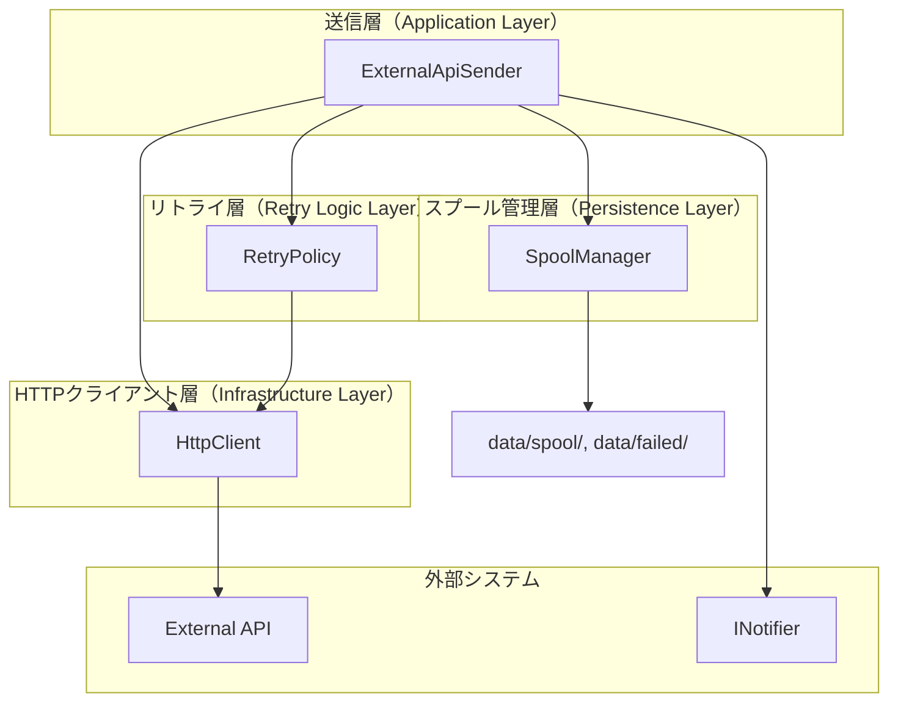
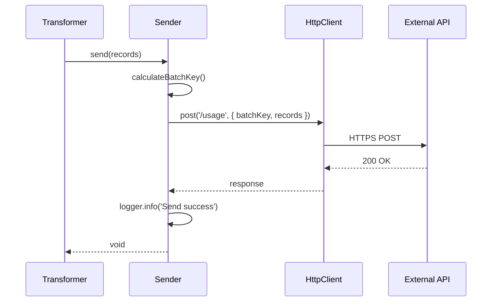
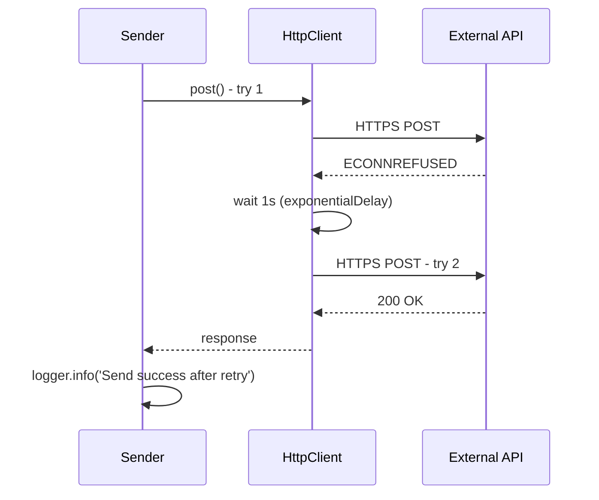
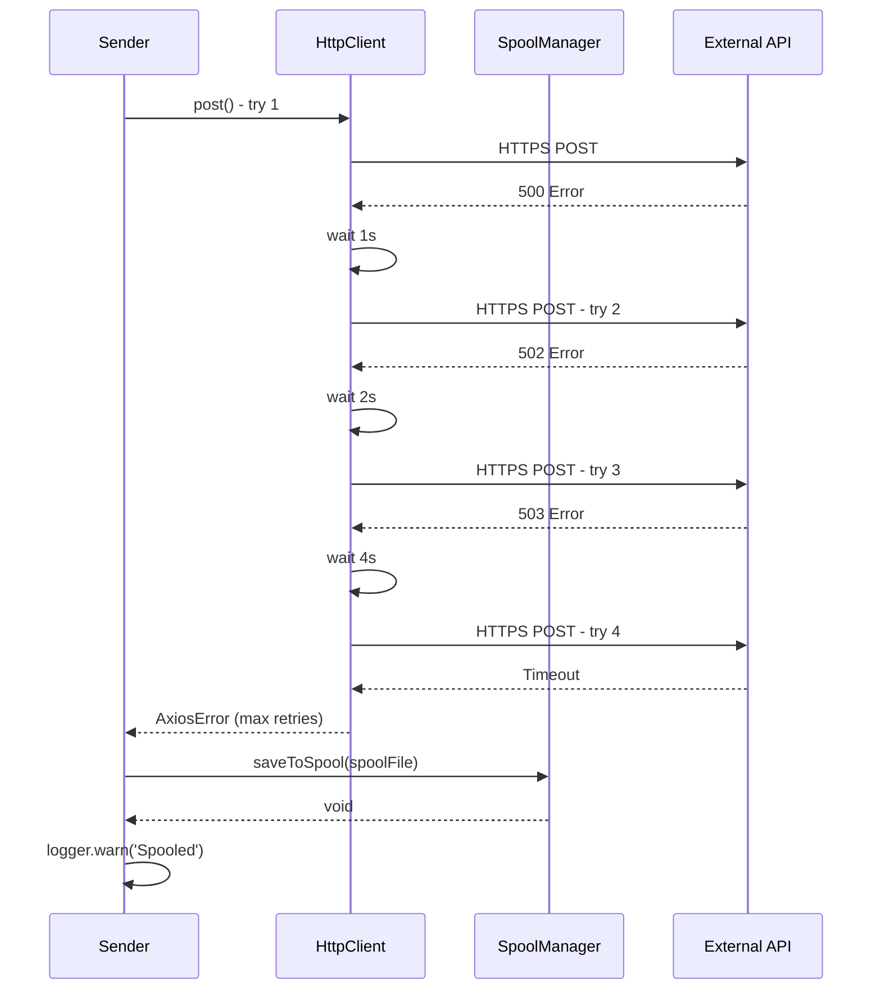
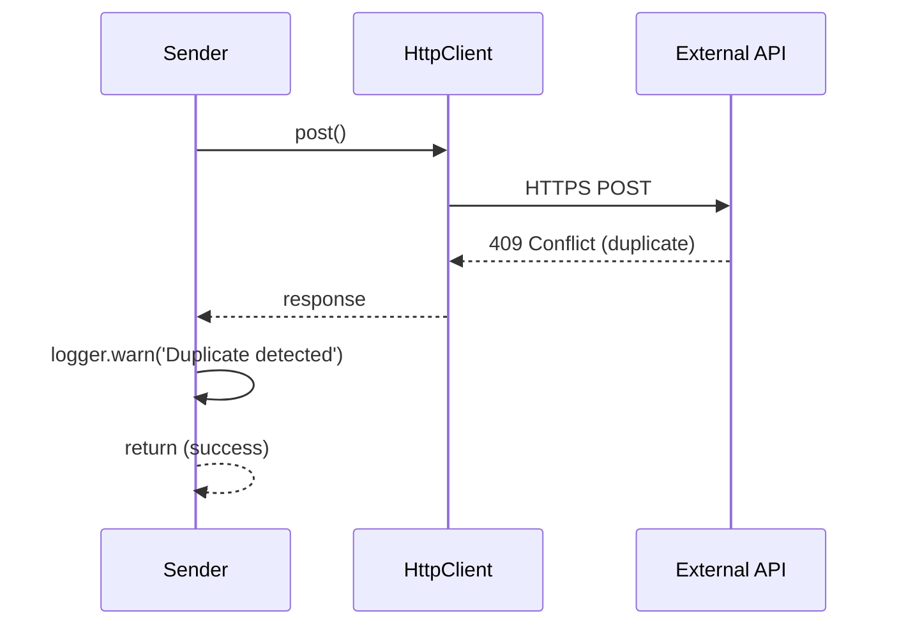
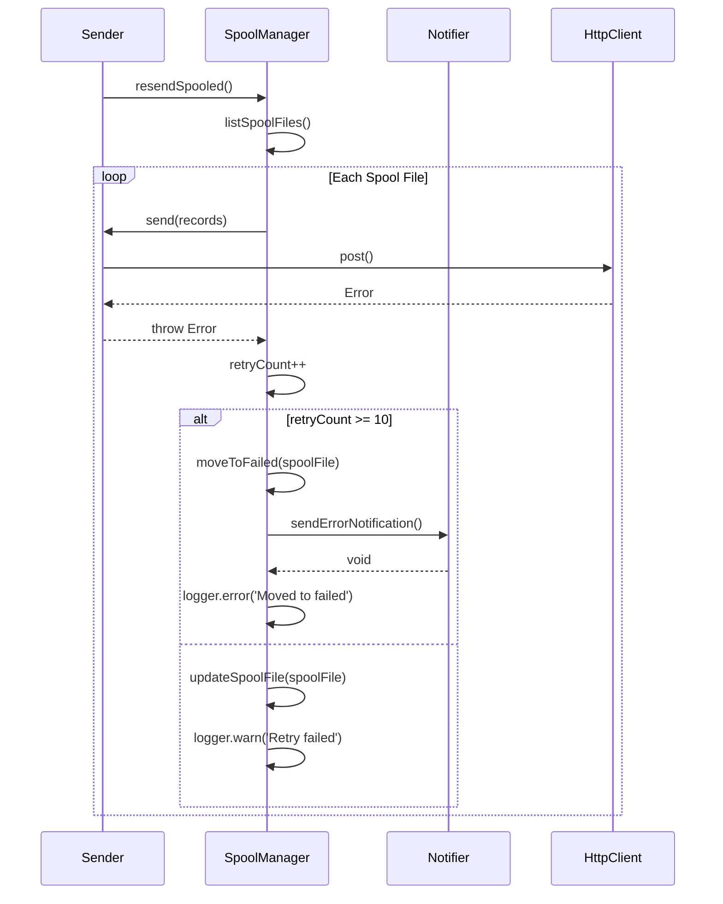

# Design Document: External API Sender

## 合意事項チェックリスト

### スコープ
- [x] 変換済みデータを外部APIへHTTPS POSTで送信
- [x] リトライ処理（指数バックオフ、最大3回）
- [x] 冪等性保証（409レスポンス対応）
- [x] スプール機構（data/spool/）
- [x] スプール再送処理（次回実行時）
- [x] data/failed/移動とエラー通知（リトライ上限超過時）

### 非スコープ
- [x] 認証トークンのリフレッシュ（固定トークン想定、将来拡張）
- [x] 外部APIのスキーマバリデーション（Transformerで検証済み）
- [x] マルチプロセス対応（単一プロセス前提）
- [x] スプールの優先度制御（全データ同一優先度）

### 制約条件
- [x] 並行運用: 単一プロセス前提（スケジューラが1プロセスのみ起動）
- [x] 互換性要件: Epic共通の技術スタック（axios + axios-retry）
- [x] バッチサイズ: 100件/バッチ（メモリ使用量50MB以内）

### パフォーマンス要件
- [x] 測定の要否: 送信スループット、スプール読み込み速度を計測
- [x] 目標値: 100件/バッチを30秒以内、1000件スプール走査を10秒以内

### 設計への反映確認
- [x] スコープはすべてアーキテクチャ図、データフロー図に反映
- [x] 非スコープは実装範囲外として明記
- [x] 制約条件はADR 003（ファイルロック機構）、ADR 007（HTTPクライアント）に反映
- [x] パフォーマンス要件は非機能要件セクションに反映

## 前提となるADR

### 必須ADR（本ストーリーで作成）
- [ADR 001: スプールファイル形式](../../adr/001-spool-file-format.md) - 1 JSONファイル形式、バッチ全体を1ファイルに保存
- [ADR 002: リトライポリシー](../../adr/002-retry-policy.md) - 指数バックオフ（1秒 → 2秒 → 4秒）、最大3回
- [ADR 003: ファイルロック機構](../../adr/003-file-lock-mechanism.md) - 単一プロセス前提、ファイルロック不要
- [ADR 004: 通知方法](../../adr/004-notification-method.md) - INotifierインターフェースで抽象化、Story 5で実装
- [ADR 005: Retry-Afterヘッダ対応](../../adr/005-retry-after-header.md) - 指数バックオフのみ、Retry-After無視
- [ADR 006: スプール保持期間とリトライ上限](../../adr/006-spool-retention-policy.md) - 7日間保持、10回リトライ上限
- [ADR 007: HTTPクライアントライブラリ](../../adr/007-http-client-library.md) - axios + axios-retry

## 既存コードベース分析

### 実装パスマッピング

**新規作成ファイル（8ファイル）:**
- `src/sender/external-api-sender.ts` - ISenderインターフェースの実装、送信処理の統括
- `src/sender/spool-manager.ts` - スプールファイルの読み書き、再送処理
- `src/sender/retry-policy.ts` - リトライロジック（指数バックオフ）
- `src/sender/http-client.ts` - axiosラッパー、認証・タイムアウト・ログ
- `src/interfaces/sender.ts` - ISenderインターフェース定義
- `src/types/spool.ts` - SpoolFile型定義
- `src/types/external-api.ts` - ExternalApiRecord型定義（Story 3と共有）
- `src/utils/file-utils.ts` - ファイル操作ユーティリティ

**既存修正ファイル（2ファイル）:**
- `src/config/env-config.ts` - 環境変数追加（EXTERNAL_API_*）
- `src/types/metrics.ts` - ExecutionMetrics拡張（送信関連メトリクス）

### 統合点の明確化

**Story 3（data-transformation）との統合:**
- **入力**: TransformerからExternalApiRecord[]を受け取る
- **インターフェース**: `ISender.send(records: ExternalApiRecord[]): Promise<void>`
- **冪等キー**: Transformerが生成したbatchIdempotencyKeyを使用

**Story 5（monitoring-logging-healthcheck）との統合:**
- **通知**: INotifierインターフェースでエラー通知を送信
- **インターフェース**: `INotifier.sendErrorNotification(message: ErrorNotificationMessage): Promise<void>`
- **実装**: Story 5でSlackNotifier、EmailNotifierを実装

**Story 1（foundation-and-scheduler）との統合:**
- **ロガー**: winston Loggerを使用
- **環境変数**: env-configで一元管理
- **スケジューラ**: node-cronが1プロセスのみ起動

### 類似機能の検索と判断

**検索キーワード:** スプール、リトライ、ファイル保存、キュー、バッチ処理

**結果:** 類似機能なし（新規実装）

**判断:** 本プロジェクトで初めてのスプール機構・リトライ処理となるため、新規実装を進める。将来的に他のストーリーで同様の機構が必要になった場合、本実装を共通モジュールとして抽出可能。

## 統合ポイントマップ

### 統合点1: Transformer → Sender
- **既存コンポーネント**: Transformerクラス（Story 3）
- **統合方法**: Transformerの変換完了後、Sender.send()を呼び出し
- **影響度**: 中（データ利用）
- **必要なテスト観点**:
  - Transformerが生成したデータをSenderが正しく受け取る
  - バッチサイズ100件の制限が守られている
  - batchIdempotencyKeyが正しく設定されている

### 統合点2: Sender → External API
- **既存コンポーネント**: 外部API（HTTPS POST エンドポイント）
- **統合方法**: axios POST送信、Bearerトークン認証
- **影響度**: 高（外部システム連携）
- **必要なテスト観点**:
  - 認証ヘッダが正しく設定されている
  - タイムアウト30秒が守られている
  - リトライが正しく動作する（指数バックオフ）
  - 409レスポンスを成功として処理する

### 統合点3: Sender → INotifier
- **既存コンポーネント**: INotifierインターフェース（Story 5で実装）
- **統合方法**: data/failed/移動時にsendErrorNotification()を呼び出し
- **影響度**: 中（通知送信）
- **必要なテスト観点**:
  - リトライ上限超過時に通知が送信される
  - 通知内容に必要な情報が全て含まれる
  - 通知失敗時も処理が継続する（エラーを握りつぶさない）

### 統合点4: Sender → SpoolManager
- **既存コンポーネント**: SpoolManagerクラス（新規作成）
- **統合方法**: リトライ上限到達時にsaveToSpool()を呼び出し、次回実行時にresendSpooled()を呼び出し
- **影響度**: 高（データ永続化）
- **必要なテスト観点**:
  - スプールファイルが正しく保存される
  - ファイルパーミッション600が設定される
  - スプール再送が正しく動作する
  - retryCountが正しくインクリメントされる

## 変更影響マップ

### 変更対象: 外部API送信機構（新規）

**直接影響:**
- `src/sender/external-api-sender.ts` - 新規作成（メインクラス）
- `src/sender/spool-manager.ts` - 新規作成（スプール管理）
- `src/sender/retry-policy.ts` - 新規作成（リトライロジック）
- `src/sender/http-client.ts` - 新規作成（axiosラッパー）

**間接影響:**
- `src/config/env-config.ts` - 環境変数追加（EXTERNAL_API_*）
- `src/types/metrics.ts` - ExecutionMetrics拡張（送信メトリクス）
- Story 3（Transformer） - send()メソッド呼び出しの追加
- Story 5（Notifier） - INotifier実装の追加

**波及なし:**
- Story 2（Fetcher） - データ取得処理には影響なし
- Story 6（Manual Resend） - スプール再送インターフェースを提供するのみ

## インターフェース変更マトリクス

| 既存インターフェース | 新インターフェース | 変換必要性 | アダプター要否 | 互換性確保方法 |
|---------------------|-------------------|-----------|---------------|---------------|
| なし（新規） | ISender | なし | 不要 | - |
| なし（新規） | INotifier | なし | 不要 | - |
| TransformerのExternalApiRecord[] | SenderのExternalApiRecord[] | なし | 不要 | 型共有（src/types/external-api.ts） |

## 実装アプローチ

### メタ認知的戦略選択プロセス

**Phase 1: 問題理解と制約の明確化**

1. **機能の性質**:
   - 外部API送信は独立した責務（Transformer、Notifierとは疎結合）
   - スプール機構は送信処理と密結合（データ永続化）
   - リトライ処理はHTTPクライアント層に統合

2. **技術的依存関係**:
   - HTTPクライアント層 → リトライ層 → 送信層 → スプール管理層（下位層から実装）
   - Notifierインターフェースは並行実装可能（Story 5がブロッカー）

3. **リスクと不確実性**:
   - 外部APIのレスポンス形式が未確定（モックで代替）
   - スプールファイルの肥大化リスク（保持期間7日で軽減）

**Phase 2: 実装アプローチの選択**

**選択: 垂直スライス（機能単位で完結）**

**理由:**
- 各レイヤー（HTTPクライアント、リトライ、スプール、送信）が明確に分離
- レイヤーごとに独立してテスト可能
- 外部依存（外部API）をモックで代替し、早期に動作確認可能
- Story 5（Notifier）への依存は最小限（インターフェースのみ）

**Phase 3: フェーズ構成の決定**

- **Phase 1**: HTTPクライアント層（axios + axios-retry）
- **Phase 2**: スプール管理層（ファイル保存・読み込み・再送）
- **Phase 3**: 送信層統合（Sender + SpoolManager + HttpClient）
- **Phase 4**: エラー通知統合（INotifier呼び出し、モック実装）

**Phase 4: 統合ポイントの定義**

- **Phase 1完了時**: HTTPクライアント単体テスト、モックAPIでのリトライ動作確認（L1）
- **Phase 2完了時**: スプールファイル保存・読み込み・再送のテスト（L2）
- **Phase 3完了時**: 送信→スプール→再送の統合テスト（L3）
- **Phase 4完了時**: エラー通知送信の統合テスト、全体E2Eテスト（L3）

## アーキテクチャ概要

### 4レイヤー構成



### ISenderインターフェース定義

```typescript
export interface ISender {
  /**
   * 変換済みデータを外部APIへ送信
   * @param records - 送信するレコード配列
   * @throws {Error} - 送信失敗時（リトライ上限到達、スプール保存失敗）
   */
  send(records: ExternalApiRecord[]): Promise<void>

  /**
   * スプールファイルを再送
   * @throws {Error} - 再送失敗時
   */
  resendSpooled(): Promise<void>
}
```

## データモデル

### ExternalApiRecord型定義（Story 3と共有）

```typescript
export interface ExternalApiRecord {
  date: string // YYYY-MM-DD
  appId: string
  provider: string
  model: string
  totalTokens: number
  promptTokens: number
  completionTokens: number
  totalCalls: number
  idempotencyKey: string // レコード単位の冪等キー
}
```

### SpoolFile型定義

```typescript
export interface SpoolFile {
  batchIdempotencyKey: string // バッチ単位の冪等キー（SHA256）
  records: ExternalApiRecord[] // 送信データ
  firstAttempt: string // 初回試行時刻（ISO 8601形式）
  retryCount: number // リトライ回数
  lastError: string // 最終エラーメッセージ
}

export const SpoolFileSchema = z.object({
  batchIdempotencyKey: z.string(),
  records: z.array(ExternalApiRecordSchema),
  firstAttempt: z.string().datetime(),
  retryCount: z.number().int().min(0),
  lastError: z.string()
})
```

### ExecutionMetrics拡張

```typescript
export interface ExecutionMetrics {
  // 既存メトリクス（Story 1, 2, 3）
  fetchedRecords: number
  transformedRecords: number

  // Story 4で追加
  sendSuccess: number // 送信成功数（409含む）
  sendFailed: number // 送信失敗数（リトライ上限到達）
  spoolSaved: number // スプール保存数
  spoolResendSuccess: number // スプール再送成功数
  failedMoved: number // data/failed/移動数
}
```

## 詳細設計

### ExternalApiSenderクラス（送信層）

```typescript
export class ExternalApiSender implements ISender {
  constructor(
    private readonly httpClient: HttpClient,
    private readonly spoolManager: SpoolManager,
    private readonly notifier: INotifier,
    private readonly logger: Logger,
    private readonly config: EnvConfig
  ) {}

  async send(records: ExternalApiRecord[]): Promise<void> {
    try {
      // 1. 外部APIへ送信
      const response = await this.httpClient.post('/usage', {
        batchIdempotencyKey: this.calculateBatchKey(records),
        records
      })

      // 2. 200/201レスポンス: 成功
      if (response.status === 200 || response.status === 201) {
        this.logger.info('Send success', { recordCount: records.length })
        return
      }

      // 3. 409レスポンス: 重複検出、成功扱い
      if (response.status === 409) {
        this.logger.warn('Duplicate data detected', { batchKey: this.calculateBatchKey(records) })
        return
      }
    } catch (error) {
      // 4. リトライ上限到達: スプール保存
      if (this.isMaxRetriesError(error)) {
        await this.spoolManager.saveToSpool({
          batchIdempotencyKey: this.calculateBatchKey(records),
          records,
          firstAttempt: new Date().toISOString(),
          retryCount: 0,
          lastError: error.message
        })
        this.logger.warn('Spooled due to max retries', { recordCount: records.length })
        return
      }

      // 5. その他のエラー: 再スロー
      throw error
    }
  }

  async resendSpooled(): Promise<void> {
    const spoolFiles = await this.spoolManager.listSpoolFiles()

    for (const spoolFile of spoolFiles) {
      try {
        // 1. 再送試行
        await this.send(spoolFile.records)

        // 2. 成功: スプールファイル削除
        await this.spoolManager.deleteSpoolFile(spoolFile.batchIdempotencyKey)
        this.logger.info('Spool resend success', { batchKey: spoolFile.batchIdempotencyKey })
      } catch (error) {
        // 3. 失敗: retryCountインクリメント
        spoolFile.retryCount++
        spoolFile.lastError = error.message

        // 4. リトライ上限チェック
        if (spoolFile.retryCount >= this.config.MAX_SPOOL_RETRIES) {
          // 5. data/failed/へ移動
          await this.spoolManager.moveToFailed(spoolFile)

          // 6. エラー通知送信
          await this.notifier.sendErrorNotification({
            title: 'Spool retry limit exceeded',
            filePath: `data/failed/failed_${spoolFile.batchIdempotencyKey}.json`,
            lastError: spoolFile.lastError,
            firstAttempt: spoolFile.firstAttempt,
            retryCount: spoolFile.retryCount
          })
          this.logger.error('Moved to failed', { batchKey: spoolFile.batchIdempotencyKey })
        } else {
          // 7. retryCount更新
          await this.spoolManager.updateSpoolFile(spoolFile)
          this.logger.warn('Spool resend failed', { batchKey: spoolFile.batchIdempotencyKey, retryCount: spoolFile.retryCount })
        }
      }
    }
  }

  private calculateBatchKey(records: ExternalApiRecord[]): string {
    // バッチ冪等キー生成（SHA256）
    const keys = records.map(r => r.idempotencyKey).sort().join('|')
    return createHash('sha256').update(keys).digest('hex')
  }

  private isMaxRetriesError(error: unknown): boolean {
    // axios-retryのリトライ上限到達エラーを判定
    return error instanceof AxiosError && error.config?.['axios-retry']?.retryCount >= this.config.MAX_RETRIES
  }
}
```

### SpoolManagerクラス（スプール管理層）

```typescript
export class SpoolManager {
  private readonly spoolDir = 'data/spool'
  private readonly failedDir = 'data/failed'

  constructor(
    private readonly logger: Logger,
    private readonly config: EnvConfig
  ) {}

  async saveToSpool(spoolFile: SpoolFile): Promise<void> {
    const fileName = `spool_${new Date().toISOString().replace(/[:.]/g, '')}_${spoolFile.batchIdempotencyKey}.json`
    const filePath = `${this.spoolDir}/${fileName}`

    // 1. ディレクトリ作成
    await fs.mkdir(this.spoolDir, { recursive: true })

    // 2. 一時ファイルへ書き込み（atomic operation）
    const tempPath = `${filePath}.tmp`
    await fs.writeFile(tempPath, JSON.stringify(spoolFile, null, 2), { mode: 0o600 })

    // 3. リネーム
    await fs.rename(tempPath, filePath)

    this.logger.info('Spool file saved', { filePath })
  }

  async listSpoolFiles(): Promise<SpoolFile[]> {
    // 1. スプールディレクトリ走査
    const files = await fs.readdir(this.spoolDir)
    const spoolFiles: SpoolFile[] = []

    for (const file of files) {
      if (!file.startsWith('spool_')) continue

      const filePath = `${this.spoolDir}/${file}`
      const content = await fs.readFile(filePath, 'utf-8')

      // 2. zodバリデーション
      const parseResult = SpoolFileSchema.safeParse(JSON.parse(content))
      if (!parseResult.success) {
        this.logger.error('Corrupted spool file', { filePath, error: parseResult.error })
        await this.moveToFailed(JSON.parse(content))
        continue
      }

      spoolFiles.push(parseResult.data)
    }

    // 3. firstAttempt昇順でソート（古いデータ優先）
    return spoolFiles.sort((a, b) =>
      new Date(a.firstAttempt).getTime() - new Date(b.firstAttempt).getTime()
    )
  }

  async deleteSpoolFile(batchKey: string): Promise<void> {
    const files = await fs.readdir(this.spoolDir)
    for (const file of files) {
      if (file.includes(batchKey)) {
        await fs.unlink(`${this.spoolDir}/${file}`)
        this.logger.info('Spool file deleted', { file })
      }
    }
  }

  async updateSpoolFile(spoolFile: SpoolFile): Promise<void> {
    await this.deleteSpoolFile(spoolFile.batchIdempotencyKey)
    await this.saveToSpool(spoolFile)
  }

  async moveToFailed(spoolFile: SpoolFile): Promise<void> {
    // 1. data/failed/ディレクトリ作成
    await fs.mkdir(this.failedDir, { recursive: true })

    // 2. ファイル移動
    const fileName = `failed_${new Date().toISOString().replace(/[:.]/g, '')}_${spoolFile.batchIdempotencyKey}.json`
    const filePath = `${this.failedDir}/${fileName}`
    await fs.writeFile(filePath, JSON.stringify(spoolFile, null, 2), { mode: 0o600 })

    // 3. スプールファイル削除
    await this.deleteSpoolFile(spoolFile.batchIdempotencyKey)

    this.logger.info('Moved to failed', { filePath })
  }
}
```

### HttpClientクラス（HTTPクライアント層）

```typescript
export class HttpClient {
  private readonly client: AxiosInstance

  constructor(
    private readonly logger: Logger,
    private readonly config: EnvConfig
  ) {
    // 1. axiosインスタンス作成
    this.client = axios.create({
      baseURL: this.config.EXTERNAL_API_ENDPOINT,
      timeout: this.config.EXTERNAL_API_TIMEOUT_MS,
      headers: {
        'Content-Type': 'application/json',
        'Authorization': `Bearer ${this.config.EXTERNAL_API_TOKEN}`,
        'User-Agent': 'dify-usage-exporter/1.0.0'
      }
    })

    // 2. axios-retry設定
    axiosRetry(this.client, {
      retries: this.config.MAX_RETRIES,
      retryDelay: axiosRetry.exponentialDelay,
      retryCondition: (error) => {
        return axiosRetry.isNetworkOrIdempotentRequestError(error) ||
          (error.response?.status >= 500) ||
          (error.response?.status === 429)
      }
    })

    // 3. リクエストインターセプター（ログ出力）
    this.client.interceptors.request.use((config) => {
      this.logger.debug('HTTP Request', {
        method: config.method,
        url: config.url,
        headers: this.maskToken(config.headers)
      })
      return config
    })

    // 4. レスポンスインターセプター（ログ出力）
    this.client.interceptors.response.use(
      (response) => {
        this.logger.debug('HTTP Response', {
          status: response.status,
          data: response.data
        })
        return response
      },
      (error) => {
        this.logger.error('HTTP Error', {
          status: error.response?.status,
          message: error.message,
          retryCount: error.config?.['axios-retry']?.retryCount
        })
        throw error
      }
    )
  }

  async post(path: string, data: unknown): Promise<AxiosResponse> {
    return this.client.post(path, data)
  }

  private maskToken(headers: Record<string, string>): Record<string, string> {
    const masked = { ...headers }
    if (masked.Authorization) {
      masked.Authorization = 'Bearer ***MASKED***'
    }
    return masked
  }
}
```

## データフロー

### Happy Path: Transformer → Sender → External API



### Exception Pattern 1: ネットワークエラー → リトライ → 成功



### Exception Pattern 2: リトライ上限 → スプール保存



### Exception Pattern 3: 409 Conflict → 成功扱い



### Exception Pattern 4: スプールリトライ上限 → data/failed/移動 → 通知



## 環境変数

### 必須環境変数

```bash
# 外部APIエンドポイント（必須）
EXTERNAL_API_ENDPOINT=https://api.example.com/v1

# 外部API認証トークン（必須）
EXTERNAL_API_TOKEN=your_secret_token_here
```

### 任意環境変数（デフォルト値あり）

```bash
# タイムアウト時間（ミリ秒、デフォルト30000）
EXTERNAL_API_TIMEOUT_MS=30000

# 最大リトライ回数（デフォルト3）
MAX_RETRIES=3

# 最大スプールリトライ回数（デフォルト10）
MAX_SPOOL_RETRIES=10

# バッチサイズ（デフォルト100）
BATCH_SIZE=100
```

### env-config.ts拡張

```typescript
export interface EnvConfig {
  // 既存（Story 1, 2, 3）
  DIFY_API_ENDPOINT: string
  DIFY_API_TOKEN: string

  // Story 4で追加
  EXTERNAL_API_ENDPOINT: string
  EXTERNAL_API_TOKEN: string
  EXTERNAL_API_TIMEOUT_MS: number
  MAX_RETRIES: number
  MAX_SPOOL_RETRIES: number
  BATCH_SIZE: number
}

export function loadEnvConfig(): EnvConfig {
  // 必須環境変数チェック
  const required = ['EXTERNAL_API_ENDPOINT', 'EXTERNAL_API_TOKEN']
  for (const key of required) {
    if (!process.env[key]) {
      throw new Error(`Missing required environment variable: ${key}`)
    }
  }

  // HTTPS必須チェック
  if (!process.env.EXTERNAL_API_ENDPOINT.startsWith('https://')) {
    throw new Error('EXTERNAL_API_ENDPOINT must use HTTPS protocol')
  }

  return {
    // 既存設定
    DIFY_API_ENDPOINT: process.env.DIFY_API_ENDPOINT,
    DIFY_API_TOKEN: process.env.DIFY_API_TOKEN,

    // Story 4設定
    EXTERNAL_API_ENDPOINT: process.env.EXTERNAL_API_ENDPOINT,
    EXTERNAL_API_TOKEN: process.env.EXTERNAL_API_TOKEN,
    EXTERNAL_API_TIMEOUT_MS: Number(process.env.EXTERNAL_API_TIMEOUT_MS) || 30000,
    MAX_RETRIES: Number(process.env.MAX_RETRIES) || 3,
    MAX_SPOOL_RETRIES: Number(process.env.MAX_SPOOL_RETRIES) || 10,
    BATCH_SIZE: Number(process.env.BATCH_SIZE) || 100
  }
}
```

## エラーハンドリング

### リトライ対象エラー

```typescript
export function isRetryableError(error: unknown): boolean {
  if (!(error instanceof AxiosError)) return false

  // ネットワークエラー
  if (error.code === 'ECONNREFUSED') return true
  if (error.code === 'ETIMEDOUT') return true
  if (error.code === 'ENOTFOUND') return true
  if (error.code === 'ECONNRESET') return true

  // HTTPエラー
  const status = error.response?.status
  if (!status) return true // レスポンスなし（ネットワーク障害）
  if (status >= 500 && status < 600) return true // 5xx
  if (status === 429) return true // Too Many Requests

  return false
}
```

### リトライ非対象エラー

```typescript
export function isNonRetryableError(error: unknown): boolean {
  if (!(error instanceof AxiosError)) return false

  const status = error.response?.status
  if (status === 400) return true // Bad Request - データ不正
  if (status === 401) return true // Unauthorized - 認証失敗
  if (status === 403) return true // Forbidden - 権限不足
  if (status === 404) return true // Not Found - エンドポイント設定ミス

  return false
}
```

### 409レスポンスの処理

```typescript
export function is409Conflict(error: unknown): boolean {
  if (!(error instanceof AxiosError)) return false
  return error.response?.status === 409
}

// Senderクラスでの使用例
if (is409Conflict(error)) {
  this.logger.warn('Duplicate data detected', { batchKey })
  return // 成功扱い
}
```

## セキュリティ考慮事項

### 1. HTTPS必須

```typescript
// env-config.tsで検証
if (!process.env.EXTERNAL_API_ENDPOINT.startsWith('https://')) {
  throw new Error('EXTERNAL_API_ENDPOINT must use HTTPS protocol')
}
```

### 2. トークンマスキング

```typescript
private maskToken(headers: Record<string, string>): Record<string, string> {
  const masked = { ...headers }
  if (masked.Authorization) {
    masked.Authorization = 'Bearer ***MASKED***'
  }
  return masked
}
```

### 3. ファイルパーミッション600

```typescript
await fs.writeFile(filePath, JSON.stringify(spoolFile, null, 2), { mode: 0o600 })
```

### 4. 環境変数検証

```typescript
// 起動時に必須環境変数をチェック
const required = ['EXTERNAL_API_ENDPOINT', 'EXTERNAL_API_TOKEN']
for (const key of required) {
  if (!process.env[key]) {
    throw new Error(`Missing required environment variable: ${key}`)
  }
}
```

## パフォーマンス考慮事項

### 1. バッチ処理（100件/バッチ）

```typescript
// Transformerでバッチサイズ制限
const BATCH_SIZE = Number(process.env.BATCH_SIZE) || 100
const batches = chunk(records, BATCH_SIZE)

for (const batch of batches) {
  await sender.send(batch)
}
```

### 2. タイムアウト30秒

```typescript
const client = axios.create({
  timeout: this.config.EXTERNAL_API_TIMEOUT_MS // デフォルト30000
})
```

### 3. メモリ効率（ストリーミング処理）

```typescript
// スプールファイル走査時にメモリ効率を考慮
async listSpoolFiles(): Promise<SpoolFile[]> {
  const files = await fs.readdir(this.spoolDir)
  const spoolFiles: SpoolFile[] = []

  // 1ファイルずつ読み込み（一度に全ファイルをメモリに展開しない）
  for (const file of files) {
    const content = await fs.readFile(`${this.spoolDir}/${file}`, 'utf-8')
    const spoolFile = JSON.parse(content)
    spoolFiles.push(spoolFile)
  }

  return spoolFiles
}
```

## テスト戦略

### 単体テスト

```typescript
describe('ExternalApiSender', () => {
  describe('send()', () => {
    it('should send records successfully', async () => {
      // モックHTTPクライアント、200レスポンス
      // 送信成功を確認
    })

    it('should handle 409 Conflict as success', async () => {
      // モックHTTPクライアント、409レスポンス
      // 重複検出、成功扱いを確認
    })

    it('should save to spool on max retries', async () => {
      // モックHTTPクライアント、常に500エラー
      // スプール保存を確認
    })
  })

  describe('resendSpooled()', () => {
    it('should resend spooled files successfully', async () => {
      // モックスプールファイル作成
      // 再送成功、ファイル削除を確認
    })

    it('should move to failed on max spool retries', async () => {
      // モックスプールファイル（retryCount=10）
      // data/failed/移動、通知送信を確認
    })
  })
})

describe('SpoolManager', () => {
  describe('saveToSpool()', () => {
    it('should save spool file with permission 600', async () => {
      // スプールファイル保存
      // パーミッション600を確認
    })
  })

  describe('listSpoolFiles()', () => {
    it('should list spool files sorted by firstAttempt', async () => {
      // 複数スプールファイル作成
      // firstAttempt昇順を確認
    })

    it('should move corrupted files to failed', async () => {
      // 破損スプールファイル作成
      // data/failed/移動を確認
    })
  })
})

describe('HttpClient', () => {
  describe('post()', () => {
    it('should retry on network error', async () => {
      // モックAPI（1回目ECONNREFUSED、2回目200）
      // リトライ成功を確認
    })

    it('should apply exponential backoff', async () => {
      // モックAPI（常に500エラー）
      // 待機時間（1秒、2秒、4秒）を確認
    })

    it('should mask token in logs', async () => {
      // ログ出力を確認
      // トークンが***MASKED***になっているか確認
    })
  })
})
```

### 統合テスト（E2Eフロー）

```typescript
describe('E2E: External API Sender', () => {
  it('should complete full flow: send → success', async () => {
    // モックAPI（200レスポンス）
    // Transformer → Sender → External API
    // 送信成功を確認
  })

  it('should complete full flow: send → retry → success', async () => {
    // モックAPI（1回目500、2回目200）
    // リトライ成功を確認
  })

  it('should complete full flow: send → spool → resend → success', async () => {
    // モックAPI（初回は常に500、再送時は200）
    // スプール保存 → 再送成功を確認
  })

  it('should complete full flow: send → spool → failed → notification', async () => {
    // モックAPI（常に500エラー）
    // スプールリトライ10回 → data/failed/移動 → 通知を確認
  })
})
```

### エラーシナリオテスト

```typescript
describe('Error Scenarios', () => {
  it('should handle network timeout', async () => {
    // モックAPI（タイムアウト）
    // リトライ → スプール保存を確認
  })

  it('should handle 429 Too Many Requests', async () => {
    // モックAPI（429レスポンス）
    // リトライ（指数バックオフ）を確認
  })

  it('should handle 400 Bad Request without retry', async () => {
    // モックAPI（400レスポンス）
    // リトライしない、エラースローを確認
  })

  it('should handle 401 Unauthorized without retry', async () => {
    // モックAPI（401レスポンス）
    // リトライしない、エラースローを確認
  })
})
```

## 受入条件（Acceptance Criteria、EARS記法）

### 正常系

- [ ] **AC-Send-1**（契機型）: ユーザーがTransformerからExternalApiRecord[]を渡したとき、システムは外部APIへHTTPS POSTで送信すること
- [ ] **AC-Send-2**（選択型）: もしレスポンスが200/201ならば、システムは送信成功としてログに記録すること
- [ ] **AC-Send-3**（選択型）: もしレスポンスが409ならば、システムは重複検出として成功扱いし、警告ログのみ出力すること

### リトライ処理

- [ ] **AC-Retry-1**（契機型）: ネットワークエラー（ECONNREFUSED）が発生したとき、システムは1秒待機後にリトライすること
- [ ] **AC-Retry-2**（契機型）: HTTP 5xxエラーが発生したとき、システムは指数バックオフ（1秒 → 2秒 → 4秒）でリトライすること
- [ ] **AC-Retry-3**（契機型）: HTTP 429エラーが発生したとき、システムはリトライ対象として処理すること
- [ ] **AC-Retry-4**（選択型）: もしHTTP 400/401/403エラーが発生した場合、システムはリトライせずにエラーをスローすること

### スプール機構

- [ ] **AC-Spool-1**（契機型）: リトライ3回失敗したとき、システムはdata/spool/ディレクトリへJSON形式で保存すること
- [ ] **AC-Spool-2**（遍在型）: システムはスプールファイルのパーミッションを600（所有者のみ読み書き）に設定すること
- [ ] **AC-Spool-3**（遍在型）: システムはfirstAttemptをISO 8601形式（UTC）で記録すること

### スプール再送処理

- [ ] **AC-Resend-1**（契機型）: 次回実行時にresendSpooled()が呼ばれたとき、システムはdata/spool/のファイルをfirstAttempt昇順で走査すること
- [ ] **AC-Resend-2**（選択型）: もし再送が成功すれば、システムはスプールファイルを削除すること
- [ ] **AC-Resend-3**（選択型）: もし再送が失敗すれば、システムはretryCountをインクリメントし、lastErrorを更新すること

### data/failed/移動とエラー通知

- [ ] **AC-Failed-1**（選択型）: もしretryCount ≥ 10ならば、システムはdata/failed/ディレクトリへファイルを移動すること
- [ ] **AC-Failed-2**（契機型）: data/failed/へ移動したとき、システムはINotifier.sendErrorNotification()を呼び出すこと
- [ ] **AC-Failed-3**（遍在型）: システムは通知内容にfilePath、lastError、firstAttempt、retryCountを含めること

### セキュリティ

- [ ] **AC-Security-1**（遍在型）: システムはHTTPS/TLS 1.2以上での通信を必須とし、http://を拒否すること
- [ ] **AC-Security-2**（遍在型）: システムはログ出力時にBearerトークンを***MASKED***に置換すること
- [ ] **AC-Security-3**（遍在型）: システムはスプールファイルとfailedファイルのパーミッションを600に設定すること

## 実装フェーズ

### Phase 1: HTTPクライアント層（2-3日）

**目的**: axios + axios-retryのセットアップ、リトライ動作の確認

**タスク:**
- [ ] HttpClientクラス実装
  - 実装: `src/sender/http-client.ts`
  - テスト: `src/sender/__tests__/http-client.test.ts`
- [ ] axios-retry設定（指数バックオフ）
- [ ] インターセプター実装（ログ、トークンマスク）
- [ ] 環境変数追加（env-config.ts）
- [ ] 単体テスト作成（リトライ動作確認）

**フェーズ完了条件:**
- [ ] HttpClientクラスが正しくリトライする（指数バックオフ）
- [ ] トークンマスクが正しく動作する
- [ ] 単体テストがすべてパス

**動作確認手順（L1）:**
1. モックAPIサーバーを起動（1回目500、2回目200レスポンス）
2. HttpClient.post()を実行
3. リトライ動作を確認（1秒待機後、2回目で成功）
4. ログ出力を確認（トークンが***MASKED***）

### Phase 2: スプール管理層（2-3日）

**目的**: スプールファイルの保存・読み込み・再送処理の実装

**タスク:**
- [ ] SpoolManagerクラス実装
  - 実装: `src/sender/spool-manager.ts`
  - テスト: `src/sender/__tests__/spool-manager.test.ts`
- [ ] SpoolFile型定義（zod）
- [ ] ファイル操作ユーティリティ実装（file-utils.ts）
- [ ] 単体テスト作成（保存・読み込み・削除・移動）

**フェーズ完了条件:**
- [ ] スプールファイルが正しく保存される（パーミッション600）
- [ ] firstAttempt昇順でソートされる
- [ ] 破損ファイルがdata/failed/へ移動される
- [ ] 単体テストがすべてパス

**動作確認手順（L2）:**
1. テストデータ（ExternalApiRecord[]）を作成
2. SpoolManager.saveToSpool()を実行
3. data/spool/にファイルが作成されているか確認
4. パーミッション600を確認（`ls -l data/spool/`）
5. SpoolManager.listSpoolFiles()で読み込み確認

### Phase 3: 送信層統合（3-4日）

**目的**: Sender、SpoolManager、HttpClientの統合

**タスク:**
- [ ] ExternalApiSenderクラス実装
  - 実装: `src/sender/external-api-sender.ts`
  - テスト: `src/sender/__tests__/external-api-sender.test.ts`
- [ ] ISenderインターフェース定義
- [ ] バッチ冪等キー生成ロジック実装
- [ ] 統合テスト作成（E2Eフロー）

**フェーズ完了条件:**
- [ ] 送信 → リトライ → 成功のフロー動作
- [ ] 送信 → スプール保存 → 再送 → 成功のフロー動作
- [ ] 409レスポンスが成功扱いになる
- [ ] 統合テストがすべてパス

**動作確認手順（L3）:**
1. モックAPIサーバーを起動（初回は常に500、再送時は200）
2. Sender.send()を実行（初回）
3. スプールファイルが作成されているか確認
4. Sender.resendSpooled()を実行（再送）
5. スプールファイルが削除されているか確認
6. ログ出力を確認（送信成功、スプール保存、再送成功）

### Phase 4: エラー通知統合（1-2日）

**目的**: INotifier呼び出し、モックNotifier実装

**タスク:**
- [ ] INotifierインターフェース定義
  - 実装: `src/interfaces/notifier.ts`
- [ ] ConsoleNotifier実装（モック、ログ出力のみ）
  - 実装: `src/notifier/console-notifier.ts`
- [ ] data/failed/移動時の通知送信実装
- [ ] 統合テスト作成（通知送信確認）

**フェーズ完了条件:**
- [ ] retryCount ≥ 10時にdata/failed/へ移動
- [ ] 移動時にINotifier.sendErrorNotification()が呼ばれる
- [ ] ConsoleNotifierでログ出力される
- [ ] 統合テストがすべてパス

**動作確認手順（L3）:**
1. テストスプールファイル作成（retryCount=10）
2. Sender.resendSpooled()を実行
3. data/failed/へファイルが移動されているか確認
4. ConsoleNotifierのログ出力を確認（通知内容）

## 参考資料

- [Axios Retry Best Practices (ZenRows, 2025)](https://www.zenrows.com/blog/axios-retry)
- [Idempotency Keys in REST APIs (Zuplo, 2025)](https://zuplo.com/learning-center/implementing-idempotency-keys-in-rest-apis-a-complete-guide)
- [Stripe API Idempotent Requests](https://docs.stripe.com/api/idempotent_requests)
- [Best Practices for Message Queue Services (ResearchGate, 2025)](https://www.researchgate.net/publication/387722154_BEST_PRACTICES_FOR_MESSAGE_QUEUE_SERVICES_IN_DISTRIBUTED_SYSTEMSRaghukishore_Balivada)
- [AWS Error Retries and Exponential Backoff](https://docs.aws.amazon.com/general/latest/gr/api-retries.html)
- Epic方針書: `specs/epics/1-dify-usage-exporter/epic.md`
- PRD: `specs/stories/4-external-api-sender/prd.md`
