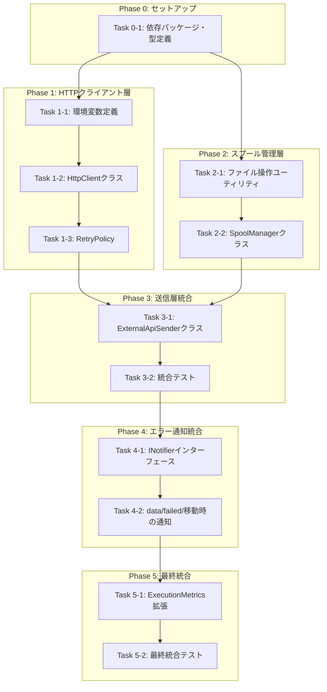
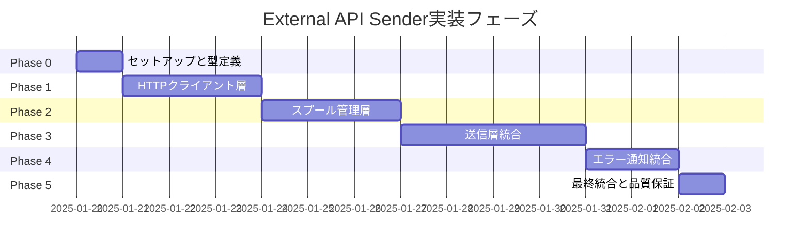

# 作業計画書: External API Sender

## 作業概要

### 目的
変換済み使用量データを外部APIへ確実に送信し、失敗時は自動リトライ・スプール保存することで、データ欠損を防ぎDownstream処理（コスト集計・課金）を安定化させる。

### ゴール
- HTTPS POST送信（Bearer認証、30秒タイムアウト）
- リトライ処理（指数バックオフ、最大3回）
- 冪等性保証（409 Conflict対応）
- スプール機構（data/spool/への保存・再送）
- data/failed/移動とエラー通知（リトライ上限超過時）

### 成果物
- ExternalApiSenderクラス（ISenderインターフェース実装）
- SpoolManagerクラス（スプール管理）
- HttpClientクラス（axiosラッパー）
- RetryPolicyユーティリティ（リトライロジック）
- 環境変数拡張（env-config.ts）
- ExecutionMetrics拡張（送信メトリクス）
- 単体テスト・統合テスト（カバレッジ70%以上）

## 実装フェーズ

### Phase 0: セットアップと共通型定義（0.5日）

**目的**: プロジェクト環境セットアップ、共通型定義、テスト基盤準備

#### Task 0-1: 依存パッケージインストールと型定義
- [ ] axios, axios-retryのインストール確認
- [ ] zodのインストール確認
- [ ] ExternalApiRecord型定義作成（src/types/external-api.ts）
- [ ] SpoolFile型定義作成（src/types/spool.ts、zodスキーマ含む）
- [ ] ISenderインターフェース定義作成（src/interfaces/sender.ts）

**完了条件:**
- [ ] 実装完了: 型定義ファイルが作成されている
- [ ] 品質完了: TypeScriptコンパイルエラーなし
- [ ] 統合完了: Story 3のExternalApiRecord型と整合性確認

**成果物:**
- src/types/external-api.ts
- src/types/spool.ts
- src/interfaces/sender.ts

**動作確認（L1）:**
1. TypeScriptコンパイル実行: `npm run build`
2. 型定義ファイルのインポート確認

---

### Phase 1: HTTPクライアント層（2-3日）

**目的**: axios + axios-retryによるHTTPクライアント実装、リトライポリシー設定

#### Task 1-1: 環境変数定義と拡張
- [ ] env-config.ts拡張（EXTERNAL_API_*環境変数追加）
- [ ] HTTPS必須チェック実装
- [ ] 必須環境変数バリデーション実装
- [ ] 単体テスト作成（src/config/__tests__/env-config.test.ts）

**完了条件:**
- [ ] 実装完了: 環境変数が正しく読み込まれる
- [ ] 品質完了: 単体テストがパス、必須チェックが動作
- [ ] 統合完了: 既存のenv-configと整合性確認

**成果物:**
- src/config/env-config.ts（拡張）
- src/config/__tests__/env-config.test.ts

#### Task 1-2: HttpClientクラス実装と単体テスト作成
- [ ] HttpClientクラス実装（src/sender/http-client.ts）
  - axiosインスタンス作成（baseURL、timeout、認証ヘッダー設定）
  - axios-retry設定（指数バックオフ、リトライ条件）
  - リクエスト/レスポンスインターセプター（ログ出力、トークンマスク）
- [ ] 単体テスト作成（src/sender/__tests__/http-client.test.ts）
  - リトライ動作確認（nockでモックAPI）
  - タイムアウト確認
  - トークンマスク確認
  - リトライ条件判定確認（5xx、429、ネットワークエラー）

**完了条件:**
- [ ] 実装完了: HttpClientクラスが動作する
- [ ] 品質完了: 単体テストがパス（src/sender/__tests__/http-client.test.ts）
- [ ] 統合完了: モックAPIでリトライ動作確認

**成果物:**
- src/sender/http-client.ts
- src/sender/__tests__/http-client.test.ts

**動作確認（L1）:**
1. モックAPIサーバー起動（nock使用、1回目500エラー、2回目200レスポンス）
2. HttpClient.post()実行
3. リトライ動作を確認（1秒待機後、2回目で成功）
4. ログ出力を確認（トークンが***MASKED***）
5. 単体テスト実行: `npm test src/sender/__tests__/http-client.test.ts`

#### Task 1-3: RetryPolicyユーティリティ実装
- [ ] リトライ条件判定関数実装（src/sender/retry-policy.ts）
  - isRetryableError()
  - isNonRetryableError()
  - is409Conflict()
- [ ] 単体テスト作成（src/sender/__tests__/retry-policy.test.ts）

**完了条件:**
- [ ] 実装完了: リトライ条件判定が正しく動作する
- [ ] 品質完了: 単体テストがパス（src/sender/__tests__/retry-policy.test.ts）
- [ ] 統合完了: HttpClientとの統合確認

**成果物:**
- src/sender/retry-policy.ts
- src/sender/__tests__/retry-policy.test.ts

---

### Phase 2: スプール管理層（2-3日）

**目的**: data/spool/、data/failed/へのファイル保存・読み込み・削除機能

#### Task 2-1: ファイル操作ユーティリティ実装
- [ ] ファイル操作ユーティリティ実装（src/utils/file-utils.ts）
  - パーミッション600設定関数
  - アトミックファイル書き込み関数
- [ ] 単体テスト作成（src/utils/__tests__/file-utils.test.ts）

**完了条件:**
- [ ] 実装完了: ファイル操作ユーティリティが動作する
- [ ] 品質完了: 単体テストがパス（src/utils/__tests__/file-utils.test.ts）
- [ ] 統合完了: パーミッション600が正しく設定される

**成果物:**
- src/utils/file-utils.ts
- src/utils/__tests__/file-utils.test.ts

#### Task 2-2: SpoolManagerクラス実装と単体テスト作成
- [ ] SpoolManagerクラス実装（src/sender/spool-manager.ts）
  - saveToSpool(): スプール保存
  - loadFromSpool(): スプール読み込み（firstAttempt昇順ソート）
  - deleteSpoolFile(): スプールファイル削除
  - moveToFailed(): data/failed/へ移動
  - updateSpoolFile(): retryCount更新
- [ ] 単体テスト作成（src/sender/__tests__/spool-manager.test.ts）
  - ファイル保存・読み込み・削除・移動確認
  - firstAttempt昇順ソート確認
  - 破損ファイルのdata/failed/移動確認
  - パーミッション600確認

**完了条件:**
- [ ] 実装完了: SpoolManagerクラスが動作する
- [ ] 品質完了: 単体テストがパス（src/sender/__tests__/spool-manager.test.ts）
- [ ] 統合完了: スプールファイルがdata/spool/に正しく保存される

**成果物:**
- src/sender/spool-manager.ts
- src/sender/__tests__/spool-manager.test.ts

**動作確認（L2）:**
1. テストデータ（ExternalApiRecord[]）を作成
2. SpoolManager.saveToSpool()を実行
3. data/spool/にファイルが作成されているか確認
4. パーミッション600を確認（`ls -l data/spool/`）
5. SpoolManager.listSpoolFiles()で読み込み確認（firstAttempt昇順）
6. 単体テスト実行: `npm test src/sender/__tests__/spool-manager.test.ts`

---

### Phase 3: 送信層統合（3-4日）

**目的**: ExternalApiSender実装、リトライ→スプール→再送→data/failed/のフロー統合

#### Task 3-1: ExternalApiSenderクラス実装
- [ ] ExternalApiSenderクラス実装（src/sender/external-api-sender.ts）
  - send(): HTTPクライアント経由で送信
  - resendSpooled(): スプール再送処理
  - handleSendError(): エラーハンドリング（リトライ vs スプール保存判定）
  - calculateBatchKey(): バッチ冪等キー生成（SHA256）
  - isMaxRetriesError(): リトライ上限到達判定
- [ ] 単体テスト作成（src/sender/__tests__/external-api-sender.test.ts）
  - 送信成功シナリオ
  - 409 Conflict対応（成功扱い）
  - リトライ上限到達→スプール保存
  - リトライ成功シナリオ

**完了条件:**
- [ ] 実装完了: ExternalApiSenderクラスが動作する
- [ ] 品質完了: 単体テストがパス（src/sender/__tests__/external-api-sender.test.ts）
- [ ] 統合完了: HttpClient、SpoolManagerとの統合確認

**成果物:**
- src/sender/external-api-sender.ts
- src/sender/__tests__/external-api-sender.test.ts

#### Task 3-2: 統合テスト作成（E2Eフロー）
- [ ] 統合テスト作成（src/sender/__tests__/integration/sender-e2e.int.test.ts）
  - Happy Path: 送信成功
  - Exception Pattern 1: ネットワークエラー → リトライ → 成功
  - Exception Pattern 2: リトライ上限 → スプール保存
  - Exception Pattern 3: 409 Conflict → 成功扱い
  - スプール再送フロー: スプール保存 → 再送成功

**完了条件:**
- [ ] 実装完了: 統合テストがすべて作成されている
- [ ] 品質完了: 統合テストがパス（src/sender/__tests__/integration/sender-e2e.int.test.ts）
- [ ] 統合完了: E2Eフロー全体が正しく動作する

**成果物:**
- src/sender/__tests__/integration/sender-e2e.int.test.ts

**動作確認（L3）:**
1. モックAPIサーバーを起動（初回は常に500、再送時は200）
2. Sender.send()を実行（初回）
3. スプールファイルが作成されているか確認（`ls -la data/spool/`）
4. Sender.resendSpooled()を実行（再送）
5. スプールファイルが削除されているか確認
6. ログ出力を確認（送信成功、スプール保存、再送成功）
7. 統合テスト実行: `npm test src/sender/__tests__/integration/sender-e2e.int.test.ts`

---

### Phase 4: エラー通知統合（1-2日）

**目的**: INotifier連携、data/failed/移動時の通知送信

#### Task 4-1: INotifierインターフェース定義とモック実装
- [ ] INotifierインターフェース定義（src/interfaces/notifier.ts）
- [ ] ConsoleNotifier実装（モック、ログ出力のみ）（src/notifier/console-notifier.ts）
- [ ] 単体テスト作成（src/notifier/__tests__/console-notifier.test.ts）

**完了条件:**
- [ ] 実装完了: INotifierインターフェース定義とConsoleNotifier実装
- [ ] 品質完了: 単体テストがパス（src/notifier/__tests__/console-notifier.test.ts）
- [ ] 統合完了: ConsoleNotifierでログ出力される

**成果物:**
- src/interfaces/notifier.ts
- src/notifier/console-notifier.ts
- src/notifier/__tests__/console-notifier.test.ts

#### Task 4-2: data/failed/移動時の通知送信実装
- [ ] ExternalApiSender.resendSpooled()にINotifier呼び出しを追加
- [ ] data/failed/移動時の通知送信実装
- [ ] 統合テスト拡張（通知送信確認）（src/sender/__tests__/integration/sender-e2e.int.test.ts）

**完了条件:**
- [ ] 実装完了: data/failed/移動時に通知が送信される
- [ ] 品質完了: 統合テストがパス（通知送信確認）
- [ ] 統合完了: INotifier呼び出しが正しく動作する

**成果物:**
- src/sender/external-api-sender.ts（拡張）
- src/sender/__tests__/integration/sender-e2e.int.test.ts（拡張）

**動作確認（L3）:**
1. テストスプールファイル作成（retryCount=10）
2. Sender.resendSpooled()を実行
3. data/failed/へファイルが移動されているか確認（`ls -la data/failed/`）
4. ConsoleNotifierのログ出力を確認（通知内容）
5. 統合テスト実行: `npm test src/sender/__tests__/integration/sender-e2e.int.test.ts`

---

### Phase 5: メトリクス拡張と最終統合（1日）

**目的**: ExecutionMetrics拡張、全体統合テスト、最終動作確認

#### Task 5-1: ExecutionMetrics型拡張
- [ ] ExecutionMetrics型拡張（src/types/metrics.ts）
  - sendSuccess: number
  - sendFailed: number
  - spoolSaved: number
  - spoolResendSuccess: number
  - failedMoved: number
- [ ] ExternalApiSenderにメトリクス記録機能追加

**完了条件:**
- [ ] 実装完了: ExecutionMetrics型拡張とメトリクス記録機能追加
- [ ] 品質完了: TypeScriptコンパイルエラーなし
- [ ] 統合完了: Story 5でメトリクス集計に使用可能

**成果物:**
- src/types/metrics.ts（拡張）
- src/sender/external-api-sender.ts（拡張）

#### Task 5-2: 最終統合テストと品質保証
- [ ] 全単体テスト実行（カバレッジ70%以上確認）
- [ ] 全統合テスト実行
- [ ] TypeScriptビルド確認
- [ ] Biomeチェック実行（lint + format）
- [ ] エラーシナリオテスト実行
  - ネットワークタイムアウト
  - 429 Too Many Requests
  - 400 Bad Request（リトライしない）
  - 401 Unauthorized（リトライしない）

**完了条件:**
- [ ] 実装完了: 全タスクが完了している
- [ ] 品質完了: 全テストがパス、TypeScriptビルド成功、Biomeチェック成功
- [ ] 統合完了: E2Eフロー全体が正しく動作する

**動作確認（最終確認）:**
1. 全テスト実行: `npm test`
2. カバレッジ確認: `npm run test:coverage:fresh`（70%以上）
3. TypeScriptビルド: `npm run build`
4. Biomeチェック: `npm run check`
5. E2Eフロー確認:
   - 送信成功 → ログ確認
   - リトライ成功 → ログ確認
   - スプール保存 → data/spool/確認
   - スプール再送 → data/spool/削除確認
   - data/failed/移動 → data/failed/確認 → 通知確認

---

## タスク依存関係図

## フェーズ構成図

## リスクと対策

### 技術的リスク

| リスク | 影響度 | 発生確率 | 緩和策 |
|--------|--------|----------|--------|
| 外部APIの長期停止（1日以上） | 高 | 中 | スプール機構で最大7日間保持、data/failed/で永久保存 |
| ディスク容量不足 | 高 | 低 | スプール最大保持期間7日、定期的なdata/failed/クリーンアップ |
| 環境変数の誤設定 | 高 | 中 | 起動時バリデーション、必須項目チェック、.env.exampleの提供 |
| ネットワークファイアウォール制限 | 中 | 中 | IPホワイトリスト登録、事前の接続テスト実施 |
| 外部APIのレート制限（429） | 中 | 高 | Retry-Afterヘッダ対応、指数バックオフ、最大リトライ回数制限 |
| 冪等キーの衝突 | 低 | 低 | SHA256ハッシュで衝突確率は極めて低い、衝突時は409で重複検出 |
| スプールファイルの破損 | 中 | 低 | JSON形式で保存、読み込み時にzodでバリデーション、破損時はdata/failed/へ移動 |
| 認証トークンの有効期限切れ | 高 | 中 | 401エラー時に即座にログ出力、将来的にリフレッシュロジック追加 |

### ブロッカー

| ブロッカー | 対策 | 担当 |
|-----------|------|------|
| Story 1未完了（Logger、Environment Config） | Story 1完了を待つ | - |
| Story 3未完了（ExternalApiRecord型定義） | Story 3完了を待つ | - |
| Story 5未完了（INotifierインターフェース） | 並行実装可能、INotifierインターフェースはPhase 4で定義 | 本ストーリー |
| axios/axios-retryセットアップ未完了 | Story 1で完了済み | - |

## 受入条件（Acceptance Criteria、EARS記法）

### 正常系

- [ ] **AC-Send-1**（契機型）: ユーザーがTransformerからExternalApiRecord[]を渡したとき、システムは外部APIへHTTPS POSTで送信すること
- [ ] **AC-Send-2**（選択型）: もしレスポンスが200/201ならば、システムは送信成功としてログに記録すること
- [ ] **AC-Send-3**（選択型）: もしレスポンスが409ならば、システムは重複検出として成功扱いし、警告ログのみ出力すること

### リトライ処理

- [ ] **AC-Retry-1**（契機型）: ネットワークエラー（ECONNREFUSED）が発生したとき、システムは1秒待機後にリトライすること
- [ ] **AC-Retry-2**（契機型）: HTTP 5xxエラーが発生したとき、システムは指数バックオフ（1秒 → 2秒 → 4秒）でリトライすること
- [ ] **AC-Retry-3**（契機型）: HTTP 429エラーが発生したとき、システムはリトライ対象として処理すること
- [ ] **AC-Retry-4**（選択型）: もしHTTP 400/401/403エラーが発生した場合、システムはリトライせずにエラーをスローすること

### スプール機構

- [ ] **AC-Spool-1**（契機型）: リトライ3回失敗したとき、システムはdata/spool/ディレクトリへJSON形式で保存すること
- [ ] **AC-Spool-2**（遍在型）: システムはスプールファイルのパーミッションを600（所有者のみ読み書き）に設定すること
- [ ] **AC-Spool-3**（遍在型）: システムはfirstAttemptをISO 8601形式（UTC）で記録すること

### スプール再送処理

- [ ] **AC-Resend-1**（契機型）: 次回実行時にresendSpooled()が呼ばれたとき、システムはdata/spool/のファイルをfirstAttempt昇順で走査すること
- [ ] **AC-Resend-2**（選択型）: もし再送が成功すれば、システムはスプールファイルを削除すること
- [ ] **AC-Resend-3**（選択型）: もし再送が失敗すれば、システムはretryCountをインクリメントし、lastErrorを更新すること

### data/failed/移動とエラー通知

- [ ] **AC-Failed-1**（選択型）: もしretryCount ≥ 10ならば、システムはdata/failed/ディレクトリへファイルを移動すること
- [ ] **AC-Failed-2**（契機型）: data/failed/へ移動したとき、システムはINotifier.sendErrorNotification()を呼び出すこと
- [ ] **AC-Failed-3**（遍在型）: システムは通知内容にfilePath、lastError、firstAttempt、retryCountを含めること

### セキュリティ

- [ ] **AC-Security-1**（遍在型）: システムはHTTPS/TLS 1.2以上での通信を必須とし、http://を拒否すること
- [ ] **AC-Security-2**（遍在型）: システムはログ出力時にBearerトークンを***MASKED***に置換すること
- [ ] **AC-Security-3**（遍在型）: システムはスプールファイルとfailedファイルのパーミッションを600に設定すること

## 品質チェックリスト

- [ ] **Design Doc整合性確認**: 全受入条件がタスク化されている
- [ ] **技術的依存関係に基づくフェーズ構成**: HTTPクライアント層 → スプール管理層 → 送信層統合 → エラー通知統合
- [ ] **全要件のタスク化**: AC-Send-1〜3、AC-Retry-1〜4、AC-Spool-1〜3、AC-Resend-1〜3、AC-Failed-1〜3、AC-Security-1〜3が全てタスクに反映
- [ ] **最終フェーズに品質保証の存在**: Phase 5に最終統合テストと品質保証
- [ ] **統合ポイントの動作確認手順配置**: L1（Phase 1）、L2（Phase 2）、L3（Phase 3、4、5）
- [ ] **テストファイルパスの明記**: 各テストタスクに具体的なテストファイルパスを記載

## 参考資料

- Epic方針書: `specs/epics/1-dify-usage-exporter/epic.md`
- PRD: `specs/stories/4-external-api-sender/prd.md`
- Design Doc: `specs/stories/4-external-api-sender/design.md`
- [Axios Retry Best Practices (ZenRows, 2025)](https://www.zenrows.com/blog/axios-retry)
- [Idempotency Keys in REST APIs (Zuplo, 2025)](https://zuplo.com/learning-center/implementing-idempotency-keys-in-rest-apis-a-complete-guide)
- [AWS Error Retries and Exponential Backoff](https://docs.aws.amazon.com/general/latest/gr/api-retries.html)

## 用語集

- **スプール（Spool）**: リトライ上限到達時にローカルファイルへ一時保存するデータ
- **冪等性（Idempotency）**: 同じ操作を複数回実行しても結果が変わらない性質
- **冪等キー（Idempotency Key）**: 重複データを検出するための一意な識別子
- **指数バックオフ（Exponential Backoff）**: リトライ間隔を指数的に増加させる手法（1秒→2秒→4秒）
- **409 Conflict**: HTTPステータスコード、リソースの重複を示す
- **Bearer認証**: HTTPヘッダーにトークンを含める認証方式（`Authorization: Bearer {token}`）
- **data/failed/**: リトライ上限超過後にファイルを移動する永久保存ディレクトリ
