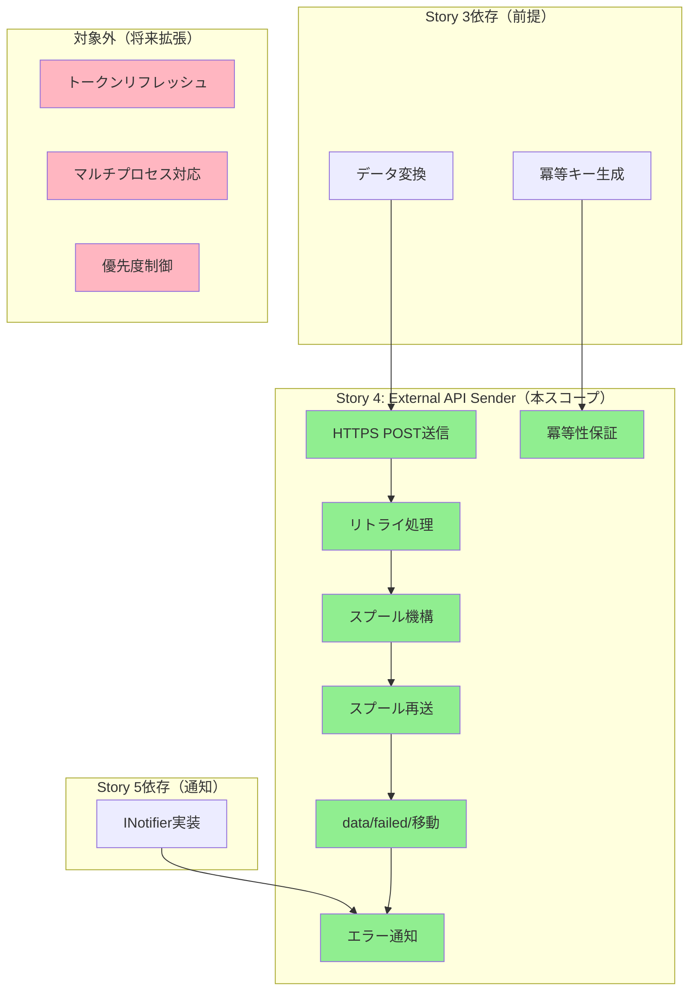
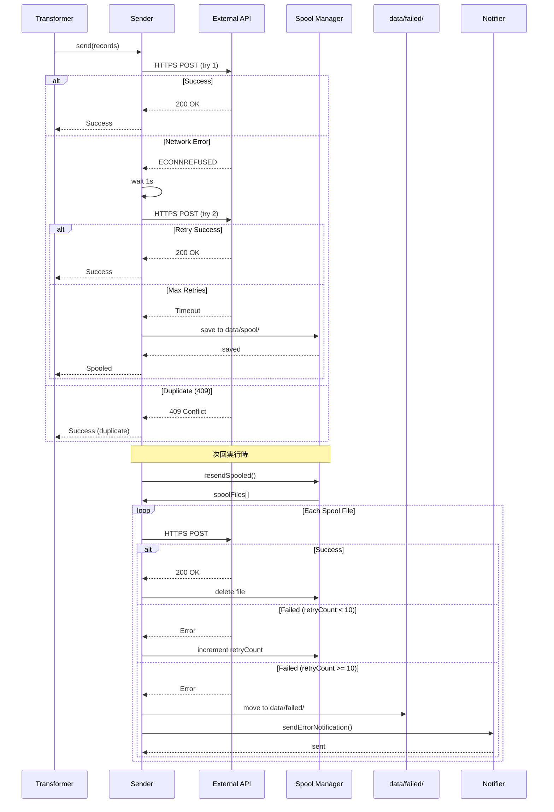

# 要件定義書: External API Sender

## 概要

### 1行要約
変換済み使用量データを外部APIへ確実に送信し、失敗時は自動リトライ・スプール保存することで、データ欠損を防ぎDownstream処理（コスト集計・課金）を安定化させる。

### 背景
Difyの使用量データを外部システム（コスト集計・課金処理・利用監査）へ連携する際、ネットワーク障害やAPI一時停止によるデータ欠損は、課金精度やコスト管理の信頼性に直結する重大な問題となる。単純な送信処理だけでは不十分であり、失敗時の自動リトライ、永続化されたスプール機構、重複防止の冪等性保証が必要である。

本機能は、これらの信頼性要件を満たす送信基盤を提供し、運用担当者が手動介入することなく、データの完全性と一貫性を保証する。

## ユーザーストーリー

### プライマリーユーザー
- **システム運用担当者**: Dify使用量データを確実に外部システムへ連携させる責任を持つ
- **経理・コスト管理担当者**: 正確なコスト集計・課金データを必要とする
- **アプリ利用監査担当者**: アプリ別/ユーザー別の利用状況を追跡する

### ユーザーストーリー

```
As a システム運用担当者
I want to 変換済み使用量データを外部APIへ確実に送信し、失敗時は自動リトライ・スプール保存する
So that データ欠損を防ぎ、Downstream処理（コスト集計・課金処理）の精度と信頼性を確保できる
```

### ユースケース

1. **通常フロー（成功）**
   - 変換済みデータを受け取り、外部APIへHTTPS POSTで送信
   - 200 OKレスポンスを受信し、送信成功をログに記録
   - 送信成功メトリクスをインクリメント

2. **一時的エラーからの自動復旧**
   - 1回目の送信でネットワークエラー（ECONNREFUSED）が発生
   - 1秒待機後、自動的に2回目の送信を試行
   - 2回目で成功し、リトライ回数をログに記録

3. **重複データの検出（冪等性）**
   - 同じバッチデータを誤って2回送信
   - 外部APIが冪等キーで重複を検出し、409 Conflictを返す
   • システムは409を成功とみなし、警告ログのみ出力
   - スプール保存は行わない

4. **リトライ上限到達時のスプール保存**
   - 3回のリトライ全てで5xxエラーが発生
   - data/spool/ディレクトリへJSON形式で保存
   - 次回実行時に自動的に再送を試行

5. **スプールリトライ上限超過時のエラー通知**
   - スプールファイルの再送が10回失敗
   - data/failed/ディレクトリへ移動
   - 運用担当者へエラー通知（Slack/メール）を送信
   - 手動対応が必要な状態を通知

## 機能要件

### 必須要件（MVP）

#### 1. HTTPS POST送信
- **詳細**: 変換済みデータを外部APIへHTTPS POSTで送信
- **認証**: Bearer認証（環境変数`EXTERNAL_API_TOKEN`）
- **タイムアウト**: 30秒（環境変数`EXTERNAL_API_TIMEOUT_MS`）
- **ヘッダー**:
  - `Content-Type: application/json`
  - `Authorization: Bearer {token}`
  - `User-Agent: dify-usage-exporter/1.0.0`
- **受入条件**:
  - 200/201レスポンスを成功として処理
  - レスポンスボディをログに記録（トークンマスク済み）

#### 2. リトライ処理（指数バックオフ）
- **詳細**: ネットワークエラー・5xx・429発生時に自動リトライ
- **最大リトライ回数**: 3回（環境変数`MAX_RETRIES`）
- **バックオフ方式**: 指数バックオフ（1秒 → 2秒 → 4秒）
- **リトライ対象エラー**:
  - ネットワークエラー（ECONNREFUSED, ETIMEDOUT, etc.）
  - HTTP 5xx（500, 502, 503, 504）
  - HTTP 429（Too Many Requests）
- **リトライ非対象エラー**:
  - HTTP 400（Bad Request）- データ不正
  - HTTP 401（Unauthorized）- 認証失敗
  - HTTP 403（Forbidden）- 権限不足
- **受入条件**:
  - リトライ回数、バックオフ時間、エラー内容をログに記録
  - Retry-Afterヘッダがある場合は優先して使用

#### 3. 冪等性保証（409レスポンス対応）
- **詳細**: 重複データ送信を検出し、安全に処理
- **冪等キー**: バッチ単位のSHA256ハッシュ（`batchIdempotencyKey`）
- **409 Conflictの扱い**:
  - 成功扱い（既に処理済みのデータ）
  - 警告ログのみ出力
  - スプール保存しない
  - 送信成功メトリクスにカウント
- **受入条件**:
  - 同じデータを2回送信しても、2回目は409で正常終了
  - 409受信時のログに`duplicate data detected`を含む

#### 4. スプール機構（data/spool/）
- **詳細**: リトライ上限到達時にローカルファイルへ永続化
- **スプールディレクトリ**: `data/spool/`
- **ファイル名**: `spool_{timestamp}_{batchIdempotencyKey}.json`
  - 例: `spool_20250118T120530Z_a3f2e1b9c4d5.json`
- **ファイルパーミッション**: 600（所有者のみ読み書き）
- **保存内容**:
  ```json
  {
    "batchIdempotencyKey": "a3f2e1b9c4d5...",
    "records": [...],
    "firstAttempt": "2025-01-18T12:05:30Z",
    "retryCount": 0,
    "lastError": "HTTP 503 Service Unavailable"
  }
  ```
- **受入条件**:
  - リトライ3回失敗後、スプールファイルが正しく作成される
  - ファイルパーミッションが600である
  - firstAttemptがISO 8601形式で記録される

#### 5. スプール再送処理
- **詳細**: 次回実行時にスプールファイルを自動的に再送
- **走査順序**: firstAttempt昇順（古いデータ優先）
- **再送成功時**: スプールファイルを削除
- **再送失敗時**: retryCountをインクリメント、lastErrorを更新
- **受入条件**:
  - 次回実行時にスプールファイルが検出され、再送が試行される
  - 再送成功時にスプールファイルが削除される
  - 再送失敗時にretryCountが正しくインクリメントされる

#### 6. data/failed/移動とエラー通知
- **詳細**: スプールリトライ上限超過時の処理
- **移動条件**: retryCount ≥ 10（環境変数`MAX_SPOOL_RETRIES`）
- **移動先ディレクトリ**: `data/failed/`
- **ファイル名**: `failed_{timestamp}_{batchIdempotencyKey}.json`
- **エラー通知内容**:
  - ファイルパス
  - 最終エラーメッセージ
  - firstAttempt（初回試行時刻）
  - retryCount
- **受入条件**:
  - retryCount ≥ 10時、data/failed/へファイルが移動される
  - 移動後、エラー通知が送信される
  - 通知内容に必要な情報が全て含まれる

#### 7. エラーハンドリング
- **詳細**: 全てのエラーを構造化ログとして記録
- **ログ項目**:
  - エラー種別（network, http, timeout, etc.）
  - エラーメッセージ
  - HTTPステータスコード（該当時）
  - リトライ試行回数
  - バックオフ時間
  - APIレスポンス内容（トークンマスク済み）
- **受入条件**:
  - 全てのエラーがJSON形式でログ出力される
  - トークンや機密情報がマスクされている
  - エラーコンテキストが十分に記録される

### 追加要件（Nice to Have）

- **プログレス表示**: 大量バッチ送信時の進捗状況表示（100件ごと）
- **送信レート制限**: 外部API保護のための送信レート制限（例: 10req/s）
- **バッチ分割**: 大量データを自動的に複数バッチに分割
- **スプール圧縮**: 長期保存時のディスク容量削減（gzip圧縮）
- **再送スケジューリング**: 時間帯指定での再送実行（営業時間外のみ等）

### 対象外（Out of Scope）

- **認証トークンのリフレッシュ**: トークン有効期限管理と自動更新（将来拡張）
  - 理由: 初期バージョンでは固定トークン想定、リフレッシュロジックは複雑性が高い
- **外部APIのスキーマバリデーション**: 送信前のスキーマ検証
  - 理由: Transformerで検証済み、二重検証は不要
- **マルチプロセス対応**: 複数プロセス同時実行時のファイルロック
  - 理由: 単一プロセス前提（シンプル化）、将来的に必要になれば検討
- **スプールの優先度制御**: 重要度に応じた再送順序制御
  - 理由: 現状は全データ同一優先度、要件が明確でない
- **外部APIのレスポンスキャッシュ**: 重複チェックのためのローカルキャッシュ
  - 理由: 外部APIが409を返す仕様のため不要

## 非機能要件

### パフォーマンス
- **送信スループット**: 100件/バッチを30秒以内で送信完了
- **スプール読み込み**: 1000件のスプールファイルを10秒以内で走査
- **メモリ使用量**: バッチ送信時のメモリ使用量を50MB以内に抑制
- **タイムアウト**: API呼び出しタイムアウト30秒（環境変数で設定可能）

### 信頼性
- **データ完全性**: リトライ・スプール機構により99.9%以上のデータ送信成功率
- **冪等性**: 同じデータを複数回送信しても副作用なし
- **永続化**: スプールファイルによる障害時のデータ保護
- **通知確実性**: data/failed/移動時のエラー通知100%送信

### セキュリティ
- **通信暗号化**: HTTPS/TLS 1.2以上必須、http://は拒否
- **認証**: Bearerトークン認証、トークンは環境変数で管理
- **ファイルパーミッション**: スプールファイルは600（所有者のみ読み書き）
- **ログマスキング**: APIトークン、機密情報はログ出力時にマスク

### 可観測性
- **構造化ログ**: JSON Lines形式、timestamp/level/message/context含む
- **実行メトリクス**: 送信成功数、失敗数、リトライ回数、スプールサイズ
- **エラー追跡**: エラー種別、発生頻度、影響範囲の記録

### 拡張性
- **バッチサイズ調整**: 環境変数で柔軟に変更可能
- **リトライポリシー変更**: 最大リトライ回数、バックオフ時間を環境変数で設定
- **通知チャネル追加**: INotifierインターフェースで抽象化、実装容易

## 例外フロー

### Pattern 1: ネットワークエラー（リトライ成功）
```
1. データ送信試行（1回目）
   → ネットワークエラー（ECONNREFUSED）
   → ログ: error, retryCount=0, nextBackoff=1s
   → 1秒待機

2. データ送信試行（2回目）
   → 成功（200 OK）
   → ログ: info, retryCount=1, success=true
   → メトリクス: sendSuccess++
```

**期待結果**: リトライによりデータ送信成功、スプール保存なし

### Pattern 2: リトライ上限到達（スプール保存）
```
1. データ送信試行（1回目）
   → HTTP 500 Internal Server Error
   → ログ: error, retryCount=0, nextBackoff=1s
   → 1秒待機

2. データ送信試行（2回目）
   → HTTP 502 Bad Gateway
   → ログ: error, retryCount=1, nextBackoff=2s
   → 2秒待機

3. データ送信試行（3回目）
   → HTTP 503 Service Unavailable
   → ログ: error, retryCount=2, nextBackoff=4s
   → 4秒待機

4. データ送信試行（4回目）
   → タイムアウト（30秒）
   → ログ: error, retryCount=3, maxRetriesReached=true
   → スプール保存: data/spool/spool_20250118T120530Z_a3f2e1b9c4d5.json
   → ログ: warn, spoolSaved=true, spoolPath=...
   → メトリクス: sendFailed++, spoolSaved++
```

**期待結果**: リトライ上限到達、スプール保存、次回実行時に再送

### Pattern 3: 409 Conflict（重複データ）
```
1. データ送信試行（1回目）
   → HTTP 409 Conflict
   → レスポンスボディ: {"error": "duplicate batch detected"}
   → ログ: warn, duplicate=true, batchIdempotencyKey=...
   → メトリクス: sendSuccess++（重複も成功扱い）
   → スプール保存なし
```

**期待結果**: 重複検出、成功扱い、スプール保存なし

### Pattern 4: スプールリトライ上限超過
```
1. スプール再送処理（1-10回目）
   → 全て失敗（HTTP 503等）
   → retryCountをインクリメント
   → ログ: error, spoolRetry=N

2. スプール再送処理（11回目のチェック）
   → retryCount=10 ≥ MAX_SPOOL_RETRIES
   → data/failed/へ移動: failed_20250125T093000Z_a3f2e1b9c4d5.json
   → エラー通知送信（Slack/メール）
   → ログ: error, movedToFailed=true, notificationSent=true
   → メトリクス: failedMoved++
```

**期待結果**: data/failed/へ移動、エラー通知送信、手動対応待ち

## ユーザージャーニー図


## スコープ境界図



## データフロー図



## 成功基準

### 定量的指標

1. **データ送信成功率**: 99.9%以上
   - 測定方法: (送信成功数 + 409数) / 総送信試行数
   - 目標値: 0.999以上

2. **リトライ成功率**: 80%以上
   - 測定方法: リトライで成功した数 / リトライ試行数
   - 目標値: 0.8以上

3. **スプール再送成功率**: 95%以上
   - 測定方法: スプール再送成功数 / スプール再送試行数
   - 目標値: 0.95以上

4. **送信レイテンシ**: P95で5秒以内
   - 測定方法: 送信開始から成功レスポンス受信までの時間
   - 目標値: P95 < 5秒

5. **スプールファイル滞留**: 24時間以内に95%が送信成功
   - 測定方法: スプールファイルのfirstAttemptから送信成功までの時間
   - 目標値: P95 < 24時間

6. **data/failed/移動率**: 1%未満
   - 測定方法: data/failed/移動数 / 総送信試行数
   - 目標値: < 0.01

### 定性的指標

1. **運用負荷の軽減**
   - 手動介入が必要なケースが月1回以下
   - エラー通知が適切なタイミングで送信される
   - ログから障害原因を特定できる

2. **データ整合性の保証**
   - 重複データが外部APIに送信されない（409で防止）
   - スプール機構によりデータ欠損が発生しない
   - 冪等キーにより再送しても副作用なし

3. **可観測性の向上**
   - 構造化ログにより障害追跡が容易
   - メトリクスにより送信状況をリアルタイム把握
   - スプールファイルにより未送信データを可視化

## 技術的考慮事項

### 依存関係

#### Blocked by（実装前に必要）
- **Story 1**: foundation-and-scheduler
  - axios/axios-retryセットアップ
  - Logger（winston）実装
  - Environment Config実装
- **Story 3**: data-transformation
  - ExternalApiRecord型定義
  - バッチ冪等キー生成ロジック
- **Story 5**: monitoring-logging-healthcheck
  - INotifierインターフェース定義

#### Provides to（本ストーリーが提供）
- **Story 5**: ExecutionMetrics拡張
  - 送信成功数（sendSuccess）
  - 送信失敗数（sendFailed）
  - スプール保存数（spoolSaved）
  - スプール再送成功数（spoolResendSuccess）
  - data/failed/移動数（failedMoved）
- **Story 6**: manual-resend-watermark
  - スプール再送インターフェース（ISender.resendSpooled()）

### 制約

#### 技術的制約
- **Node.js 20.x必須**: ES2022機能使用、古いバージョンは非対応
- **HTTPS必須**: 外部APIがHTTPSのみ対応、http://は拒否
- **単一プロセス前提**: 複数プロセス同時実行時のファイルロック非対応
- **ローカルファイルシステム**: スプール保存にローカルディスクを使用、分散環境は未対応

#### リソース制約
- **ディスク容量**: スプールファイル最大保持期間7日、1日10MBと想定し70MB必要
- **メモリ**: バッチ送信時に最大50MB使用
- **ネットワーク帯域**: 100件/バッチ、1バッチ1MB想定で1Mbps程度

#### 運用制約
- **環境変数必須**: 以下の環境変数が設定されていないと起動不可
  - `EXTERNAL_API_ENDPOINT`（外部APIエンドポイントURL）
  - `EXTERNAL_API_TOKEN`（認証トークン）
  - `MAX_RETRIES`（最大リトライ回数、デフォルト3）
  - `MAX_SPOOL_RETRIES`（最大スプールリトライ回数、デフォルト10）
  - `EXTERNAL_API_TIMEOUT_MS`（タイムアウト時間、デフォルト30000）
- **ディレクトリ権限**: data/spool/、data/failed/の書き込み権限必須
- **時刻同期**: firstAttemptのタイムスタンプが正確である必要があり、NTP等で時刻同期必須

### リスクと軽減策

| リスク | 影響度 | 発生確率 | 軽減策 |
|--------|--------|----------|--------|
| 外部APIの長期停止（1日以上） | 高 | 中 | スプール機構で最大7日間保持、data/failed/で永久保存 |
| ディスク容量不足 | 高 | 低 | スプール最大保持期間7日、定期的なdata/failed/クリーンアップ手順を運用手順書に記載 |
| 環境変数の誤設定 | 高 | 中 | 起動時バリデーション、必須項目チェック、.env.exampleの提供 |
| ネットワークファイアウォール制限 | 中 | 中 | IPホワイトリスト登録、事前の接続テスト実施 |
| 外部APIのレート制限（429） | 中 | 高 | Retry-Afterヘッダ対応、指数バックオフ、最大リトライ回数制限 |
| 冪等キーの衝突 | 低 | 低 | SHA256ハッシュで衝突確率は極めて低い、衝突時は409で重複検出 |
| スプールファイルの破損 | 中 | 低 | JSON形式で保存、読み込み時にzodでバリデーション、破損時はdata/failed/へ移動 |
| 認証トークンの有効期限切れ | 高 | 中 | 初期バージョンでは固定トークン想定、401エラー時に即座にログ出力、将来的にリフレッシュロジック追加 |
| タイムゾーン不一致 | 低 | 中 | 全てのタイムスタンプをUTC（ISO 8601）で記録 |

## 推定作業量と影響範囲

### 新規作成ファイル（8ファイル）
- `src/sender/external-api-sender.ts` - メインクラス（ISenderの実装）
- `src/sender/spool-manager.ts` - スプール管理ロジック
- `src/sender/retry-policy.ts` - リトライロジック（指数バックオフ）
- `src/sender/http-client.ts` - axiosラッパー（認証、タイムアウト、ログ）
- `src/interfaces/sender.ts` - ISenderインターフェース定義
- `src/types/spool.ts` - SpoolFile型定義
- `src/types/external-api.ts` - ExternalApiRecord型定義
- `src/utils/file-utils.ts` - ファイル操作ユーティリティ

### 既存修正ファイル（2ファイル）
- `src/config/env-config.ts` - 環境変数追加（EXTERNAL_API_*）
- `src/types/metrics.ts` - ExecutionMetrics拡張（送信関連メトリクス）

### テストファイル（2ファイル）
- `src/sender/__tests__/external-api-sender.test.ts` - 単体テスト
- `src/sender/__tests__/spool-manager.test.ts` - スプール管理テスト

### 推定作業量
10-15日（実作業日）

## 付録

### 参考資料
- Epic方針書: `specs/epics/1-dify-usage-exporter/epic.md`
- Story 3 (data-transformation): ExternalApiRecord型定義、冪等キー生成
- Story 5 (monitoring-logging-healthcheck): INotifierインターフェース
- axios-retry公式ドキュメント: https://github.com/softonic/axios-retry

### 用語集
- **スプール（Spool）**: リトライ上限到達時にローカルファイルへ一時保存するデータ
- **冪等性（Idempotency）**: 同じ操作を複数回実行しても結果が変わらない性質
- **冪等キー（Idempotency Key）**: 重複データを検出するための一意な識別子
- **指数バックオフ（Exponential Backoff）**: リトライ間隔を指数的に増加させる手法（1秒→2秒→4秒）
- **409 Conflict**: HTTP ステータスコード、リソースの重複を示す
- **Retry-After**: HTTPヘッダー、リトライ可能になるまでの待機時間を指定
- **Bearer認証**: HTTPヘッダーにトークンを含める認証方式（`Authorization: Bearer {token}`）
- **data/failed/**: リトライ上限超過後にファイルを移動する永久保存ディレクトリ
