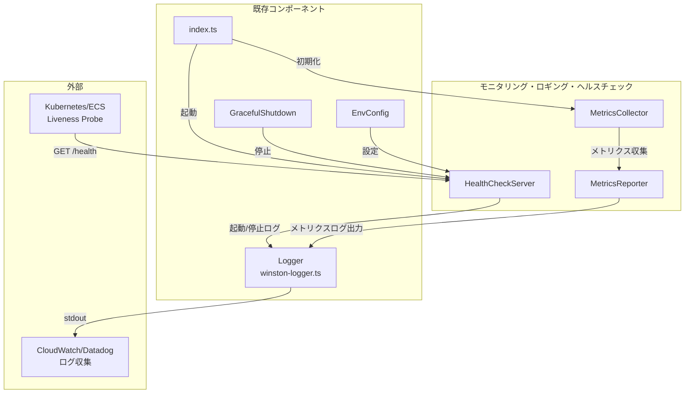
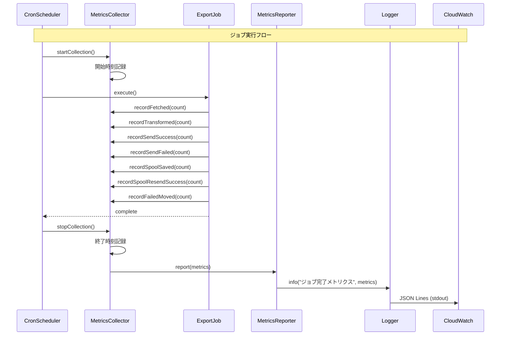

# Design Doc: モニタリング・ロギング・ヘルスチェック機能

## 概要

Dify使用量エクスポーターにモニタリング・ロギング・ヘルスチェック機能を実装し、運用可視性とコンテナオーケストレーション環境での死活監視を実現する。

## 前提となるADR

- [ADR 008: バックエンド基盤技術スタック](specs/adr/008-backend-foundation-tech-stack.md) - winston/zod採用の背景
- [ADR 011: ヘルスチェックHTTPサーバー実装方式](specs/adr/011-healthcheck-http-server.md) - Node.js標準httpモジュール採用

## 合意事項チェックリスト

### スコープ

- [x] 既存winstonロガーを活用した構造化ログ出力
- [x] ExecutionMetrics型を活用したメトリクス収集・出力
- [x] Node.js標準httpモジュールによるヘルスチェックAPI実装
- [x] 環境変数による設定（ポート番号、有効/無効）

### 非スコープ

- [x] Prometheus/Grafana等の外部モニタリングシステム連携
- [x] 詳細なメトリクス（CPU使用率、メモリ使用量等）
- [x] 複数エンドポイント（`/metrics`等）
- [x] データベース等の依存サービス状態チェック

### 制約条件

- [x] 出力先は標準出力のみ（CloudWatch/Datadog等での収集想定）
- [x] ヘルスチェックポート: 8080（デフォルト）
- [x] 既存処理への影響最小化

### パフォーマンス要件

- [x] ヘルスチェックレスポンス: 10ms以内
- [x] メトリクスログ出力: ジョブ実行時間に対して1%以下の影響

### 設計への反映確認

- [x] スコープ内の全機能がコンポーネント設計に反映されている
- [x] 制約条件がインターフェース設計に反映されている
- [x] 非スコープ項目が将来の拡張として明記されている

## 既存コードベース分析

### 調査結果

#### 既存実装の確認

| コンポーネント | パス | 用途 |
|-------------|-----|------|
| Logger | `src/logger/winston-logger.ts` | JSON構造化ログ（既存活用） |
| ExecutionMetrics | `src/types/metrics.ts` | メトリクス型定義（既存活用） |
| EnvConfig | `src/config/env-config.ts` | 環境変数管理（拡張） |
| envSchema | `src/types/env.ts` | 環境変数スキーマ（拡張） |
| GracefulShutdown | `src/shutdown/graceful-shutdown.ts` | シャットダウン処理（拡張） |
| index.ts | `src/index.ts` | エントリーポイント（拡張） |

#### 類似機能の検索

- **ヘルスチェック**: 類似機能なし（新規実装）
- **メトリクスコレクター**: 類似機能なし（新規実装）
- **ログ出力**: winston-logger.ts が既存（活用）

#### 採用した判断

- **既存使用**: Logger（winston-logger.ts）、ExecutionMetrics型
- **新規実装**: HealthCheckServer、MetricsCollector、MetricsReporter

## アーキテクチャ概要

### 全体構成図



### データフロー図



## 実装アプローチ

### 戦略選択: 垂直スライス

**選択理由**:
- 各コンポーネント（HealthCheckServer、MetricsCollector、MetricsReporter）は独立して動作可能
- 外部依存が最小（既存Loggerのみ）
- 段階的に価値を提供できる（Phase 1でヘルスチェック、Phase 2でメトリクス）

### フェーズ構成

| Phase | 内容 | 確認レベル | 依存 |
|-------|------|-----------|------|
| Phase 1 | HealthCheckServer実装 | L2（統合確認） | なし |
| Phase 2 | MetricsCollector/Reporter実装 | L2（統合確認） | Phase 1 |
| Phase 3 | 全体統合・品質保証 | L3（E2E確認） | Phase 1, 2 |

## コンポーネント設計

### 1. HealthCheckServer

**責務**: HTTPサーバーでヘルスチェックエンドポイントを提供

**パス**: `src/healthcheck/healthcheck-server.ts`

```typescript
import type { Server } from 'node:http'
import type { Logger } from '../logger/winston-logger.js'

export interface HealthCheckServerOptions {
  port: number
  logger: Logger
}

export interface HealthCheckServer {
  /**
   * HTTPサーバーを起動する
   * @returns server.listen()が完了し、ポートがバインドされた時点でPromiseが解決される
   */
  start(): Promise<void>

  /**
   * HTTPサーバーを停止する
   * @returns server.close()が完了した時点でPromiseが解決される
   */
  stop(): Promise<void>
}

export interface HealthCheckResponse {
  status: 'ok'
  /** process.uptime()の戻り値（プロセス起動からの経過秒数） */
  uptime: number
  /** ISO 8601形式のタイムスタンプ */
  timestamp: string
}
```

**実装詳細**:
- `uptime`: `process.uptime()`を使用してプロセス起動からの経過秒数を取得
- `start()`: 内部で`server.listen(port)`を呼び出し、`listening`イベント発火時にPromiseを解決
- `stop()`: 内部で`server.close()`を呼び出し、全接続のクローズ完了時にPromiseを解決

### 2. MetricsCollector

**責務**: ジョブ実行中のメトリクスを収集

**パス**: `src/monitoring/metrics-collector.ts`

```typescript
import type { ExecutionMetrics } from '../types/metrics.js'

export interface MetricsCollector {
  /**
   * メトリクス収集を開始する
   * - executionIdを生成（パターン: exec-${timestamp}-${randomSuffix}）
   * - 開始時刻を記録
   * @returns 生成されたexecutionId
   */
  startCollection(): string

  /**
   * メトリクス収集を停止する
   * - 終了時刻を記録
   */
  stopCollection(): void

  recordFetched(count: number): void
  recordTransformed(count: number): void
  recordSendSuccess(count: number): void
  recordSendFailed(count: number): void
  recordSpoolSaved(count: number): void
  recordSpoolResendSuccess(count: number): void
  recordFailedMoved(count: number): void

  getMetrics(): ExecutionMetrics
  getExecutionDuration(): number
  getExecutionId(): string
}
```

**executionId生成**:
- 責務: `MetricsCollector.startCollection()`で生成
- パターン: `exec-${Date.now()}-${randomBytes(4).toString('hex')}`
- 例: `exec-1737539400000-a1b2c3d4`

### 3. MetricsReporter

**責務**: 収集したメトリクスをログとして出力

**パス**: `src/monitoring/metrics-reporter.ts`

```typescript
import type { Logger } from '../logger/winston-logger.js'
import type { ExecutionMetrics } from '../types/metrics.js'

export interface MetricsReporter {
  report(metrics: ExecutionMetrics, durationMs: number): void
}

export function createMetricsReporter(logger: Logger): MetricsReporter
```

## インターフェース定義

### 環境変数スキーマ拡張

**パス**: `src/types/env.ts`（既存ファイル拡張）

```typescript
// 追加する環境変数
HEALTHCHECK_PORT: z.coerce.number().min(1).max(65535).default(8080),
HEALTHCHECK_ENABLED: z.coerce.boolean().default(true),
```

**z.coerce.boolean()の変換ルール**:
- `true`に変換される値: `'true'`, `'1'`, `1`, `true`
- `false`に変換される値: `'false'`, `'0'`, `0`, `false`, `''`, `undefined`, `null`
- その他の文字列は`true`に変換される（truthy判定）

**推奨設定例**:
```bash
HEALTHCHECK_ENABLED=true   # 有効
HEALTHCHECK_ENABLED=false  # 無効
HEALTHCHECK_ENABLED=1      # 有効
HEALTHCHECK_ENABLED=0      # 無効
```

### HealthCheckResponse型

```typescript
export interface HealthCheckResponse {
  status: 'ok'
  uptime: number
  timestamp: string
}
```

### メトリクスログ出力形式

```json
{
  "level": "info",
  "message": "ジョブ完了メトリクス",
  "timestamp": "2025-01-22T10:30:00.000Z",
  "service": "dify-usage-exporter",
  "executionId": "exec-1234567890-abc",
  "metrics": {
    "fetchedRecords": 150,
    "transformedRecords": 148,
    "sendSuccess": 145,
    "sendFailed": 3,
    "spoolSaved": 1,
    "spoolResendSuccess": 0,
    "failedMoved": 0
  },
  "durationMs": 5432,
  "recordsPerSecond": 27.2
}
```

## 統合ポイントマップ

### 統合点1: index.ts（エントリーポイント）

```yaml
統合点1:
  既存コンポーネント: src/index.ts main()関数
  統合方法: HealthCheckServer起動処理を追加
  影響度: 中（起動フロー変更）
  必要なテスト観点:
    - HealthCheckServer起動確認
    - HEALTHCHECK_ENABLED=falseでの起動スキップ
    - 既存起動フローへの影響なし
```

### 統合点2: GracefulShutdown

```yaml
統合点2:
  既存コンポーネント: src/shutdown/graceful-shutdown.ts
  統合方法: HealthCheckServer.stop()呼び出しを追加
  影響度: 中（シャットダウンフロー変更）
  必要なテスト観点:
    - SIGTERM時のHealthCheckServer停止
    - 既存シャットダウンフローへの影響なし
```

### 統合点3: Scheduler（onTick）

```yaml
統合点3:
  既存コンポーネント: src/index.ts onTickコールバック
  統合方法: MetricsCollectorの開始/停止、MetricsReporter呼び出し
  影響度: 中（ジョブ実行フロー変更）
  必要なテスト観点:
    - メトリクス収集の開始/停止
    - メトリクスログ出力確認
    - 既存ジョブ処理への影響なし
```

**具体的な統合パターン**:

```typescript
// src/index.ts の onTick コールバック内での統合

const onTick = async () => {
  // 1. メトリクス収集開始
  const executionId = metricsCollector.startCollection()
  logger.info('ジョブ実行開始', { executionId })

  try {
    // 2. Fetch処理
    const fetchedRecords = await fetcher.fetch()
    metricsCollector.recordFetched(fetchedRecords.length)

    // 3. Transform処理
    const transformedRecords = await transformer.transform(fetchedRecords)
    metricsCollector.recordTransformed(transformedRecords.length)

    // 4. Send処理
    const sendResult = await sender.send(transformedRecords)
    metricsCollector.recordSendSuccess(sendResult.success)
    metricsCollector.recordSendFailed(sendResult.failed)
    metricsCollector.recordSpoolSaved(sendResult.spoolSaved)
    metricsCollector.recordSpoolResendSuccess(sendResult.spoolResendSuccess)
    metricsCollector.recordFailedMoved(sendResult.failedMoved)

  } finally {
    // 5. メトリクス収集停止とレポート出力
    metricsCollector.stopCollection()
    const metrics = metricsCollector.getMetrics()
    const duration = metricsCollector.getExecutionDuration()
    metricsReporter.report(metrics, duration)
  }
}
```

## 統合境界の約束

### 境界1: HealthCheckServer - HTTP Client（外部）

```yaml
境界名: HealthCheck API
  入力: GET /health リクエスト
  出力: 200 OK + JSON（同期）
  エラー時: 500 Internal Server Error（サーバー内部エラー）
```

### 境界2: MetricsCollector - ExportJob

```yaml
境界名: メトリクス記録
  入力: record*メソッド呼び出し（count: number）
  出力: void（同期、内部状態更新）
  エラー時: エラーは発生しない（単純なカウンター）
```

### 境界3: MetricsReporter - Logger

```yaml
境界名: メトリクスログ出力
  入力: ExecutionMetrics, durationMs
  出力: void（同期、ログ出力）
  エラー時: Loggerのエラーハンドリングに委譲
```

## 変更影響マップ

```yaml
変更対象: src/types/env.ts
直接影響:
  - src/types/env.ts（スキーマ拡張）
  - src/config/env-config.ts（型推論による自動更新）
間接影響:
  - src/index.ts（新環境変数参照）
  - テストファイル（テスト用設定更新）
波及なし:
  - 他の既存処理

変更対象: src/index.ts
直接影響:
  - src/index.ts（HealthCheckServer起動、MetricsCollector統合）
間接影響:
  - src/shutdown/graceful-shutdown.ts（シャットダウンオプション拡張）
波及なし:
  - 既存ジョブ処理（scheduler, logger, config）

変更対象: src/shutdown/graceful-shutdown.ts
直接影響:
  - GracefulShutdownOptions型拡張
  - shutdown関数内でHealthCheckServer.stop()呼び出し
間接影響:
  - なし
波及なし:
  - 既存シャットダウン処理
```

## インターフェース変更マトリクス

| 既存インターフェース | 変更内容 | 互換性 | 対応方法 |
|-------------------|---------|-------|---------|
| EnvConfig | フィールド追加 | 後方互換 | デフォルト値設定 |
| GracefulShutdownOptions | フィールド追加（optional） | 後方互換 | オプショナルフィールド |
| Scheduler | 変更なし | - | - |
| Logger | 変更なし | - | - |

## データ契約

### HealthCheckResponse

```typescript
interface HealthCheckResponse {
  status: 'ok'           // 固定値
  uptime: number         // process.uptime()の戻り値（秒）
  timestamp: string      // ISO 8601形式
}
```

**前提条件**: なし
**保証**: 常に有効なJSONを返す
**エラー時動作**: 500ステータスコードを返す

### ExecutionMetrics（既存型）

```typescript
interface ExecutionMetrics {
  fetchedRecords: number      // >= 0
  transformedRecords: number  // >= 0, <= fetchedRecords
  sendSuccess: number         // >= 0
  sendFailed: number          // >= 0
  spoolSaved: number          // >= 0
  spoolResendSuccess: number  // >= 0
  failedMoved: number         // >= 0
}
```

**前提条件**: 全フィールドが0以上の整数
**保証**: 型定義通りの構造
**エラー時動作**: 該当なし（内部型）

## 受入条件（EARS記法）

### 正常系

#### ヘルスチェック

- [ ] **AC-HC-1** (契機型): `GET /health`リクエストが受信されたとき、システムは200ステータスコードとHealthCheckResponse形式のJSONを返すこと
- [ ] **AC-HC-2** (契機型): アプリケーションが起動したとき、システムはHEALTHCHECK_PORTで指定されたポートでHTTPサーバーを起動すること
- [ ] **AC-HC-3** (選択型): もしHEALTHCHECK_ENABLED=falseの場合、システムはヘルスチェックサーバーを起動しないこと
- [ ] **AC-HC-4** (契機型): SIGTERMシグナルが受信されたとき、システムはヘルスチェックサーバーを正常に停止すること

#### メトリクス収集

- [ ] **AC-MC-1** (契機型): ジョブ実行が開始されたとき、システムはメトリクス収集を開始すること
- [ ] **AC-MC-2** (契機型): ジョブ実行が完了したとき、システムはExecutionMetrics形式でメトリクスをログ出力すること
- [ ] **AC-MC-3** (遍在型): システムは各処理フェーズ（fetch, transform, send）でレコード数をメトリクスとして記録すること
- [ ] **AC-MC-4** (遍在型): システムはジョブ実行時間（durationMs）をメトリクスに含めること
- [ ] **AC-MC-5** (遍在型): システムはレコード処理速度（recordsPerSecond）をメトリクスに含めること

#### ロギング

- [ ] **AC-LOG-1** (遍在型): システムは全てのログをJSON Lines形式で標準出力に出力すること
- [ ] **AC-LOG-2** (遍在型): システムはメトリクスログにexecutionIdを含めること
- [ ] **AC-LOG-3** (遍在型): システムはヘルスチェックサーバー起動/停止をログ出力すること

### 異常系

- [ ] **AC-ERR-1** (不測型): もしヘルスチェックポートが使用中の場合、システムはエラーログを出力して起動を継続すること
- [ ] **AC-ERR-2** (不測型): もし`/health`以外のパスにリクエストがあった場合、システムは404ステータスコードを返すこと
- [ ] **AC-ERR-3** (不測型): もしGET以外のメソッドでリクエストがあった場合、システムは404ステータスコードを返すこと

### 非機能要件

- [ ] **AC-PERF-1** (遍在型): システムはヘルスチェックリクエストに10ms以内で応答すること
- [ ] **AC-PERF-2** (遍在型): システムはメトリクス収集・出力によるジョブ実行時間への影響を1%以下に抑えること

## テスト戦略

### 単体テスト

| コンポーネント | テストファイル | テスト観点 |
|--------------|--------------|-----------|
| HealthCheckServer | `src/healthcheck/__tests__/healthcheck-server.test.ts` | 起動/停止、レスポンス形式、エラーケース |
| MetricsCollector | `src/monitoring/__tests__/metrics-collector.test.ts` | 各recordメソッド、getMetrics |
| MetricsReporter | `src/monitoring/__tests__/metrics-reporter.test.ts` | ログ出力形式、計算値 |

### 統合テスト

| テストファイル | テスト観点 |
|--------------|-----------|
| `src/healthcheck/__tests__/integration/healthcheck.int.test.ts` | HTTP経由のヘルスチェック |
| `src/monitoring/__tests__/integration/metrics.int.test.ts` | メトリクス収集からログ出力までのフロー |

### E2E確認手順

#### Phase 1完了時（ヘルスチェック）

```bash
# 1. 環境変数設定
export HEALTHCHECK_PORT=8080
export HEALTHCHECK_ENABLED=true

# 2. アプリケーション起動
npm run start

# 3. ヘルスチェック確認
curl -i http://localhost:8080/health

# 期待結果: 200 OK + JSON
# {
#   "status": "ok",
#   "uptime": 12.345,
#   "timestamp": "2025-01-22T10:30:00.000Z"
# }

# 4. 無効なパス確認
curl -i http://localhost:8080/invalid
# 期待結果: 404 Not Found

# 5. Graceful Shutdown確認
kill -SIGTERM <PID>
# 期待結果: ログに"ヘルスチェックサーバー停止"が出力
```

#### Phase 2完了時（メトリクス）

```bash
# 1. ジョブ実行（手動トリガーまたはcron待機）

# 2. 標準出力でメトリクスログ確認
# 期待結果: JSON形式でメトリクスが出力
# {
#   "level": "info",
#   "message": "ジョブ完了メトリクス",
#   "metrics": { ... },
#   "durationMs": 5432,
#   "recordsPerSecond": 27.2
# }
```

#### Phase 3完了時（全体統合）

```bash
# 1. Docker Composeで起動
docker-compose up -d

# 2. ヘルスチェック確認
curl http://localhost:8080/health

# 3. ログ確認
docker logs dify-usage-exporter

# 4. 全テスト実行
npm run check:all

# 期待結果: 全テストパス、カバレッジ70%以上
```

## 将来の拡張

以下は本Story 5のスコープ外だが、将来の拡張として想定：

1. **Prometheus形式メトリクス**: `/metrics`エンドポイントの追加
2. **詳細なシステムメトリクス**: CPU使用率、メモリ使用量、GC統計
3. **依存サービス状態チェック**: Dify API、外部API接続確認
4. **カスタムヘルスチェックロジック**: ディスク容量、キュー深度等

## 参考資料

- [How to implement a health check in Node.js - LogRocket Blog](https://blog.logrocket.com/how-to-implement-a-health-check-in-node-js/)
- [Express vs Fastify Performance - BetterStack](https://betterstack.com/community/guides/scaling-nodejs/fastify-express/)
- [Winston Logger Best Practices - BetterStack](https://betterstack.com/community/guides/logging/how-to-install-setup-and-use-winston-and-morgan-to-log-node-js-applications/)
- [Node.js Health Check Best Practices - Stack Overflow](https://stackoverflow.com/questions/48885862/nodejs-application-healthcheck-best-practice)
