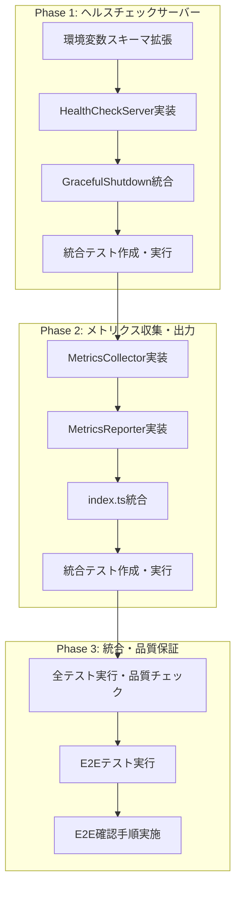

# 作業計画書: モニタリング・ロギング・ヘルスチェック機能

## 概要

Dify使用量エクスポーターにモニタリング・ロギング・ヘルスチェック機能を実装し、運用可視性とコンテナオーケストレーション環境での死活監視を実現する。

## フェーズ構成図



## タスク依存関係図


## リスクと対策

### リスク1: ポート競合

- **リスク**: ヘルスチェックポートが既に使用中の場合、起動失敗
- **対策**: EADDRINUSE エラーハンドリングを実装し、エラーログを出力して起動継続
- **検知方法**: 統合テストでポート競合シナリオを検証

### リスク2: 既存処理への影響

- **リスク**: メトリクス収集による既存ジョブ処理のパフォーマンス低下
- **対策**: メトリクス操作は単純なカウンター加算のみに制限（オーバーヘッド1%以下）
- **検知方法**: パフォーマンステストで実行時間への影響を測定

### リスク3: シャットダウン順序

- **リスク**: GracefulShutdownでHealthCheckServerの停止順序が不適切
- **対策**: 既存シャットダウン処理の最初にHealthCheckServer停止を配置
- **検知方法**: 統合テストでSIGTERMシグナル処理を検証

---

## Phase 1: ヘルスチェックサーバー

**確認レベル**: L2（統合確認）
**依存**: なし

### Task 1-1: 環境変数スキーマ拡張と単体テスト作成

- [x] `src/types/env.ts` に HEALTHCHECK_PORT, HEALTHCHECK_ENABLED を追加
- [x] z.coerce.number() と z.coerce.boolean() の適切な設定
- [x] デフォルト値設定（port: 8080, enabled: true）
- [x] 単体テスト作成完了（`src/types/__tests__/env.test.ts`）
- [x] テスト実行・パス確認

**完了条件**:
- 環境変数スキーマが正常にパース可能
- デフォルト値が正しく設定される

### Task 1-2: HealthCheckServer実装と単体テスト作成

- [x] `src/healthcheck/healthcheck-server.ts` 新規作成
- [x] HealthCheckServerOptions, HealthCheckServer, HealthCheckResponse 型定義
- [x] createHealthCheckServer ファクトリ関数実装
- [x] start() / stop() メソッド実装（Promise形式）
- [x] GET /health エンドポイント実装
- [x] 404 レスポンス（無効パス、無効メソッド）
- [x] EADDRINUSEエラーハンドリング
- [x] 単体テスト作成完了（`src/healthcheck/__tests__/healthcheck-server.test.ts`）
- [x] テスト実行・パス確認

**完了条件**:
- AC-HC-1, AC-HC-2, AC-HC-3, AC-ERR-1, AC-ERR-2, AC-ERR-3 対応
- 単体テストが全てパス

### Task 1-3: GracefulShutdown統合

- [x] `src/shutdown/graceful-shutdown.ts` の GracefulShutdownOptions 拡張
- [x] healthCheckServer?: { stop: () => Promise<void> } オプション追加
- [x] shutdown関数内でhealthCheckServer.stop()呼び出し
- [x] 既存シャットダウン処理への影響なし確認
- [x] 既存テストの更新と実行確認

**完了条件**:
- AC-HC-4 対応
- 既存のシャットダウンテストがパス

### Task 1-4: ヘルスチェック統合テスト作成・実行

- [x] `src/healthcheck/__tests__/integration/healthcheck.int.test.ts` の全テスト実装
- [x] HTTP経由のヘルスチェック動作検証（24テストケース）
- [x] AC-LOG-3（起動/停止ログ）対応
- [x] AC-PERF-1（10ms以内レスポンス）対応
- [x] 全統合テスト実行・パス確認

**完了条件**:
- 統合テスト 24件全てパス
- ヘルスチェックサーバーがHTTP経由で正常動作

### Phase 1 動作確認

```bash
# 1. 環境変数設定
export HEALTHCHECK_PORT=8080
export HEALTHCHECK_ENABLED=true

# 2. アプリケーション起動
npm run start

# 3. ヘルスチェック確認
curl -i http://localhost:8080/health
# 期待結果: 200 OK + JSON
# {
#   "status": "ok",
#   "uptime": 12.345,
#   "timestamp": "2025-01-22T10:30:00.000Z"
# }

# 4. 無効なパス確認
curl -i http://localhost:8080/invalid
# 期待結果: 404 Not Found

# 5. Graceful Shutdown確認
kill -SIGTERM <PID>
# 期待結果: ログに"ヘルスチェックサーバー停止"が出力
```

---

## Phase 2: メトリクス収集・出力

**確認レベル**: L2（統合確認）
**依存**: Phase 1

### Task 2-1: MetricsCollector実装と単体テスト作成

- [x] `src/monitoring/metrics-collector.ts` 新規作成
- [x] MetricsCollector インターフェース実装
- [x] startCollection() / stopCollection() メソッド実装
- [x] executionId生成（exec-${timestamp}-${hex}形式）
- [x] 全record*メソッド実装（7種類）
- [x] getMetrics() / getExecutionDuration() / getExecutionId() 実装
- [x] 単体テスト作成完了（`src/monitoring/__tests__/metrics-collector.test.ts`）
- [x] テスト実行・パス確認

**完了条件**:
- AC-MC-1, AC-MC-3, AC-MC-4 対応
- 単体テストが全てパス

### Task 2-2: MetricsReporter実装と単体テスト作成

- [x] `src/monitoring/metrics-reporter.ts` 新規作成
- [x] MetricsReporter インターフェース実装
- [x] createMetricsReporter ファクトリ関数実装
- [x] report() メソッド実装
- [x] recordsPerSecond計算（ゼロ除算対策含む）
- [x] JSON Lines形式のログ出力
- [x] 単体テスト作成完了（`src/monitoring/__tests__/metrics-reporter.test.ts`）
- [x] テスト実行・パス確認

**完了条件**:
- AC-MC-2, AC-MC-5, AC-LOG-1, AC-LOG-2 対応
- 単体テストが全てパス

### Task 2-3: index.ts メトリクス統合

- [x] `src/index.ts` の onTick コールバック拡張
- [x] MetricsCollector初期化
- [x] MetricsReporter初期化
- [x] startCollection() → 各record*() → stopCollection() → report() フロー実装
- [x] 既存fetch/transform/send処理との統合
- [x] 既存テストの更新と実行確認

**完了条件**:
- 統合ポイント3（Scheduler onTick）の統合完了
- 既存ジョブ処理への影響なし

### Task 2-4: メトリクス統合テスト作成・実行

- [x] `src/monitoring/__tests__/integration/metrics.int.test.ts` の全テスト実装
- [x] MetricsCollector全機能検証
- [x] MetricsReporter全機能検証
- [x] Collector + Reporter 連携検証（34テストケース）
- [x] AC-PERF-2（オーバーヘッド1%以下）対応
- [x] 全統合テスト実行・パス確認

**完了条件**:
- 統合テスト 34件全てパス
- メトリクス収集から出力までの完全フロー動作

### Phase 2 動作確認

```bash
# 1. ジョブ実行（手動トリガーまたはcron待機）

# 2. 標準出力でメトリクスログ確認
# 期待結果: JSON形式でメトリクスが出力
# {
#   "level": "info",
#   "message": "ジョブ完了メトリクス",
#   "metrics": { ... },
#   "durationMs": 5432,
#   "recordsPerSecond": 27.2
# }
```

---

## Phase 3: 統合・品質保証

**確認レベル**: L3（E2E確認）
**依存**: Phase 1, Phase 2

### Task 3-1: 全テスト実行・品質チェック

- [x] 全単体テスト実行・パス確認
- [x] 全統合テスト実行・パス確認
- [x] 型チェック（npm run build）パス
- [x] Lintチェック（npm run check）パス
- [x] カバレッジ70%以上確認

**完了条件**:
- 全テストパス
- 型チェック・Lintエラーなし
- カバレッジ基準達成

### Task 3-2: E2Eテスト実行

- [x] `src/__tests__/e2e/monitoring-logging-healthcheck.e2e.test.ts` の全テスト実装
- [x] ヘルスチェック全体疎通確認（26テストケース）
- [x] Graceful Shutdownフロー確認
- [x] メトリクス収集・出力フロー確認
- [x] 環境変数設定による動作切り替え確認
- [x] エッジケース・異常系確認
- [x] パフォーマンス検証
- [x] 既存機能との統合確認
- [x] 全E2Eテスト実行・パス確認

**完了条件**:
- E2Eテスト 26件全てパス
- 全受入条件（AC）達成

### Task 3-3: E2E確認手順実施

- [x] Docker Composeで起動確認
- [x] ヘルスチェックHTTP経由確認
- [x] メトリクスログ出力確認
- [x] 全品質チェック（npm run check:all）パス

**完了条件**:
- E2E確認手順全て完了
- 本番環境相当での動作確認

### Phase 3 動作確認

```bash
# 1. Docker Composeで起動
docker-compose up -d

# 2. ヘルスチェック確認
curl http://localhost:8080/health

# 3. ログ確認
docker logs dify-usage-exporter

# 4. 全テスト実行
npm run check:all

# 期待結果: 全テストパス、カバレッジ70%以上
```

---

## 品質チェックリスト

- [x] Design Doc整合性確認（全受入条件がタスク化されている）
- [x] 技術的依存関係に基づくフェーズ構成
- [x] 最終フェーズに品質保証の存在
- [x] 統合ポイントの動作確認手順配置
- [x] テストファイルパスの明記

## 受入条件（AC）とタスクのトレーサビリティ

| AC ID | 説明 | 対応タスク |
|-------|------|-----------|
| AC-HC-1 | GET /health レスポンス | Task 1-2, Task 1-4 |
| AC-HC-2 | HTTPサーバー起動 | Task 1-1, Task 1-2, Task 1-4 |
| AC-HC-3 | HEALTHCHECK_ENABLED=false | Task 1-2, Task 1-4 |
| AC-HC-4 | Graceful Shutdown | Task 1-3, Task 1-4 |
| AC-MC-1 | メトリクス収集開始 | Task 2-1, Task 2-4 |
| AC-MC-2 | メトリクスログ出力 | Task 2-2, Task 2-4 |
| AC-MC-3 | 処理フェーズメトリクス | Task 2-1, Task 2-3, Task 2-4 |
| AC-MC-4 | ジョブ実行時間 | Task 2-1, Task 2-4 |
| AC-MC-5 | レコード処理速度 | Task 2-2, Task 2-4 |
| AC-LOG-1 | JSON Lines形式 | Task 2-2, Task 2-4 |
| AC-LOG-2 | executionId | Task 2-1, Task 2-2, Task 2-4 |
| AC-LOG-3 | 起動/停止ログ | Task 1-2, Task 1-4 |
| AC-ERR-1 | ポート使用中エラー | Task 1-2, Task 1-4 |
| AC-ERR-2 | 無効パス404 | Task 1-2, Task 1-4 |
| AC-ERR-3 | 無効メソッド404 | Task 1-2, Task 1-4 |
| AC-PERF-1 | 10ms以内レスポンス | Task 1-4, Task 3-2 |
| AC-PERF-2 | オーバーヘッド1%以下 | Task 2-4, Task 3-2 |

## テスト件数サマリ

| テスト種別 | ファイルパス | 件数 | 実行タイミング |
|-----------|-------------|------|---------------|
| 統合テスト（ヘルスチェック） | `src/healthcheck/__tests__/integration/healthcheck.int.test.ts` | 24件 | Phase 1 Task 1-4 |
| 統合テスト（メトリクス） | `src/monitoring/__tests__/integration/metrics.int.test.ts` | 34件 | Phase 2 Task 2-4 |
| E2Eテスト | `src/__tests__/e2e/monitoring-logging-healthcheck.e2e.test.ts` | 26件 | Phase 3 Task 3-2 |
| **合計** | | **84件** | |
