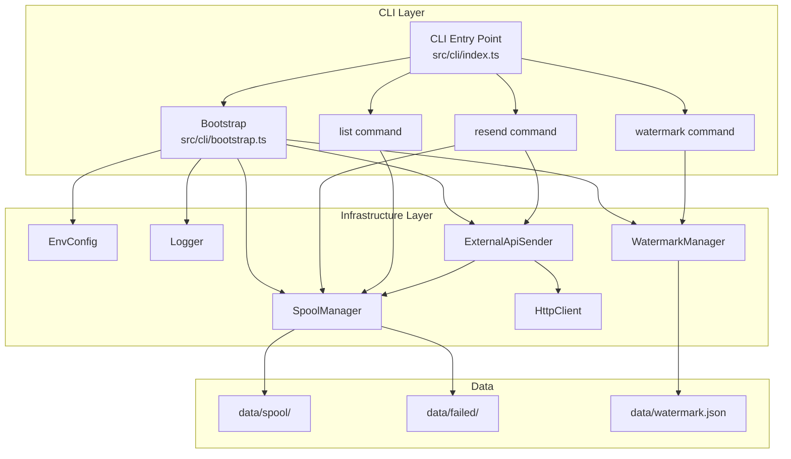
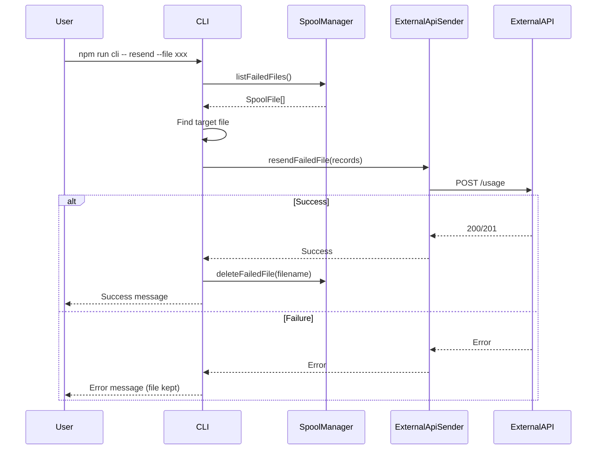
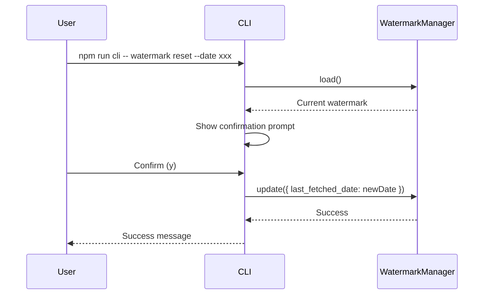

# Design Document: 手動再送とウォーターマーク操作CLI

## 概要

`data/failed/`ディレクトリ内の失敗ファイルの手動再送と、ウォーターマーク（last_fetched_date）の操作を行うCLIツールを実装する。

## 前提となるADR

- [ADR 012: CLIフレームワークの選定](specs/adr/012-cli-framework-selection.md) - Commander.js採用
- [ADR 001: スプールファイル形式](specs/adr/001-spool-file-format.md) - SpoolFile型定義
- [ADR 006: スプール保持ポリシー](specs/adr/006-spool-retention-policy.md) - リトライポリシー

## 合意事項チェックリスト

### スコープ

- [x] CLI層（src/cli/）の新規作成
- [x] SpoolManagerへのlistFailedFilesメソッド追加
- [x] WatermarkManagerへのresetメソッド追加
- [x] npm scriptsへのcliコマンド追加

### 非スコープ

- [ ] GUIインターフェース
- [ ] バックグラウンド実行
- [ ] スケジュールされた自動再送

### 制約条件

- CLI実行方法: `npm run cli -- コマンド`形式
- 確認プロンプト: ウォーターマークリセット時に常に表示
- 既存ロジックの再利用: ExternalApiSenderの再送機能を活用

## 既存コードベース分析

### 実装パスマッピング

| 対象 | 既存/新規 | ファイルパス |
|------|----------|-------------|
| CLI エントリーポイント | 新規 | src/cli/index.ts |
| CLI bootstrap | 新規 | src/cli/bootstrap.ts |
| resendコマンド | 新規 | src/cli/commands/resend.ts |
| watermarkコマンド | 新規 | src/cli/commands/watermark.ts |
| listコマンド | 新規 | src/cli/commands/list.ts |
| 共通ユーティリティ | 新規 | src/cli/utils/prompt.ts |
| SpoolManager | 既存（拡張） | src/sender/spool-manager.ts |
| WatermarkManager | 既存（利用） | src/watermark/watermark-manager.ts |
| ExternalApiSender | 既存（拡張） | src/sender/external-api-sender.ts |

### 類似機能検索結果

- **再送ロジック**: ExternalApiSender.resendSpooled()が存在、`data/spool/`の再送に対応
  - 判断: 既存ロジックを参考に、`data/failed/`用の再送メソッドを追加
- **ファイル一覧取得**: SpoolManager.listSpoolFiles()が存在
  - 判断: 同様のパターンでlistFailedFiles()を追加

### 統合ポイント

1. **SpoolManagerとの統合**
   - listFailedFiles(): `data/failed/`内のファイル一覧取得
   - 既存のdeleteSpoolFile()パターンを参考にdeleteFailedFile()追加

2. **WatermarkManagerとの統合**
   - reset(): 指定日時へのウォーターマーク更新

3. **ExternalApiSenderとの統合**
   - resendFailedFile(): CLI専用の再送メソッドを新規追加
   - **注意**: 既存のsend()は自動リトライ→スプール保存のフローを含むため不適切
   - sendToExternalApi()をpublicにせず、CLI専用メソッドで明確に分離

## 変更影響マップ

```yaml
変更対象: CLI機能の新規追加
直接影響:
  - src/cli/ (新規作成)
  - src/sender/spool-manager.ts (メソッド追加: listFailedFiles, deleteFailedFile, getFailedFile)
  - src/sender/external-api-sender.ts (メソッド追加: resendFailedFile)
  - package.json (npm scripts追加、commander依存追加)
間接影響:
  - なし（既存機能への影響なし）
波及なし:
  - 既存の自動実行ロジック（src/index.ts）
  - 既存のExternalApiSender.send()、resendSpooled()の動作
  - 既存のWatermarkManagerの動作
  - 既存のテスト
```

## アーキテクチャ設計

### CLI層構造

```
src/cli/
├── index.ts              # エントリーポイント（bootstrap含む）
├── bootstrap.ts          # 依存関係構築
├── commands/
│   ├── resend.ts         # 再送コマンド
│   ├── watermark.ts      # ウォーターマークコマンド
│   └── list.ts           # 一覧コマンド
└── utils/
    └── prompt.ts         # 確認プロンプト
```

### 依存性注入設計

CLI層のbootstrapフローを以下のように設計する。

```typescript
// src/cli/bootstrap.ts

import { loadConfig } from '../config/env-config.js'
import { createLogger } from '../logger/winston-logger.js'
import { ConsoleNotifier } from '../notifier/console-notifier.js'
import { ExternalApiSender } from '../sender/external-api-sender.js'
import { createHttpClient } from '../sender/http-client.js'
import { SpoolManager } from '../sender/spool-manager.js'
import type { ExecutionMetrics } from '../types/metrics.js'
import { createWatermarkManager } from '../watermark/watermark-manager.js'

export interface CliDependencies {
  config: EnvConfig
  logger: Logger
  spoolManager: SpoolManager
  watermarkManager: WatermarkManager
  externalApiSender: ExternalApiSender
}

export function bootstrapCli(): CliDependencies {
  // 1. 環境変数読み込み
  const config = loadConfig()

  // 2. ロガー作成
  const logger = createLogger(config)

  // 3. SpoolManager作成
  const spoolManager = new SpoolManager(config, logger)

  // 4. WatermarkManager作成
  const watermarkManager = createWatermarkManager({ config, logger })

  // 5. HttpClient作成
  const httpClient = createHttpClient(config, logger)

  // 6. Notifier作成（CLIではConsoleNotifier）
  const notifier = new ConsoleNotifier()

  // 7. メトリクス初期化（CLIでは最小限）
  const metrics: ExecutionMetrics = {
    fetchSuccess: 0,
    fetchFailed: 0,
    transformSuccess: 0,
    transformFailed: 0,
    sendSuccess: 0,
    sendFailed: 0,
    spoolSaved: 0,
    spoolResendSuccess: 0,
    failedMoved: 0,
  }

  // 8. ExternalApiSender作成
  const externalApiSender = new ExternalApiSender(
    httpClient,
    spoolManager,
    notifier,
    logger,
    config,
    metrics,
  )

  return {
    config,
    logger,
    spoolManager,
    watermarkManager,
    externalApiSender,
  }
}
```

### CLIエントリーポイント

```typescript
// src/cli/index.ts

import { Command } from 'commander'
import { bootstrapCli } from './bootstrap.js'
import { createListCommand } from './commands/list.js'
import { createResendCommand } from './commands/resend.js'
import { createWatermarkCommand } from './commands/watermark.js'

async function main(): Promise<void> {
  // 依存関係を構築
  const deps = bootstrapCli()

  const program = new Command()
  program
    .name('dify-usage-exporter')
    .description('Dify usage data exporter CLI')
    .version('1.0.0')

  // 依存関係を注入してコマンドを登録
  program.addCommand(createResendCommand(deps))
  program.addCommand(createWatermarkCommand(deps))
  program.addCommand(createListCommand(deps))

  await program.parseAsync()
}

main().catch((error) => {
  console.error('Error:', error instanceof Error ? error.message : error)
  process.exit(1)
})
```

### コマンド関数の設計

```typescript
// src/cli/commands/resend.ts

import { Command } from 'commander'
import type { CliDependencies } from '../bootstrap.js'

export function createResendCommand(deps: CliDependencies): Command {
  const { spoolManager, externalApiSender, logger } = deps

  const command = new Command('resend')
    .description('Resend failed files to external API')
    .option('-f, --file <filename>', 'Resend specific file')
    .option('-a, --all', 'Resend all failed files')
    .action(async (options) => {
      // コマンドロジック
      // spoolManager, externalApiSenderを使用
    })

  return command
}
```

### アーキテクチャ図



## コマンド仕様

### 1. resend - 手動再送コマンド

**用途**: `data/failed/`内の失敗ファイルを手動で再送

```bash
# 失敗ファイル一覧を表示し、対話的に選択
npm run cli -- resend

# 指定ファイルを再送
npm run cli -- resend --file <filename>

# 全ファイルを再送
npm run cli -- resend --all
```

**オプション**:
| オプション | 短縮形 | 説明 | 必須 |
|------------|--------|------|------|
| --file <filename> | -f | 指定ファイル名を再送 | No |
| --all | -a | 全ファイルを再送 | No |

**出力例**:

```
$ npm run cli -- resend

Failed files in data/failed/:
  1. failed_20250122T123456_abc123.json (3 records, first attempt: 2025-01-20)
  2. failed_20250122T123789_def456.json (5 records, first attempt: 2025-01-21)

Total: 2 files, 8 records

$ npm run cli -- resend --file failed_20250122T123456_abc123.json

Resending failed_20250122T123456_abc123.json...
✓ Successfully resent 3 records
File deleted: failed_20250122T123456_abc123.json

$ npm run cli -- resend --all

Resending all failed files...
  ✓ failed_20250122T123456_abc123.json: 3 records sent
  ✗ failed_20250122T123789_def456.json: Failed (Network error)

Summary:
  Successful: 1 file (3 records)
  Failed: 1 file (5 records)
```

### 2. watermark - ウォーターマーク操作コマンド

**用途**: ウォーターマーク（last_fetched_date）の表示・リセット

```bash
# 現在のウォーターマークを表示
npm run cli -- watermark show

# ウォーターマークをリセット
npm run cli -- watermark reset --date <ISO8601>
```

**サブコマンド**:

| サブコマンド | 説明 |
|-------------|------|
| show | 現在のウォーターマークを表示 |
| reset | 指定日時にリセット（確認プロンプト表示） |

**resetオプション**:
| オプション | 短縮形 | 説明 | 必須 |
|------------|--------|------|------|
| --date <ISO8601> | -d | リセットする日時（ISO 8601形式） | Yes |

**出力例**:

```
$ npm run cli -- watermark show

Current watermark:
  last_fetched_date: 2025-01-22T10:30:00.000Z
  last_updated_at:   2025-01-22T11:00:00.000Z

$ npm run cli -- watermark reset --date 2025-01-20T00:00:00.000Z

WARNING: This will reset the watermark to 2025-01-20T00:00:00.000Z
All data after this date will be re-fetched on next execution.

Current: 2025-01-22T10:30:00.000Z
New:     2025-01-20T00:00:00.000Z

Are you sure? (y/N): y

✓ Watermark reset to 2025-01-20T00:00:00.000Z
```

### 3. list - 失敗ファイル一覧コマンド

**用途**: `data/failed/`内のファイル一覧とステータス表示

```bash
npm run cli -- list
```

**出力例**:

```
$ npm run cli -- list

Failed files in data/failed/:

┌─────────────────────────────────────────────┬─────────┬─────────────────────┬────────────┐
│ Filename                                     │ Records │ First Attempt       │ Last Error │
├─────────────────────────────────────────────┼─────────┼─────────────────────┼────────────┤
│ failed_20250122T123456_abc123.json           │ 3       │ 2025-01-20 10:30:00 │ Timeout    │
│ failed_20250122T123789_def456.json           │ 5       │ 2025-01-21 14:20:00 │ 500 Error  │
└─────────────────────────────────────────────┴─────────┴─────────────────────┴────────────┘

Total: 2 files, 8 records
```

## データフロー

### 手動再送フロー



### ウォーターマークリセットフロー



## インターフェース定義

### SpoolManager拡張

```typescript
// src/sender/spool-manager.ts に追加

export class SpoolManager {
  // 既存メソッド...

  /**
   * 失敗ファイルを一覧取得
   *
   * @returns firstAttempt昇順でソートされたSpoolFile配列
   */
  async listFailedFiles(): Promise<SpoolFile[]> {
    // data/failed/からファイルを読み込み
  }

  /**
   * 失敗ファイルを削除
   *
   * @param filename - 削除するファイル名
   */
  async deleteFailedFile(filename: string): Promise<void> {
    // data/failed/からファイルを削除
  }

  /**
   * 失敗ファイル名からSpoolFileを取得
   *
   * @param filename - ファイル名
   * @returns SpoolFile or null
   */
  async getFailedFile(filename: string): Promise<SpoolFile | null> {
    // 指定ファイルを読み込み
  }
}
```

### WatermarkManager拡張

```typescript
// src/watermark/watermark-manager.ts
// 既存インターフェースをそのまま利用（変更不要）

export interface WatermarkManager {
  load(): Promise<Watermark | null>
  update(watermark: Watermark): Promise<void>
}

// CLIからのリセットはupdate()を直接使用
// 意味的な分離は呼び出し側で行う
```

### ExternalApiSender拡張

```typescript
// src/sender/external-api-sender.ts に追加

export class ExternalApiSender implements ISender {
  // 既存メソッド...

  /**
   * CLI手動再送用メソッド
   *
   * data/failed/内のファイルを外部APIへ送信する。
   * 自動リトライ後のスプール保存ロジックを含まない純粋な送信処理。
   *
   * @param records - 送信するレコード配列
   * @throws {Error} - 送信失敗時（リトライは行わない、またはaxios-retryのみ）
   */
  async resendFailedFile(records: ExternalApiRecord[]): Promise<void> {
    // sendToExternalApi()と同等の処理を実行
    // ただしスプール保存は行わない
    const batchKey = this.calculateBatchKey(records)

    const response = await this.httpClient.post('/usage', {
      batchIdempotencyKey: batchKey,
      records,
    })

    if (response.status === 200 || response.status === 201) {
      this.logger.info('CLI resend success', { recordCount: records.length })
      return
    }

    if (response.status === 409) {
      this.logger.warn('CLI resend: duplicate detected', { batchKey })
      return
    }
  }
}
```

### CLI手動再送のデータフロー詳細

```yaml
手動再送フロー:
  1. CLIがSpoolManager.listFailedFiles()でファイル一覧取得
  2. CLIがSpoolManager.getFailedFile(filename)で対象ファイル取得
  3. CLIがExternalApiSender.resendFailedFile(records)で送信
     - send()を使用しない理由: 失敗時にスプール保存が発生し二重保存になる
     - resendFailedFile()はaxios-retryによる自動リトライのみ（スプール保存なし）
  4. 成功時: CLIがSpoolManager.deleteFailedFile(filename)で削除
  5. 失敗時: ファイルは保持、エラーメッセージを表示

send()との違い:
  - send(): 新規データ送信用、失敗時は自動でスプール保存
  - resendFailedFile(): 手動再送用、スプール保存なし、成功/失敗のみを返す
```

### CLI型定義

```typescript
// src/cli/types.ts

export interface ResendResult {
  filename: string
  success: boolean
  recordCount: number
  error?: string
}

export interface ResendSummary {
  successful: ResendResult[]
  failed: ResendResult[]
  totalRecords: number
}

export interface FailedFileInfo {
  filename: string
  recordCount: number
  firstAttempt: string
  lastError: string
}
```

## 統合ポイントマップ

```yaml
統合点1:
  既存コンポーネント: SpoolManager
  統合方法: メソッド追加（listFailedFiles, deleteFailedFile, getFailedFile）
  影響度: 中（既存クラスにメソッド追加）
  必要なテスト観点: 既存listSpoolFiles()の動作が変わらないこと

統合点2:
  既存コンポーネント: WatermarkManager
  統合方法: 既存update()を利用（reset用の新メソッドは不要）
  影響度: 低（既存機能をそのまま利用）
  必要なテスト観点: 既存load()/update()の動作確認

統合点3:
  既存コンポーネント: ExternalApiSender
  統合方法: send()を呼び出し
  影響度: 低（読み取りのみ）
  必要なテスト観点: send()の正常動作
```

## 統合境界の約束

```yaml
境界1: CLI → SpoolManager
  入力: なし（一覧取得）、または filename: string（削除/取得）
  出力: Promise<SpoolFile[]> または Promise<void> または Promise<SpoolFile | null>
  エラー時: ファイルシステムエラーをそのまま伝播、ログ出力

境界2: CLI → WatermarkManager
  入力: Watermark（update時）
  出力: Promise<Watermark | null>（load）、Promise<void>（update）
  エラー時: WatermarkFileErrorをそのまま伝播

境界3: CLI → ExternalApiSender
  入力: ExternalApiRecord[]
  出力: Promise<void>
  エラー時: ネットワークエラー、APIエラーをキャッチして表示

境界4: CLI → User（stdout）
  入力: コマンド引数
  出力: 構造化された結果表示
  エラー時: エラーメッセージを表示し、exit 1
```

## 実装アプローチ

**垂直スライス**を採用する。

### 選択理由

1. **独立した機能単位**: 各コマンド（resend, watermark, list）は独立して動作
2. **早期価値提供**: 1コマンド完成ごとに利用可能
3. **リスク分散**: コマンドごとにテスト・検証が可能
4. **既存コードへの影響最小化**: CLI層は新規追加であり、既存システムへの影響が限定的

### フェーズ構成

| Phase | 内容 | 確認レベル |
|-------|------|-----------|
| Phase 1 | SpoolManager拡張 + listコマンド | L2（統合テスト） |
| Phase 2 | resendコマンド | L2（統合テスト） |
| Phase 3 | watermarkコマンド | L2（統合テスト） |
| Phase 4 | 全体統合 + E2E確認 | L3（E2E） |

## 受入条件（EARS記法）

### resendコマンド

- [ ] **AC-RESEND-1** (契機型): ユーザーが`npm run cli -- resend`を引数なしで実行したとき、システムは`data/failed/`内のファイル一覧を表示すること
- [ ] **AC-RESEND-2** (契機型): ユーザーが`npm run cli -- resend --file <filename>`を実行したとき、システムは指定ファイルの再送を試行すること
- [ ] **AC-RESEND-3** (契機型): ユーザーが`npm run cli -- resend --all`を実行したとき、システムは`data/failed/`内の全ファイルを順次再送すること
- [ ] **AC-RESEND-4** (選択型): もし再送が成功した場合、システムは該当ファイルを`data/failed/`から削除すること
- [ ] **AC-RESEND-5** (選択型): もし再送が失敗した場合、システムはエラーメッセージを表示し、ファイルを保持すること
- [ ] **AC-RESEND-6** (契機型): 再送完了後、システムは成功/失敗のサマリーを表示すること

### watermarkコマンド

- [ ] **AC-WM-1** (契機型): ユーザーが`npm run cli -- watermark show`を実行したとき、システムは現在のlast_fetched_dateとlast_updated_atを表示すること
- [ ] **AC-WM-2** (選択型): もしウォーターマークファイルが存在しない場合、システムは「未設定」と表示すること
- [ ] **AC-WM-3** (契機型): ユーザーが`npm run cli -- watermark reset --date <ISO8601>`を実行したとき、システムは確認プロンプトを表示すること
- [ ] **AC-WM-4** (選択型): もしユーザーが確認プロンプトで「y」を入力した場合、システムはウォーターマークを指定日時にリセットすること
- [ ] **AC-WM-5** (選択型): もしユーザーが確認プロンプトで「y」以外を入力した場合、システムはリセットをキャンセルすること
- [ ] **AC-WM-6** (不測型): もし指定された日時がISO 8601形式でない場合、システムはエラーメッセージを表示し、exit 1で終了すること

### listコマンド

- [ ] **AC-LIST-1** (契機型): ユーザーが`npm run cli -- list`を実行したとき、システムは`data/failed/`内の全ファイルを一覧表示すること
- [ ] **AC-LIST-2** (遍在型): システムは各ファイルについてファイル名、レコード数、初回試行日時、最終エラーを表示すること
- [ ] **AC-LIST-3** (選択型): もし`data/failed/`内にファイルが存在しない場合、システムは「No failed files」と表示すること
- [ ] **AC-LIST-4** (遍在型): システムは一覧の最後に合計ファイル数と合計レコード数を表示すること

### 共通

- [ ] **AC-COMMON-1** (遍在型): システムはすべてのコマンドで--helpオプションを提供し、使用方法を表示すること
- [ ] **AC-COMMON-2** (不測型): もし未知のコマンドが入力された場合、システムはエラーメッセージとヘルプを表示すること
- [ ] **AC-COMMON-3** (遍在型): システムはエラー時にexit code 1、成功時にexit code 0で終了すること

## テスト戦略

### ユニットテスト

| テスト対象 | テスト内容 | ファイル |
|-----------|-----------|----------|
| SpoolManager.listFailedFiles | ファイル一覧取得、ソート | src/sender/__tests__/spool-manager.test.ts |
| SpoolManager.deleteFailedFile | ファイル削除 | src/sender/__tests__/spool-manager.test.ts |
| SpoolManager.getFailedFile | 単一ファイル取得 | src/sender/__tests__/spool-manager.test.ts |
| resendコマンドロジック | 再送フロー | src/cli/__tests__/commands/resend.test.ts |
| watermarkコマンドロジック | 表示・リセットフロー | src/cli/__tests__/commands/watermark.test.ts |
| listコマンドロジック | 一覧表示フロー | src/cli/__tests__/commands/list.test.ts |
| prompt | 確認プロンプト | src/cli/__tests__/utils/prompt.test.ts |

### 統合テスト

| テスト内容 | ファイル |
|-----------|----------|
| CLI → SpoolManager連携 | src/cli/__tests__/integration/resend.int.test.ts |
| CLI → WatermarkManager連携 | src/cli/__tests__/integration/watermark.int.test.ts |

### E2E確認手順

1. **セットアップ**
   ```bash
   # テスト用の失敗ファイルを作成
   mkdir -p data/failed
   echo '{"batchIdempotencyKey":"test123","records":[...],"firstAttempt":"2025-01-20T00:00:00.000Z","retryCount":10,"lastError":"Test error"}' > data/failed/failed_test_test123.json
   ```

2. **listコマンド確認**
   ```bash
   npm run cli -- list
   # 期待: ファイル一覧が表示される
   ```

3. **watermark showコマンド確認**
   ```bash
   npm run cli -- watermark show
   # 期待: 現在のウォーターマークが表示される
   ```

4. **watermark resetコマンド確認**
   ```bash
   npm run cli -- watermark reset --date 2025-01-01T00:00:00.000Z
   # 期待: 確認プロンプトが表示され、yで更新される
   ```

5. **resendコマンド確認**
   ```bash
   npm run cli -- resend --file failed_test_test123.json
   # 期待: 再送が試行され、成功/失敗が表示される
   ```

## エラーハンドリング

### エラー種別と対応

| エラー種別 | 対応 | exit code |
|-----------|------|-----------|
| ファイル未存在 | エラーメッセージ表示 | 1 |
| 日時形式不正 | バリデーションエラー表示 | 1 |
| ネットワークエラー | エラーメッセージ表示、ファイル保持 | 1 |
| 確認キャンセル | キャンセルメッセージ表示 | 0 |

### エラー出力形式

```typescript
function handleError(error: unknown): never {
  if (error instanceof ValidationError) {
    console.error(`Error: ${error.message}`)
  } else if (error instanceof Error) {
    console.error(`Error: ${error.message}`)
    if (process.env.DEBUG) {
      console.error(error.stack)
    }
  } else {
    console.error('Unknown error occurred')
  }
  process.exit(1)
}
```

## 非機能要件

### パフォーマンス

- ファイル一覧表示: 100ファイル以下で1秒以内
- 再送処理: ネットワーク遅延を除き1ファイルあたり100ms以内

### セキュリティ

- APIトークン等の機密情報はCLI出力に含めない
- ファイル操作は指定ディレクトリ（data/）内に限定

### 保守性

- 各コマンドは独立したファイルとして実装
- 共通ロジック（プロンプト、エラーハンドリング）はutilsに分離

## 参考資料

- [Commander.js GitHub](https://github.com/tj/commander.js): コマンド定義パターン
- [Node.js readline/promises](https://nodejs.org/api/readline.html#promises-api): 確認プロンプト実装
