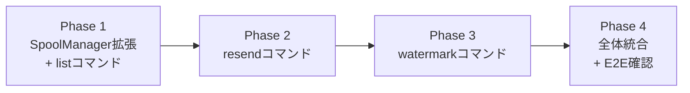
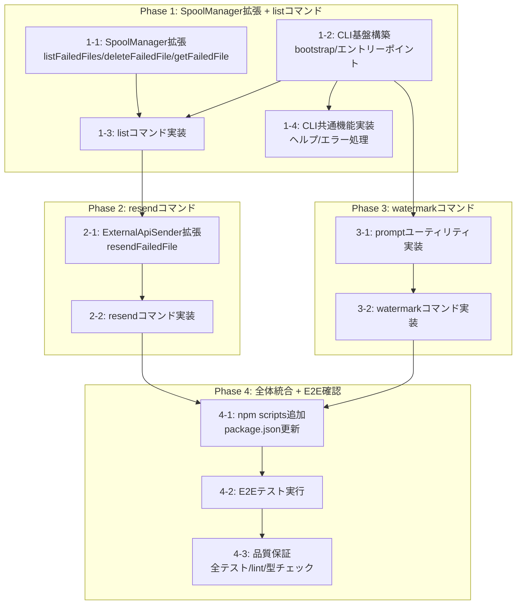

# 作業計画書: 手動再送とウォーターマーク操作CLI

## フェーズ構成図



## タスク依存関係図



## リスクと対策

| リスク | 発生確率 | 影響度 | 対策 | 検知方法 |
|-------|---------|-------|------|---------|
| Commander.js APIの不整合 | 低 | 中 | ADR 012を参照し、公式ドキュメントを確認 | Phase 1の基盤構築時 |
| ExternalApiSender.resendFailedFileとsend()の責務混同 | 中 | 高 | Design Doc記載の「send()との違い」を厳守、スプール保存を含めない | 統合テストで検証 |
| readline/promisesの非同期処理エラー | 低 | 中 | 適切なPromise処理とエラーハンドリング | 統合テストで検証 |
| 環境変数不足によるbootstrap失敗 | 低 | 高 | loadConfig()の既存エラーハンドリングを利用 | Phase 1の動作確認時 |

---

## Phase 1: SpoolManager拡張 + listコマンド

**目的**: CLIの基盤を構築し、失敗ファイル一覧表示機能を実装
**確認レベル**: L2（統合テスト）

### Task 1-1: SpoolManager拡張

**完了条件**:
- [x] listFailedFiles()メソッド実装完了（src/sender/spool-manager.ts）
  - data/failed/からファイルを読み込み、SpoolFile[]を返す
  - firstAttempt昇順でソート
- [x] deleteFailedFile()メソッド実装完了
  - 指定ファイルをdata/failed/から削除
- [x] getFailedFile()メソッド実装完了
  - 指定ファイル名からSpoolFileを取得、存在しない場合はnull
- [x] 単体テスト作成・実行完了
  - テストファイル: src/sender/__tests__/spool-manager.test.ts に追加
  - 対象テストケース: 一覧取得、ソート、削除、単一取得、エラーケース
- [x] 既存のlistSpoolFiles()等のテストが引き続きパスすること

**ACトレーサビリティ**: AC-LIST-1, AC-LIST-2, AC-LIST-3, AC-LIST-4

### Task 1-2: CLI基盤構築

**完了条件**:
- [x] bootstrap.ts実装完了（src/cli/bootstrap.ts）
  - CliDependencies型定義
  - bootstrapCli()関数実装（Design Doc記載のDI構築フロー）
- [x] index.ts実装完了（src/cli/index.ts）
  - Commanderプログラム設定
  - エントリーポイントのエラーハンドリング
- [x] types.ts実装完了（src/cli/types.ts）
  - ResendResult, ResendSummary, FailedFileInfo型定義
- [x] 型チェック・lint通過

**ACトレーサビリティ**: AC-COMMON-1, AC-COMMON-2, AC-COMMON-3

### Task 1-3: listコマンド実装と統合テスト作成

**完了条件**:
- [x] list.ts実装完了（src/cli/commands/list.ts）
  - createListCommand()関数実装
  - ファイル一覧のフォーマット表示
  - 合計ファイル数・レコード数の表示
  - 空ディレクトリ時の「No failed files」メッセージ
- [x] 統合テスト作成・実行完了
  - テストファイル: src/cli/__tests__/integration/list-command.int.test.ts
  - it.todoを全て実装（16件）
- [x] 単体テスト作成・実行完了（コマンドロジック）
  - テストファイル: src/cli/__tests__/commands/list.test.ts
- [x] 全テストパス

**ACトレーサビリティ**: AC-LIST-1, AC-LIST-2, AC-LIST-3, AC-LIST-4

### Task 1-4: CLI共通機能実装と統合テスト作成

**完了条件**:
- [x] --helpオプションが全コマンドで動作
- [x] --versionオプションが動作
- [x] 未知コマンドでエラーメッセージとヘルプ表示
- [x] エラーハンドリング実装（handleError関数）
  - ValidationError、ファイルシステムエラー、ネットワークエラーの分岐
  - DEBUG環境変数でスタックトレース表示切替
- [x] 統合テスト作成・実行完了
  - テストファイル: src/cli/__tests__/integration/common.int.test.ts
  - AC-COMMON関連のit.todoを実装（13件実装済、Phase 2/3用に21件todo）
- [x] exit code検証（成功時0、エラー時1）

**ACトレーサビリティ**: AC-COMMON-1, AC-COMMON-2, AC-COMMON-3

### Phase 1 動作確認手順

```bash
# 1. ビルド確認
npm run build

# 2. テスト実行
npm test -- --run src/sender/__tests__/spool-manager.test.ts
npm test -- --run src/cli/__tests__/integration/list-command.int.test.ts
npm test -- --run src/cli/__tests__/integration/common.int.test.ts

# 3. 手動確認（package.json更新後）
npm run cli -- list
npm run cli -- --help
npm run cli -- --version
npm run cli -- unknown-command  # エラー表示確認
```

---

## Phase 2: resendコマンド

**目的**: 失敗ファイルの手動再送機能を実装
**確認レベル**: L2（統合テスト）

### Task 2-1: ExternalApiSender拡張

**完了条件**:
- [x] resendFailedFile()メソッド実装完了（src/sender/external-api-sender.ts）
  - ExternalApiRecord[]を受け取り、外部APIへ送信
  - スプール保存ロジックを含まない（send()との明確な分離）
  - 200/201/409レスポンスを成功扱い
  - batchIdempotencyKeyの計算（既存calculateBatchKey()を使用）
- [x] 単体テスト作成・実行完了
  - テストファイル: src/sender/__tests__/external-api-sender.test.ts に追加
  - 対象: 送信成功パターン、送信失敗パターン、send()との違い検証
- [x] 既存のsend()、resendSpooled()のテストが引き続きパスすること

**ACトレーサビリティ**: AC-RESEND-2, AC-RESEND-3, AC-RESEND-4, AC-RESEND-5

### Task 2-2: resendコマンド実装と統合テスト作成

**完了条件**:
- [x] resend.ts実装完了（src/cli/commands/resend.ts）
  - createResendCommand()関数実装
  - 引数なし: listFailedFiles()でファイル一覧表示
  - --file オプション: 指定ファイルの再送
  - --all オプション: 全ファイル順次再送
  - 成功時: deleteFailedFile()でファイル削除
  - 失敗時: エラーメッセージ表示、ファイル保持
  - サマリー表示（ResendSummary形式）
- [x] 統合テスト作成・実行完了
  - テストファイル: src/cli/__tests__/integration/resend-command.int.test.ts
  - it.todoを全て実装（36件）
- [x] 単体テスト作成・実行完了（コマンドロジック）
  - テストファイル: src/cli/__tests__/commands/resend.test.ts
- [x] 全テストパス

**ACトレーサビリティ**: AC-RESEND-1, AC-RESEND-2, AC-RESEND-3, AC-RESEND-4, AC-RESEND-5, AC-RESEND-6

### Phase 2 動作確認手順

```bash
# 1. テスト実行
npm test -- --run src/sender/__tests__/external-api-sender.test.ts
npm test -- --run src/cli/__tests__/integration/resend-command.int.test.ts

# 2. 手動確認（テスト用失敗ファイル作成後）
mkdir -p data/failed
echo '{"batchIdempotencyKey":"test123","records":[{"date":"2025-01-20","workspaceId":"ws1","appId":"app1","messageCount":10,"tokenCount":100}],"firstAttempt":"2025-01-20T00:00:00.000Z","retryCount":10,"lastError":"Test error"}' > data/failed/failed_test_test123.json

npm run cli -- resend
npm run cli -- resend --file failed_test_test123.json
npm run cli -- resend --all
```

---

## Phase 3: watermarkコマンド

**目的**: ウォーターマーク表示・リセット機能を実装
**確認レベル**: L2（統合テスト）

### Task 3-1: promptユーティリティ実装

**完了条件**:
- [x] prompt.ts実装完了（src/cli/utils/prompt.ts）
  - confirmPrompt()関数実装
  - Node.js readline/promisesを使用
  - y入力でtrue、それ以外でfalse
- [x] 単体テスト作成・実行完了
  - テストファイル: src/cli/__tests__/utils/prompt.test.ts
  - 対象: y/n入力、空入力、その他入力
- [x] 全テストパス

**ACトレーサビリティ**: AC-WM-3, AC-WM-4, AC-WM-5

### Task 3-2: watermarkコマンド実装と統合テスト作成

**完了条件**:
- [x] watermark.ts実装完了（src/cli/commands/watermark.ts）
  - createWatermarkCommand()関数実装
  - showサブコマンド: load()で現在値表示
  - resetサブコマンド:
    - --date オプション（必須、ISO 8601形式）
    - 現在値と新しい値の表示
    - confirmPrompt()で確認
    - 確認後update()で更新
  - 日時バリデーション（ISO 8601形式チェック）
  - 未設定時の「未設定」メッセージ
- [x] 統合テスト作成・実行完了
  - テストファイル: src/cli/__tests__/integration/watermark-command.int.test.ts
  - 全て実装（29件）
- [x] 単体テスト作成・実行完了（コマンドロジック）
  - テストファイル: src/cli/__tests__/commands/watermark.test.ts
- [x] 全テストパス

**ACトレーサビリティ**: AC-WM-1, AC-WM-2, AC-WM-3, AC-WM-4, AC-WM-5, AC-WM-6

### Phase 3 動作確認手順

```bash
# 1. テスト実行
npm test -- --run src/cli/__tests__/utils/prompt.test.ts
npm test -- --run src/cli/__tests__/integration/watermark-command.int.test.ts

# 2. 手動確認
npm run cli -- watermark show
npm run cli -- watermark reset --date 2025-01-01T00:00:00.000Z
# 確認プロンプトでy入力
npm run cli -- watermark show  # 更新確認

# 3. エラーケース確認
npm run cli -- watermark reset --date invalid-date  # バリデーションエラー
npm run cli -- watermark reset  # --dateオプション未指定エラー
```

---

## Phase 4: 全体統合 + E2E確認

**目的**: 全コマンドの統合確認と品質保証
**確認レベル**: L3（E2E）

### Task 4-1: npm scripts追加

**完了条件**:
- [ ] package.json更新
  - "cli": "npx tsx src/cli/index.ts" 追加
- [ ] commander依存パッケージ追加確認
  - package.jsonにcommander: "^12.x"が含まれていること
- [ ] npm run cli -- --help が正常動作

**ACトレーサビリティ**: 全AC共通

### Task 4-2: E2Eテスト実行

**完了条件**:
- [ ] E2Eテスト実行完了
  - テストファイル: src/cli/__tests__/e2e/cli-commands.e2e.test.ts
  - it.todoを全て実装（36件）
- [ ] Design Doc記載のE2E確認手順を全て実行
  1. セットアップ（テスト用失敗ファイル作成）
  2. listコマンド確認
  3. watermark showコマンド確認
  4. watermark resetコマンド確認
  5. resendコマンド確認
- [ ] 全E2Eテストパス

**ACトレーサビリティ**: 全AC

### Task 4-3: 品質保証

**完了条件**:
- [ ] 全統合テストパス（148件）
  - src/cli/__tests__/integration/list-command.int.test.ts
  - src/cli/__tests__/integration/resend-command.int.test.ts
  - src/cli/__tests__/integration/watermark-command.int.test.ts
  - src/cli/__tests__/integration/common.int.test.ts
- [ ] 全E2Eテストパス（36件）
  - src/cli/__tests__/e2e/cli-commands.e2e.test.ts
- [ ] 全単体テストパス
- [ ] npm run check 通過（Biome lint + format）
- [ ] npm run build 成功（TypeScriptビルド）
- [ ] 受入条件の全チェック完了
  - resendコマンド: AC-RESEND-1〜6（6件）
  - watermarkコマンド: AC-WM-1〜6（6件）
  - listコマンド: AC-LIST-1〜4（4件）
  - 共通: AC-COMMON-1〜3（3件）
  - 合計: 19件のAC全て達成

**ACトレーサビリティ**: 全AC（最終確認）

### Phase 4 動作確認手順

```bash
# 1. 全テスト実行
npm run test:safe

# 2. 品質チェック
npm run check
npm run build

# 3. E2Eシナリオ確認（Design Doc記載手順）
# セットアップ
mkdir -p data/failed
echo '{"batchIdempotencyKey":"test123","records":[{"date":"2025-01-20","workspaceId":"ws1","appId":"app1","messageCount":10,"tokenCount":100}],"firstAttempt":"2025-01-20T00:00:00.000Z","retryCount":10,"lastError":"Test error"}' > data/failed/failed_test_test123.json

# listコマンド確認
npm run cli -- list

# watermark showコマンド確認
npm run cli -- watermark show

# watermark resetコマンド確認
npm run cli -- watermark reset --date 2025-01-01T00:00:00.000Z

# resendコマンド確認
npm run cli -- resend --file failed_test_test123.json

# 4. カバレッジ確認（オプション）
npm run test:coverage:fresh
```

---

## 受入条件サマリー

### resendコマンド（6件）
- [ ] AC-RESEND-1: 引数なし実行でファイル一覧表示
- [ ] AC-RESEND-2: --fileオプションで指定ファイル再送
- [ ] AC-RESEND-3: --allオプションで全ファイル再送
- [ ] AC-RESEND-4: 再送成功時にファイル削除
- [ ] AC-RESEND-5: 再送失敗時にエラー表示・ファイル保持
- [ ] AC-RESEND-6: 処理後にサマリー表示

### watermarkコマンド（6件）
- [ ] AC-WM-1: showでlast_fetched_date/last_updated_at表示
- [ ] AC-WM-2: ファイル未存在時に「未設定」表示
- [ ] AC-WM-3: reset時に確認プロンプト表示
- [ ] AC-WM-4: 確認「y」でウォーターマークリセット
- [ ] AC-WM-5: 確認「y」以外でリセットキャンセル
- [ ] AC-WM-6: 不正日時形式でエラー・exit 1

### listコマンド（4件）
- [ ] AC-LIST-1: 全ファイル一覧表示
- [ ] AC-LIST-2: 各ファイルの詳細情報表示
- [ ] AC-LIST-3: 空ディレクトリで「No failed files」表示
- [ ] AC-LIST-4: 合計ファイル数・レコード数表示

### 共通（3件）
- [ ] AC-COMMON-1: 全コマンドで--helpオプション提供
- [ ] AC-COMMON-2: 未知コマンドでエラー・ヘルプ表示
- [ ] AC-COMMON-3: 成功時exit 0、エラー時exit 1

---

## テストケース解決進捗

| フェーズ | 統合テスト | E2E | 合計 |
|---------|----------|-----|------|
| Phase 1 | 33/33件 | - | 33件 |
| Phase 2 | 36/36件 | - | 36件 |
| Phase 3 | 32/32件 | - | 32件 |
| Phase 4 | - | 36/36件 | 36件 |
| **合計** | 101件 | 36件 | **137件** |

---

## 品質チェックリスト

- [ ] Design Doc整合性確認（全AC対応）
- [ ] 技術的依存関係に基づくフェーズ構成
- [ ] 全要件のタスク化完了
- [ ] 最終フェーズに品質保証の存在
- [ ] 統合ポイントの動作確認手順配置
- [ ] テスト設計情報の反映完了
  - [ ] 各Phaseに対応する統合テストファイルの実装タスク
  - [ ] ACとテストケースのトレーサビリティ明記
  - [ ] テスト解決の定量的進捗指標設定
