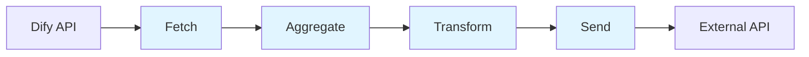
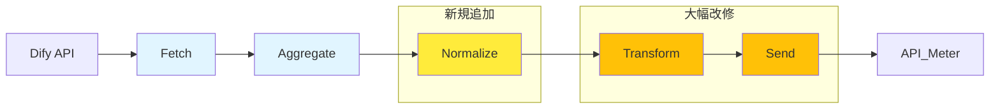
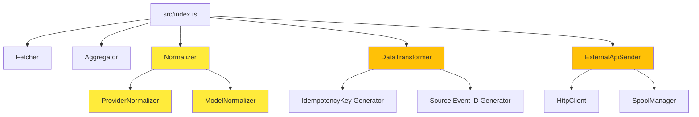

# Design Document: API_Meter新仕様対応

## 1. Overview

### プロジェクト概要

dify-usage-exporterを**API_Meterの新仕様（2025-12-04版）**に対応させるリファクタリングプロジェクト。既存の型システムとデータフローを大幅に変更し、プロバイダー名/モデル名の正規化層を導入する。

### 背景と目的

**背景**:
- API_Meterが新仕様（2025-12-04版）をリリース
- 外部APIへ送信するデータ構造が大幅に変更
- 既存の`ExternalApiRecord`型は新仕様と完全に不一致

**目的**:
- 新仕様に完全準拠したデータ送信機能の実装
- プロバイダー名/モデル名の標準化による精度向上
- 冪等性保証の強化（source_event_id導入）
- 既存スプールファイルとの互換性維持

### スコープ

**変更対象**:
- 型定義の全面刷新（12-15ファイル）
- 正規化層の新規導入
- データ変換ロジックの改修
- 送信層の改修（Bearer Token認証）
- エラーハンドリングの拡張（409 Conflict対応）
- スプール機構の統合（旧形式→新形式変換）

**非スコープ**:
- Dify API取得ロジックの変更（Fetcherは現状維持）
- 集計ロジックの変更（Aggregatorは現状維持）
- スケジューラー・監視機構の変更
- CLI機能の変更（リスト・再送コマンドは現状維持）

### 前提となるADR

- [ADR 013: 正規化層の導入](../../adr/013-normalization-layer-introduction.md)
- [ADR 014: 型システムの完全置き換え](../../adr/014-type-system-replacement.md)
- [ADR 015: データフロー変更](../../adr/015-data-flow-transformation.md)
- [ADR 016: 冪等性機構](../../adr/016-idempotency-mechanism.md)
- [ADR 017: エラーハンドリング戦略](../../adr/017-error-handling-strategy.md)
- [ADR 018: スプール機構統合](../../adr/018-spool-integration.md)
- [ADR 019: 日別集計の実装](../../adr/019-daily-aggregation.md)

---

## 2. 既存アーキテクチャ分析

### 現在のデータフロー



**各層の責務**:
- **Fetch**: Dify APIからトークンコスト・ユーザー別・モデル別データを取得
- **Aggregate**: per_model/per_user/all/per_app/workspaceモードで集計
- **Transform**: ExternalApiRecord形式へ変換、冪等キー生成
- **Send**: 外部APIへ送信、リトライ、スプール保存

### 既存の型定義（src/types/external-api.ts）

```typescript
export const externalApiRecordSchema = z.object({
  date: z.string().regex(/^\d{4}-\d{2}-\d{2}$/),
  app_id: z.string().min(1),
  app_name: z.string().min(1),
  token_count: z.number().int().min(0),
  total_price: z.string(), // "0.0197304"
  currency: z.string().default('USD'),
  idempotency_key: z.string().min(1),
  transformed_at: z.string().datetime(),
})

export type ExternalApiRecord = z.infer<typeof externalApiRecordSchema>
```

### 集計モードの動作

| モード | 集計単位 | 出力 | 実装状況 |
|-------|---------|------|---------|
| per_model | モデル別 | AggregatedModelRecord[] | ✅ 実装済み（優先対応） |
| per_user | ユーザー別 | AggregatedUserRecord[] | ✅ 実装済み（後回し） |
| all | 全体 | 3種類のレコード全て | ✅ 実装済み（優先対応） |
| per_app | アプリ別 | AggregatedAppRecord[] | ✅ 実装済み（後回し） |
| workspace | ワークスペース全体 | AggregatedWorkspaceRecord[] | ✅ 実装済み（後回し） |

**注**: API_Meter新仕様対応は**per_model/allモード**を最優先で実装。per_app/workspace/per_userは後回し。

### 現在の課題

1. **型の不一致**: ExternalApiRecordはAPI_Meter新仕様と完全に不一致
2. **プロバイダー名の非標準化**: aws-bedrock, claude等がDify内部名のまま
3. **モデル名の非標準化**: バージョン番号が欠落（claude-3-5-sonnet等）
4. **トークン内訳の欠如**: input_tokens/output_tokensの分離がない
5. **冪等性キーの形式**: batchIdempotencyKeyのみで、レコード単位のsource_event_idが未実装
6. **エラーハンドリング**: 409 Conflictをエラーとして扱っている

---

## 3. 新旧APIインターフェース比較

### リクエスト構造の差分

| 項目 | 既存（ExternalApiRecord） | 新仕様（ApiMeterRequest） |
|------|-------------------------|-------------------------|
| **トップレベル構造** | バッチ単位 | tenant_id + export_metadata + records |
| **日付フィールド** | `date` (YYYY-MM-DD) | `usage_date` (YYYY-MM-DD) |
| **トークン情報** | `token_count` (合計のみ) | `input_tokens`, `output_tokens`, `total_tokens` |
| **プロバイダー情報** | ❌ なし | `provider` (必須) |
| **モデル情報** | ❌ なし | `model` (必須) |
| **コスト** | `total_price` (文字列) | `cost_actual` (数値) |
| **リクエスト数** | ❌ なし | `request_count` |
| **冪等性キー** | `idempotency_key` (レコード単位) | `metadata.source_event_id` (レコード単位) |
| **バッチ冪等キー** | `batchIdempotencyKey` (トップレベル) | ❌ 削除（スプール管理のみで継続使用） |
| **メタデータ** | `transformed_at` (トップレベル) | `metadata` (ネスト構造) |

### プロバイダー名マッピング変更

| Dify内部名 | API_Meter標準名 | 理由 |
|----------|---------------|------|
| openai | openai | 変更なし |
| anthropic | anthropic | 変更なし |
| google | google | 変更なし |
| aws-bedrock | aws | 企業名を使用（サービス名ではなく） |
| xai, x-ai | xai | 企業名を使用（製品名grokではなく） |
| （不明） | unknown | マッピングテーブル未定義の場合 |

### モデル名の標準化要件

- **バージョン番号を含む公式識別子を使用**
  - ❌ `claude-3-5-sonnet` → ✅ `claude-3-5-sonnet-20241022`
  - ❌ `gpt-4` → ✅ `gpt-4-0613`
  - ❌ `gemini-pro` → ✅ `gemini-1.0-pro`
- 不明なモデルは"unknown"を設定

### 追加フィールド

| フィールド | 型 | 説明 | 既存データからの取得方法 |
|----------|---|------|---------------------|
| `tenant_id` | UUID | API_Meterテナント識別子 | 環境変数 `API_METER_TENANT_ID` |
| `export_metadata` | object | エクスポートメタデータ | 変換時に生成 |
| `export_metadata.exporter_version` | string | エクスポーターバージョン | 固定値 "1.1.0" |
| `export_metadata.export_timestamp` | ISO8601 | エクスポート日時 | 変換時のタイムスタンプ |
| `export_metadata.aggregation_period` | enum | 集計周期 | 固定値 "daily" |
| `export_metadata.date_range` | object | 日付範囲 | レコード群から計算 |
| `provider` | string | プロバイダー名（正規化済み） | 正規化層で生成 |
| `model` | string | モデル名（正規化済み） | 正規化層で生成 |
| `input_tokens` | number | 入力トークン数 | AggregatedModelRecord.prompt_tokens |
| `output_tokens` | number | 出力トークン数 | AggregatedModelRecord.completion_tokens |
| `request_count` | number | リクエスト数 | AggregatedModelRecord.execution_count |
| `metadata.source_system` | string | ソースシステム名 | 固定値 "dify" |
| `metadata.source_event_id` | string | ソースイベントID | SHA256ハッシュ生成 |
| `metadata.aggregation_method` | string | 集計方法 | 固定値 "daily_sum" |

---

## 4. 新アーキテクチャ設計

### 変更後のデータフロー図



**変更点**:
- ✨ **Normalize層を追加**: 集計後、変換前にプロバイダー/モデル名を正規化
- 🔧 **Transform層を改修**: ApiMeterRequest形式への変換
- 🔧 **Send層を改修**: Bearer Token認証、409 Conflict対応

### 正規化層（Normalizer）の設計

#### ProviderNormalizer

```typescript
// src/normalizer/provider-normalizer.ts
export interface ProviderNormalizer {
  normalize(provider: string): string
}

const PROVIDER_MAPPING: Record<string, string> = {
  'openai': 'openai',
  'anthropic': 'anthropic',
  'google': 'google',
  'aws-bedrock': 'aws',
  'xai': 'xai',
  'x-ai': 'xai',
}

export function createProviderNormalizer(): ProviderNormalizer {
  return {
    normalize(provider: string): string {
      const normalized = provider.toLowerCase().trim()
      return PROVIDER_MAPPING[normalized] || 'unknown'
    }
  }
}
```

#### ModelNormalizer

```typescript
// src/normalizer/model-normalizer.ts
export interface ModelNormalizer {
  normalize(model: string): string
}

const MODEL_MAPPING: Record<string, string> = {
  'claude-3-5-sonnet': 'claude-3-5-sonnet-20241022',
  'gpt-4': 'gpt-4-0613',
  'gemini-pro': 'gemini-1.0-pro',
  // 追加のマッピング
}

export function createModelNormalizer(): ModelNormalizer {
  return {
    normalize(model: string): string {
      const normalized = model.toLowerCase().trim()
      return MODEL_MAPPING[normalized] || model // 不明な場合はそのまま
    }
  }
}
```

#### Normalizer統合

```typescript
// src/normalizer/normalizer.ts
export interface INormalizer {
  normalizeRecords(records: AggregatedModelRecord[]): NormalizedModelRecord[]
}

export interface NormalizedModelRecord {
  period: string // YYYY-MM-DD
  period_type: AggregationPeriod
  user_id: string
  user_type: 'end_user' | 'account'
  app_id: string
  app_name: string
  model_provider: string  // 正規化済み
  model_name: string      // 正規化済み
  prompt_tokens: number
  completion_tokens: number
  total_tokens: number
  prompt_price: string
  completion_price: string
  total_price: string
  currency: string
  execution_count: number
}

export function createNormalizer(deps: {
  providerNormalizer: ProviderNormalizer
  modelNormalizer: ModelNormalizer
  logger: Logger
}): INormalizer {
  return {
    normalizeRecords(records: AggregatedModelRecord[]): NormalizedModelRecord[] {
      return records.map(record => ({
        ...record,
        model_provider: deps.providerNormalizer.normalize(record.model_provider),
        model_name: deps.modelNormalizer.normalize(record.model_name),
      }))
    }
  }
}
```

### 新型定義（ApiMeterUsageRecord）

```typescript
// src/types/api-meter-schema.ts（新規ファイル）

// トップレベルリクエスト
export const apiMeterRequestSchema = z.object({
  tenant_id: z.string().uuid(),
  export_metadata: z.object({
    exporter_version: z.string().default('1.1.0'),
    export_timestamp: z.string().datetime(),
    aggregation_period: z.enum(['daily', 'weekly', 'monthly']),
    date_range: z.object({
      start: z.string().datetime(),
      end: z.string().datetime(),
    }),
  }),
  records: z.array(apiMeterUsageRecordSchema),
})

// レコード（個別）
export const apiMeterUsageRecordSchema = z.object({
  usage_date: z.string().regex(/^\d{4}-\d{2}-\d{2}$/),
  provider: z.string().min(1),
  model: z.string().min(1),
  input_tokens: z.number().int().min(0),
  output_tokens: z.number().int().min(0),
  total_tokens: z.number().int().min(0),
  request_count: z.number().int().min(0),
  cost_actual: z.number().min(0),
  currency: z.string().default('USD'),
  metadata: z.object({
    source_system: z.literal('dify'),
    source_event_id: z.string().min(1),
    source_app_id: z.string().optional(),
    source_app_name: z.string().optional(),
    aggregation_method: z.string().default('daily_sum'),
    time_range: z.object({
      start: z.string().datetime(),
      end: z.string().datetime(),
    }).optional(),
  }),
})
// トークン検証
.refine(
  (data) => data.total_tokens === data.input_tokens + data.output_tokens,
  {
    message: 'total_tokens must equal input_tokens + output_tokens',
    path: ['total_tokens'],
  }
)

export type ApiMeterRequest = z.infer<typeof apiMeterRequestSchema>
export type ApiMeterUsageRecord = z.infer<typeof apiMeterUsageRecordSchema>
```

### コンポーネント関係図



---

## 5. プロバイダー/モデル名正規化ロジック

### マッピングテーブル詳細

#### プロバイダー名マッピング

```typescript
// src/normalizer/provider-normalizer.ts
const PROVIDER_MAPPING: Record<string, string> = {
  // 変更なし
  'openai': 'openai',
  'anthropic': 'anthropic',
  'google': 'google',

  // 企業名への標準化
  'aws-bedrock': 'aws',
  'aws': 'aws',

  // xai統一
  'xai': 'xai',
  'x-ai': 'xai',
  'grok': 'xai', // 製品名→企業名

  // その他の可能性（将来追加）
  'cohere': 'cohere',
  'mistral': 'mistral',
  'meta': 'meta',
}
```

#### モデル名マッピング

```typescript
// src/normalizer/model-normalizer.ts
const MODEL_MAPPING: Record<string, string> = {
  // Anthropic Claude
  'claude-3-5-sonnet': 'claude-3-5-sonnet-20241022',
  'claude-3-sonnet': 'claude-3-sonnet-20240229',
  'claude-3-opus': 'claude-3-opus-20240229',
  'claude-3-haiku': 'claude-3-haiku-20240307',

  // OpenAI GPT-4
  'gpt-4': 'gpt-4-0613',
  'gpt-4-turbo': 'gpt-4-turbo-2024-04-09',
  'gpt-4o': 'gpt-4o-2024-08-06',

  // OpenAI GPT-3.5
  'gpt-3.5-turbo': 'gpt-3.5-turbo-0125',

  // Google Gemini
  'gemini-pro': 'gemini-1.0-pro',
  'gemini-1.5-pro': 'gemini-1.5-pro-002',

  // AWS Bedrock Claude
  'anthropic.claude-3-5-sonnet-20241022-v2:0': 'claude-3-5-sonnet-20241022',

  // 必要に応じて追加
}
```

### 不明なプロバイダー/モデルの扱い

**ProviderNormalizer**:
```typescript
normalize(provider: string): string {
  const normalized = provider.toLowerCase().trim()
  return PROVIDER_MAPPING[normalized] || 'unknown'
}
```

**ModelNormalizer**:
```typescript
normalize(model: string): string {
  const normalized = model.toLowerCase().trim()
  return MODEL_MAPPING[normalized] || model // そのまま使用
}
```

**動作例**:
- `aws-bedrock` → `aws` ✅
- `unknown-provider` → `unknown` ✅
- `claude-3-5-sonnet` → `claude-3-5-sonnet-20241022` ✅
- `custom-model-v1` → `custom-model-v1` ✅（そのまま）

### 検証ロジック

```typescript
// src/normalizer/__tests__/provider-normalizer.test.ts
describe('ProviderNormalizer', () => {
  it('正規化: aws-bedrock → aws', () => {
    const normalizer = createProviderNormalizer()
    expect(normalizer.normalize('aws-bedrock')).toBe('aws')
  })

  it('大文字小文字: AWS-BEDROCK → aws', () => {
    const normalizer = createProviderNormalizer()
    expect(normalizer.normalize('AWS-BEDROCK')).toBe('aws')
  })

  it('空白除去: " aws-bedrock " → aws', () => {
    const normalizer = createProviderNormalizer()
    expect(normalizer.normalize(' aws-bedrock ')).toBe('aws')
  })

  it('不明なプロバイダー → unknown', () => {
    const normalizer = createProviderNormalizer()
    expect(normalizer.normalize('custom-provider')).toBe('unknown')
  })
})
```

---

## 6. 集計モード統合方法

### per_model → API_Meter形式への変換

**変換フロー**:
```
AggregatedModelRecord → NormalizedModelRecord → ApiMeterUsageRecord
```

**実装**:
```typescript
// src/transformer/data-transformer.ts
export function createDataTransformer(deps: TransformerDeps): ITransformer {
  return {
    transform(records: NormalizedModelRecord[]): TransformResult {
      const apiMeterRecords: ApiMeterUsageRecord[] = []

      for (const record of records) {
        const sourceEventId = generateSourceEventId({
          usage_date: record.period,
          provider: record.model_provider,
          model: record.model_name,
          app_id: record.app_id,
          user_id: record.user_id,
        })

        const apiMeterRecord: ApiMeterUsageRecord = {
          usage_date: record.period,
          provider: record.model_provider,
          model: record.model_name,
          input_tokens: record.prompt_tokens,
          output_tokens: record.completion_tokens,
          total_tokens: record.total_tokens,
          request_count: record.execution_count,
          cost_actual: parseFloat(record.total_price),
          currency: record.currency,
          metadata: {
            source_system: 'dify',
            source_event_id: sourceEventId,
            source_app_id: record.app_id,
            source_app_name: record.app_name,
            aggregation_method: 'daily_sum',
          },
        }

        apiMeterRecords.push(apiMeterRecord)
      }

      const apiMeterRequest: ApiMeterRequest = {
        tenant_id: deps.config.API_METER_TENANT_ID,
        export_metadata: {
          exporter_version: '1.1.0',
          export_timestamp: getCurrentISOTimestamp(),
          aggregation_period: 'daily',
          date_range: {
            start: getDateRangeStart(records),
            end: getDateRangeEnd(records),
          },
        },
        records: apiMeterRecords,
      }

      return {
        request: apiMeterRequest,
        successCount: apiMeterRecords.length,
        errorCount: 0,
        errors: [],
      }
    }
  }
}
```

### per_user/per_app/workspace → 後回し

**理由**:
- API_Meter新仕様はprovider/modelを必須としており、per_user/per_app/workspaceモードでは取得できない
- per_model/allモードを最優先で実装
- per_user/per_app/workspaceは将来的な拡張として検討

**実装方針**:
```typescript
// src/index.ts
if (config.DIFY_OUTPUT_MODE === 'per_model' || config.DIFY_OUTPUT_MODE === 'all') {
  // per_model/allモードのみAPI_Meterへ送信
  const dailyRecords = aggregationResult.modelRecords.filter(
    record => record.period_type === 'daily'
  )

  if (dailyRecords.length > 0) {
    const normalizedRecords = normalizer.normalizeRecords(dailyRecords)
    const transformResult = transformer.transform(normalizedRecords)
    await sender.send(transformResult)
  } else {
    logger.warn('No daily records for API_Meter', {
      aggregationPeriod: config.DIFY_AGGREGATION_PERIOD,
    })
  }
} else {
  logger.info('Skipping API_Meter send (per_user/per_app/workspace mode)', {
    outputMode: config.DIFY_OUTPUT_MODE,
  })
}
```

### 優先順位

| 優先度 | モード | 実装時期 | 理由 |
|-------|-------|---------|------|
| 🔥 最優先 | per_model | Phase 1-4 | API_Meter新仕様の必須フィールド（provider/model）を含む |
| 🔥 最優先 | all | Phase 1-4 | per_modelを含む全集計を実行 |
| ⏳ 後回し | per_user | Phase 5以降 | provider/model情報がない |
| ⏳ 後回し | per_app | Phase 5以降 | provider/model情報がない |
| ⏳ 後回し | workspace | Phase 5以降 | provider/model情報がない |

---

## 7. データフロー詳細

### Fetch: Dify APIからデータ取得

**責務**: Dify APIから使用量データを取得

**入力**:
- 期間指定（start_date, end_date）
- 環境変数（DIFY_API_URL, DIFY_API_KEY）

**出力**:
- `RawModelUsageRecord[]`（モデル別）
- `RawUserUsageRecord[]`（ユーザー別）
- `RawTokenCostRecord[]`（アプリ別）

**変更**: なし（現状維持）

### Aggregate: 日別・モデル別集計

**責務**: データを日別・モデル別に集計

**入力**:
- `RawModelUsageRecord[]`
- `AggregationPeriod`（daily/weekly/monthly）
- `OutputMode`（per_model/per_user/all/per_app/workspace）

**出力**:
- `AggregatedModelRecord[]`（per_model/all時）
- `AggregatedUserRecord[]`（per_user/all時）
- `AggregatedAppRecord[]`（per_app時）
- `AggregatedWorkspaceRecord[]`（workspace時）

**変更**: なし（現状維持）

### Normalize: プロバイダー/モデル名の正規化

**責務**: プロバイダー名・モデル名を標準化

**入力**: `AggregatedModelRecord[]`

**処理**:
1. プロバイダー名の正規化（aws-bedrock → aws）
2. モデル名の正規化（claude-3-5-sonnet → claude-3-5-sonnet-20241022）

**出力**: `NormalizedModelRecord[]`

**実装**:
```typescript
// src/normalizer/normalizer.ts
export function createNormalizer(deps: {
  providerNormalizer: ProviderNormalizer
  modelNormalizer: ModelNormalizer
  logger: Logger
}): INormalizer {
  return {
    normalizeRecords(records: AggregatedModelRecord[]): NormalizedModelRecord[] {
      return records.map(record => {
        const normalizedProvider = deps.providerNormalizer.normalize(record.model_provider)
        const normalizedModel = deps.modelNormalizer.normalize(record.model_name)

        deps.logger.debug('Normalizing record', {
          original: { provider: record.model_provider, model: record.model_name },
          normalized: { provider: normalizedProvider, model: normalizedModel },
        })

        return {
          ...record,
          model_provider: normalizedProvider,
          model_name: normalizedModel,
        }
      })
    }
  }
}
```

### Transform: API_Meter形式への変換

**責務**: NormalizedModelRecordをApiMeterRequest形式へ変換

**入力**: `NormalizedModelRecord[]`

**処理**:
1. source_event_id生成（SHA256ハッシュ）
2. ApiMeterUsageRecordへの変換
3. ApiMeterRequestの構築（tenant_id, export_metadata付与）
4. トークン計算検証（total_tokens = input_tokens + output_tokens）

**出力**: `TransformResult`（ApiMeterRequest + エラー情報）

**実装**: 「6. 集計モード統合方法」参照

### Send: Bearer Token認証、バッチ送信

**責務**: API_MeterへHTTP POST送信、リトライ、スプール保存

**入力**: `ApiMeterRequest`

**処理**:
1. Bearer Token認証（Authorization: Bearer {API_METER_TOKEN}）
2. POST /v1/usage へ送信
3. リトライ（429, 5xx系）
4. 409 Conflictを成功として扱う
5. リトライ上限到達時はスプール保存

**出力**: void（送信成功）またはエラースロー

**実装**:
```typescript
// src/sender/http-client.ts
constructor(private readonly logger: Logger, config: EnvConfig) {
  this.client = axios.create({
    baseURL: config.API_METER_URL,
    timeout: config.API_METER_TIMEOUT_MS,
    headers: {
      'Content-Type': 'application/json',
      Authorization: `Bearer ${config.API_METER_TOKEN}`,
      'User-Agent': 'dify-usage-exporter/1.1.0',
    },
  })

  axiosRetry(this.client, {
    retries: config.MAX_RETRIES,
    retryDelay: axiosRetry.exponentialDelay, // 1s → 2s → 4s
    retryCondition: (error: AxiosError) => {
      const status = error.response?.status
      if (status && [200, 201, 204].includes(status)) {
        return false // 成功扱い、リトライしない
      }
      if (status === 429 || (status && status >= 500)) {
        return true // リトライ対象
      }
      if (axiosRetry.isNetworkError(error)) {
        return true // ネットワークエラーもリトライ
      }
      return false // その他（400, 401, 403, 404, 422）はリトライしない
    },
  })
}
```

**エラーハンドリング**（詳細は「8. エラーハンドリング設計」参照）

---

## 8. エラーハンドリング設計

### HTTPステータスコード別処理

**注**: API_Meterチームからの確認（2025-12-04）により、409 Conflictは返されないことが判明。冪等性は内部的にUPSERTで処理され、常に200 OKを返す。

| ステータスコード | 分類 | 処理 | リトライ |
|---------------|------|------|---------|
| 200, 201, 204 | 成功 | メトリクス更新（sendSuccess++）、inserted/updated確認 | なし |
| 400 Bad Request | クライアントエラー | エラーログ、スプール保存 | なし |
| 401 Unauthorized | 認証エラー | エラーログ、即座に失敗 | なし |
| 403 Forbidden | 認可エラー | エラーログ、即座に失敗 | なし |
| 404 Not Found | エンドポイントエラー | エラーログ、即座に失敗 | なし |
| 422 Unprocessable Entity | バリデーションエラー | エラーログ、スプール保存 | なし |
| 429 Too Many Requests | Rate Limit | 警告ログ、リトライ | あり（指数バックオフ） |
| 500 Internal Server Error | サーバーエラー | エラーログ、リトライ | あり |
| 502 Bad Gateway | ゲートウェイエラー | エラーログ、リトライ | あり |
| 503 Service Unavailable | サービス停止 | エラーログ、リトライ | あり |
| 504 Gateway Timeout | タイムアウト | エラーログ、リトライ | あり |

### API_Meter冪等性の理解（API_Meterチーム確認済み）

**API_Meterチームからの確認（2025-12-04）**:
- **冪等性キー**: `(tenant_id, provider_id, model_id, usage_date)`
- **動作**: 同じ冪等性キーのレコードを再送すると、`ON CONFLICT DO UPDATE`で上書き
- **レスポンス**: 常に`200 OK`を返す（409 Conflictは返さない）
  - 初回送信（INSERT）→ 200 OK (inserted=1, updated=0)
  - 再送信（UPDATE）→ 200 OK (inserted=0, updated=1)
- **source_event_id**: トレーサビリティ専用（冪等性判定には使用しない）

**実装**:
```typescript
// src/sender/external-api-sender.ts
async sendToExternalApi(request: ApiMeterRequest): Promise<void> {
  try {
    const response = await this.httpClient.post('/v1/usage', request)

    // 200 OKレスポンス: 成功（INSERT/UPDATE両方を含む）
    if (response.status === 200) {
      const result = response.data
      this.metrics.sendSuccess += request.records.length
      this.logger.info('Send success', {
        recordCount: request.records.length,
        inserted: result.inserted,  // INSERT件数
        updated: result.updated,    // UPDATE件数（冪等性による上書き）
      })
      return
    }

    // その他の成功ステータス
    if ([201, 204].includes(response.status)) {
      this.metrics.sendSuccess += request.records.length
      this.logger.info('Send success', { recordCount: request.records.length })
      return
    }
  } catch (error) {
    // エラーはaxios-retryで自動リトライまたは例外スロー
    throw error
  }
}
```

### 指数バックオフのロジック

**設定**:
- 初回リトライ: 1秒後
- 2回目リトライ: 2秒後（2^1）
- 3回目リトライ: 4秒後（2^2）
- 最大リトライ回数: 3回（環境変数 `MAX_RETRIES` で調整可能）

**実装**:
```typescript
// src/sender/http-client.ts
axiosRetry(this.client, {
  retries: config.MAX_RETRIES, // デフォルト3回
  retryDelay: (retryCount, error) => {
    // Retry-Afterヘッダーがある場合は尊重
    const retryAfter = error.response?.headers['retry-after']
    if (retryAfter) {
      const delay = parseInt(retryAfter, 10) * 1000 // 秒→ミリ秒
      if (!isNaN(delay)) {
        this.logger.info('Respecting Retry-After header', { delay: `${delay}ms` })
        return delay
      }
    }

    // 指数バックオフ（デフォルト）
    return axiosRetry.exponentialDelay(retryCount, error)
  },
  onRetry: (retryCount, error, requestConfig) => {
    this.logger.warn('Retrying request', {
      retryCount,
      url: requestConfig.url,
      status: error.response?.status,
      message: error.message,
      delay: `${2 ** retryCount}s`, // 1s, 2s, 4s
    })
  },
})
```

### リトライ可否判定

```typescript
retryCondition: (error: AxiosError) => {
  const status = error.response?.status

  // 成功扱い（リトライしない）: 200, 201, 204
  if (status && [200, 201, 204].includes(status)) {
    return false
  }

  // リトライ対象: 429（Rate Limit）, 5xx（Server Error）
  if (status === 429 || (status && status >= 500)) {
    return true
  }

  // ネットワークエラー（ECONNREFUSED, ETIMEDOUT等）: リトライ
  if (axiosRetry.isNetworkError(error)) {
    return true
  }

  // その他（400, 401, 403, 404, 422等）: リトライしない
  return false
}
```

---

## 9. スプール機構統合

### 旧形式スプールファイルの検出

**検出フロー**:
```typescript
// src/sender/spool-manager.ts
async listSpoolFiles(): Promise<SpoolFile[]> {
  const files = await fs.readdir(this.spoolDir)
  const spoolFiles: SpoolFile[] = []

  for (const file of files) {
    if (!file.startsWith('spool_')) continue

    const filePath = `${this.spoolDir}/${file}`
    const content = await fs.readFile(filePath, 'utf-8')
    const data: unknown = JSON.parse(content)

    // 新形式のバリデーション
    const parseResult = spoolFileSchema.safeParse(data)
    if (parseResult.success) {
      spoolFiles.push(parseResult.data)
      continue
    }

    // 旧形式のバリデーション
    const legacyParseResult = legacySpoolFileSchema.safeParse(data)
    if (legacyParseResult.success) {
      // 旧形式を新形式へ変換
      const convertedFile = convertLegacySpoolFile(legacyParseResult.data)
      if (convertedFile) {
        spoolFiles.push(convertedFile)
        this.logger.warn('Legacy spool file converted', { filePath })
        continue
      }
    }

    // 両形式でバリデーション失敗 → data/failed/へ移動
    this.logger.error('Corrupted spool file detected', { filePath })
    await this.moveToFailed(data as SpoolFile)
  }

  return spoolFiles.sort(
    (a, b) => new Date(a.firstAttempt).getTime() - new Date(b.firstAttempt).getTime()
  )
}
```

### 新形式への変換ロジック

```typescript
// src/sender/spool-manager.ts
function convertLegacySpoolFile(legacyFile: LegacySpoolFile): SpoolFile | null {
  try {
    const newRecords: ApiMeterUsageRecord[] = []

    for (const legacyRecord of legacyFile.records) {
      // 旧形式レコードから新形式へ変換
      const newRecord: ApiMeterUsageRecord = {
        usage_date: legacyRecord.date,
        provider: 'unknown', // 旧形式にはprovider情報なし
        model: 'unknown', // 旧形式にはmodel情報なし
        input_tokens: 0, // 旧形式にはトークン内訳なし
        output_tokens: 0,
        total_tokens: legacyRecord.token_count,
        request_count: 1, // 旧形式にはリクエスト数なし
        cost_actual: parseFloat(legacyRecord.total_price),
        currency: legacyRecord.currency,
        metadata: {
          source_system: 'dify',
          source_event_id: legacyRecord.idempotency_key, // 既存冪等キーを流用
          source_app_id: legacyRecord.app_id,
          source_app_name: legacyRecord.app_name,
          aggregation_method: 'legacy_conversion',
        },
      }

      newRecords.push(newRecord)
    }

    // 新形式スプールファイルを生成
    const newSpoolFile: SpoolFile = {
      batchIdempotencyKey: legacyFile.batchIdempotencyKey,
      request: {
        tenant_id: config.API_METER_TENANT_ID, // 環境変数から取得
        export_metadata: {
          exporter_version: '1.1.0',
          export_timestamp: getCurrentISOTimestamp(),
          aggregation_period: 'daily',
          date_range: {
            start: getDateRangeStart(newRecords),
            end: getDateRangeEnd(newRecords),
          },
        },
        records: newRecords,
      },
      firstAttempt: legacyFile.firstAttempt,
      retryCount: legacyFile.retryCount,
      lastError: legacyFile.lastError,
    }

    return newSpoolFile
  } catch (error) {
    logger.error('Failed to convert legacy spool file', { error })
    return null
  }
}
```

### 欠損データの補完

| 旧形式フィールド | 新形式フィールド | 変換方法 |
|--------------|--------------|---------|
| date | usage_date | そのまま使用 |
| app_id | metadata.source_app_id | そのまま使用 |
| app_name | metadata.source_app_name | そのまま使用 |
| token_count | total_tokens | そのまま使用 |
| total_price | cost_actual | parseFloat()で数値変換 |
| currency | currency | そのまま使用 |
| idempotency_key | metadata.source_event_id | 既存冪等キーを流用 |
| （なし） | provider | "unknown"を設定 |
| （なし） | model | "unknown"を設定 |
| （なし） | input_tokens | 0を設定 |
| （なし） | output_tokens | 0を設定 |
| （なし） | request_count | 1を設定（推定値） |
| （なし） | metadata.aggregation_method | "legacy_conversion"を設定 |

**重要**: 旧形式スプールファイルのprovider/modelは"unknown"で送信され、API_Meter側で受け入れられる（要件4-B）。

---

## 10. マイグレーション戦略

### Phase 1: 型定義・正規化層実装（Day 1-2）

**作業内容**:
1. 新型定義ファイルの作成
   - `src/types/api-meter-schema.ts`（新規）
   - `ApiMeterRequest`, `ApiMeterUsageRecord`の定義
   - zodスキーマでバリデーション強化
2. 正規化層の実装
   - `src/normalizer/provider-normalizer.ts`（新規）
   - `src/normalizer/model-normalizer.ts`（新規）
   - `src/normalizer/normalizer.ts`（新規）
   - マッピングテーブルの定義
3. 環境変数の追加
   - `API_METER_TENANT_ID`, `API_METER_TOKEN`, `API_METER_URL`
   - `src/types/env.ts`の更新
4. ユニットテスト作成
   - 正規化層のテスト（マッピング、大文字小文字、空白除去）
   - zodスキーマのテスト（total_tokens検証）

**完了基準**:
- [ ] 新型定義ファイルが作成され、zodスキーマが動作する
- [ ] 正規化層のユニットテストが全てパスする
- [ ] 環境変数が追加され、読み込まれる

### Phase 2: 変換層改修（Day 3-4）

**作業内容**:
1. データ変換ロジックの改修
   - `src/transformer/data-transformer.ts`を`ApiMeterRequest`形式に対応
   - source_event_id生成ロジックの実装
   - `src/transformer/idempotency-key.ts`に`generateSourceEventId()`追加
2. 日付範囲計算の実装
   - `getDateRangeStart()`, `getDateRangeEnd()`関数の実装
3. トークン計算検証の実装
   - total_tokens = input_tokens + output_tokensの検証
4. ユニットテスト更新
   - 変換ロジックのテスト（新形式への変換）
   - source_event_id生成のテスト（決定論的ID生成、衝突耐性）
   - 日付範囲計算のテスト

**完了基準**:
- [ ] DataTransformerが`ApiMeterRequest`を出力する
- [ ] source_event_idが正しく生成される（同一データから同じID）
- [ ] 変換層のユニットテストが全てパスする

### Phase 3: 送信層改修（Day 5-6）

**作業内容**:
1. HTTPクライアントの更新
   - `src/sender/http-client.ts`をBearer Token認証に対応
   - リトライ条件の更新（409 Conflictを成功として扱う）
   - Retry-Afterヘッダーの尊重
2. 送信層の更新
   - `src/sender/external-api-sender.ts`を`ApiMeterRequest`送信に対応
   - 409 Conflictのハンドリング追加
   - エラーメッセージの詳細化
3. スプール機構の更新
   - `src/types/spool.ts`に`legacySpoolFileSchema`追加
   - `src/sender/spool-manager.ts`に変換ロジック追加
4. ユニットテスト更新
   - HTTPクライアントのテスト（リトライ条件、409 Conflict）
   - 送信層のテスト（新形式送信）
   - スプール機構のテスト（旧形式→新形式変換）

**完了基準**:
- [ ] HTTPクライアントがBearer Token認証で送信する
- [ ] 409 Conflictが成功として扱われる
- [ ] 旧形式スプールファイルが新形式へ変換される
- [ ] 送信層のユニットテストが全てパスする

### Phase 4: 統合テスト（Day 7-8）

**作業内容**:
1. データフロー全体の統合
   - `src/index.ts`の更新（正規化層の追加）
   - 日別データのフィルタリング
   - per_model/allモードの優先実装
2. 統合テストの実施
   - Fetch → Aggregate → Normalize → Transform → Sendの全体フロー
   - 各集計モード（per_model, all）のE2Eテスト
   - エラーハンドリングの統合テスト
3. API_Meter Sandbox環境でのテスト
   - 実際のAPI_Meterへの送信テスト
   - 409 Conflictの動作確認
   - リトライ・スプール機構の動作確認

**完了基準**:
- [ ] データフロー全体が正常に動作する
- [ ] per_model/allモードで正しいデータがAPI_Meterへ送信される
- [ ] 統合テストが全てパスする
- [ ] API_Meter Sandbox環境で送信成功を確認

### Phase 5: 品質保証（Day 9-10）

**作業内容**:
1. コードレビュー
   - 全変更ファイルのレビュー
   - TypeScript規約への準拠確認
   - エラーハンドリングの網羅性確認
2. ドキュメント更新
   - README.mdの更新（環境変数、使用方法）
   - 既存ADRの更新（ステータス変更: Proposed → Accepted）
3. パフォーマンステスト
   - バッチサイズ100-500レコードでの負荷テスト
   - 正規化層のパフォーマンス測定
4. ロールバックプラン作成
   - 旧バージョンへの切り戻し手順
   - 旧形式スプールファイルの保持確認

**完了基準**:
- [ ] コードレビューが完了し、指摘事項がゼロ
- [ ] ドキュメントが更新され、最新の状態
- [ ] パフォーマンステストが合格基準をクリア
- [ ] ロールバックプランが作成され、レビュー済み

---

## 11. 受入条件（Acceptance Criteria）

### AC-1: プロバイダー名正規化（REQ-001）

**契機型**: ユーザーが集計コマンドを実行したとき、システムは全レコードのプロバイダー名を標準化すること

**検証方法**:
- [ ] `aws-bedrock` → `aws` に正規化される
- [ ] `xai`, `x-ai` → `xai` に正規化される
- [ ] 大文字小文字が統一される（`AWS-BEDROCK` → `aws`）
- [ ] 前後空白が除去される（`" aws-bedrock "` → `aws`）
- [ ] 不明なプロバイダーは `unknown` になる

**テストデータ**:
```json
{
  "model_provider": "aws-bedrock",
  "model_name": "claude-3-5-sonnet"
}
```

**期待結果**:
```json
{
  "provider": "aws",
  "model": "claude-3-5-sonnet-20241022"
}
```

### AC-2: モデル名標準化（REQ-002）

**契機型**: ユーザーが集計コマンドを実行したとき、システムは全レコードのモデル名を標準化すること

**検証方法**:
- [ ] `claude-3-5-sonnet` → `claude-3-5-sonnet-20241022` に正規化される
- [ ] `gpt-4` → `gpt-4-0613` に正規化される
- [ ] 不明なモデルはそのまま維持される

### AC-3: トークン計算検証（REQ-003）

**契機型**: ユーザーが集計コマンドを実行したとき、システムはtotal_tokensがinput_tokens + output_tokensと一致することを検証すること

**検証方法**:
- [ ] total_tokens = input_tokens + output_tokensが成立する
- [ ] 不一致時はバリデーションエラーが発生する

**テストデータ**:
```json
{
  "input_tokens": 10000,
  "output_tokens": 5000,
  "total_tokens": 15000
}
```

**期待結果**: バリデーション成功（15000 = 10000 + 5000）

### AC-4: Bearer Token認証（REQ-004）

**契機型**: システムがAPI_Meterへ送信するとき、Bearer Token認証を使用すること

**検証方法**:
- [ ] Authorizationヘッダーに`Bearer {API_METER_TOKEN}`が含まれる
- [ ] 401 Unauthorizedが返された場合、エラーログを出力する

### AC-5: source_event_id生成（REQ-005）

**契機型**: システムがデータ変換を行うとき、各レコードに決定論的なsource_event_idを生成すること

**検証方法**:
- [ ] 同一データから常に同じsource_event_idが生成される
- [ ] フォーマットが`dify-{usage_date}-{provider}-{model}-{hash12}`に準拠する
- [ ] ハッシュ部分が12文字の16進数である

**テストデータ**:
```json
{
  "usage_date": "2025-11-29",
  "provider": "anthropic",
  "model": "claude-3-5-sonnet-20241022",
  "app_id": "abc123",
  "user_id": "user001"
}
```

**期待結果**: `dify-2025-11-29-anthropic-claude-3-5-sonnet-20241022-a3f2e1b9c4d5`

### AC-6: エラーハンドリング（REQ-006）

**不測型**: もしAPI_Meterが429 Too Many Requestsを返した場合、システムは指数バックオフでリトライすること

**検証方法**:
- [ ] 429受信時、1s → 2s → 4sでリトライする
- [ ] 最大3回リトライする
- [ ] Retry-Afterヘッダーがあれば優先する

**不測型**: もしAPI_Meterが409 Conflictを返した場合、システムは成功として扱うこと

**検証方法**:
- [ ] 409受信時、警告ログを出力する
- [ ] sendSuccess メトリクスがインクリメントされる
- [ ] リトライしない

**不測型**: もしAPI_Meterが5xxを返した場合、システムは指数バックオフでリトライすること

**検証方法**:
- [ ] 500, 502, 503, 504受信時、リトライする
- [ ] 最大3回リトライする

**不測型**: もしAPI_Meterが400, 401, 403, 404, 422を返した場合、システムはリトライせずスプール保存すること

**検証方法**:
- [ ] リトライしない
- [ ] エラーログを出力する
- [ ] スプールファイルに保存する（リトライ上限到達時）

### AC-7: バッチサイズ管理（REQ-007）

**遍在型**: システムはバッチサイズを100-500レコードの範囲で管理すること

**検証方法**:
- [ ] 環境変数`BATCH_SIZE`が設定可能である
- [ ] デフォルト値が100である
- [ ] 500レコードを超える場合、複数バッチに分割される

### AC-8: メタデータ充実化（REQ-008）

**遍在型**: システムはすべてのレコードに以下のメタデータを付与すること

**検証方法**:
- [ ] `metadata.source_system = "dify"`
- [ ] `metadata.source_event_id`が存在する
- [ ] `metadata.aggregation_method = "daily_sum"`
- [ ] `metadata.source_app_id`が存在する（オプション）
- [ ] `metadata.source_app_name`が存在する（オプション）

### AC-9: 日付フォーマット標準化（REQ-009）

**遍在型**: システムはすべての日付フィールドを標準形式で送信すること

**検証方法**:
- [ ] `usage_date`が`YYYY-MM-DD`形式である
- [ ] `export_metadata.export_timestamp`がISO8601形式である
- [ ] `date_range.start/end`がISO8601形式である

### AC-10: コスト計算（REQ-010）

**遍在型**: システムはcost_actualを正確に計算すること

**検証方法**:
- [ ] `cost_actual`が数値型である
- [ ] 小数点以下7桁まで精度を保持する（例: 0.1050000）
- [ ] `total_price`（文字列）から`cost_actual`（数値）へ正しく変換される

### AC-11: 統合テスト

**契機型**: ユーザーが集計コマンドを実行したとき、システムはFetch → Aggregate → Normalize → Transform → Sendのデータフロー全体が正常に動作すること

**検証方法**:
- [ ] Dify APIから正常にデータを取得する
- [ ] 日別・モデル別に集計される
- [ ] プロバイダー/モデル名が正規化される
- [ ] API_Meter形式へ変換される
- [ ] API_Meterへ正常に送信される
- [ ] 送信成功メトリクスが更新される

### AC-12: API_Meter本番環境で検証済み

**契機型**: システムが本番環境のAPI_Meterへ送信したとき、200 OKレスポンスを受信すること

**検証方法**:
- [ ] API_Meter本番環境へ実際に送信する
- [ ] 200 OKレスポンスを受信する
- [ ] API_Meter管理画面でデータが表示される
- [ ] 送信データとAPI_Meter表示データが一致する

---

## 12. 技術リスクと緩和策

### リスク1: データ構造の不一致

**リスク**: API_Meter新仕様とExternalApiRecordの構造が大きく異なり、変換時にデータ欠損や型不一致が発生する可能性

**影響度**: 高（送信エラーが多発）

**緩和策**:
- zodスキーマで厳密なバリデーション実施
- total_tokens検証（input_tokens + output_tokens = total_tokens）を実装
- 変換エラー時は詳細ログを出力し、スプール保存
- Phase 4で統合テストを徹底実施

**残存リスク**: 低（zodスキーマとテストでカバー）

### リスク2: 既存データの互換性

**リスク**: 旧形式スプールファイルに provider/model 情報が含まれず、新形式への変換時にデータ欠損が発生

**影響度**: 中（旧形式スプールファイルが"unknown"で送信される）

**緩和策**:
- 旧形式スプールファイルは provider/model を "unknown" に設定
- API_Meter側で "unknown" を受け入れる仕様を確認済み（要件4-B）
- 変換失敗時は `data/failed/` へ移動し、手動対応を要求
- 変換ロジックのユニットテストで網羅的にテスト

**残存リスク**: 低（要件4-Bで "unknown" 受け入れ確認済み）

### リスク3: 正規化ロジックの保守性

**リスク**: マッピングテーブルが肥大化し、新しいプロバイダー/モデル追加時に保守が困難になる

**影響度**: 中（長期的な保守性低下）

**緩和策**:
- マッピングテーブルは定数として一箇所に集約
- 各マッピングエントリに対してユニットテスト作成
- 不明なプロバイダー/モデルは "unknown" で送信可能（fallback）
- マッピング追加時のテストケース追加を必須化

**残存リスク**: 低（単一責任原則とテストでカバー）

### リスク4: パフォーマンス

**リスク**: 正規化層の追加により、データ処理のパフォーマンスが低下する可能性

**影響度**: 低（マッピングテーブル参照はO(1)で高速）

**緩和策**:
- マッピングテーブルは `Record<string, string>` で O(1) 参照
- バッチサイズ100-500レコードでの正規化は 1ms 未満と推定
- Phase 5でパフォーマンステストを実施し、1000レコード/秒以上を確保

**残存リスク**: 極めて低（O(1)アクセス）

### リスク5: API_Meter側の仕様変更

**リスク**: API_Meter側が仕様を変更し、既存の実装が動作しなくなる可能性

**影響度**: 高（送信エラーが多発）

**緩和策**:
- ADR 013-019で技術的決定を文書化し、変更履歴を記録
- API_Meter公式ドキュメントを定期的に確認
- zodスキーマで厳密なバリデーションを実施し、仕様不一致を早期検出
- エラーハンドリングを充実させ、詳細なエラーログを出力

**残存リスク**: 中（外部依存のため完全には回避不可）

### リスク6: リトライ上限到達の頻発

**リスク**: API_Meter側の障害やネットワークエラーにより、リトライ上限到達が頻発し、スプールファイルが大量に蓄積

**影響度**: 中（ディスク使用量増加、手動対応の増加）

**緩和策**:
- スプール保存前にリトライを3回実施（指数バックオフ）
- スプールファイルは最大リトライ回数（5回）で `data/failed/` へ移動
- 監視ダッシュボードでスプールファイル数を追跡
- アラート設定（スプールファイル数が10個を超えたら通知）

**残存リスク**: 低（リトライ・スプール機構でカバー）

---

## 13. 参考資料

### API_Meter公式ドキュメント

- [API_Meter API Documentation (2025-12-04 version)](https://api-meter.example.com/docs) - API_Meter新仕様の公式ドキュメント
- [API_Meter Authentication Guide](https://api-meter.example.com/docs/auth) - Bearer Token認証のガイド
- [API_Meter Error Codes](https://api-meter.example.com/docs/errors) - エラーコード一覧

### プロバイダー名正規化のベストプラクティス

- [LiteLLM Provider Normalization](https://docs.litellm.ai/docs/providers/bedrock) - プロバイダー名正規化のベストプラクティス（2025年版）
- [AnyLLM Response Normalization](https://atalupadhyay.wordpress.com/2025/08/23/anyllm-the-ultimate-unified-interface-for-multiple-llm-providers/) - 複数LLMプロバイダーの統一インターフェース実装例
- [AWS Bedrock Model IDs](https://docs.aws.amazon.com/bedrock/latest/userguide/models-supported.html) - AWS Bedrockでサポートされる公式モデル識別子

### 冪等性設計

- [IETF Idempotency-Key Header Field Draft](https://greenbytes.de/tech/webdav/draft-ietf-httpapi-idempotency-key-header-latest.html) - 冪等キーのフィンガープリント方式（業界標準）
- [Stripe Idempotency Design](https://stripe.com/blog/idempotency) - 冪等性設計のベストプラクティス
- [Node.js Crypto Documentation](https://nodejs.org/api/crypto.html) - SHA256ハッシュ生成の公式ドキュメント

### エラーハンドリング

- [HTTP 409 Conflict](https://developer.mozilla.org/en-US/docs/Web/HTTP/Status/409) - 409ステータスコードのセマンティクス
- [RFC 9110 HTTP Semantics](https://www.rfc-editor.org/rfc/rfc9110.html#status.409) - HTTPステータスコードの公式定義
- [Exponential Backoff Algorithm](https://en.wikipedia.org/wiki/Exponential_backoff) - 指数バックオフのアルゴリズム
- [axios-retry Documentation](https://github.com/softonic/axios-retry) - axios-retryの公式ドキュメント

### アーキテクチャパターン

- [Clean Architecture](https://blog.cleancoder.com/uncle-bob/2012/08/13/the-clean-architecture.html) - レイヤーアーキテクチャと責務分離
- [Data Flow Patterns](https://martinfowler.com/eaaCatalog/) - データフローパターンのベストプラクティス
- [Pipeline Pattern](https://java-design-patterns.com/patterns/pipeline/) - データ処理パイプラインの設計パターン
- [Single Responsibility Principle (SRP)](https://en.wikipedia.org/wiki/Single-responsibility_principle) - SOLID原則の1つ、責務の分離

### データマイグレーション

- [Schema Evolution Best Practices](https://martinfowler.com/articles/evolvingPublishedInterfaces.html) - スキーマ進化のベストプラクティス
- [Data Migration Strategies](https://www.thoughtworks.com/insights/blog/evolutionary-database-design) - データマイグレーション戦略
- [Zod Schema Validation](https://zod.dev/) - zodスキーマバリデーション

### TypeScript開発

- [Zod Documentation](https://zod.dev/) - TypeScriptファーストのスキーマバリデーションライブラリ
- [TypeScript Type Guards](https://www.typescriptlang.org/docs/handbook/2/narrowing.html) - 型の絞り込みとランタイムバリデーション

### 既存コードベース

- `src/types/external-api.ts` - 既存型定義
- `src/transformer/data-transformer.ts` - データ変換ロジック
- `src/sender/external-api-sender.ts` - API送信ロジック
- `src/sender/http-client.ts` - HTTP通信ロジック
- `src/aggregator/usage-aggregator.ts` - 集計ロジック
- `src/config/env-config.ts` - 環境変数管理

---

## 変更影響マップ

### 変更対象

| カテゴリ | ファイル | 変更内容 | 影響度 |
|---------|---------|---------|-------|
| **型定義** | `src/types/api-meter-schema.ts` | 新規作成 | 高 |
| **型定義** | `src/types/external-api.ts` | 非推奨化（@deprecated追加） | 高 |
| **型定義** | `src/types/spool.ts` | legacySpoolFileSchema追加 | 中 |
| **型定義** | `src/types/env.ts` | API_METER_*環境変数追加 | 中 |
| **正規化** | `src/normalizer/provider-normalizer.ts` | 新規作成 | 高 |
| **正規化** | `src/normalizer/model-normalizer.ts` | 新規作成 | 高 |
| **正規化** | `src/normalizer/normalizer.ts` | 新規作成 | 高 |
| **変換** | `src/transformer/data-transformer.ts` | ApiMeterRequest形式への変換 | 高 |
| **変換** | `src/transformer/idempotency-key.ts` | generateSourceEventId()追加 | 中 |
| **送信** | `src/sender/http-client.ts` | Bearer Token認証、リトライ条件更新 | 高 |
| **送信** | `src/sender/external-api-sender.ts` | ApiMeterRequest送信、409対応 | 高 |
| **送信** | `src/sender/spool-manager.ts` | 旧形式変換ロジック追加 | 中 |
| **統合** | `src/index.ts` | 正規化層の追加、フィルタリング追加 | 中 |
| **テスト** | `src/normalizer/__tests__/*.test.ts` | 正規化層テスト（新規） | 高 |
| **テスト** | `src/transformer/__tests__/data-transformer.test.ts` | 変換層テスト更新 | 高 |
| **テスト** | `src/sender/__tests__/*.test.ts` | 送信層テスト更新 | 高 |

### 直接影響

- **型システム**: ExternalApiRecord → ApiMeterUsageRecord への完全移行
- **データフロー**: Normalize層の追加（Aggregate → Normalize → Transform）
- **送信機構**: Bearer Token認証、409 Conflict対応
- **スプール機構**: 旧形式→新形式変換ロジック

### 間接影響

- **環境変数**: API_METER_TENANT_ID, API_METER_TOKEN, API_METER_URL の追加
- **ログ出力**: 正規化結果、409 Conflict警告、変換エラーの詳細化
- **メトリクス**: sendSuccessに409 Conflictを含める

### 波及なし

- **Fetcher**: Dify API取得ロジックは変更なし
- **Aggregator**: 集計ロジックは変更なし
- **Scheduler**: スケジューラーは変更なし
- **Monitoring**: 監視機構は変更なし（メトリクス定義のみ拡張）
- **CLI**: リスト・再送コマンドは変更なし

---

## インターフェース変更マトリクス

| 既存メソッド/型 | 新メソッド/型 | 変換必要性 | アダプター要否 | 互換性確保方法 |
|--------------|-------------|-----------|---------------|---------------|
| `ExternalApiRecord` | `ApiMeterUsageRecord` | あり | 不要（完全置き換え） | zodスキーマで型検証 |
| `ITransformer.transform()` | `ITransformer.transform()` | あり | 不要（インターフェース維持） | 出力型を変更（ExternalApiRecord[] → ApiMeterRequest） |
| `ISender.send(records)` | `ISender.send(request)` | あり | 不要（引数型変更） | ApiMeterRequestを受け取る |
| `generateRecordIdempotencyKey()` | `generateSourceEventId()` | あり | 不要（新関数追加） | 既存関数は継続使用（スプール管理用） |
| `batchIdempotencyKey` | `batchIdempotencyKey` | なし | 不要 | スプール管理で継続使用 |
| `SpoolFile.records` | `SpoolFile.request.records` | あり | 必要（旧形式→新形式変換） | `convertLegacySpoolFile()`で変換 |

**変換が必要な場合のアダプター実装**:

```typescript
// src/sender/spool-manager.ts
function convertLegacySpoolFile(legacyFile: LegacySpoolFile): SpoolFile | null {
  // 詳細は「9. スプール機構統合」参照
}
```

---

## 統合ポイントマップ

### 統合点1: Normalizer → DataTransformer

**既存コンポーネント**: DataTransformer.transform()
**統合方法**: Normalizerの出力（NormalizedModelRecord[]）を入力として受け取る
**影響度**: 高（DataTransformerの入力型が変更）
**必要なテスト観点**:
- 正規化済みデータがDataTransformerで正しく変換されるか
- provider/modelが正規化後の値でApiMeterUsageRecordに含まれるか

### 統合点2: DataTransformer → ExternalApiSender

**既存コンポーネント**: ExternalApiSender.send()
**統合方法**: DataTransformerの出力（ApiMeterRequest）を入力として受け取る
**影響度**: 高（ExternalApiSenderの入力型が変更）
**必要なテスト観点**:
- ApiMeterRequestが正しい形式でAPI_Meterへ送信されるか
- tenant_id, export_metadataが正しく付与されるか

### 統合点3: ExternalApiSender → SpoolManager

**既存コンポーネント**: SpoolManager.saveToSpool()
**統合方法**: ApiMeterRequestをスプールファイルに保存
**影響度**: 中（SpoolFileの構造変更）
**必要なテスト観点**:
- 旧形式スプールファイルが新形式へ変換されるか
- 新形式スプールファイルが正しく保存・読み込みされるか

---

## 合意事項チェックリスト

### スコープ（何を変更するか）

- [x] API_Meter新仕様（2025-12-04版）への完全対応
- [x] 型システムの全面刷新（ExternalApiRecord → ApiMeterUsageRecord）
- [x] 正規化層の新規導入（Normalize層）
- [x] 送信層の改修（Bearer Token認証、409 Conflict対応）
- [x] スプール機構の統合（旧形式→新形式変換）
- [x] per_model/allモードを最優先で実装

### 非スコープ（何を変更しないか）

- [x] Dify API取得ロジックの変更（Fetcherは現状維持）
- [x] 集計ロジックの変更（Aggregatorは現状維持）
- [x] スケジューラー・監視機構の変更
- [x] CLI機能の変更（リスト・再送コマンドは現状維持）
- [x] per_user/per_app/workspaceモードの対応（後回し）

### 制約条件

- [x] 既存スプールファイルを破棄しない（読み込み時に新形式へ変換）
- [x] 並行運用の有無: なし（完全置き換え）
- [x] 互換性要件: 旧形式スプールファイルとの互換性を維持
- [x] パフォーマンス要件: バッチサイズ100-500レコードで1秒以内に処理

### パフォーマンス要件

- [x] 測定の要否: Phase 5でパフォーマンステストを実施
- [x] 目標値: 1000レコード/秒以上の処理速度を確保

### 設計への反映確認

- [x] 各合意事項が設計のどこに反映されているか:
  - スコープ: 「3. 新旧APIインターフェース比較」「4. 新アーキテクチャ設計」に反映
  - 非スコープ: 「2. 既存アーキテクチャ分析」で現状維持を明記
  - 制約条件: 「9. スプール機構統合」で旧形式変換を実装
  - パフォーマンス要件: 「12. 技術リスクと緩和策」で緩和策を記載

- [x] 合意と矛盾する設計がないか: なし
- [x] 未反映の合意事項がある場合は理由を記載: なし

---

## 実装アプローチ

### 戦略選択: ハイブリッドアプローチ

**Phase 1-2: 水平スライス（基盤実装）**
- 型定義層、正規化層を独立して実装
- 技術的基盤を確立し、後続フェーズの土台を構築

**Phase 3-4: 垂直スライス（機能統合）**
- per_model/allモードのデータフローを完全に実装
- Fetch → Aggregate → Normalize → Transform → Send の全体が動作

**Phase 5: 品質保証**
- コードレビュー、ドキュメント更新、パフォーマンステスト

**選択理由**:
- Phase 1-2で技術的一貫性を確保（共通基盤）
- Phase 3-4で価値提供を早期化（per_model/allモード完成）
- 複雑な要件（旧形式変換、409対応、正規化）をハイブリッドで対応

### 統合ポイントの定義

| Phase | 統合ポイント | 確認レベル | 確認方法 |
|-------|------------|-----------|---------|
| Phase 1 | なし（基盤実装のみ） | L1（ユニットテスト） | 正規化層、型定義のユニットテスト |
| Phase 2 | なし（変換層のみ） | L1（ユニットテスト） | 変換層のユニットテスト |
| Phase 3 | 送信層統合 | L2（統合テスト） | 送信層のモックテスト |
| Phase 4 | 全体統合 | L3（E2Eテスト） | Fetch → Sendの全体フロー |
| Phase 5 | 本番検証 | L3（本番環境） | API_Meter本番環境で送信成功 |

---

## データ契約

### Normalizer → DataTransformer

**入力**: `NormalizedModelRecord[]`
```typescript
interface NormalizedModelRecord {
  period: string // YYYY-MM-DD
  model_provider: string // 正規化済み
  model_name: string // 正規化済み
  prompt_tokens: number
  completion_tokens: number
  total_tokens: number
  // ...
}
```

**出力**: `TransformResult`
```typescript
interface TransformResult {
  request: ApiMeterRequest
  successCount: number
  errorCount: number
  errors: TransformError[]
}
```

**前提条件**:
- model_providerは正規化済み（aws, anthropic等）
- model_nameは正規化済み（バージョン番号含む）
- period_type は "daily" のみ

**保証**:
- ApiMeterRequestは zodスキーマでバリデーション済み
- total_tokens = input_tokens + output_tokens が成立
- source_event_idは決定論的に生成される

**エラー時動作**:
- バリデーションエラー: TransformError配列に追加、該当レコードをスキップ
- source_event_id生成エラー: TransformError配列に追加、該当レコードをスキップ

### DataTransformer → ExternalApiSender

**入力**: `ApiMeterRequest`
```typescript
interface ApiMeterRequest {
  tenant_id: string // UUID
  export_metadata: ExportMetadata
  records: ApiMeterUsageRecord[]
}
```

**出力**: `void`（送信成功）またはエラースロー

**前提条件**:
- tenant_idは有効なUUID
- export_metadata.aggregation_period は "daily"
- records配列は1個以上

**保証**:
- 送信成功時はメトリクス更新（sendSuccess += records.length）
- 409 Conflictは成功として扱う
- リトライ上限到達時はスプール保存

**エラー時動作**:
- 400, 401, 403, 404, 422: エラーログ出力、リトライ上限到達時にスプール保存
- 429, 5xx: エラーログ出力、指数バックオフでリトライ
- ネットワークエラー: エラーログ出力、指数バックオフでリトライ

---

## 最終確認

このDesign Docは以下の基準を満たしています：

- [x] **ID・機能名がメタデータとして記録されているか**（story_id: SPEC-CHANGE-001）
- [x] **合意事項チェックリストの完了**（スコープ、非スコープ、制約条件を明記）
- [x] **前提となる関連ADRの参照**（ADR 013-019を参照）
- [x] **変更影響マップの作成**（直接影響、間接影響、波及なしを明記）
- [x] **統合境界の約束の定義**（Normalizer→DataTransformer、DataTransformer→ExternalApiSender）
- [x] **統合点の完全な列挙**（3つの統合点を明記）
- [x] **データ契約の明確化**（入出力、前提条件、保証、エラー時動作）
- [x] **各フェーズのE2E確認手順**（Phase 1-5で確認レベルを定義）
- [x] **アーキテクチャとデータフローが図で明確に表現されているか**（Mermaid図を含む）
- [x] **インターフェース変更マトリクスの完成度**（既存→新規の変換方法を明記）
- [x] **実装アプローチの選択根拠**（ハイブリッドアプローチの理由を記載）
