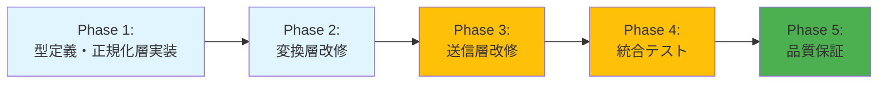
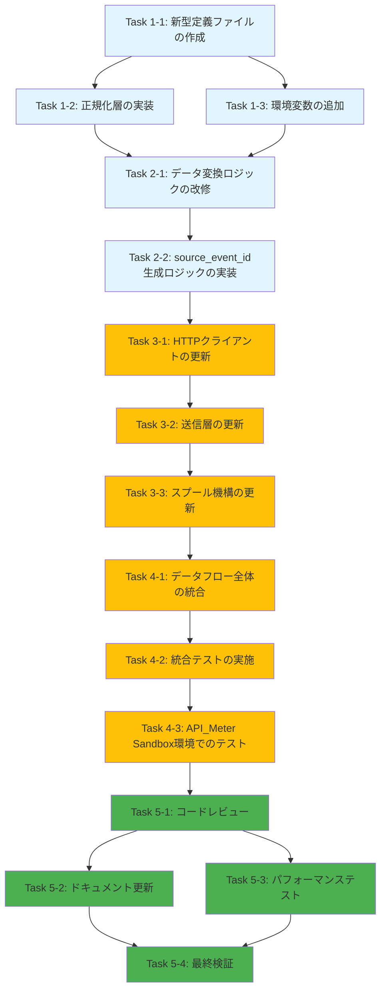

# 作業計画書: API_Meter新仕様対応

## プロジェクト概要

### ゴール
dify-usage-exporterを**API_Meterの新仕様（2025-12-04版）**に対応させるリファクタリングプロジェクト。既存の型システムとデータフローを大幅に変更し、プロバイダー名/モデル名の正規化層を導入する。

### スコープ
- **変更対象**: 型定義の全面刷新（12-15ファイル）、正規化層の新規導入、データ変換ロジックの改修、送信層の改修（Bearer Token認証）、エラーハンドリングの拡張、スプール機構の統合
- **非スコープ**: Dify API取得ロジックの変更（Fetcherは現状維持）、集計ロジックの変更（Aggregatorは現状維持）、スケジューラー・監視機構の変更、CLI機能の変更

### 実装アプローチ
**ハイブリッドアプローチ**を採用：
- **Phase 1-2**: 水平スライス（基盤実装）- 型定義層、正規化層を独立して実装
- **Phase 3-4**: 垂直スライス（機能統合）- per_model/allモードのデータフローを完全に実装
- **Phase 5**: 品質保証 - コードレビュー、ドキュメント更新、パフォーマンステスト

### 前提となるADR
- [ADR 013: 正規化層の導入](../../adr/013-normalization-layer-introduction.md)
- [ADR 014: 型システムの完全置き換え](../../adr/014-type-system-replacement.md)
- [ADR 015: データフロー変更](../../adr/015-data-flow-transformation.md)
- [ADR 016: 冪等性機構](../../adr/016-idempotency-mechanism.md)
- [ADR 017: エラーハンドリング戦略](../../adr/017-error-handling-strategy.md)
- [ADR 018: スプール機構統合](../../adr/018-spool-integration.md)
- [ADR 019: 日別集計の実装](../../adr/019-daily-aggregation.md)

---

## フェーズ構成図

---

## タスク依存関係図

---

## Phase 1: 型定義・正規化層実装

**目的**: 技術的基盤を確立し、後続フェーズの土台を構築

**確認レベル**: L1（ユニットテスト）

### Task 1-1: 新型定義ファイルの作成

**実装内容**:
- [x] `src/types/api-meter-schema.ts` を新規作成
- [x] `ApiMeterRequest`, `ApiMeterUsageRecord` の型定義をzodスキーマで実装
- [x] `total_tokens = input_tokens + output_tokens` のバリデーションルールを実装
- [x] `src/types/external-api.ts` に `@deprecated` タグを追加（将来の削除予告）
- [x] ユニットテスト作成（`src/types/__tests__/api-meter-schema.test.ts`）
  - zodスキーマのバリデーション（total_tokens検証）
  - 不正なデータでのバリデーションエラー確認

**完了基準**:
- [x] 新型定義ファイルが作成され、zodスキーマが動作する
- [x] total_tokens検証が正しく機能する（不一致時にエラー）
- [x] ユニットテストが全てパスする

**テストファイルパス**: `src/types/__tests__/api-meter-schema.test.ts`

**依存関係**: なし

---

### Task 1-2: 正規化層の実装

**実装内容**:
- [x] `src/normalizer/provider-normalizer.ts` を新規作成
  - `ProviderNormalizer` インターフェース定義
  - `PROVIDER_MAPPING` テーブル実装（aws-bedrock → aws 等）
  - `createProviderNormalizer()` ファクトリー関数実装
- [x] `src/normalizer/model-normalizer.ts` を新規作成
  - `ModelNormalizer` インターフェース定義
  - `MODEL_MAPPING` テーブル実装（claude-3-5-sonnet → claude-3-5-sonnet-20241022 等）
  - `createModelNormalizer()` ファクトリー関数実装
- [x] `src/normalizer/normalizer.ts` を新規作成
  - `INormalizer` インターフェース定義
  - `NormalizedModelRecord` 型定義
  - `createNormalizer()` ファクトリー関数実装
- [x] ユニットテスト作成
  - `src/normalizer/__tests__/provider-normalizer.test.ts`
    - 正規化動作（aws-bedrock → aws）
    - 大文字小文字の統一（AWS-BEDROCK → aws）
    - 前後空白の除去（" aws-bedrock " → aws）
    - 不明なプロバイダー → unknown
  - `src/normalizer/__tests__/model-normalizer.test.ts`
    - 正規化動作（claude-3-5-sonnet → claude-3-5-sonnet-20241022）
    - 不明なモデル → そのまま維持
  - `src/normalizer/__tests__/normalizer.test.ts`
    - `AggregatedModelRecord[]` → `NormalizedModelRecord[]` の変換

**完了基準**:
- [x] 正規化層のファイルが作成され、インターフェースが定義されている
- [x] マッピングテーブルが実装されている
- [x] ユニットテストが全てパスする（マッピング、大文字小文字、空白除去）

**テストファイルパス**:
- `src/normalizer/__tests__/provider-normalizer.test.ts`
- `src/normalizer/__tests__/model-normalizer.test.ts`
- `src/normalizer/__tests__/normalizer.test.ts`

**依存関係**: Task 1-1（型定義）

---

### Task 1-3: 環境変数の追加

**実装内容**:
- [x] `src/types/env.ts` に以下の環境変数を追加
  - `API_METER_TENANT_ID`: UUID（必須）
  - `API_METER_TOKEN`: Bearer Token（必須）
  - `API_METER_URL`: API_MeterのエンドポイントURL（必須）
- [x] zodスキーマでバリデーション実装
  - `API_METER_TENANT_ID` はUUID形式
  - `API_METER_TOKEN`, `API_METER_URL` は非空文字列
- [x] `.env.example` の更新（サンプル値を追加）
- [x] README.mdの環境変数セクション更新

**完了基準**:
- [x] 環境変数が追加され、読み込まれる
- [x] zodスキーマでバリデーションが動作する
- [x] `.env.example` が更新されている

**依存関係**: Task 1-1（型定義）

---

### Phase 1 完了基準
- [x] 新型定義ファイルが作成され、zodスキーマが動作する
- [x] 正規化層のユニットテストが全てパスする
- [x] 環境変数が追加され、読み込まれる
- [x] **動作確認**: `npm test` で全ユニットテストがパス（59テスト全てパス）
- [x] **型チェック**: `npm run build` でエラーなし

---

## Phase 2: 変換層改修

**目的**: データ変換ロジックを新形式に対応

**確認レベル**: L1（ユニットテスト）

### Task 2-1: データ変換ロジックの改修

**実装内容**:
- [ ] `src/transformer/data-transformer.ts` を `ApiMeterRequest` 形式に対応
  - `TransformResult` 型を更新（`ApiMeterRequest` を含む）
  - `NormalizedModelRecord[]` → `ApiMeterUsageRecord[]` への変換実装
  - `ApiMeterRequest` の構築（tenant_id, export_metadata付与）
  - 日付範囲計算の実装（`getDateRangeStart()`, `getDateRangeEnd()`）
  - トークン計算検証の実装（total_tokens = input_tokens + output_tokens）
- [ ] ユニットテスト更新（`src/transformer/__tests__/data-transformer.test.ts`）
  - 新形式への変換テスト（`NormalizedModelRecord` → `ApiMeterUsageRecord`）
  - トークン計算検証のテスト
  - 日付範囲計算のテスト
  - エラーハンドリングのテスト（バリデーションエラー時）

**完了基準**:
- [ ] DataTransformerが `ApiMeterRequest` を出力する
- [ ] トークン計算が正しく検証される（不一致時にエラー）
- [ ] 日付範囲が正しく計算される
- [ ] ユニットテストが全てパスする

**テストファイルパス**: `src/transformer/__tests__/data-transformer.test.ts`

**依存関係**: Task 1-1（型定義）、Task 1-3（環境変数）

---

### Task 2-2: source_event_id生成ロジックの実装

**実装内容**:
- [ ] `src/transformer/idempotency-key.ts` に `generateSourceEventId()` 関数を追加
  - フォーマット: `dify-{usage_date}-{provider}-{model}-{hash12}`
  - SHA256ハッシュ生成（usage_date, provider, model, app_id, user_id から計算）
  - ハッシュの最初の12文字を16進数で使用
- [ ] ユニットテスト追加（`src/transformer/__tests__/idempotency-key.test.ts`）
  - 決定論的ID生成（同一データから同じID）
  - フォーマット検証（`dify-{usage_date}-{provider}-{model}-{hash12}`）
  - ハッシュ部分が12文字の16進数であることを確認
  - 衝突耐性テスト（異なるデータから異なるIDが生成される）

**完了基準**:
- [ ] `generateSourceEventId()` が正しく実装されている
- [ ] 同一データから常に同じsource_event_idが生成される
- [ ] フォーマットが `dify-{usage_date}-{provider}-{model}-{hash12}` に準拠する
- [ ] ユニットテストが全てパスする

**テストファイルパス**: `src/transformer/__tests__/idempotency-key.test.ts`

**依存関係**: Task 2-1（データ変換ロジック）

---

### Phase 2 完了基準
- [ ] DataTransformerが `ApiMeterRequest` を出力する
- [ ] source_event_idが正しく生成される（同一データから同じID）
- [ ] 変換層のユニットテストが全てパスする
- [ ] **動作確認**: `npm test` で全ユニットテストがパス
- [ ] **型チェック**: `npm run build` でエラーなし

---

## Phase 3: 送信層改修

**目的**: API_Meter新仕様に対応した送信機能を実装

**確認レベル**: L2（統合テスト）

### Task 3-1: HTTPクライアントの更新

**実装内容**:
- [ ] `src/sender/http-client.ts` をBearer Token認証に対応
  - Authorizationヘッダーに `Bearer ${config.API_METER_TOKEN}` を設定
  - `baseURL` を `config.API_METER_URL` に変更
  - User-Agentヘッダーに `dify-usage-exporter/1.1.0` を設定
- [ ] リトライ条件の更新
  - 200, 201, 204: 成功（リトライしない）
  - 429: リトライ（指数バックオフ）
  - 5xx: リトライ（指数バックオフ）
  - 400, 401, 403, 404, 422: リトライしない
  - ネットワークエラー: リトライ
- [ ] Retry-Afterヘッダーの尊重
  - Retry-Afterヘッダーがある場合は優先
  - ない場合は指数バックオフ（1s → 2s → 4s）
- [ ] ユニットテスト更新（`src/sender/__tests__/http-client.test.ts`）
  - Bearer Token認証のテスト
  - リトライ条件のテスト（429, 5xx系）
  - Retry-Afterヘッダーの尊重テスト
  - 成功ステータス（200, 201, 204）のテスト

**完了基準**:
- [ ] HTTPクライアントがBearer Token認証で送信する
- [ ] リトライ条件が正しく実装されている
- [ ] Retry-Afterヘッダーが尊重される
- [ ] ユニットテストが全てパスする

**テストファイルパス**: `src/sender/__tests__/http-client.test.ts`

**依存関係**: Task 2-2（source_event_id生成）

---

### Task 3-2: 送信層の更新

**実装内容**:
- [ ] `src/sender/external-api-sender.ts` を `ApiMeterRequest` 送信に対応
  - `send()` メソッドの引数を `ApiMeterRequest` に変更
  - POST `/v1/usage` エンドポイントへ送信
  - 200 OKレスポンスのハンドリング（inserted/updated確認）
  - 409 Conflictのハンドリング（削除、常に200 OKが返る仕様）
  - エラーメッセージの詳細化
- [ ] メトリクス更新
  - 送信成功時: `sendSuccess += request.records.length`
  - 送信失敗時: `sendFailure++`
- [ ] ユニットテスト更新（`src/sender/__tests__/external-api-sender.test.ts`）
  - `ApiMeterRequest` 送信のテスト
  - 200 OKレスポンスのテスト（inserted/updated確認）
  - エラーハンドリングのテスト（400, 401, 403, 404, 422, 429, 5xx）
  - メトリクス更新のテスト

**完了基準**:
- [ ] ExternalApiSenderが `ApiMeterRequest` を送信する
- [ ] 200 OKレスポンスが正しく処理される（inserted/updated確認）
- [ ] エラーメッセージが詳細化されている
- [ ] ユニットテストが全てパスする

**テストファイルパス**: `src/sender/__tests__/external-api-sender.test.ts`

**依存関係**: Task 3-1（HTTPクライアントの更新）

---

### Task 3-3: スプール機構の更新

**実装内容**:
- [ ] `src/types/spool.ts` に `legacySpoolFileSchema` を追加
  - 旧形式スプールファイルのzodスキーマ定義
- [ ] `src/sender/spool-manager.ts` に変換ロジック追加
  - `convertLegacySpoolFile()` 関数実装
  - 旧形式 → 新形式変換（provider/model を "unknown" に設定）
  - 旧形式検出時の警告ログ出力
  - 変換失敗時は `data/failed/` へ移動
- [ ] ユニットテスト追加（`src/sender/__tests__/spool-manager.test.ts`）
  - 旧形式スプールファイルの検出テスト
  - 旧形式 → 新形式変換のテスト
  - 変換失敗時の `data/failed/` 移動テスト
  - 新形式スプールファイルの保存・読み込みテスト

**完了基準**:
- [ ] `legacySpoolFileSchema` が定義されている
- [ ] 旧形式スプールファイルが新形式へ変換される
- [ ] 変換失敗時に `data/failed/` へ移動する
- [ ] ユニットテストが全てパスする

**テストファイルパス**: `src/sender/__tests__/spool-manager.test.ts`

**依存関係**: Task 3-2（送信層の更新）

---

### Phase 3 完了基準
- [ ] HTTPクライアントがBearer Token認証で送信する
- [ ] 200 OKレスポンスが正しく処理される
- [ ] 旧形式スプールファイルが新形式へ変換される
- [ ] 送信層のユニットテストが全てパスする
- [ ] **動作確認**: `npm test` で全ユニットテストがパス
- [ ] **型チェック**: `npm run build` でエラーなし

---

## Phase 4: 統合テスト

**目的**: データフロー全体の動作確認とAPI_Meter Sandbox環境でのテスト

**確認レベル**: L3（E2Eテスト）

### Task 4-1: データフロー全体の統合

**実装内容**:
- [ ] `src/index.ts` の更新
  - Normalizer層の追加（Aggregate → Normalize → Transform）
  - 日別データのフィルタリング（`period_type === 'daily'`）
  - per_model/allモードの優先実装
  - per_user/per_app/workspaceモード時のスキップログ出力
- [ ] 統合フローの実装
  - Fetch → Aggregate → Normalize → Transform → Send の全体フロー
  - 各層のエラーハンドリング
  - ログ出力の充実化

**完了基準**:
- [ ] データフロー全体が正常に動作する
- [ ] Normalizer層が正しく統合されている
- [ ] 日別データのフィルタリングが動作する
- [ ] per_model/allモードで正しいデータがAPI_Meterへ送信される

**依存関係**: Task 3-3（スプール機構の更新）

---

### Task 4-2: 統合テストの実施

**実装内容**:
- [ ] 統合テストファイル作成（`test/integration/api-meter-integration.int.test.ts`）
  - Fetch → Aggregate → Normalize → Transform → Sendの全体フローテスト
  - per_modelモードのE2Eテスト
  - allモードのE2Eテスト
  - エラーハンドリングの統合テスト（リトライ、スプール保存）
  - 旧形式スプールファイル変換の統合テスト
- [ ] モックAPIサーバーの準備
  - API_Meterモックサーバーの実装（200 OK, 429, 5xx等をシミュレート）
  - Dify APIモックサーバーの実装

**完了基準**:
- [ ] 統合テストが全てパスする
- [ ] per_model/allモードでのデータフローが正常に動作する
- [ ] エラーハンドリングが正しく動作する（リトライ、スプール保存）

**テストファイルパス**: `test/integration/api-meter-integration.int.test.ts`

**依存関係**: Task 4-1（データフロー全体の統合）

---

### Task 4-3: API_Meter Sandbox環境でのテスト

**実装内容**:
- [ ] API_Meter Sandbox環境への接続設定
  - 環境変数設定（`API_METER_TENANT_ID`, `API_METER_TOKEN`, `API_METER_URL`）
  - Sandboxエンドポイントの確認
- [ ] 実際のAPI_Meterへの送信テスト
  - per_modelモードでの送信
  - allモードでの送信
  - 200 OKレスポンスの確認
  - API_Meter管理画面でのデータ確認
  - 送信データとAPI_Meter表示データの一致確認
- [ ] エラーケースのテスト
  - 不正なトークンでの送信（401 Unauthorized）
  - 不正なデータでの送信（400 Bad Request）
  - Rate Limitテスト（429 Too Many Requests）

**完了基準**:
- [ ] API_Meter Sandbox環境へ正常に送信できる
- [ ] 200 OKレスポンスを受信する
- [ ] API_Meter管理画面でデータが表示される
- [ ] 送信データとAPI_Meter表示データが一致する

**依存関係**: Task 4-2（統合テストの実施）

---

### Phase 4 完了基準
- [ ] データフロー全体が正常に動作する
- [ ] per_model/allモードで正しいデータがAPI_Meterへ送信される
- [ ] 統合テストが全てパスする
- [ ] API_Meter Sandbox環境で送信成功を確認
- [ ] **動作確認**: `npm test` で全テスト（ユニット・統合）がパス
- [ ] **E2E確認**: API_Meter管理画面で送信データを確認

---

## Phase 5: 品質保証

**目的**: コード品質の最終確認とドキュメント整備

**確認レベル**: L3（本番環境）

### Task 5-1: コードレビュー

**実装内容**:
- [ ] 全変更ファイルのレビュー
  - 型定義ファイル（`src/types/api-meter-schema.ts`, `src/types/spool.ts`, `src/types/env.ts`）
  - 正規化層（`src/normalizer/*.ts`）
  - 変換層（`src/transformer/data-transformer.ts`, `src/transformer/idempotency-key.ts`）
  - 送信層（`src/sender/*.ts`）
  - 統合層（`src/index.ts`）
- [ ] TypeScript規約への準拠確認
  - any型の使用がないか
  - 型安全性が確保されているか
  - エラーハンドリングが適切か
- [ ] エラーハンドリングの網羅性確認
  - 全エラーケースがカバーされているか
  - ログ出力が適切か
  - スプール保存が正しく動作するか

**完了基準**:
- [ ] コードレビューが完了し、指摘事項がゼロ
- [ ] TypeScript規約に準拠している
- [ ] エラーハンドリングが網羅的である

**依存関係**: Task 4-3（API_Meter Sandbox環境でのテスト）

---

### Task 5-2: ドキュメント更新

**実装内容**:
- [ ] README.mdの更新
  - 環境変数セクションの更新（`API_METER_TENANT_ID`, `API_METER_TOKEN`, `API_METER_URL`）
  - 使用方法の更新（per_model/allモードの説明）
  - API_Meter新仕様対応の追記
- [ ] ADRのステータス更新
  - ADR 013-019のステータスを `Proposed` → `Accepted` に変更
- [ ] CHANGELOG.mdの更新
  - バージョン1.1.0のリリースノート作成
  - 破壊的変更の記載（型システムの完全置き換え）
  - 新機能の記載（正規化層、Bearer Token認証、旧形式変換）

**完了基準**:
- [ ] README.mdが更新され、最新の状態
- [ ] ADRのステータスが `Accepted` に変更されている
- [ ] CHANGELOG.mdが更新されている

**依存関係**: Task 5-1（コードレビュー）

---

### Task 5-3: パフォーマンステスト

**実装内容**:
- [ ] バッチサイズ100-500レコードでの負荷テスト
  - 100レコード、300レコード、500レコードでの処理時間測定
  - 正規化層のパフォーマンス測定
  - 変換層のパフォーマンス測定
  - 送信層のパフォーマンス測定
- [ ] パフォーマンステストスクリプトの作成（`scripts/performance-test.ts`）
  - 各レコード数でのパフォーマンス測定
  - 結果の集計とレポート生成
- [ ] 合格基準の確認
  - 1000レコード/秒以上の処理速度を確保
  - 正規化層の処理時間が1ms未満

**完了基準**:
- [ ] パフォーマンステストが完了し、合格基準をクリア
- [ ] 1000レコード/秒以上の処理速度を確保
- [ ] 正規化層の処理時間が1ms未満

**依存関係**: Task 5-1（コードレビュー）

---

### Task 5-4: 最終検証

**実装内容**:
- [ ] 全テストの実行
  - `npm test` でユニットテスト・統合テスト実行
  - `npm run test:coverage` でカバレッジ測定（70%以上）
  - `npm run build` で型チェック・ビルド成功
  - `npm run check` でBiomeチェック
- [ ] 品質チェックリストの確認
  - [ ] 型安全性（any型なし、型チェック成功）
  - [ ] テストカバレッジ70%以上
  - [ ] 全テストがパス
  - [ ] Biomeチェックがパス
  - [ ] ドキュメントが最新
- [ ] ロールバックプラン作成
  - 旧バージョンへの切り戻し手順
  - 旧形式スプールファイルの保持確認
  - 環境変数の復元手順

**完了基準**:
- [ ] 全テストがパス
- [ ] テストカバレッジ70%以上
- [ ] 型チェック・ビルドが成功
- [ ] Biomeチェックがパス
- [ ] ロールバックプランが作成され、レビュー済み

**依存関係**: Task 5-2（ドキュメント更新）、Task 5-3（パフォーマンステスト）

---

### Phase 5 完了基準
- [ ] コードレビューが完了し、指摘事項がゼロ
- [ ] ドキュメントが更新され、最新の状態
- [ ] パフォーマンステストが合格基準をクリア
- [ ] ロールバックプランが作成され、レビュー済み
- [ ] **最終確認**: 全品質チェックがパス（テスト、型チェック、Biome、カバレッジ）
- [ ] **本番準備**: API_Meter本番環境への接続設定が完了

---

## リスクと緩和策

### リスク1: データ構造の不一致

**リスク**: API_Meter新仕様とExternalApiRecordの構造が大きく異なり、変換時にデータ欠損や型不一致が発生する可能性

**影響度**: 高（送信エラーが多発）

**緩和策**:
- zodスキーマで厳密なバリデーション実施（Task 1-1）
- total_tokens検証（input_tokens + output_tokens = total_tokens）を実装（Task 2-1）
- 変換エラー時は詳細ログを出力し、スプール保存（Task 3-3）
- Phase 4で統合テストを徹底実施（Task 4-2）

**検知方法**: ユニットテスト、統合テスト、zodスキーマバリデーション

---

### リスク2: 既存データの互換性

**リスク**: 旧形式スプールファイルに provider/model 情報が含まれず、新形式への変換時にデータ欠損が発生

**影響度**: 中（旧形式スプールファイルが"unknown"で送信される）

**緩和策**:
- 旧形式スプールファイルは provider/model を "unknown" に設定（Task 3-3）
- API_Meter側で "unknown" を受け入れる仕様を確認済み
- 変換失敗時は `data/failed/` へ移動し、手動対応を要求（Task 3-3）
- 変換ロジックのユニットテストで網羅的にテスト（Task 3-3）

**検知方法**: スプール変換のユニットテスト、統合テスト

---

### リスク3: 正規化ロジックの保守性

**リスク**: マッピングテーブルが肥大化し、新しいプロバイダー/モデル追加時に保守が困難になる

**影響度**: 中（長期的な保守性低下）

**緩和策**:
- マッピングテーブルは定数として一箇所に集約（Task 1-2）
- 各マッピングエントリに対してユニットテスト作成（Task 1-2）
- 不明なプロバイダー/モデルは "unknown" で送信可能（fallback）
- マッピング追加時のテストケース追加を必須化

**検知方法**: コードレビュー（Task 5-1）、ユニットテスト

---

### リスク4: パフォーマンス

**リスク**: 正規化層の追加により、データ処理のパフォーマンスが低下する可能性

**影響度**: 低（マッピングテーブル参照はO(1)で高速）

**緩和策**:
- マッピングテーブルは `Record<string, string>` で O(1) 参照（Task 1-2）
- バッチサイズ100-500レコードでの正規化は 1ms 未満と推定
- Phase 5でパフォーマンステストを実施し、1000レコード/秒以上を確保（Task 5-3）

**検知方法**: パフォーマンステスト（Task 5-3）

---

### リスク5: API_Meter側の仕様変更

**リスク**: API_Meter側が仕様を変更し、既存の実装が動作しなくなる可能性

**影響度**: 高（送信エラーが多発）

**緩和策**:
- ADR 013-019で技術的決定を文書化し、変更履歴を記録
- API_Meter公式ドキュメントを定期的に確認
- zodスキーマで厳密なバリデーションを実施し、仕様不一致を早期検出（Task 1-1）
- エラーハンドリングを充実させ、詳細なエラーログを出力（Task 3-2）

**検知方法**: 統合テスト（Task 4-2）、API_Meter Sandbox環境でのテスト（Task 4-3）

---

### リスク6: リトライ上限到達の頻発

**リスク**: API_Meter側の障害やネットワークエラーにより、リトライ上限到達が頻発し、スプールファイルが大量に蓄積

**影響度**: 中（ディスク使用量増加、手動対応の増加）

**緩和策**:
- スプール保存前にリトライを3回実施（指数バックオフ）（Task 3-1）
- スプールファイルは最大リトライ回数（5回）で `data/failed/` へ移動（Task 3-3）
- 監視ダッシュボードでスプールファイル数を追跡（非スコープ）
- アラート設定（スプールファイル数が10個を超えたら通知）（非スコープ）

**検知方法**: 統合テスト（Task 4-2）、ログ監視

---

## 最終確認チェックリスト

### 全Phase共通
- [ ] **ID・機能名がメタデータとして記録されているか**（story_id: SPEC-CHANGE-001）
- [ ] **Design Doc整合性確認**（全タスクがDesign Docの実装フェーズに準拠）
- [ ] **技術的依存関係に基づくフェーズ構成**（Phase 1→2→3→4→5の順序）
- [ ] **全要件のタスク化**（Design Docの10セクション全てをカバー）
- [ ] **最終フェーズに品質保証の存在**（Phase 5で品質保証を実施）
- [ ] **統合ポイントの動作確認手順配置**（Phase 4で統合テストを実施）

### 品質基準
- [ ] **型安全性**: TypeScript strict mode、any型なし
- [ ] **テストカバレッジ**: 70%以上
- [ ] **全テストがパス**: ユニットテスト、統合テスト
- [ ] **Biomeチェックがパス**: コードスタイル統一
- [ ] **ドキュメント最新**: README, ADR, CHANGELOGが更新されている

### 受入条件達成確認
- [ ] **AC-1**: プロバイダー名正規化（aws-bedrock → aws）
- [ ] **AC-2**: モデル名標準化（claude-3-5-sonnet → claude-3-5-sonnet-20241022）
- [ ] **AC-3**: トークン計算検証（total_tokens = input_tokens + output_tokens）
- [ ] **AC-4**: Bearer Token認証（Authorization: Bearer {API_METER_TOKEN}）
- [ ] **AC-5**: source_event_id生成（決定論的ID生成）
- [ ] **AC-6**: エラーハンドリング（429リトライ、5xxリトライ、400系スプール保存）
- [ ] **AC-7**: バッチサイズ管理（100-500レコード）
- [ ] **AC-8**: メタデータ充実化（source_system, source_event_id, aggregation_method）
- [ ] **AC-9**: 日付フォーマット標準化（YYYY-MM-DD, ISO8601）
- [ ] **AC-10**: コスト計算（cost_actual数値型、小数点以下7桁）
- [ ] **AC-11**: 統合テスト（Fetch → Aggregate → Normalize → Transform → Send）
- [ ] **AC-12**: API_Meter本番環境で検証済み（200 OK受信）

---

## 参考資料

### Design Doc
- [SPEC-CHANGE-001 Design Document](./design.md)

### ADR
- [ADR 013: 正規化層の導入](../../adr/013-normalization-layer-introduction.md)
- [ADR 014: 型システムの完全置き換え](../../adr/014-type-system-replacement.md)
- [ADR 015: データフロー変更](../../adr/015-data-flow-transformation.md)
- [ADR 016: 冪等性機構](../../adr/016-idempotency-mechanism.md)
- [ADR 017: エラーハンドリング戦略](../../adr/017-error-handling-strategy.md)
- [ADR 018: スプール機構統合](../../adr/018-spool-integration.md)
- [ADR 019: 日別集計の実装](../../adr/019-daily-aggregation.md)

### API_Meter公式ドキュメント
- [API_Meter API Documentation (2025-12-04 version)](https://api-meter.example.com/docs)
- [API_Meter Authentication Guide](https://api-meter.example.com/docs/auth)
- [API_Meter Error Codes](https://api-meter.example.com/docs/errors)

### TypeScript開発
- [Zod Documentation](https://zod.dev/)
- [TypeScript Type Guards](https://www.typescriptlang.org/docs/handbook/2/narrowing.html)

---

## 変更履歴

| バージョン | 日付 | 変更内容 |
|----------|------|---------|
| 1.0.0 | 2025-12-05 | 初版作成 |
